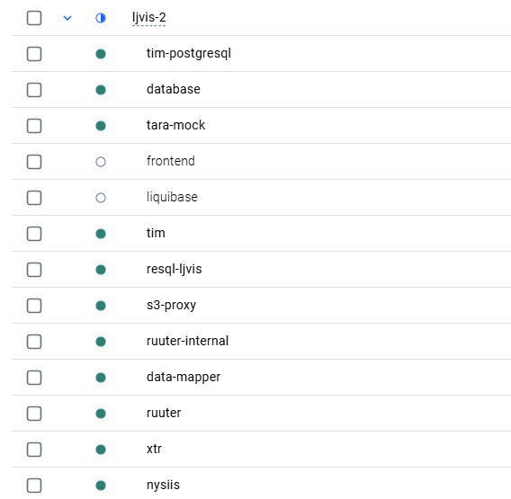

# Liiklusjärelevalve infosüsteem (LJVIS)

## Lokaalne arendus 

### Dockerfailide muudatused 

   Ava ljvis-2\docker\tara-mock\Dockerfile fail.
Kommenteeri välja järgmine rida:
```dockerfile
#RUN chmod +x /entrypoint.sh /service/tara-mock-server
```
ja siis eemalda kommentaar sellelt realt
```dockerfile
RUN sed -i 's/\r//' /entrypoint.sh && chmod +x /entrypoint.sh /service/tara-mock-server
```

Ava ljvis-2\docker\tim\Dockerfile fail. Kommenteeri välja järgmine rida:

```dockerfile 
#RUN chmod +x /entrypoint.sh
```
ja siis eemalda kommentaar sellelt realt
```dockerfile 
RUN sed -i 's/\r//' /entrypoint.sh && chmod +x /entrypoint.sh
```

### Keystore
Loo ljvis-2/.ssl kaust ja lisa sinna keystore.p12 fail. (Küsi faili sisu teiste arendajate käest)

### .env faili loomine
Loo ljvis-2/.env fail. (Küsi faili sisu teiste arendajate käest) 

### Konteinerite käivitamine
docker-compose up --build -d

### SQLide käivitamine
Käivita kõik SQL-id järjest, mis siin: DSL/Liquibase/test (ljvis_db)

### Kontrolli konteinerite olekut
Dockeris peavad jooksma 11/13 konteinerist. Peata frontend konteineri kui see jookseb.



### Frontendi käivitamine
```
cd .\frontend\

npm install

npm run dev
```

### Süsteemi sisse logimine
Kui kõik on õige siis http://localhost:3001/ kaudu saad süsteemi sisse logida 