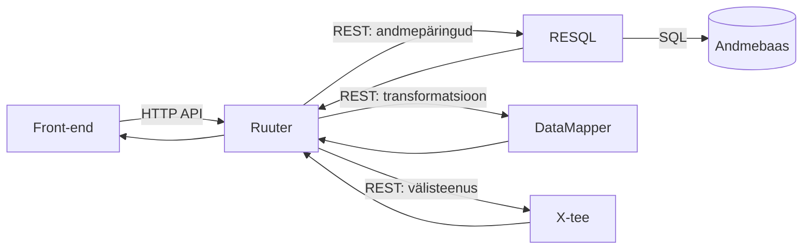

# Ruuter, RESQL ja DataMapper – arhitektuurne kontekst LJVIS projektis

> **Eesmärk:** Dokument kirjeldab kolme Buerokratt-perekonna põhikomponendi – **Ruuter**, **RESQL** ja **DataMapper** – rolli, tööpõhimõtteid ning piiranguid LJVIS süsteemis. Mõeldud kasutamiseks arendajatele viitedokumendina ja LLM-kontekstina koodi genereerimisel.

---

## 1. Üldine arhitektuuriprintsiip

| Printsiip | Selgitus |
|-----------|----------|
| **Komponentide sõltumatus** | Ruuter, RESQL ja DataMapper on üksteisest täielikult sõltumatud. Iga komponent käivitub ja töötab iseseisvalt ilma teisi vajamata. Neid saab kasutada eraldi, kombineerida vabalt või vajadusel välja vahetada. |
| **Suhtlus ainult REST API kaudu** | Komponendid suhtlevad omavahel ainult REST API kaudu. Otsepöördumised (nt andmebaasi otseühendus front-end'ist) on keelatud. |
| **Üks fail = üks funktsioon = üks endpoint** | Iga ärifunktsioon, andmebaasipäring ja transformatsioon on eraldi fail, mis tekitab eraldi REST endpoint'i. Mitte kunagi ei panustata mitut erinevat loogikat ühte faili. |
| **Äriloogika DSL-failides, mitte rakenduskoodis** | Kogu äriloogika, otsustusloogika, andmetransformatsioonid ja marsruutimine on deklaratiivsetes DSL-failides (YAML, SQL, JSON mallid). Traditsioonilise koodi kirjutamine on minimaalne. |
| **Taaskasutus endpoint'ide kaudu** | Kui endpoint on loodud (nt "kas kasutaja eksisteerib?"), kasutatakse sama endpoint'i igal pool süsteemis, kus seda loogikat vaja läheb. Dubleerimine on keelatud. |

### 1.1 Üldine komponentide joonis



---

## 2. Ruuter – äriloogika orkestratsioon

### 2.1 Roll

Ruuter on **keskne päringute marsruutimise ja äriloogika orkestratsiooni kiht**. Ta võtab vastu sissetulevad päringud (nt front-end'ist) ja suunab need sammhaaval edasi teistele teenustele (RESQL, DataMapper, X-tee jne).

### 2.2 Tööpõhimõte

- Äriloogika kirjeldatakse **YAML-põhistes DSL-failides**.
- Endpoint'i struktuur tuleneb **failistruktuurist** (kataloogipuu = URL-ide puu).
- Iga ärioperatsioon on **eraldi lühike DSL-fail** – nt kasutaja loomine, kasutaja deaktiveerimine, kasutaja olemasolu kontroll on igaüks oma fail.
- **Ei ole switch/case loogikat** ühes failis – kui on delete, siis on eraldi DSL ainult kustutamise jaoks.
- Ruuter defineerib **täpselt, mida sisendist oodatakse** ja **mida edasi antakse** järgmisele sammule. Üleliigseid parameetreid ei edastata automaatselt.

### 2.3 Autoriseerimine

- **Kogu autoriseerimise loogika** on ainult Ruuteris (`.guard`-failid).
- RESQL, DataMapper ja teised teenused **ei tea autoriseerimisest midagi** – nad täidavad kõik päringud, mis neile tulevad.
- Guard-failid valideerivad JWT payload'i alusel, kas kasutajal on õigus konkreetsele endpoint'ile.

### 2.4 Vastuste vormindamine

- Ruuter saab **ümberdefineerida väljundi struktuuri** enne front-end'ile saatmist.
- Väiksemate transformatsioonide puhul (nt välja ümbernimetamine) saab seda teha otse Ruuteri DSL-is.
- Keerulisemate transformatsioonide korral saadetakse andmed DataMapper'isse.
- Front-end saab alati **täpselt selle struktuuriga vastuse, mida ta vajab** – mitte rohkem, mitte vähem.

### 2.5 Sammude orkestratsioon – näide

Kasutaja loomise voog Ruuteris:

1. **Samm 1:** Pöördu RESQL endpoint'i poole → "kas kasutaja isikukoodiga X on juba olemas?"
2. **Samm 2:** Kui ei ole → pöördu RESQL create endpoint'i poole → sissekande tegemine
3. **Samm 3:** Pöördu uuesti samm 1 endpoint'i poole → kinnita, et kasutaja loodi edukalt
4. **Samm 4:** Tagasta kliendile andmebaasist loetud tegelik tulemus (mitte sisendi peegeldus)

> **Oluline:** Kliendile tagastatakse alati andmebaasist kontrollitud tulemus, mitte lihtsalt sisendi peegeldus. See on NATO standarditest tulenev kontrollpraktika.

---

## 3. RESQL – andmebaasipäringute kiht

### 3.1 Roll

RESQL on **REST-põhine andmebaasipäringute teenus**. Ta võtab vastu REST päringuid ja täidab vastavaid SQL lauseid. Iga SQL-fail = üks päring = üks REST endpoint.

### 3.2 Tööpõhimõte

- SQL päringud asuvad **DSL kataloogis**, organiseerituna loogilise puu järgi:
  ```
  DSL/
    <project>/
      <method>/
        v1/<module>/<entity>/<operation>.sql
  ```
- `<method>` loogikas on `get|post`; teostuses kasutatakse vastavaid meetodikaustu (`GET`/`POST`) platvormi kokkuleppe järgi.
- Näide (klassifikaatorite list):
  - Ruuteri sisekutse: `[#LOCAL_RESQL]/dev/v1/iam/classifier/list`
  - RESQL SQL fail: `DSL/Resql/dev/POST/v1/iam/classifier/list.sql`
- **Üks fail = üks SQL päring.** Mitut SQL lauset ühes failis ei tohi olla (nt `INSERT INTO ... ; SELECT ...` – keelatud).
- Muutujad SQL-failides on tähistatud **kooloniga**: `:variableName` (nt `:userId`, `:note`).
- RESQL võtab päringuid vastu **REST formaadis** (JSON sisend) ja tagastab tulemused **JSON formaadis**.
- RESQL **ei tea autoriseerimisest, äriloogikast ega andmestruktuurist midagi** – ta lihtsalt täidab päringuid.

### 3.3 GET vs POST reeglid

| Reegel | Selgitus |
|--------|----------|
| **Vaikimisi alati POST** | Kõik päringud peaksid vaikimisi olema POST, eriti kui kaasas on identifikaatorid või mis tahes andmed. |
| **GET ainult parameetrita listid** | GET lubatud ainult siis, kui päring ei võta ühtegi sisendparameetrit (nt kõikide kasutajate nimekiri). |
| **Põhjus: turvalisus** | GET parameetrid jäävad brauseri cache'i, logidesse ja ajalukku. POST body'd mitte. Brauserid cache'ivad agressiivselt GET päringuid, mis võib põhjustada vale info kuvamist (KeMIT kogemus 2018. aastast). |

### 3.4 Andmebaasi disaini põhimõtted (RESQL kontekstis)

| Põhimõte | Selgitus |
|----------|----------|
| **Ainult INSERT ja SELECT** | UPDATE ja DELETE käsud on keelatud. Andmete "muutmine" toimub uue sissekande lisamisega. |
| **Staatused eraldi tabelis** | Nt `account` + `account_states`. Põhiandmestik ei muutu; staatus on alati viimane kirje eraldi tabelis (`ORDER BY timestamp DESC LIMIT 1`). |
| **Ajaloo säilitamine** | Kõik muudatused jäävad ajalukku. See võimaldab tõendada, millal ja miks staatus muutus. |
| **Arhiveerimine** | Aegunud kirjeid arhiveeritakse perioodiliselt (CronManager). Päringuloogika ei muutu – viimane kirje on alati kättesaadav. |
| **Sub-query'd lubatud** | RESQL toetab alamlauseid (lightweight join) ühe faili sees. Tabelite vahelise seose puhul saab kasutada sub-query't, mitte JOIN'i. |
| **Väljad camelCase'is** | SQL vastuste väljad peavad olema **camelCase** formaadis. See peab olema tagatud juba SQL-faili tasemel (nt `AS "displayName"`). Seda linditakse automaatselt commit'imisel. |

### 3.5 Lokaalne arenduskeskkond

- RESQL käivitub **Docker Compose'iga** – `docker compose up -d` loob andmebaasi ja paneb teenuse püsti.
- `SQL/` kataloogis on **init-skriptid** lokaalse demo-andmebaasi loomiseks (skeemad, testiandmed).
- **Init-skriptid ei ole toodanguskriptid** – need on ainult lokaalse arenduse jaoks. Toodangu skeemamuudatused käivad **Liquibase** kaudu.
- Init-skriptide järjestus tagatakse failinimede numbrilise prefiksiga (nt `10_schema.sql`, `20_data.sql`).

---

## 4. DataMapper – andmete transformatsioon

### 4.1 Roll

DataMapper on **andmete transformatsiooni ja ümberstuktureerimise teenus**. Ta võtab vastu suvalise JSON-struktuuri ja teisendab selle vastavalt DSL-reeglitele soovitud kujule.

### 4.2 Tööpõhimõte

- Transformatsioonid on kirjeldatud **DSL-failides** (JSON/mallipõhised).
- Iga transformatsioon on **eraldi DSL-fail** konkreetse andmeallika ja kasutusjuhu jaoks.
- DataMapper **ei tea äriloogikast, autoriseerimisest ega andmeallikast midagi** – ta lihtsalt teisendab sisendi väljundiks vastavalt DSL-reeglitele.

### 4.3 Transformatsiooni võimalused

- **Väljade filtreerimine** – 15 väljast jäetakse alles ainult 3
- **Väljade ümbernimetamine** – `user_id` → `userId`, `display_name` → `displayName`
- **Struktuuri muutmine** – hierarhia muutmine, massiivide töötlemine, väljade ümberpaigutamine
- **Väljade väärtuste töötlemine** – kuupäeva vormindamine, formaadi teisendamine jne
- **Versioneerimine** – sama andmeallika (nt X-tee teenus) jaoks mitu DSL-versiooni

### 4.4 Peamine kasutusjuht: välisteenuste vastuste normaliseerimine

**Näide: X-tee juhilubade päring**

1. Ruuter saab X-tee'st vastuse (15 välja, osad eesti, osad inglise keeles)
2. Ruuter saadab vastuse DataMapper'isse
3. DataMapper'i DSL ütleb: jäta alles 3 välja, nimeta ümber, teisenda formaat
4. DataMapper tagastab normaliseeritud vastuse Ruuterile
5. Ruuter edastab front-end'ile

**Versioneerimise näide:**

- X-tee teenuse v1 kasutab välja `xRoadId` → DataMapper DSL v1
- X-tee teenuse v2 kasutab välja `universalId` → DataMapper DSL v2
- Päringule lisatakse versioonitunnus → DataMapper valib õige DSL-i

### 4.5 Miks mitte teha transformatsioone front-end'is või Ruuteris?

| Põhjus | Selgitus |
|--------|----------|
| **Front-end'i vahetatavus** | Kui vahetame UI raamistiku, ei pea otsima kust formaatimisloogikat ümber tegema. |
| **Taaskasutus projektide vahel** | Sama DataMapper DSL on kasutatav erinevates projektides ilma koodi kopeerimata. |
| **Isoleeritus** | Välisteenuse muutumisel muutub ainult DataMapper'i DSL, mitte Ruuter ega front-end. |
| **Ülevaatlikkus** | Kogu andmete struktuurimuutmise loogika on ühes kohas, mitte hajutatult üle kogu süsteemi. |

---

## 5. Komponentide koostoime – tüüpiline päringuvoog

```mermaid
flowchart LR
  FE[Front-end] -->|1. Päring| R[Ruuter]
  R -->|2. Autoriseerimine (.guard/JWT)| R
  R -->|3a. Andmepäring| Q[RESQL]
  Q -->|SQL| DB[(DB)]
  DB --> Q
  Q -->|4. Vastus| R
  R -->|3b. Vajadusel transformatsioon| DM[DataMapper]
  DM -->|5. Transformeeritud vastus| R
  R -->|3c. Vajadusel välisteenus| XT[X-tee]
  XT -->|4. Vastus| R
  R -->|6. Lõppvastus| FE
```

**Tüüpiline voog:**

1. Front-end saadab päringu Ruuterile
2. Ruuter kontrollib autoriseerimist (`.guard` fail / JWT)
3. Ruuter suunab päringu RESQL-ile (andmebaasipäring) ja/või X-tee'le (välisteenus)
4. Vastus tuleb tagasi Ruuterile
5. Vajadusel suunab Ruuter vastuse DataMapper'isse transformatsiooniks
6. Ruuter vormindab lõpliku vastuse ja saadab front-end'ile

**Oluline:** Front-end suhtleb **ainult Ruuteriga**. RESQL, DataMapper, X-tee jm teenused ei ole front-end'ile otse kättesaadavad.

---

## 6. Arendusreeglid ja piirangud – kokkuvõte

### 6.1 Üldised

- Äriloogika ainult YAML DSL-failides (Ruuter), mitte Java/JS koodis
- Andmebaasipäringud ainult SQL-failides (RESQL), mitte ORM-is ega rakenduskoodis
- Andmetransformatsioonid ainult DSL-failides (DataMapper), mitte front-end'is
- Iga komponent on eraldiseisev – ei eelda teiste olemasolu
- Kõik suhtlus REST API kaudu

### 6.2 RESQL-spetsiifilised

- Üks fail = üks SQL päring (mitu lauset ühes failis keelatud)
- Ainult INSERT ja SELECT (UPDATE, DELETE, JOIN keelatud)
- Vaikimisi POST päringud; GET ainult parameetrita listide jaoks
- Muutujad: `:muutujaNimi` (camelCase)
- Väljundväljad: camelCase (SQL alias'te kaudu)
- Lokaalne init eraldi SQL-kataloogis; toodang Liquibase kaudu

### 6.3 Ruuteri-spetsiifilised

- Iga operatsioon eraldi DSL-fail (ei ole ühte suurt faili mitme operatsiooni jaoks)
- Sisend defineerida täpselt – mitte edastada kõiki query/body parameetreid automaatselt
- Väljund defineerida täpselt – front-end saab ainult seda, mida ta vajab
- Kogu autoriseerimisloogika ainult Ruuteris

### 6.4 DataMapper'i-spetsiifilised

- Iga transformatsioon eraldi DSL-fail
- Versioneerida DSL-e välise teenuse muutumisel
- Kasutada taaskasutamiseks projektide vahel

---

## 7. Seotud komponendid (mainitud koosolekul)

| Komponent | Roll | Märkused |
|-----------|------|----------|
| **CronManager** | Perioodiliste taustatööde haldus | Kasutatakse nt aegunud kirjete arhiveerimiseks ja kustutamiseks |
| **TIM** | Identiteedi- ja sessioonihaldus | Käsitletakse eraldi koosolekul |
| **Liquibase** | Andmebaasi skeemamuudatuste haldus | Toodangukeskkonna skeemamuudatused ainult Liquibase kaudu |
| **Docker Compose** | Lokaalne arenduskeskkond | Iga komponent käivitub eraldi `docker compose up -d` käsuga |
