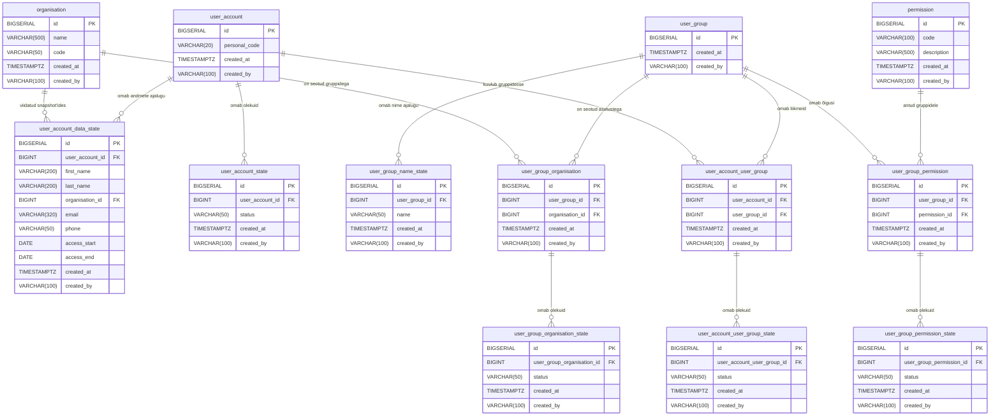

# LJVIS 2 — Andmemudel kliendile

## 1. Sissejuhatus

Käesolev dokument kirjeldab LJVIS 2 andmemudelit - milliseid andmeid süsteem hoiab ja kuidas need omavahel seotud on.

## 2. ER-diagramm



## 3. Andmebaasitabelid

<!-- EPIC_02 BEGIN -->

**`organisation`**

| Veeru nimi | Tüüp | Kohustuslik | Primaarvõti |
|---|---|---|---|
| `id` | BIGSERIAL | Jah | Jah |
| `name` | VARCHAR(500) | Jah |  |
| `code` | VARCHAR(50) | Jah |  |
| `created_at` | TIMESTAMPTZ | Jah |  |
| `created_by` | VARCHAR(100) | Jah |  |

**`user_account`**

| Veeru nimi | Tüüp | Kohustuslik | Primaarvõti |
|---|---|---|---|
| `id` | BIGSERIAL | Jah | Jah |
| `personal_code` | VARCHAR(20) | Jah |  |
| `created_at` | TIMESTAMPTZ | Jah |  |
| `created_by` | VARCHAR(100) | Jah |  |

> Muutumatu identity-rida. Muudetavad andmed (nimi, asutus, kontaktandmed, ligipääsuperiood) on tabelis `user_account_data_state` (INSERT-only atribuudi-ajaloo snapshot; viimane rida annab kehtivad väärtused).

**`user_account_data_state`**

| Veeru nimi | Tüüp | Kohustuslik | Primaarvõti |
|---|---|---|---|
| `id` | BIGSERIAL | Jah | Jah |
| `user_account_id` | BIGINT | Jah |  |
| `first_name` | VARCHAR(200) | Jah |  |
| `last_name` | VARCHAR(200) | Jah |  |
| `organisation_id` | BIGINT | Jah |  |
| `email` | VARCHAR(320) | Jah |  |
| `phone` | VARCHAR(50) | Ei |  |
| `access_start` | DATE | Jah |  |
| `access_end` | DATE | Ei |  |
| `created_at` | TIMESTAMPTZ | Jah |  |
| `created_by` | VARCHAR(100) | Jah |  |

**`user_account_state`**

| Veeru nimi | Tüüp | Kohustuslik | Primaarvõti |
|---|---|---|---|
| `id` | BIGSERIAL | Jah | Jah |
| `user_account_id` | BIGINT | Jah |  |
| `status` | VARCHAR(50) | Jah |  |
| `created_at` | TIMESTAMPTZ | Jah |  |
| `created_by` | VARCHAR(100) | Jah |  |

**`user_group`**

| Veeru nimi | Tüüp | Kohustuslik | Primaarvõti |
|---|---|---|---|
| `id` | BIGSERIAL | Jah | Jah |
| `created_at` | TIMESTAMPTZ | Jah |  |
| `created_by` | VARCHAR(100) | Jah |  |

> Identity-rida. Grupi nimi on tabelis `user_group_name_state` (INSERT-only ajalugu; viimane rida annab kehtiva nime). `coversAllOrganisations` ei salvestata — see arvutatakse lugemise ajal aktiivsete `user_group_organisation` ridade arvu ja `organisation` kataloogi suuruse võrdlusest.

**`user_group_name_state`**

| Veeru nimi | Tüüp | Kohustuslik | Primaarvõti |
|---|---|---|---|
| `id` | BIGSERIAL | Jah | Jah |
| `user_group_id` | BIGINT | Jah |  |
| `name` | VARCHAR(50) | Jah |  |
| `created_at` | TIMESTAMPTZ | Jah |  |
| `created_by` | VARCHAR(100) | Jah |  |

**`permission`**

| Veeru nimi | Tüüp | Kohustuslik | Primaarvõti |
|---|---|---|---|
| `id` | BIGSERIAL | Jah | Jah |
| `code` | VARCHAR(100) | Jah |  |
| `description` | VARCHAR(500) | Jah |  |
| `created_at` | TIMESTAMPTZ | Jah |  |
| `created_by` | VARCHAR(100) | Jah |  |

**`user_account_user_group`**

| Veeru nimi | Tüüp | Kohustuslik | Primaarvõti |
|---|---|---|---|
| `id` | BIGSERIAL | Jah | Jah |
| `user_account_id` | BIGINT | Jah |  |
| `user_group_id` | BIGINT | Jah |  |
| `created_at` | TIMESTAMPTZ | Jah |  |
| `created_by` | VARCHAR(100) | Jah |  |

**`user_account_user_group_state`**

| Veeru nimi | Tüüp | Kohustuslik | Primaarvõti |
|---|---|---|---|
| `id` | BIGSERIAL | Jah | Jah |
| `user_account_user_group_id` | BIGINT | Jah |  |
| `status` | VARCHAR(50) | Jah |  |
| `created_at` | TIMESTAMPTZ | Jah |  |
| `created_by` | VARCHAR(100) | Jah |  |

**`user_group_organisation`**

| Veeru nimi | Tüüp | Kohustuslik | Primaarvõti |
|---|---|---|---|
| `id` | BIGSERIAL | Jah | Jah |
| `user_group_id` | BIGINT | Jah |  |
| `organisation_id` | BIGINT | Jah |  |
| `created_at` | TIMESTAMPTZ | Jah |  |
| `created_by` | VARCHAR(100) | Jah |  |

**`user_group_organisation_state`**

| Veeru nimi | Tüüp | Kohustuslik | Primaarvõti |
|---|---|---|---|
| `id` | BIGSERIAL | Jah | Jah |
| `user_group_organisation_id` | BIGINT | Jah |  |
| `status` | VARCHAR(50) | Jah |  |
| `created_at` | TIMESTAMPTZ | Jah |  |
| `created_by` | VARCHAR(100) | Jah |  |

**`user_group_permission`**

| Veeru nimi | Tüüp | Kohustuslik | Primaarvõti |
|---|---|---|---|
| `id` | BIGSERIAL | Jah | Jah |
| `user_group_id` | BIGINT | Jah |  |
| `permission_id` | BIGINT | Jah |  |
| `created_at` | TIMESTAMPTZ | Jah |  |
| `created_by` | VARCHAR(100) | Jah |  |

**`user_group_permission_state`**

| Veeru nimi | Tüüp | Kohustuslik | Primaarvõti |
|---|---|---|---|
| `id` | BIGSERIAL | Jah | Jah |
| `user_group_permission_id` | BIGINT | Jah |  |
| `status` | VARCHAR(50) | Jah |  |
| `created_at` | TIMESTAMPTZ | Jah |  |
| `created_by` | VARCHAR(100) | Jah |  |

<!-- EPIC_02 END -->

## 4. Tabelite ärikirjeldus

<!-- EPIC_02 BEGIN -->
| Tabel | Ärikirjeldus |
|-------|--------------|
| `organisation` | Asutused (ametiasutused), kuhu kasutajad kuuluvad; kinnine loend, mida rakenduse kasutajaliidese kaudu ei hallata. |
| `user_account` | Muutumatu identity-rida kasutajakonto jaoks (`id`, `personal_code`). Muudetavad andmed (nimi, asutus, kontakt, ligipääsuperiood) on tabelis `user_account_data_state`. |
| `user_account_data_state` | Kasutajakonto muudetavate andmete INSERT-only ajaloo snapshot (nimi, asutus, kontaktandmed, ligipääsuperiood) — iga muudatus salvestatakse uue reana, viimane rida annab kehtivad väärtused. |
| `user_account_state` | Kasutajakontode olekute ajalugu (aktiivne, deaktiveerimisel, mitteaktiivne) — iga olekumuutus salvestatakse uue reana. |
| `user_group` | Nimelised kasutajagrupid, mis koondavad õigused; kasutajagruppe süsteemist ei kustutata. Tabel sisaldab ainult identifikaatorit ja loomise metaandmeid — grupi nimi elab tabelis `user_group_name_state`. |
| `user_group_name_state` | Kasutajagrupi nimetuse muudatuste ajalugu — iga nimemuudatus salvestatakse uue reana, viimane rida (uusima `created_at` järgi) annab grupi kehtiva nime. |
| `permission` | Süsteemi õiguste kinnine kataloog — iga menüüpunkti või funktsiooni kohta üks kirje. |
| `user_account_user_group` | Seosetabel kasutaja ja kasutajagrupi vahel (mitu-mitmele liikmelisus). |
| `user_account_user_group_state` | Kasutaja ja kasutajagrupi liikmelisuse olekute ajalugu — iga muutus salvestatakse uue reana. |
| `user_group_organisation` | Seosetabel kasutajagrupi ja asutuse vahel (mitu-mitmele katvus). |
| `user_group_organisation_state` | Kasutajagrupi ja asutuse seose olekute ajalugu — iga muutus salvestatakse uue reana. |
| `user_group_permission` | Seosetabel kasutajagrupi ja õiguse vahel (mitu-mitmele õiguste omistus). |
| `user_group_permission_state` | Kasutajagrupi ja õiguse seose olekute ajalugu — iga muutus salvestatakse uue reana. |
<!-- EPIC_02 END -->

## 5. Olulisemad seosed ja äriterminid

<!-- EPIC_02 BEGIN -->

**Kasutajad ja asutused.** Iga kasutaja kuulub täpselt ühte asutusse. `user_account` on muutumatu identity-rida (`id`, `personal_code`), mille muudetavad andmed (sh `organisation_id`) hoitakse tabelis `user_account_data_state` — iga andmemuudatus salvestatakse uue snapshot-reana ja viimane rida annab kehtivad väärtused. Seos asutusega on seega `user_account_data_state` ja `organisation` vahel (1:N, ehk asutusel võib olla palju kasutajaid, kuid kasutajal on alati ainult üks asutus). Iga kasutajakonto olekumuutused (aktiivne, deaktiveerimisel, mitteaktiivne) hoitakse eraldi tabelis `user_account_state`, kus iga olekumuutus on omaette rida ja viimane rida näitab kasutaja praegust olekut.

**Kasutajad ja kasutajagrupid.** Kasutajad ja kasutajagrupid on omavahel mitu-mitmele (M:N) seoses: sama kasutaja võib kuuluda mitmesse gruppi ning sama grupp võib sisaldada mitut kasutajat. Seost hoitakse seosetabelis `user_account_user_group`, mille iga liikmelisuse olekumuutused (lisamine ja eemaldamine) kogutakse tabelisse `user_account_user_group_state`.

**Kasutajagrupid ja asutused.** Kasutajagrupid on samuti mitu-mitmele (M:N) seoses asutustega — seos määrab, milliste asutuste kasutajaid konkreetne grupp katta saab. Seost hoitakse tabelis `user_group_organisation`, mille olekumuutused on tabelis `user_group_organisation_state`. Kui grupp on mõeldud katma kõiki asutusi, luuakse loomise hetkel seosed iga kataloogis oleva asutuse kohta (snapshot). Vastust koostades arvutatakse lugemise ajal välja tuletatud lipp `coversAllOrganisations` (`true`, kui grupi aktiivsete `user_group_organisation` ridade arv võrdub `organisation` kataloogi suurusega) — lippu eraldi DB-veeruna ei salvestata.

**Kasutajagrupid ja õigused.** Kasutajagrupid koondavad õigused: sama mitu-mitmele (M:N) muster kehtib ka `user_group` ja `permission` vahel — grupil võib olla mitu õigust ja sama õigus võib olla mitmes grupis. Seost hoitakse tabelis `user_group_permission`, mille olekumuutused on tabelis `user_group_permission_state`.

**Kasutajagrupi nimetus.** Grupi nimi võib elu jooksul muutuda. Iga nimemuudatus salvestatakse uue reana tabelis `user_group_name_state` (lisamine ainult, mitte ülekirjutamine), nii et nime kehtiv väärtus on alati viimane rida ning kõik varasemad nimetused jäävad ajaloolisteks andmeteks. `user_group` tabel ise pärast loomist ei muutu.

**Olekute ajalugu.** Iga liikmelisuse, seose ja kasutajakonto puhul hoitakse muutuste ajalugu vastavas olekutabelis (`*_state`), nii et süsteem säilitab täieliku ülevaate sellest, kes ja millal liikmelisuse, õiguse määramise või kasutaja oleku muutis. Varasemaid ridu ei kustutata ega ei muudeta — uus muutus on alati uus rida.

<!-- EPIC_02 END -->

## 6. DDL skript

Järgnevalt on välja toodud SQL skript, millega luuakse eelnevalt kirjeldatud andmebaasitabelid

```sql
-- EPIC_02 BEGIN
-- ============================================================
-- EPIC 02 — Kasutajate haldamine — DDL
-- Database: PostgreSQL
-- Pattern: INSERT-only (no UPDATE / DELETE / JOIN)
-- ============================================================

-- 1. organisation
CREATE TABLE organisation (
    id              BIGSERIAL       NOT NULL,
    name            VARCHAR(500)    NOT NULL,
    code            VARCHAR(50)     NOT NULL,
    created_at      TIMESTAMPTZ     NOT NULL DEFAULT now(),
    created_by      VARCHAR(100)    NOT NULL,
    CONSTRAINT pk_organisation PRIMARY KEY (id),
    CONSTRAINT uq_organisation_code UNIQUE (code)
);

COMMENT ON TABLE  organisation IS 'Organisations (agencies) registered in the system';
COMMENT ON COLUMN organisation.id IS 'Primary key';
COMMENT ON COLUMN organisation.name IS 'Official name of the organisation';
COMMENT ON COLUMN organisation.code IS 'Unique registry code of the organisation';
COMMENT ON COLUMN organisation.created_at IS 'Row creation timestamp';
COMMENT ON COLUMN organisation.created_by IS 'User or process that created the row';

CREATE INDEX idx_organisation_name ON organisation (name);

-- NOTE: organisation has no state table. Organisations are a fixed list, not manageable
-- via the application UI; new organisations are added at development time based on a
-- request to Kliimaministeerium (confirmed on 21.04.2026 analysis meeting).

-- 2. user_account (immutable identity row)
CREATE TABLE user_account (
    id              BIGSERIAL       NOT NULL,
    personal_code   VARCHAR(20)     NOT NULL,
    created_at      TIMESTAMPTZ     NOT NULL DEFAULT now(),
    created_by      VARCHAR(100)    NOT NULL,
    CONSTRAINT pk_user_account PRIMARY KEY (id),
    CONSTRAINT uq_user_account_personal_code UNIQUE (personal_code)
);

COMMENT ON TABLE  user_account IS 'Immutable identity row for user accounts. Mutable fields (name, organisation, contact, access period) live in user_account_data_state (INSERT-only attribute-history snapshot; latest row wins).';
COMMENT ON COLUMN user_account.id IS 'Primary key';
COMMENT ON COLUMN user_account.personal_code IS 'Estonian personal identification code (isikukood); immutable identity field';
COMMENT ON COLUMN user_account.created_at IS 'Row creation timestamp';
COMMENT ON COLUMN user_account.created_by IS 'User or process that created the row';

CREATE INDEX idx_user_account_personal_code ON user_account (personal_code);

-- INSERT-ONLY COMPLIANCE: mutable fields previously stored directly on user_account
-- (first_name, last_name, organisation_id, email, phone, access_start, access_end)
-- have been moved to user_account_data_state — INSERT-only attribute-history snapshot.
-- The latest row (ORDER BY created_at DESC LIMIT 1) gives the current values.
-- This brings user_account into compliance with HD4 Lisa 7 (only INSERT and SELECT;
-- UPDATE/DELETE/JOIN strictly forbidden) without a written deviation request.

-- 2b. user_account_data_state (INSERT-only attribute-history snapshot)
CREATE TABLE user_account_data_state (
    id              BIGSERIAL       NOT NULL,
    user_account_id BIGINT          NOT NULL,
    first_name      VARCHAR(200)    NOT NULL,
    last_name       VARCHAR(200)    NOT NULL,
    organisation_id BIGINT          NOT NULL,
    email           VARCHAR(320)    NOT NULL,
    phone           VARCHAR(50),
    access_start    DATE            NOT NULL,
    access_end      DATE,
    created_at      TIMESTAMPTZ     NOT NULL DEFAULT now(),
    created_by      VARCHAR(100)    NOT NULL,
    CONSTRAINT pk_user_account_data_state PRIMARY KEY (id),
    CONSTRAINT fk_uads_user_account FOREIGN KEY (user_account_id) REFERENCES user_account (id),
    CONSTRAINT fk_uads_organisation FOREIGN KEY (organisation_id) REFERENCES organisation (id)
);

COMMENT ON TABLE  user_account_data_state IS 'INSERT-only attribute-history snapshot of mutable user fields; latest row by created_at is the current version';
COMMENT ON COLUMN user_account_data_state.id IS 'Primary key';
COMMENT ON COLUMN user_account_data_state.user_account_id IS 'FK to user_account';
COMMENT ON COLUMN user_account_data_state.first_name IS 'First name of the user at the time the row was inserted';
COMMENT ON COLUMN user_account_data_state.last_name IS 'Last name (family name) of the user at the time the row was inserted';
COMMENT ON COLUMN user_account_data_state.organisation_id IS 'FK to the organisation the user belongs to at the time the row was inserted';
COMMENT ON COLUMN user_account_data_state.email IS 'E-mail address at the time the row was inserted';
COMMENT ON COLUMN user_account_data_state.phone IS 'Phone number at the time the row was inserted (optional, format: + digits and spaces)';
COMMENT ON COLUMN user_account_data_state.access_start IS 'Date from which access is granted (inclusive) at the time the row was inserted';
COMMENT ON COLUMN user_account_data_state.access_end IS 'Date until which access is granted (inclusive) at the time the row was inserted; NULL = no end date';
COMMENT ON COLUMN user_account_data_state.created_at IS 'Row creation timestamp; ordering key for latest-snapshot resolution';
COMMENT ON COLUMN user_account_data_state.created_by IS 'User or process that created the row';

CREATE INDEX idx_uads_user_account_id_created_at ON user_account_data_state (user_account_id, created_at DESC);
CREATE INDEX idx_uads_organisation_id ON user_account_data_state (organisation_id);
CREATE INDEX idx_uads_first_name ON user_account_data_state (first_name);
CREATE INDEX idx_uads_last_name ON user_account_data_state (last_name);
CREATE INDEX idx_uads_access_end ON user_account_data_state (access_end);

-- 4. user_account_state
CREATE TABLE user_account_state (
    id              BIGSERIAL       NOT NULL,
    user_account_id BIGINT          NOT NULL,
    status          VARCHAR(50)     NOT NULL,
    created_at      TIMESTAMPTZ     NOT NULL DEFAULT now(),
    created_by      VARCHAR(100)    NOT NULL,
    CONSTRAINT pk_user_account_state PRIMARY KEY (id),
    CONSTRAINT fk_user_account_state_ua FOREIGN KEY (user_account_id) REFERENCES user_account (id)
);

COMMENT ON TABLE  user_account_state IS 'INSERT-only state history for user accounts';
COMMENT ON COLUMN user_account_state.id IS 'Primary key';
COMMENT ON COLUMN user_account_state.user_account_id IS 'FK to user_account';
COMMENT ON COLUMN user_account_state.status IS 'State code: active, pending_deactivation, inactive';
COMMENT ON COLUMN user_account_state.created_at IS 'Row creation timestamp';
COMMENT ON COLUMN user_account_state.created_by IS 'User or process that created the row';

CREATE INDEX idx_user_account_state_ua_id ON user_account_state (user_account_id);
CREATE INDEX idx_user_account_state_created_at ON user_account_state (created_at);
CREATE INDEX idx_user_account_state_ua_id_created_at ON user_account_state (user_account_id, created_at DESC);

-- 5. user_group (immutable identity row)
CREATE TABLE user_group (
    id          BIGSERIAL       NOT NULL,
    created_at  TIMESTAMPTZ     NOT NULL DEFAULT now(),
    created_by  VARCHAR(100)    NOT NULL,
    CONSTRAINT pk_user_group PRIMARY KEY (id)
);

COMMENT ON TABLE  user_group IS 'Named user groups that bundle permissions; identity row only. Display name lives in user_group_name_state (INSERT-only attribute history).';
COMMENT ON COLUMN user_group.id IS 'Primary key';
COMMENT ON COLUMN user_group.created_at IS 'Row creation timestamp';
COMMENT ON COLUMN user_group.created_by IS 'User or process that created the row';

-- NOTE: user_group has no status state table. User groups are never removed after
-- creation; temporary access is handled by adding/removing a user from a group via
-- user_account_user_group_state (confirmed on 21.04.2026 analysis meeting).
-- INSERT-ONLY COMPLIANCE: the previous mutable columns (name, covers_all_organisations)
-- have been removed in favour of:
--   * user_group_name_state — INSERT-only attribute history for the display name;
--     latest row (ORDER BY created_at DESC LIMIT 1) gives the current name.
--   * coversAllOrganisations is computed at read time as
--     ( count(active user_group_organisation rows for the group)
--       == count(*) FROM organisation ). It is no longer stored.
-- This brings user_group into compliance with HD4 Lisa 7 (only INSERT and SELECT;
-- UPDATE/DELETE/JOIN strictly forbidden) without a written deviation request.

-- 5b. user_group_name_state (INSERT-only attribute history)
CREATE TABLE user_group_name_state (
    id              BIGSERIAL       NOT NULL,
    user_group_id   BIGINT          NOT NULL,
    name            VARCHAR(50)     NOT NULL,
    created_at      TIMESTAMPTZ     NOT NULL DEFAULT now(),
    created_by      VARCHAR(100)    NOT NULL,
    CONSTRAINT pk_user_group_name_state PRIMARY KEY (id),
    CONSTRAINT fk_ugns_user_group FOREIGN KEY (user_group_id) REFERENCES user_group (id)
);

COMMENT ON TABLE  user_group_name_state IS 'INSERT-only history of user_group display name changes; latest row by created_at is the current name';
COMMENT ON COLUMN user_group_name_state.id IS 'Primary key';
COMMENT ON COLUMN user_group_name_state.user_group_id IS 'FK to user_group';
COMMENT ON COLUMN user_group_name_state.name IS 'Display name of the user group at the time the row was inserted';
COMMENT ON COLUMN user_group_name_state.created_at IS 'Row creation timestamp; ordering key for latest-name resolution';
COMMENT ON COLUMN user_group_name_state.created_by IS 'User or process that created the row';

CREATE INDEX idx_ugns_user_group_id_created_at ON user_group_name_state (user_group_id, created_at DESC);
CREATE INDEX idx_ugns_name_lower ON user_group_name_state (LOWER(name));

-- 3. permission
CREATE TABLE permission (
    id              BIGSERIAL       NOT NULL,
    code            VARCHAR(100)    NOT NULL,
    description     VARCHAR(500)    NOT NULL,
    created_at      TIMESTAMPTZ     NOT NULL DEFAULT now(),
    created_by      VARCHAR(100)    NOT NULL,
    CONSTRAINT pk_permission PRIMARY KEY (id),
    CONSTRAINT uq_permission_code UNIQUE (code)
);

COMMENT ON TABLE  permission IS 'Fixed catalogue of system permissions (resource.action codes)';
COMMENT ON COLUMN permission.id IS 'Primary key';
COMMENT ON COLUMN permission.code IS 'Unique permission code (e.g. user.list.admin)';
COMMENT ON COLUMN permission.description IS 'Human-readable description of the permission';
COMMENT ON COLUMN permission.created_at IS 'Row creation timestamp';
COMMENT ON COLUMN permission.created_by IS 'User or process that created the row';

CREATE INDEX idx_permission_code ON permission (code);

-- 4. user_account_user_group (many-to-many link)
CREATE TABLE user_account_user_group (
    id              BIGSERIAL       NOT NULL,
    user_account_id BIGINT          NOT NULL,
    user_group_id   BIGINT          NOT NULL,
    created_at      TIMESTAMPTZ     NOT NULL DEFAULT now(),
    created_by      VARCHAR(100)    NOT NULL,
    CONSTRAINT pk_user_account_user_group PRIMARY KEY (id),
    CONSTRAINT fk_uaug_user_account FOREIGN KEY (user_account_id) REFERENCES user_account (id),
    CONSTRAINT fk_uaug_user_group FOREIGN KEY (user_group_id) REFERENCES user_group (id)
);

COMMENT ON TABLE  user_account_user_group IS 'Many-to-many link between users and user groups';
COMMENT ON COLUMN user_account_user_group.id IS 'Primary key';
COMMENT ON COLUMN user_account_user_group.user_account_id IS 'FK to user_account';
COMMENT ON COLUMN user_account_user_group.user_group_id IS 'FK to user_group';
COMMENT ON COLUMN user_account_user_group.created_at IS 'Row creation timestamp';
COMMENT ON COLUMN user_account_user_group.created_by IS 'User or process that created the row';

CREATE INDEX idx_uaug_user_account_id ON user_account_user_group (user_account_id);
CREATE INDEX idx_uaug_user_group_id ON user_account_user_group (user_group_id);

-- 5. user_account_user_group_state
CREATE TABLE user_account_user_group_state (
    id                          BIGSERIAL       NOT NULL,
    user_account_user_group_id  BIGINT          NOT NULL,
    status                      VARCHAR(50)     NOT NULL,
    created_at                  TIMESTAMPTZ     NOT NULL DEFAULT now(),
    created_by                  VARCHAR(100)    NOT NULL,
    CONSTRAINT pk_uaug_state PRIMARY KEY (id),
    CONSTRAINT fk_uaug_state_uaug FOREIGN KEY (user_account_user_group_id) REFERENCES user_account_user_group (id)
);

COMMENT ON TABLE  user_account_user_group_state IS 'INSERT-only state history for user–group membership';
COMMENT ON COLUMN user_account_user_group_state.id IS 'Primary key';
COMMENT ON COLUMN user_account_user_group_state.user_account_user_group_id IS 'FK to user_account_user_group';
COMMENT ON COLUMN user_account_user_group_state.status IS 'State code: active, removed';
COMMENT ON COLUMN user_account_user_group_state.created_at IS 'Row creation timestamp';
COMMENT ON COLUMN user_account_user_group_state.created_by IS 'User or process that created the row';

CREATE INDEX idx_uaug_state_uaug_id ON user_account_user_group_state (user_account_user_group_id);
CREATE INDEX idx_uaug_state_created_at ON user_account_user_group_state (created_at);
CREATE INDEX idx_uaug_state_uaug_id_created_at ON user_account_user_group_state (user_account_user_group_id, created_at DESC);

-- 6. user_group_organisation (many-to-many link)
CREATE TABLE user_group_organisation (
    id              BIGSERIAL       NOT NULL,
    user_group_id   BIGINT          NOT NULL,
    organisation_id BIGINT          NOT NULL,
    created_at      TIMESTAMPTZ     NOT NULL DEFAULT now(),
    created_by      VARCHAR(100)    NOT NULL,
    CONSTRAINT pk_user_group_organisation PRIMARY KEY (id),
    CONSTRAINT fk_ugo_user_group FOREIGN KEY (user_group_id) REFERENCES user_group (id),
    CONSTRAINT fk_ugo_organisation FOREIGN KEY (organisation_id) REFERENCES organisation (id)
);

COMMENT ON TABLE  user_group_organisation IS 'Many-to-many link between user groups and organisations';
COMMENT ON COLUMN user_group_organisation.id IS 'Primary key';
COMMENT ON COLUMN user_group_organisation.user_group_id IS 'FK to user_group';
COMMENT ON COLUMN user_group_organisation.organisation_id IS 'FK to organisation';
COMMENT ON COLUMN user_group_organisation.created_at IS 'Row creation timestamp';
COMMENT ON COLUMN user_group_organisation.created_by IS 'User or process that created the row';

CREATE INDEX idx_ugo_user_group_id ON user_group_organisation (user_group_id);
CREATE INDEX idx_ugo_organisation_id ON user_group_organisation (organisation_id);

-- 7. user_group_organisation_state
CREATE TABLE user_group_organisation_state (
    id                          BIGSERIAL       NOT NULL,
    user_group_organisation_id  BIGINT          NOT NULL,
    status                      VARCHAR(50)     NOT NULL,
    created_at                  TIMESTAMPTZ     NOT NULL DEFAULT now(),
    created_by                  VARCHAR(100)    NOT NULL,
    CONSTRAINT pk_ugo_state PRIMARY KEY (id),
    CONSTRAINT fk_ugo_state_ugo FOREIGN KEY (user_group_organisation_id) REFERENCES user_group_organisation (id)
);

COMMENT ON TABLE  user_group_organisation_state IS 'INSERT-only state history for group–organisation membership';
COMMENT ON COLUMN user_group_organisation_state.id IS 'Primary key';
COMMENT ON COLUMN user_group_organisation_state.user_group_organisation_id IS 'FK to user_group_organisation';
COMMENT ON COLUMN user_group_organisation_state.status IS 'State code: active, removed';
COMMENT ON COLUMN user_group_organisation_state.created_at IS 'Row creation timestamp';
COMMENT ON COLUMN user_group_organisation_state.created_by IS 'User or process that created the row';

CREATE INDEX idx_ugo_state_ugo_id ON user_group_organisation_state (user_group_organisation_id);
CREATE INDEX idx_ugo_state_created_at ON user_group_organisation_state (created_at);

-- 8. user_group_permission (many-to-many link)
CREATE TABLE user_group_permission (
    id              BIGSERIAL       NOT NULL,
    user_group_id   BIGINT          NOT NULL,
    permission_id   BIGINT          NOT NULL,
    created_at      TIMESTAMPTZ     NOT NULL DEFAULT now(),
    created_by      VARCHAR(100)    NOT NULL,
    CONSTRAINT pk_user_group_permission PRIMARY KEY (id),
    CONSTRAINT fk_ugp_user_group FOREIGN KEY (user_group_id) REFERENCES user_group (id),
    CONSTRAINT fk_ugp_permission FOREIGN KEY (permission_id) REFERENCES permission (id)
);

COMMENT ON TABLE  user_group_permission IS 'Many-to-many link between user groups and permissions';
COMMENT ON COLUMN user_group_permission.id IS 'Primary key';
COMMENT ON COLUMN user_group_permission.user_group_id IS 'FK to user_group';
COMMENT ON COLUMN user_group_permission.permission_id IS 'FK to permission';
COMMENT ON COLUMN user_group_permission.created_at IS 'Row creation timestamp';
COMMENT ON COLUMN user_group_permission.created_by IS 'User or process that created the row';

CREATE INDEX idx_ugp_user_group_id ON user_group_permission (user_group_id);
CREATE INDEX idx_ugp_permission_id ON user_group_permission (permission_id);

-- 9. user_group_permission_state
CREATE TABLE user_group_permission_state (
    id                          BIGSERIAL       NOT NULL,
    user_group_permission_id    BIGINT          NOT NULL,
    status                      VARCHAR(50)     NOT NULL,
    created_at                  TIMESTAMPTZ     NOT NULL DEFAULT now(),
    created_by                  VARCHAR(100)    NOT NULL,
    CONSTRAINT pk_ugp_state PRIMARY KEY (id),
    CONSTRAINT fk_ugp_state_ugp FOREIGN KEY (user_group_permission_id) REFERENCES user_group_permission (id)
);

COMMENT ON TABLE  user_group_permission_state IS 'INSERT-only state history for group–permission membership';
COMMENT ON COLUMN user_group_permission_state.id IS 'Primary key';
COMMENT ON COLUMN user_group_permission_state.user_group_permission_id IS 'FK to user_group_permission';
COMMENT ON COLUMN user_group_permission_state.status IS 'State code: active, removed';
COMMENT ON COLUMN user_group_permission_state.created_at IS 'Row creation timestamp';
COMMENT ON COLUMN user_group_permission_state.created_by IS 'User or process that created the row';

CREATE INDEX idx_ugp_state_ugp_id ON user_group_permission_state (user_group_permission_id);
CREATE INDEX idx_ugp_state_created_at ON user_group_permission_state (created_at);
-- EPIC_02 END
```
