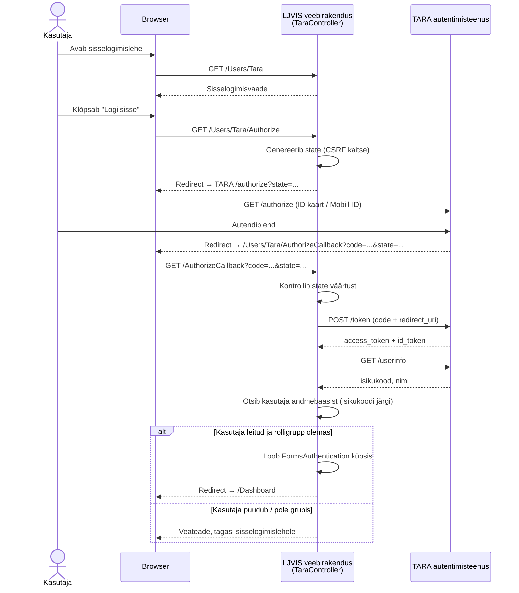
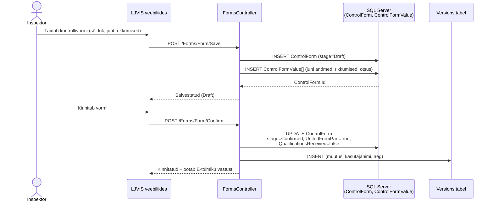
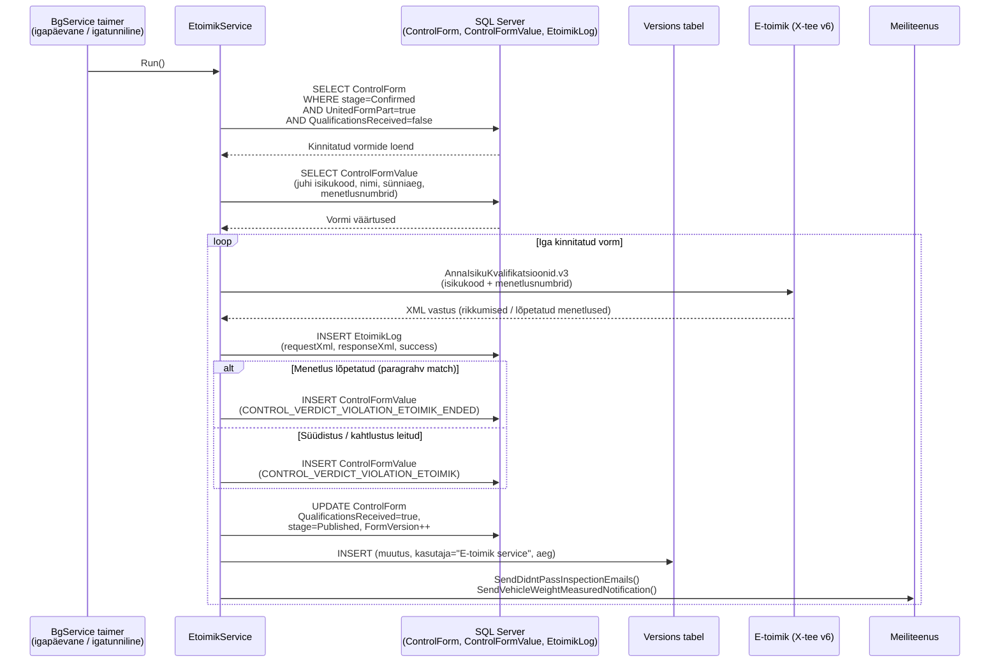
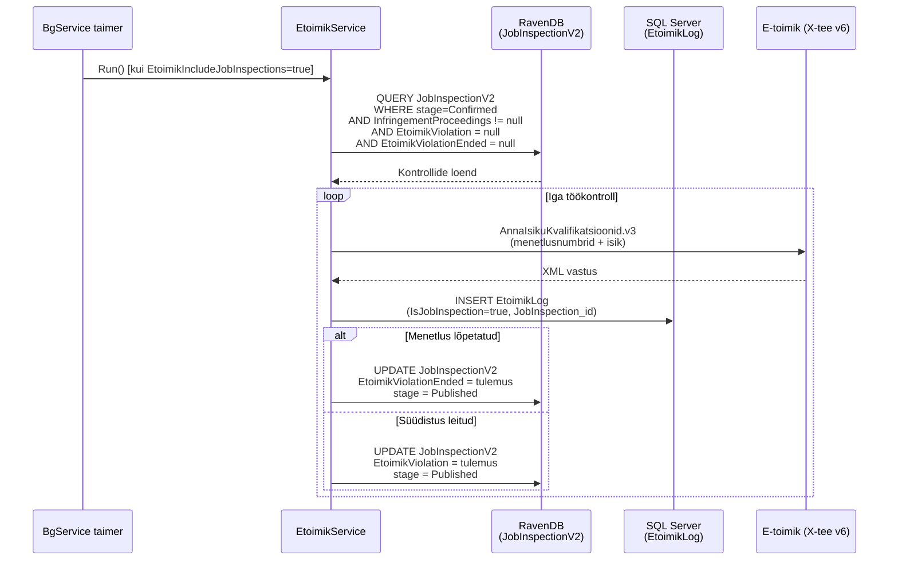
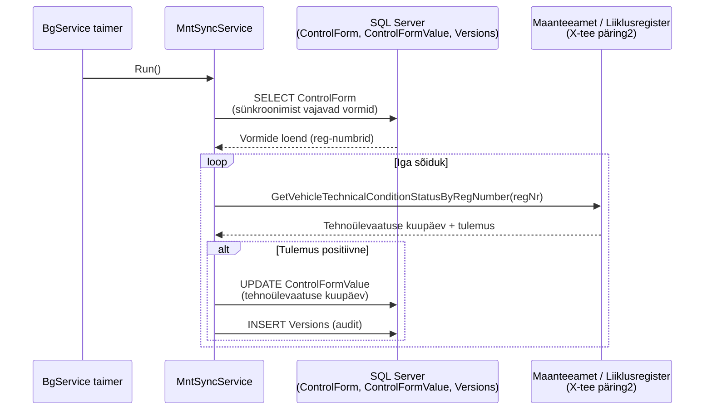
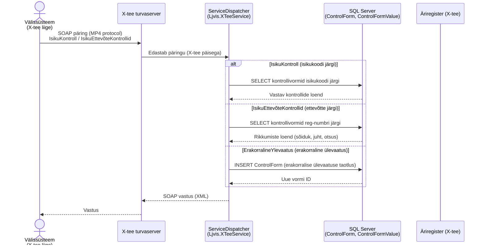
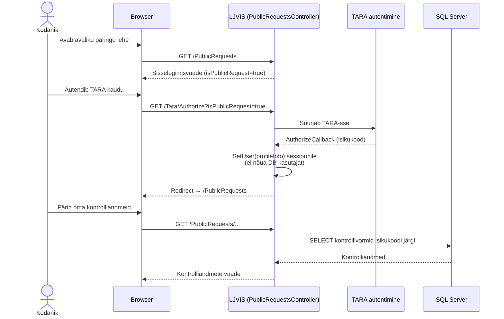

# LJVIS1 – Andmevoogude sequence diagrammid

## 1. Kasutaja autentimine (TARA)

---

## 2. Kontrollivormi loomine ja kinnitamine (maanteekontroll)

---

## 3. E-toimiku kvalifikatsioonide päring – ControlForm (BgService)

---

## 4. E-toimiku kvalifikatsioonide päring – JobInspection (BgService)

---

## 5. Sõiduki tehnoülevaatuse sünkroonimine (MntSyncService / BgService)

---

## 6. X-tee sissetulev teenus – IsikuKontroll / IsikuEttevõteKontrollid

---

## 7. Avalik päring (PublicRequests – kodaniku vaade)

