# LJVIS – Kasutuslood kasutajagruppide järgi

## Kasutajagrupid

| Grupp | Kirjeldus |
|-------|-----------|
| **Kodanik (avalik kasutaja)** | Autendib TARA kaudu, vaatab oma andmeid |
| **Inspektor** | Loob ja haldab kontrollivorme |
| **ERRU RR kasutaja** | Saadab rikkumisteated ERRU-sse |
| **ERRU Mainepäringu kasutaja** | Kontrollib vedaja head mainet |
| **ERRU Tegevusloa kontrolli kasutaja** | Kontrollib ühenduse tegevusluba |
| **ERRU Tehnokontrolli kasutaja** | Haldab teekontrolli teateid |
| **Statistikakasutaja** | Vaatab ja ekspordib statistikat |
| **Kohaliku asutuse administraator** | Haldab oma asutuse kasutajaid |
| **Süsteemiadministraator** | Täielik süsteemihaldus |
| **Välissüsteem (X-tee)** | Masinliidese päringud X-tee kaudu |
| **BgService (automatiseeritud)** | Taustaprotsessid, ei ole inimkasutaja |

---

## 1. Kodanik (avalik kasutaja)

> Autendib TARA OAuth-ga. Ei vaja DB kasutajakontot. Näeb ainult oma andmeid.

| # | Kasutuslugu | Kirjeldus |
|---|-------------|-----------|
| K-01 | Sisselogimine TARA kaudu | Autendib end ID-kaardi või Mobiil-ID abil |
| K-02 | Keele vahetamine | Vahetab rakenduse kuvakeelt |
| K-03 | Väljalogmine | Lõpetab seansi |
| K-04 | Oma kontrollide vaatamine | Näeb enda kohta tehtud kontrollivormide kokkuvõtet |
| K-05 | Oma seotud ettevõtete vaatamine | Näeb, milliste ettevõtetega on seotud |
| K-06 | Oma rikkumiste vaatamine | Näeb enda rikkumiste ajalugu |

---

## 2. Inspektor

> Sisselogitud kasutaja, kellel on üks või mitu vormitüübi rolli. Loob ja haldab kontrollivorme.

### 2a. Üldised otsingu- ja vaatamise kasutuslood

| # | Kasutuslugu | Vajalik roll |
|---|-------------|--------------|
| I-01 | Isiku otsimine | `SearchPerson` |
| I-02 | Ettevõtte otsimine | `SearchCompany` |
| I-03 | Sõiduki otsimine | `SearchVehicle` |
| I-04 | Kontrollide otsimine | `SearchControls` |
| I-05 | Vormide otsimine | `SearchForms` |
| I-06 | Vormide otsimine koodi järgi | `SearchFormsByCode` |
| I-07 | Rikkumiste vaatamine ettevõtte järgi | `SearchViolationsByCompany` |
| I-08 | Rikkumiste vaatamine isiku järgi | `SearchViolationsByPerson` |
| I-09 | Ettevõtte rikkumised isiku järgi | `SearchCompanyViolationsByPerson` |
| I-10 | Eri-ülevaatusele saadetud sõidukid | `SearchSentToSpecialInspectionVehicles` |
| I-11 | Välisvedajate rikkumised | `ForeignCarriersViolationsSearch` |
| I-12 | Isiku andmete vaatamine | Autenditud kasutaja |
| I-13 | Ettevõtte andmete vaatamine | Autenditud kasutaja |
| I-14 | Sõiduki andmete vaatamine | Autenditud kasutaja |
| I-15 | Armatuurlaua vaatamine | Autenditud kasutaja |
| I-16 | Viimaste tehingute vaatamine | Autenditud kasutaja |

### 2b. X-tee päringud (reaalajas andmeotsing)

| # | Kasutuslugu | Kirjeldus |
|---|-------------|-----------|
| I-17 | Isiku otsimine X-tee kaudu | Pärib rahvastikuregistrist või muust allikast |
| I-18 | Ettevõtte otsimine X-tee kaudu | Pärib äriregistrist |
| I-19 | Riikide lühikoodide laadimine | Abiväärtused vormi täitmiseks |

### 2c. Kontrollivormid – maanteekontroll

| # | Kasutuslugu | Vajalik roll |
|---|-------------|--------------|
| I-20 | Teeäärse kontrollikaardi loomine | `RoadControlCard` |
| I-21 | Teeäärse kontrollikaardi (2012) loomine | `RoadControlCard2012` |
| I-22 | Ohtliku veo vormi loomine | `DangerousDelivery` |
| I-23 | Ohtliku veo vormi (2012) loomine | `DangerousDelivery2012` |
| I-24 | Välismaalase rikkumise vormi loomine | `ForeignViolate` |
| I-25 | Veovahendi tehnoülevaatuse vormi loomine | `Roadworthiness` |
| I-26 | Tehnoülevaatuse vormi (2012) loomine | `Roadworthiness2012` |
| I-27 | Kütusevõtuki vormi loomine | `FuelSample` |
| I-28 | Transpordi peatamise vormi loomine | `TransportInterruption` |
| I-29 | Vormi salvestamine mustandina | Sama roll kui loomine |
| I-30 | Vormi kinnitamine | Sama roll kui loomine |
| I-31 | Vormi redigeerimine (enda loodud) | `EditOwnData` |
| I-32 | Vormi kustutamine (enda loodud) | `DeleteOwnData` |
| I-33 | Vormi redigeerimine (oma asutus) | `EditOwnEstablishmentData` |
| I-34 | Vormi kustutamine (oma asutus) | `DeleteOwnEstablishmentData` |
| I-35 | Vormi suunamine teisele kasutajale | `AllowControlFormRedirecting` |
| I-36 | Haldusmenetluse sektsiooni uuendamine | `AllowUpdateControlFormAdministrativeProcedureSection` |
| I-37 | Dokumendikontrolli vormi loomine/vaatamine | Forms area |
| I-38 | Kiirusmõõtja vormi loomine | Forms area |

### 2d. Töökontroll (JobInspection)

| # | Kasutuslugu | Vajalik roll |
|---|-------------|--------------|
| I-39 | Töökontrolli vormi loomine | `JobInspection` |
| I-40 | Töökontrolli vormi redigeerimine | `JobInspection` |
| I-41 | Töökontrollide otsimine ja filtreerimine | `JobInspection` |
| I-42 | Töökontrolli menetluse andmete vaatamine | `JobInspection` |

### 2e. Hea maine kontroll (Good Repute)

| # | Kasutuslugu | Vajalik roll |
|---|-------------|--------------|
| I-43 | Hea maine kontrolli vormi loomine | `GoodRepute` |

### 2f. Riskihinnang

| # | Kasutuslugu | Kirjeldus |
|---|-------------|-----------|
| I-44 | Riskihinnangu vaatamine | Autenditud kasutaja |
| I-45 | Riskihinnangu eksportimine Excelisse | Autenditud kasutaja |

### 2g. Arhiiv

| # | Kasutuslugu | Kirjeldus |
|---|-------------|-----------|
| I-46 | Arhiivi sirvamine ja otsimine | Autenditud kasutaja |
| I-47 | Arhiivianalüüsi loomine | Autenditud kasutaja |

---

## 3. ERRU RR kasutaja (rikkumisteated)

> Grupp `ROLE_GROUP_ERRU_INF`. Haldab rikkumisteateid ERRU süsteemiga.

| # | Kasutuslugu | Kirjeldus |
|---|-------------|-----------|
| E1-01 | Rikkumisteadete loendi vaatamine | Kõik sissetulevad/väljaminevad teated |
| E1-02 | Rikkumisteadete otsimine | Filtreerimine kuupäeva, ettevõtte jms järgi |
| E1-03 | MS→ERRU rikkumisteate loomine | Saadab rikkumisteate ERRU-sse |
| E1-04 | Rikkumisteate esitamine | Kinnitab ja saadab teate |
| E1-05 | Olemasoleva rikkumisteate laadimine | Vaatab/muudab eelnevalt loodud teadet |

---

## 4. ERRU Mainepäringu kasutaja (CheckGoodRepute)

> Grupp `ROLE_GROUP_ERRU_CGR`. Kontrollib vedajate head mainet ERRU kaudu.

| # | Kasutuslugu | Kirjeldus |
|---|-------------|-----------|
| E2-01 | Mainepäringu sõnumi loomine | Algatab hea maine kontrollpäringu |
| E2-02 | Mainepäringute loendi vaatamine | Näeb kõiki päringuid ja nende staatuseid |
| E2-03 | Mainepäringu vastuse vaatamine | Näeb ERRU vastust |

---

## 5. ERRU Tegevusloa kontrolli kasutaja (CheckCommunityLicence)

> Grupp `ROLE_GROUP_ERRU_CCL`. Kontrollib ühenduse tegevuslube.

| # | Kasutuslugu | Kirjeldus |
|---|-------------|-----------|
| E3-01 | Tegevusloa kontrollpäringu loomine | Algatab tegevusloa kontrolli |
| E3-02 | Tegevusloa teadete loend | Vaatab kõiki päringuid |
| E3-03 | Tegevusloa teadete otsimine | Filtreerimine |
| E3-04 | Tegevusloa kontrollvastuse vaatamine | Näeb ERRU vastust |

---

## 6. ERRU Teknokontrolli kasutaja (RoadSideInspection)

> Grupp `ROLE_GROUP_ERRU_RSI`. Haldab teekontrolli teateid ERRU-ga.

| # | Kasutuslugu | Kirjeldus |
|---|-------------|-----------|
| E4-01 | Teekontrolli teadete loend | Kõik sissetulevad/väljaminevad teated |
| E4-02 | Teekontrolli teadete otsimine | Filtreerimine |
| E4-03 | Teekontrolli teate detailide vaatamine | Täpne info ühe teate kohta |
| E4-04 | Vastuse saabumise kontrollimine | Kontrollib, kas ERRU on vastanud |

---

## 7. Statistikakasutaja

> Grupp `ROLE_GROUP_STATISTICS`. Statistika eksporditööriistad.

| # | Kasutuslugu | Kirjeldus |
|---|-------------|-----------|
| S-01 | Statistikaraporti vaatamine | Koondaruanne kontrollivormidest |
| S-02 | Statistika eksportimine Excelisse | Laadib alla tabeli |
| S-03 | CVS-i andmete vaatamine | Avab CVS-andmefaili |

---

## 8. Kohaliku asutuse administraator

> Roll `AdministrateOwnEstablishmentUsers`. Haldab kasutajaid ainult oma asutuses.

| # | Kasutuslugu | Kirjeldus |
|---|-------------|-----------|
| A1-01 | Oma asutuse kasutajate loend | Näeb kasutajaid oma piires |
| A1-02 | Uue kasutaja lisamine | Lisab uue kasutaja oma asutusesse |
| A1-03 | Kasutaja andmete muutmine | Muudab kasutaja infot |
| A1-04 | Kasutajale rolligrupi määramine | Määrab kasutajale õigused |

---

## 9. Süsteemiadministraator

> Roll `AdministrateAllUsers` + `AllowQueries`. Täielik ligipääs.

| # | Kasutuslugu | Kirjeldus |
|---|-------------|-----------|
| SA-01 | Kõikide kasutajate haldamine | Kasutajate loend kõigist asutustest |
| SA-02 | Kasutaja loomine/muutmine/kustutamine | Täielik kasutajahaldus |
| SA-03 | Rollide ja rolligruppide vaatamine | Näeb kogu õiguste maatriksit |
| SA-04 | Rolli lisamine rolligruppi | Muudab rolligrupi õigusi |
| SA-05 | Rolli eemaldamine rolligrupist | Kitsendab rolligrupi õigusi |
| SA-06 | Uue rolligrupi loomine | Loob uue õiguste komplekti |
| SA-07 | Rolligrupi kustutamine | Eemaldab olemasoleva grupi |
| SA-08 | Klassifikaatorite vaatamine | Näeb süsteemi viiteväärtusi |
| SA-09 | Klassifikaatorite muutmine | Muudab/lisab viiteväärtusi |
| SA-10 | Klassifikaatorite järjestamine | Muudab kuvajärjekorda |
| SA-11 | Tootmislogiisse sisenemine | `AdministrateProductionLog` |
| SA-12 | DB sünkroonimispäringu käivitamine | `AllowQueries` – otsepäring andmebaasile |
| SA-13 | Sünkroonimise lähtestamine | Lähtestab sync-oleku |
| SA-14 | Raportite loend | Näeb kõiki süsteemiraporteid |
| SA-15 | Raporti käivitamine | `RunReports` |
| SA-16 | ERRU/SSRS raportite vaatamine | `ViewReports` |
| SA-17 | Erakorralise ülevaatuse vormi haldamine | Admin kontroll |

---

## 10. Välissüsteem (X-tee inbound)

> Masinliides. Autendib X-tee turvaserveri kaudu (SOAP/MP4).

| # | Kasutuslugu | X-tee teenus |
|---|-------------|--------------|
| X-01 | Isiku kontrollide pärimine | `IsikuKontroll` |
| X-02 | Ettevõtte ja isiku rikkumiste pärimine | `IsikuEttevõteKontrollid` |
| X-03 | Erakorralise ülevaatuse algatamine | `ErakorralineYlevaatus` |
| X-04 | Erakorralise ülevaatuse kinnitamine | `ErakorralineYlevaatusTehtud` |
| X-05 | Töökontrolli registreerimine (v1) | `RegisterJobInspection` |
| X-06 | Töökontrolli registreerimine (v2) | `RegisterJobInspectionV2` |

---

## 11. BgService (automatiseeritud taustaprotsessid)

> Ei ole inimkasutaja. Käivitub ajalise plaani alusel.

| # | Kasutuslugu | Kirjeldus | Sagedus |
|---|-------------|-----------|---------|
| B-01 | E-toimiku kvalifikatsioonide pärimine (ControlForm) | Pärib kinnitatud vormide kohta menetlusandmeid | Iga päev / iga tund |
| B-02 | E-toimiku kvalifikatsioonide pärimine (JobInspection) | Sama, RavenDB töökontrollidele | Iga päev / iga tund |
| B-03 | Tehnoülevaatuse andmete sünkroonimine | Pärib Liiklusregistrist sõidukite ülevaatuse kuupäevi | Iga päev / iga tund |
| B-04 | E-meili teavituste saatmine | Saadab meilid kontrolli mitteläbimise kohta | Automaatne (B-01 osana) |
| B-05 | Sõiduki kaalumise teavituse saatmine | Saadab meili kaalumistulemuse kohta | Automaatne (B-01 osana) |

---

---

# Sequence diagrammid kasutajagruppide kaupa

---

## K – Kodanik (avalik kasutaja)

### K-01…K-03 · Sisselogimine ja väljalogmine (TARA)

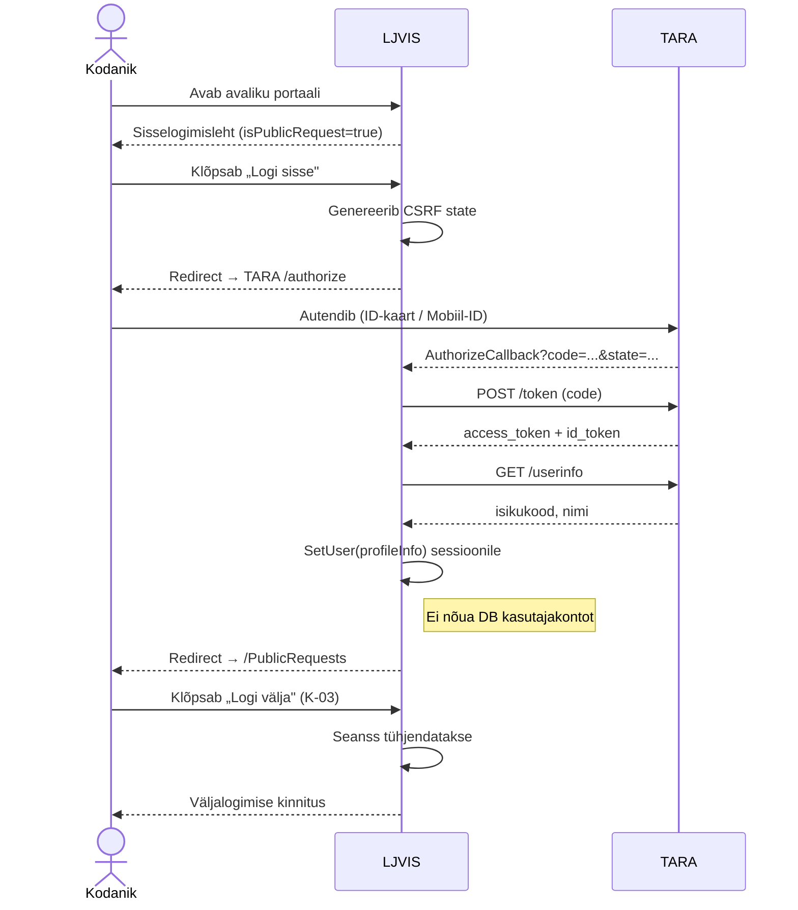
```mermaid
sequenceDiagram
    actor Kodanik
    participant UI as LJVIS
    participant TARA

    Kodanik->>UI: Avab avaliku portaali
    UI-->>Kodanik: Sisselogimisleht (isPublicRequest=true)

    Kodanik->>UI: Klõpsab „Logi sisse"
    UI->>UI: Genereerib CSRF state
    UI-->>Kodanik: Redirect → TARA /authorize

    Kodanik->>TARA: Autendib (ID-kaart / Mobiil-ID)
    TARA-->>UI: AuthorizeCallback?code=...&state=...

    UI->>TARA: POST /token (code)
    TARA-->>UI: access_token + id_token
    UI->>TARA: GET /userinfo
    TARA-->>UI: isikukood, nimi

    UI->>UI: SetUser(profileInfo) sessioonile
    Note right of UI: Ei nõua DB kasutajakontot
    UI-->>Kodanik: Redirect → /PublicRequests

    Kodanik->>UI: Klõpsab „Logi välja" (K-03)
    UI->>UI: Seanss tühjendatakse
    UI-->>Kodanik: Väljalogimise kinnitus
```

### K-04…K-06 · Oma andmete vaatamine

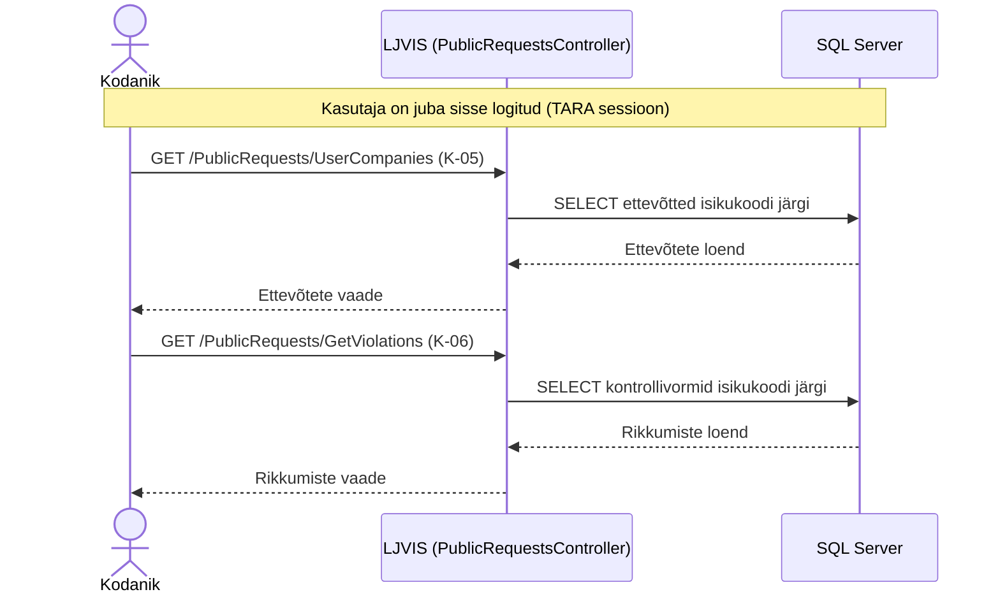
```mermaid
sequenceDiagram
    actor Kodanik
    participant UI as LJVIS (PublicRequestsController)
    participant DB as SQL Server

    Note over Kodanik,DB: Kasutaja on juba sisse logitud (TARA sessioon)

    Kodanik->>UI: GET /PublicRequests/UserCompanies (K-05)
    UI->>DB: SELECT ettevõtted isikukoodi järgi
    DB-->>UI: Ettevõtete loend
    UI-->>Kodanik: Ettevõtete vaade

    Kodanik->>UI: GET /PublicRequests/GetViolations (K-06)
    UI->>DB: SELECT kontrollivormid isikukoodi järgi
    DB-->>UI: Rikkumiste loend
    UI-->>Kodanik: Rikkumiste vaade
```

---

## I – Inspektor

### I-01…I-16 · Otsing ja andmete vaatamine

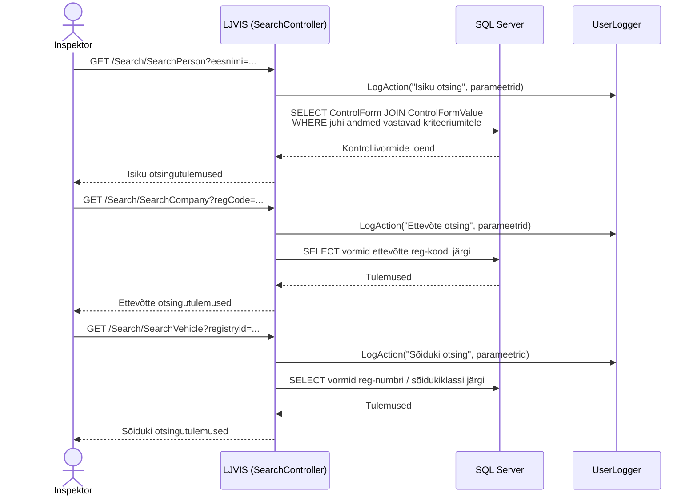
```mermaid
sequenceDiagram
    actor Inspektor
    participant UI as LJVIS (SearchController)
    participant DB as SQL Server
    participant Log as UserLogger

    Inspektor->>UI: GET /Search/SearchPerson?eesnimi=...
    UI->>Log: LogAction("Isiku otsing", parameetrid)
    UI->>DB: SELECT ControlForm JOIN ControlFormValue<br/>WHERE juhi andmed vastavad kriteeriumitele
    DB-->>UI: Kontrollivormide loend
    UI-->>Inspektor: Isiku otsingutulemused

    Inspektor->>UI: GET /Search/SearchCompany?regCode=...
    UI->>Log: LogAction("Ettevõte otsing", parameetrid)
    UI->>DB: SELECT vormid ettevõtte reg-koodi järgi
    DB-->>UI: Tulemused
    UI-->>Inspektor: Ettevõtte otsingutulemused

    Inspektor->>UI: GET /Search/SearchVehicle?registryid=...
    UI->>Log: LogAction("Sõiduki otsing", parameetrid)
    UI->>DB: SELECT vormid reg-numbri / sõidukiklassi järgi
    DB-->>UI: Tulemused
    UI-->>Inspektor: Sõiduki otsingutulemused
```

### I-17…I-18 · Reaalajas X-tee päringud vormi täitmisel

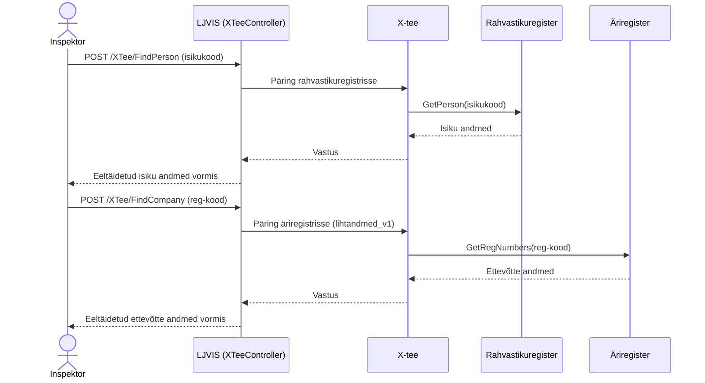
```mermaid
sequenceDiagram
    actor Inspektor
    participant UI as LJVIS (XTeeController)
    participant XTee as X-tee
    participant RR as Rahvastikuregister
    participant BR as Äriregister

    Inspektor->>UI: POST /XTee/FindPerson (isikukood)
    UI->>XTee: Päring rahvastikuregistrisse
    XTee->>RR: GetPerson(isikukood)
    RR-->>XTee: Isiku andmed
    XTee-->>UI: Vastus
    UI-->>Inspektor: Eeltäidetud isiku andmed vormis

    Inspektor->>UI: POST /XTee/FindCompany (reg-kood)
    UI->>XTee: Päring äriregistrisse (lihtandmed_v1)
    XTee->>BR: GetRegNumbers(reg-kood)
    BR-->>XTee: Ettevõtte andmed
    XTee-->>UI: Vastus
    UI-->>Inspektor: Eeltäidetud ettevõtte andmed vormis
```

### I-20…I-30 · Kontrollivormi loomine ja kinnitamine

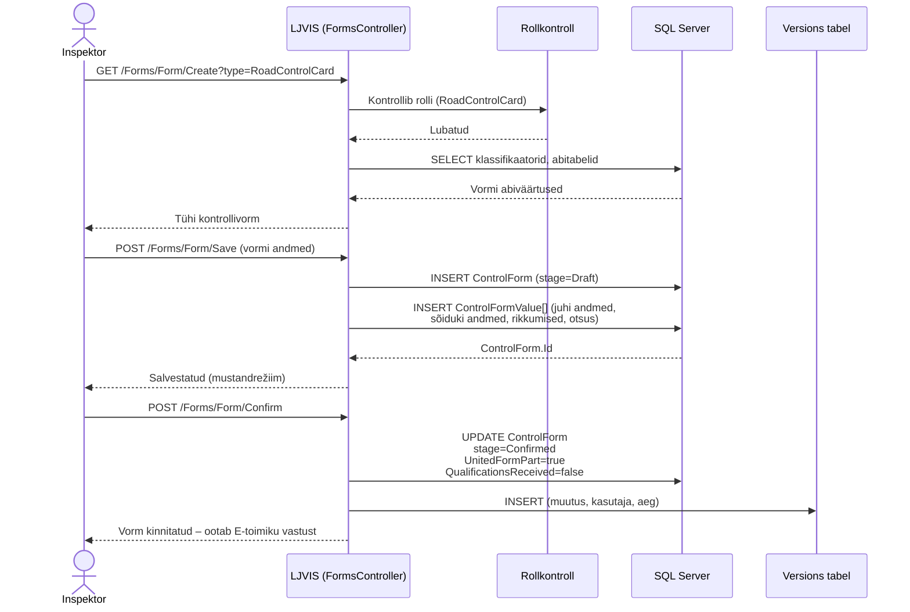
```mermaid
sequenceDiagram
    actor Inspektor
    participant UI as LJVIS (FormsController)
    participant Auth as Rollkontroll
    participant DB as SQL Server
    participant Versions as Versions tabel

    Inspektor->>UI: GET /Forms/Form/Create?type=RoadControlCard
    UI->>Auth: Kontrollib rolli (RoadControlCard)
    Auth-->>UI: Lubatud

    UI->>DB: SELECT klassifikaatorid, abitabelid
    DB-->>UI: Vormi abiväärtused
    UI-->>Inspektor: Tühi kontrollivorm

    Inspektor->>UI: POST /Forms/Form/Save (vormi andmed)
    UI->>DB: INSERT ControlForm (stage=Draft)
    UI->>DB: INSERT ControlFormValue[] (juhi andmed,<br/>sõiduki andmed, rikkumised, otsus)
    DB-->>UI: ControlForm.Id
    UI-->>Inspektor: Salvestatud (mustandrežiim)

    Inspektor->>UI: POST /Forms/Form/Confirm
    UI->>DB: UPDATE ControlForm<br/>stage=Confirmed<br/>UnitedFormPart=true<br/>QualificationsReceived=false
    UI->>Versions: INSERT (muutus, kasutaja, aeg)
    UI-->>Inspektor: Vorm kinnitatud – ootab E-toimiku vastust
```

### I-31…I-35 · Vormi redigeerimine ja suunamine

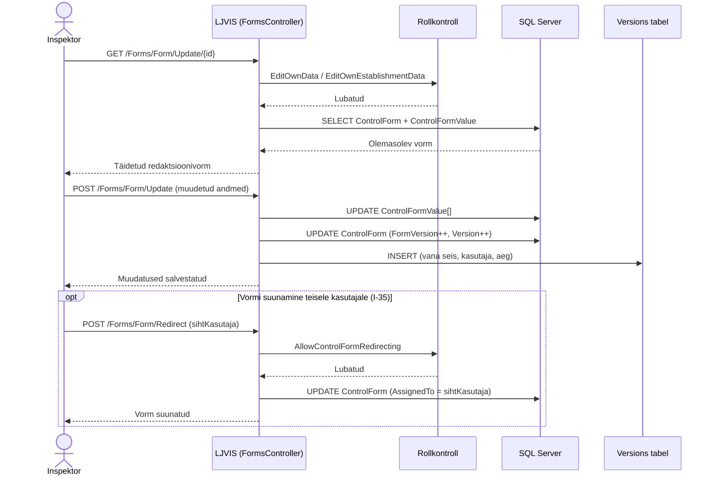
```mermaid
sequenceDiagram
    actor Inspektor
    participant UI as LJVIS (FormsController)
    participant Auth as Rollkontroll
    participant DB as SQL Server
    participant Versions as Versions tabel

    Inspektor->>UI: GET /Forms/Form/Update/{id}
    UI->>Auth: EditOwnData / EditOwnEstablishmentData
    Auth-->>UI: Lubatud
    UI->>DB: SELECT ControlForm + ControlFormValue
    DB-->>UI: Olemasolev vorm
    UI-->>Inspektor: Täidetud redaktsioonivorm

    Inspektor->>UI: POST /Forms/Form/Update (muudetud andmed)
    UI->>DB: UPDATE ControlFormValue[]
    UI->>DB: UPDATE ControlForm (FormVersion++, Version++)
    UI->>Versions: INSERT (vana seis, kasutaja, aeg)
    UI-->>Inspektor: Muudatused salvestatud

    opt Vormi suunamine teisele kasutajale (I-35)
        Inspektor->>UI: POST /Forms/Form/Redirect (sihtKasutaja)
        UI->>Auth: AllowControlFormRedirecting
        Auth-->>UI: Lubatud
        UI->>DB: UPDATE ControlForm (AssignedTo = sihtKasutaja)
        UI-->>Inspektor: Vorm suunatud
    end
```

### I-39…I-42 · Töökontrolli haldamine

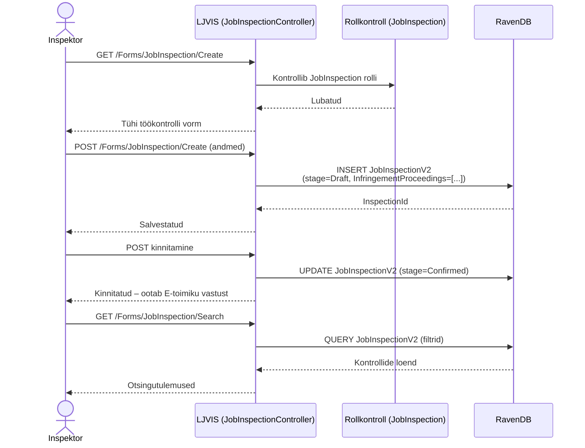
```mermaid
sequenceDiagram
    actor Inspektor
    participant UI as LJVIS (JobInspectionController)
    participant Auth as Rollkontroll (JobInspection)
    participant Raven as RavenDB

    Inspektor->>UI: GET /Forms/JobInspection/Create
    UI->>Auth: Kontrollib JobInspection rolli
    Auth-->>UI: Lubatud
    UI-->>Inspektor: Tühi töökontrolli vorm

    Inspektor->>UI: POST /Forms/JobInspection/Create (andmed)
    UI->>Raven: INSERT JobInspectionV2<br/>(stage=Draft, InfringementProceedings=[...])
    Raven-->>UI: InspectionId
    UI-->>Inspektor: Salvestatud

    Inspektor->>UI: POST kinnitamine
    UI->>Raven: UPDATE JobInspectionV2 (stage=Confirmed)
    UI-->>Inspektor: Kinnitatud – ootab E-toimiku vastust

    Inspektor->>UI: GET /Forms/JobInspection/Search
    UI->>Raven: QUERY JobInspectionV2 (filtrid)
    Raven-->>UI: Kontrollide loend
    UI-->>Inspektor: Otsingutulemused
```

### I-44…I-47 · Riskihinnang ja arhiiv

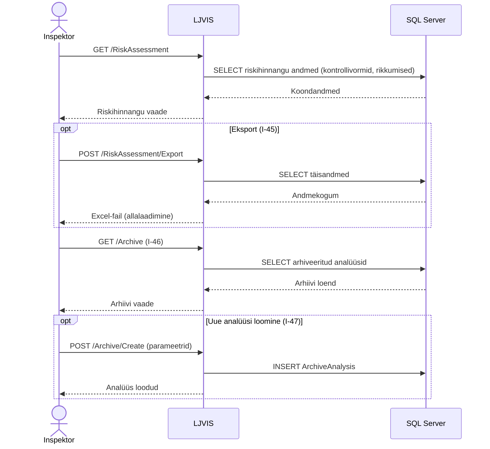
```mermaid
sequenceDiagram
    actor Inspektor
    participant UI as LJVIS
    participant DB as SQL Server

    Inspektor->>UI: GET /RiskAssessment
    UI->>DB: SELECT riskihinnangu andmed (kontrollivormid, rikkumised)
    DB-->>UI: Koondandmed
    UI-->>Inspektor: Riskihinnangu vaade

    opt Eksport (I-45)
        Inspektor->>UI: POST /RiskAssessment/Export
        UI->>DB: SELECT täisandmed
        DB-->>UI: Andmekogum
        UI-->>Inspektor: Excel-fail (allalaadimine)
    end

    Inspektor->>UI: GET /Archive (I-46)
    UI->>DB: SELECT arhiveeritud analüüsid
    DB-->>UI: Arhiivi loend
    UI-->>Inspektor: Arhiivi vaade

    opt Uue analüüsi loomine (I-47)
        Inspektor->>UI: POST /Archive/Create (parameetrid)
        UI->>DB: INSERT ArchiveAnalysis
        UI-->>Inspektor: Analüüs loodud
    end
```

---

## E1 – ERRU RR kasutaja (rikkumisteated)

### E1-01…E1-05 · Rikkumisteate loomine ja saatmine ERRU-sse

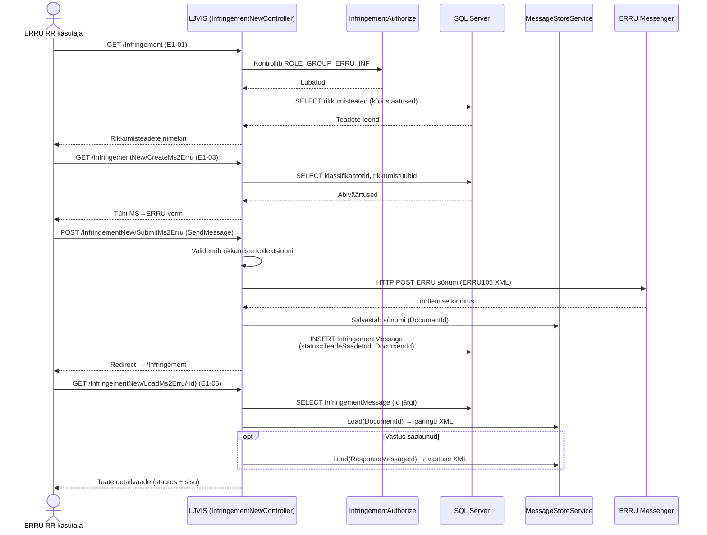
```mermaid
sequenceDiagram
    actor Kasutaja as ERRU RR kasutaja
    participant UI as LJVIS (InfringementNewController)
    participant Auth as InfringementAuthorize
    participant DB as SQL Server
    participant MsgStore as MessageStoreService
    participant ERRU as ERRU Messenger

    Kasutaja->>UI: GET /Infringement (E1-01)
    UI->>Auth: Kontrollib ROLE_GROUP_ERRU_INF
    Auth-->>UI: Lubatud
    UI->>DB: SELECT rikkumisteated (kõik staatused)
    DB-->>UI: Teadete loend
    UI-->>Kasutaja: Rikkumisteadete nimekiri

    Kasutaja->>UI: GET /InfringementNew/CreateMs2Erru (E1-03)
    UI->>DB: SELECT klassifikaatorid, rikkumistüübid
    DB-->>UI: Abiväärtused
    UI-->>Kasutaja: Tühi MS→ERRU vorm

    Kasutaja->>UI: POST /InfringementNew/SubmitMs2Erru (SendMessage)
    UI->>UI: Valideerib rikkumiste kollektsiooni
    UI->>ERRU: HTTP POST ERRU sõnum (ERRU105 XML)
    ERRU-->>UI: Töötlemise kinnitus
    UI->>MsgStore: Salvestab sõnumi (DocumentId)
    UI->>DB: INSERT InfringementMessage<br/>(status=TeadeSaadetud, DocumentId)
    UI-->>Kasutaja: Redirect → /Infringement

    Kasutaja->>UI: GET /InfringementNew/LoadMs2Erru/{id} (E1-05)
    UI->>DB: SELECT InfringementMessage (id järgi)
    UI->>MsgStore: Load(DocumentId) → päringu XML
    opt Vastus saabunud
        UI->>MsgStore: Load(ResponseMessageId) → vastuse XML
    end
    UI-->>Kasutaja: Teate detailvaade (staatus + sisu)
```

---

## E2 – ERRU Mainepäringu kasutaja (CheckGoodRepute)

### E2-01…E2-03 · Hea maine kontrollpäringu saatmine

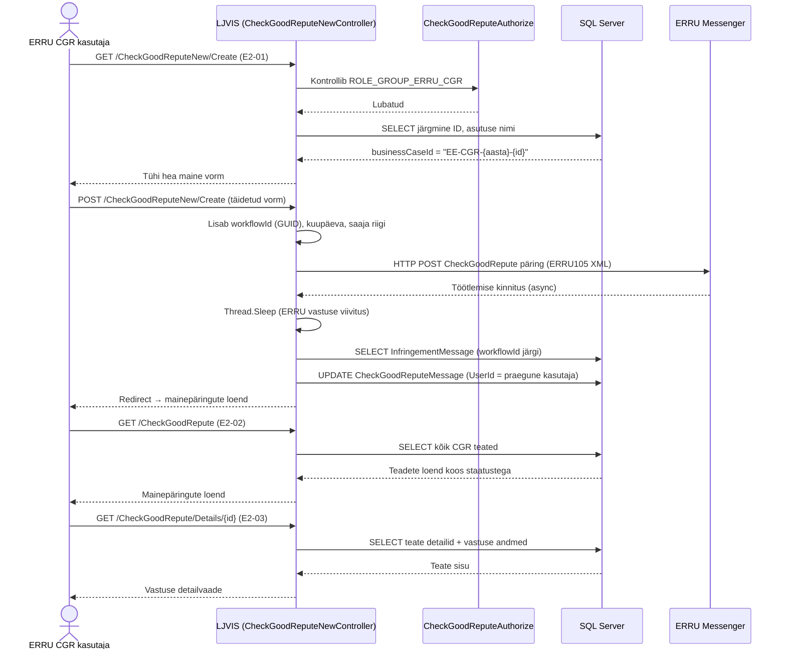
```mermaid
sequenceDiagram
    actor Kasutaja as ERRU CGR kasutaja
    participant UI as LJVIS (CheckGoodReputeNewController)
    participant Auth as CheckGoodReputeAuthorize
    participant DB as SQL Server
    participant ERRU as ERRU Messenger

    Kasutaja->>UI: GET /CheckGoodReputeNew/Create (E2-01)
    UI->>Auth: Kontrollib ROLE_GROUP_ERRU_CGR
    Auth-->>UI: Lubatud
    UI->>DB: SELECT järgmine ID, asutuse nimi
    DB-->>UI: businessCaseId = "EE-CGR-{aasta}-{id}"
    UI-->>Kasutaja: Tühi hea maine vorm

    Kasutaja->>UI: POST /CheckGoodReputeNew/Create (täidetud vorm)
    UI->>UI: Lisab workflowId (GUID), kuupäeva, saaja riigi
    UI->>ERRU: HTTP POST CheckGoodRepute päring (ERRU105 XML)
    ERRU-->>UI: Töötlemise kinnitus (async)
    UI->>UI: Thread.Sleep (ERRU vastuse viivitus)
    UI->>DB: SELECT InfringementMessage (workflowId järgi)
    UI->>DB: UPDATE CheckGoodReputeMessage (UserId = praegune kasutaja)
    UI-->>Kasutaja: Redirect → mainepäringute loend

    Kasutaja->>UI: GET /CheckGoodRepute (E2-02)
    UI->>DB: SELECT kõik CGR teated
    DB-->>UI: Teadete loend koos staatustega
    UI-->>Kasutaja: Mainepäringute loend

    Kasutaja->>UI: GET /CheckGoodRepute/Details/{id} (E2-03)
    UI->>DB: SELECT teate detailid + vastuse andmed
    DB-->>UI: Teate sisu
    UI-->>Kasutaja: Vastuse detailvaade
```

---

## E3 – ERRU Tegevusloa kontrolli kasutaja (CheckCommunityLicence)

### E3-01…E3-04 · Tegevusloa kontrollpäringu haldamine

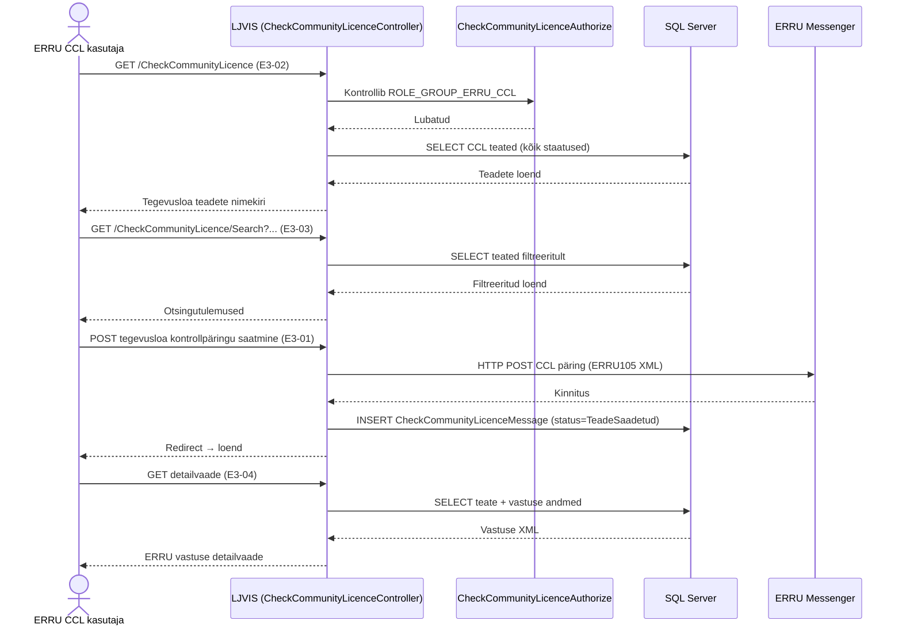
```mermaid
sequenceDiagram
    actor Kasutaja as ERRU CCL kasutaja
    participant UI as LJVIS (CheckCommunityLicenceController)
    participant Auth as CheckCommunityLicenceAuthorize
    participant DB as SQL Server
    participant ERRU as ERRU Messenger

    Kasutaja->>UI: GET /CheckCommunityLicence (E3-02)
    UI->>Auth: Kontrollib ROLE_GROUP_ERRU_CCL
    Auth-->>UI: Lubatud
    UI->>DB: SELECT CCL teated (kõik staatused)
    DB-->>UI: Teadete loend
    UI-->>Kasutaja: Tegevusloa teadete nimekiri

    Kasutaja->>UI: GET /CheckCommunityLicence/Search?... (E3-03)
    UI->>DB: SELECT teated filtreeritult
    DB-->>UI: Filtreeritud loend
    UI-->>Kasutaja: Otsingutulemused

    Kasutaja->>UI: POST tegevusloa kontrollpäringu saatmine (E3-01)
    UI->>ERRU: HTTP POST CCL päring (ERRU105 XML)
    ERRU-->>UI: Kinnitus
    UI->>DB: INSERT CheckCommunityLicenceMessage (status=TeadeSaadetud)
    UI-->>Kasutaja: Redirect → loend

    Kasutaja->>UI: GET detailvaade (E3-04)
    UI->>DB: SELECT teate + vastuse andmed
    DB-->>UI: Vastuse XML
    UI-->>Kasutaja: ERRU vastuse detailvaade
```

---

## E4 – ERRU Teknokontrolli kasutaja (RoadSideInspection)

### E4-01…E4-04 · Teekontrolli teadete haldamine

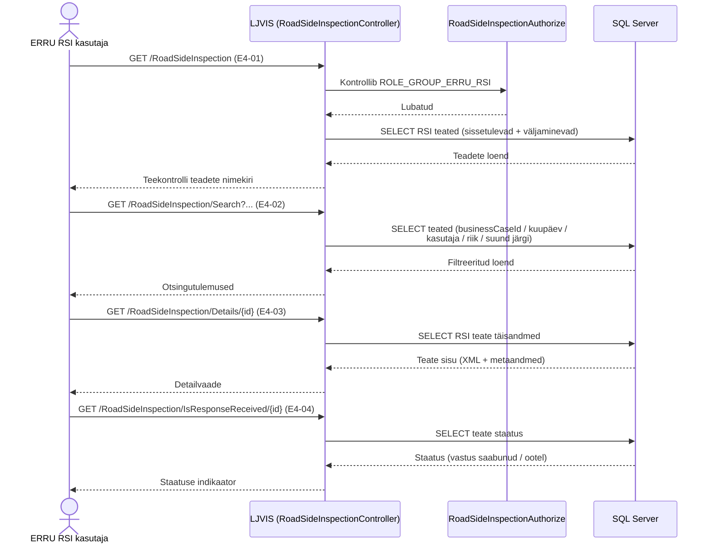
```mermaid
sequenceDiagram
    actor Kasutaja as ERRU RSI kasutaja
    participant UI as LJVIS (RoadSideInspectionController)
    participant Auth as RoadSideInspectionAuthorize
    participant DB as SQL Server

    Kasutaja->>UI: GET /RoadSideInspection (E4-01)
    UI->>Auth: Kontrollib ROLE_GROUP_ERRU_RSI
    Auth-->>UI: Lubatud
    UI->>DB: SELECT RSI teated (sissetulevad + väljaminevad)
    DB-->>UI: Teadete loend
    UI-->>Kasutaja: Teekontrolli teadete nimekiri

    Kasutaja->>UI: GET /RoadSideInspection/Search?... (E4-02)
    UI->>DB: SELECT teated (businessCaseId / kuupäev /<br/>kasutaja / riik / suund järgi)
    DB-->>UI: Filtreeritud loend
    UI-->>Kasutaja: Otsingutulemused

    Kasutaja->>UI: GET /RoadSideInspection/Details/{id} (E4-03)
    UI->>DB: SELECT RSI teate täisandmed
    DB-->>UI: Teate sisu (XML + metaandmed)
    UI-->>Kasutaja: Detailvaade

    Kasutaja->>UI: GET /RoadSideInspection/IsResponseReceived/{id} (E4-04)
    UI->>DB: SELECT teate staatus
    DB-->>UI: Staatus (vastus saabunud / ootel)
    UI-->>Kasutaja: Staatuse indikaator
```

---

## S – Statistikakasutaja

### S-01…S-03 · Statistika ja raportid

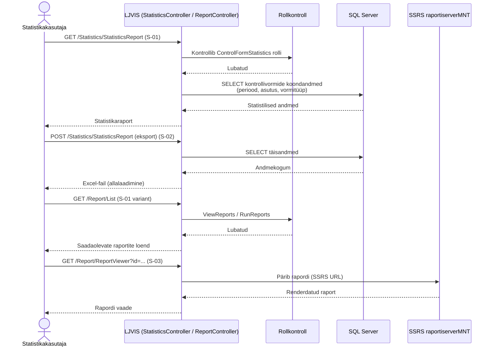
```mermaid
sequenceDiagram
    actor Kasutaja as Statistikakasutaja
    participant UI as LJVIS (StatisticsController / ReportController)
    participant Auth as Rollkontroll
    participant DB as SQL Server
    participant SSRS as SSRS raportiserverMNT

    Kasutaja->>UI: GET /Statistics/StatisticsReport (S-01)
    UI->>Auth: Kontrollib ControlFormStatistics rolli
    Auth-->>UI: Lubatud
    UI->>DB: SELECT kontrollivormide koondandmed<br/>(periood, asutus, vormitüüp)
    DB-->>UI: Statistilised andmed
    UI-->>Kasutaja: Statistikaraport

    Kasutaja->>UI: POST /Statistics/StatisticsReport (eksport) (S-02)
    UI->>DB: SELECT täisandmed
    DB-->>UI: Andmekogum
    UI-->>Kasutaja: Excel-fail (allalaadimine)

    Kasutaja->>UI: GET /Report/List (S-01 variant)
    UI->>Auth: ViewReports / RunReports
    Auth-->>UI: Lubatud
    UI-->>Kasutaja: Saadaolevate raportite loend

    Kasutaja->>UI: GET /Report/ReportViewer?id=... (S-03)
    UI->>SSRS: Pärib rapordi (SSRS URL)
    SSRS-->>UI: Renderdatud raport
    UI-->>Kasutaja: Rapordi vaade
```

---

## A1 – Kohaliku asutuse administraator

### A1-01…A1-04 · Oma asutuse kasutajate haldamine

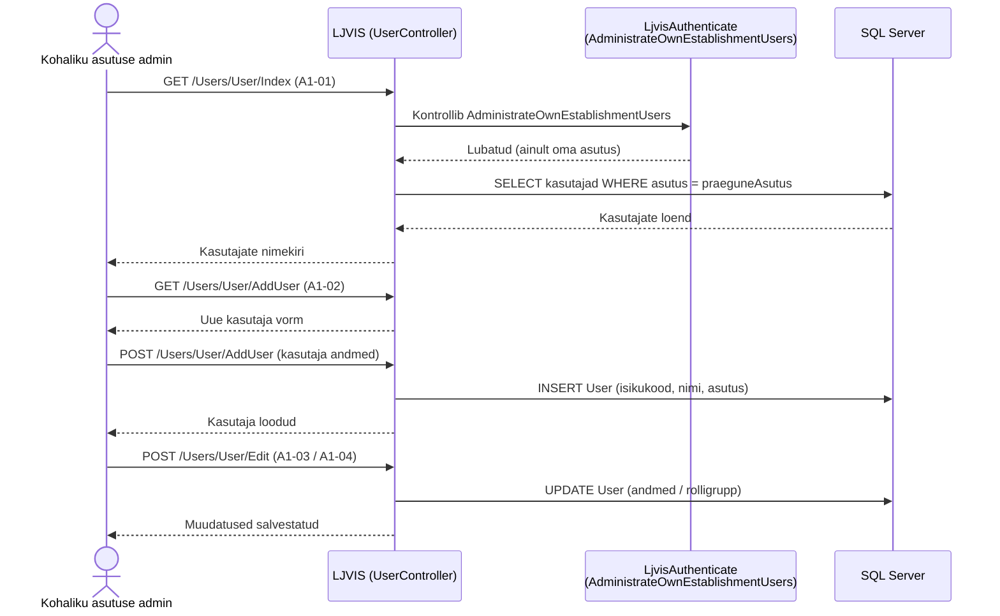
```mermaid
sequenceDiagram
    actor Admin as Kohaliku asutuse admin
    participant UI as LJVIS (UserController)
    participant Auth as LjvisAuthenticate<br/>(AdministrateOwnEstablishmentUsers)
    participant DB as SQL Server

    Admin->>UI: GET /Users/User/Index (A1-01)
    UI->>Auth: Kontrollib AdministrateOwnEstablishmentUsers
    Auth-->>UI: Lubatud (ainult oma asutus)
    UI->>DB: SELECT kasutajad WHERE asutus = praeguneAsutus
    DB-->>UI: Kasutajate loend
    UI-->>Admin: Kasutajate nimekiri

    Admin->>UI: GET /Users/User/AddUser (A1-02)
    UI-->>Admin: Uue kasutaja vorm

    Admin->>UI: POST /Users/User/AddUser (kasutaja andmed)
    UI->>DB: INSERT User (isikukood, nimi, asutus)
    UI-->>Admin: Kasutaja loodud

    Admin->>UI: POST /Users/User/Edit (A1-03 / A1-04)
    UI->>DB: UPDATE User (andmed / rolligrupp)
    UI-->>Admin: Muudatused salvestatud
```

---

## SA – Süsteemiadministraator

### SA-01…SA-07 · Kasutajate ja rollide haldamine

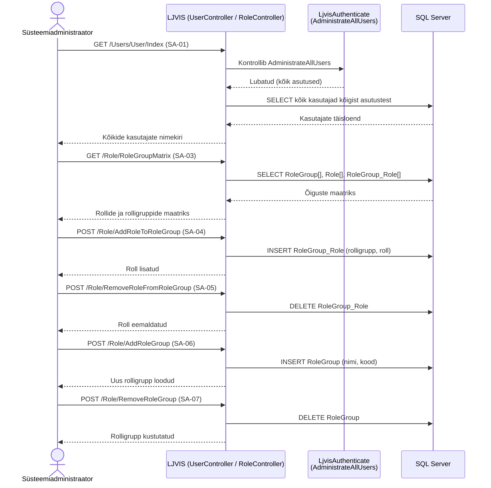
```mermaid
sequenceDiagram
    actor SA as Süsteemiadministraator
    participant UI as LJVIS (UserController / RoleController)
    participant Auth as LjvisAuthenticate<br/>(AdministrateAllUsers)
    participant DB as SQL Server

    SA->>UI: GET /Users/User/Index (SA-01)
    UI->>Auth: Kontrollib AdministrateAllUsers
    Auth-->>UI: Lubatud (kõik asutused)
    UI->>DB: SELECT kõik kasutajad kõigist asutustest
    DB-->>UI: Kasutajate täisloend
    UI-->>SA: Kõikide kasutajate nimekiri

    SA->>UI: GET /Role/RoleGroupMatrix (SA-03)
    UI->>DB: SELECT RoleGroup[], Role[], RoleGroup_Role[]
    DB-->>UI: Õiguste maatriks
    UI-->>SA: Rollide ja rolligruppide maatriks

    SA->>UI: POST /Role/AddRoleToRoleGroup (SA-04)
    UI->>DB: INSERT RoleGroup_Role (rolligrupp, roll)
    UI-->>SA: Roll lisatud

    SA->>UI: POST /Role/RemoveRoleFromRoleGroup (SA-05)
    UI->>DB: DELETE RoleGroup_Role
    UI-->>SA: Roll eemaldatud

    SA->>UI: POST /Role/AddRoleGroup (SA-06)
    UI->>DB: INSERT RoleGroup (nimi, kood)
    UI-->>SA: Uus rolligrupp loodud

    SA->>UI: POST /Role/RemoveRoleGroup (SA-07)
    UI->>DB: DELETE RoleGroup
    UI-->>SA: Rolligrupp kustutatud
```

### SA-08…SA-10 · Klassifikaatorite haldamine

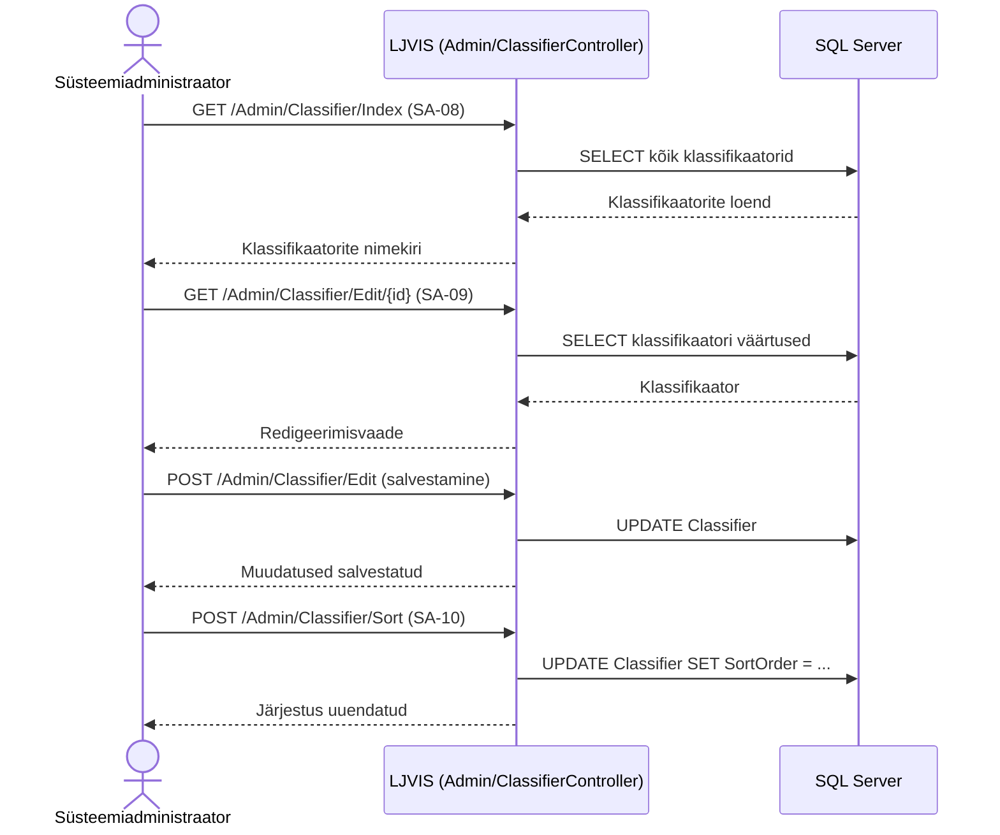
```mermaid
sequenceDiagram
    actor SA as Süsteemiadministraator
    participant UI as LJVIS (Admin/ClassifierController)
    participant DB as SQL Server

    SA->>UI: GET /Admin/Classifier/Index (SA-08)
    UI->>DB: SELECT kõik klassifikaatorid
    DB-->>UI: Klassifikaatorite loend
    UI-->>SA: Klassifikaatorite nimekiri

    SA->>UI: GET /Admin/Classifier/Edit/{id} (SA-09)
    UI->>DB: SELECT klassifikaatori väärtused
    DB-->>UI: Klassifikaator
    UI-->>SA: Redigeerimisvaade

    SA->>UI: POST /Admin/Classifier/Edit (salvestamine)
    UI->>DB: UPDATE Classifier
    UI-->>SA: Muudatused salvestatud

    SA->>UI: POST /Admin/Classifier/Sort (SA-10)
    UI->>DB: UPDATE Classifier SET SortOrder = ...
    UI-->>SA: Järjestus uuendatud
```

### SA-12…SA-13 · DB sünkroonimispäring

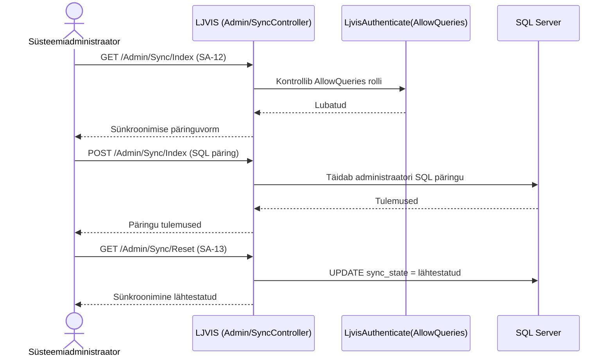
```mermaid
sequenceDiagram
    actor SA as Süsteemiadministraator
    participant UI as LJVIS (Admin/SyncController)
    participant Auth as LjvisAuthenticate(AllowQueries)
    participant DB as SQL Server

    SA->>UI: GET /Admin/Sync/Index (SA-12)
    UI->>Auth: Kontrollib AllowQueries rolli
    Auth-->>UI: Lubatud
    UI-->>SA: Sünkroonimise päringuvorm

    SA->>UI: POST /Admin/Sync/Index (SQL päring)
    UI->>DB: Täidab administraatori SQL päringu
    DB-->>UI: Tulemused
    UI-->>SA: Päringu tulemused

    SA->>UI: GET /Admin/Sync/Reset (SA-13)
    UI->>DB: UPDATE sync_state = lähtestatud
    UI-->>SA: Sünkroonimine lähtestatud
```

---

## X – Välissüsteem (X-tee inbound)

### X-01…X-06 · X-tee sissetulevad teenused

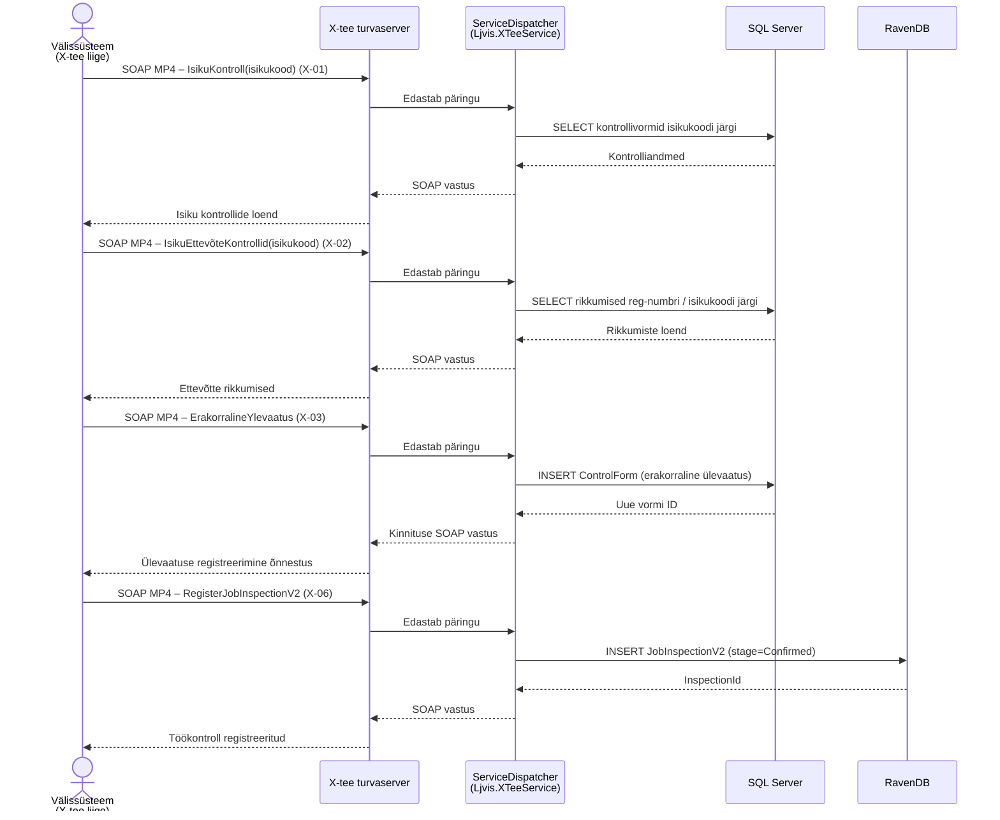
```mermaid
sequenceDiagram
    actor Välis as Välissüsteem<br/>(X-tee liige)
    participant XTee as X-tee turvaserver
    participant Dispatcher as ServiceDispatcher<br/>(Ljvis.XTeeService)
    participant DB as SQL Server
    participant Raven as RavenDB

    Välis->>XTee: SOAP MP4 – IsikuKontroll(isikukood) (X-01)
    XTee->>Dispatcher: Edastab päringu
    Dispatcher->>DB: SELECT kontrollivormid isikukoodi järgi
    DB-->>Dispatcher: Kontrolliandmed
    Dispatcher-->>XTee: SOAP vastus
    XTee-->>Välis: Isiku kontrollide loend

    Välis->>XTee: SOAP MP4 – IsikuEttevõteKontrollid(isikukood) (X-02)
    XTee->>Dispatcher: Edastab päringu
    Dispatcher->>DB: SELECT rikkumised reg-numbri / isikukoodi järgi
    DB-->>Dispatcher: Rikkumiste loend
    Dispatcher-->>XTee: SOAP vastus
    XTee-->>Välis: Ettevõtte rikkumised

    Välis->>XTee: SOAP MP4 – ErakorralineYlevaatus (X-03)
    XTee->>Dispatcher: Edastab päringu
    Dispatcher->>DB: INSERT ControlForm (erakorraline ülevaatus)
    DB-->>Dispatcher: Uue vormi ID
    Dispatcher-->>XTee: Kinnituse SOAP vastus
    XTee-->>Välis: Ülevaatuse registreerimine õnnestus

    Välis->>XTee: SOAP MP4 – RegisterJobInspectionV2 (X-06)
    XTee->>Dispatcher: Edastab päringu
    Dispatcher->>Raven: INSERT JobInspectionV2 (stage=Confirmed)
    Raven-->>Dispatcher: InspectionId
    Dispatcher-->>XTee: SOAP vastus
    XTee-->>Välis: Töökontroll registreeritud
```

---

## B – BgService (automatiseeritud taustaprotsessid)

### B-01…B-05 · E-toimiku päring ja tehnoülevaatuse sünkroonimine

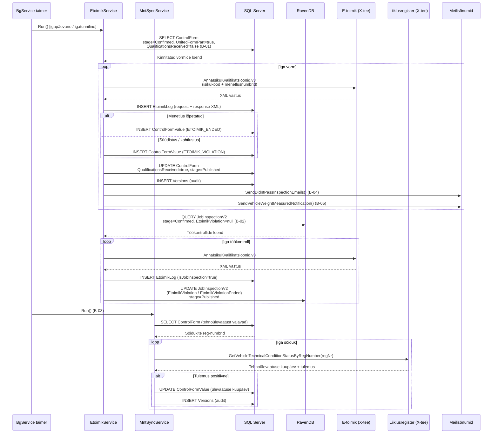
```mermaid
sequenceDiagram
    participant Timer as BgService taimer
    participant EtoimikSvc as EtoimikService
    participant MntSvc as MntSyncService
    participant DB as SQL Server
    participant Raven as RavenDB
    participant Etoimik as E-toimik (X-tee)
    participant MNT as Liiklusregister (X-tee)
    participant Mail as Meilisõnumid

    Timer->>EtoimikSvc: Run() [igapäevane / igatunniline]

    EtoimikSvc->>DB: SELECT ControlForm<br/>stage=Confirmed, UnitedFormPart=true,<br/>QualificationsReceived=false (B-01)
    DB-->>EtoimikSvc: Kinnitatud vormide loend

    loop Iga vorm
        EtoimikSvc->>Etoimik: AnnaIsikuKvalifikatsioonid.v3<br/>(isikukood + menetlusnumbrid)
        Etoimik-->>EtoimikSvc: XML vastus

        EtoimikSvc->>DB: INSERT EtoimikLog (request + response XML)

        alt Menetlus lõpetatud
            EtoimikSvc->>DB: INSERT ControlFormValue (ETOIMIK_ENDED)
        else Süüdistus / kahtlustus
            EtoimikSvc->>DB: INSERT ControlFormValue (ETOIMIK_VIOLATION)
        end

        EtoimikSvc->>DB: UPDATE ControlForm<br/>QualificationsReceived=true, stage=Published
        EtoimikSvc->>DB: INSERT Versions (audit)
        EtoimikSvc->>Mail: SendDidntPassInspectionEmails() (B-04)
        EtoimikSvc->>Mail: SendVehicleWeightMeasuredNotification() (B-05)
    end

    EtoimikSvc->>Raven: QUERY JobInspectionV2<br/>stage=Confirmed, EtoimikViolation=null (B-02)
    Raven-->>EtoimikSvc: Töökontrollide loend

    loop Iga töökontroll
        EtoimikSvc->>Etoimik: AnnaIsikuKvalifikatsioonid.v3
        Etoimik-->>EtoimikSvc: XML vastus
        EtoimikSvc->>DB: INSERT EtoimikLog (IsJobInspection=true)
        EtoimikSvc->>Raven: UPDATE JobInspectionV2<br/>(EtoimikViolation / EtoimikViolationEnded)<br/>stage=Published
    end

    Timer->>MntSvc: Run() (B-03)
    MntSvc->>DB: SELECT ControlForm (tehnoülevaatust vajavad)
    DB-->>MntSvc: Sõidukite reg-numbrid

    loop Iga sõiduk
        MntSvc->>MNT: GetVehicleTechnicalConditionStatusByRegNumber(regNr)
        MNT-->>MntSvc: Tehnoülevaatuse kuupäev + tulemus
        alt Tulemus positiivne
            MntSvc->>DB: UPDATE ControlFormValue (ülevaatuse kuupäev)
            MntSvc->>DB: INSERT Versions (audit)
        end
    end
```
