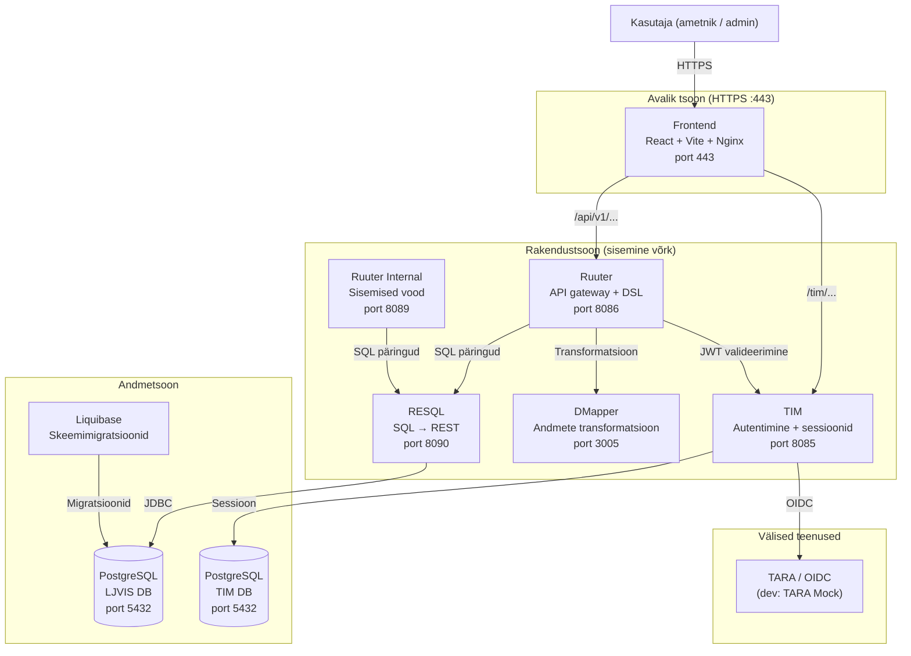
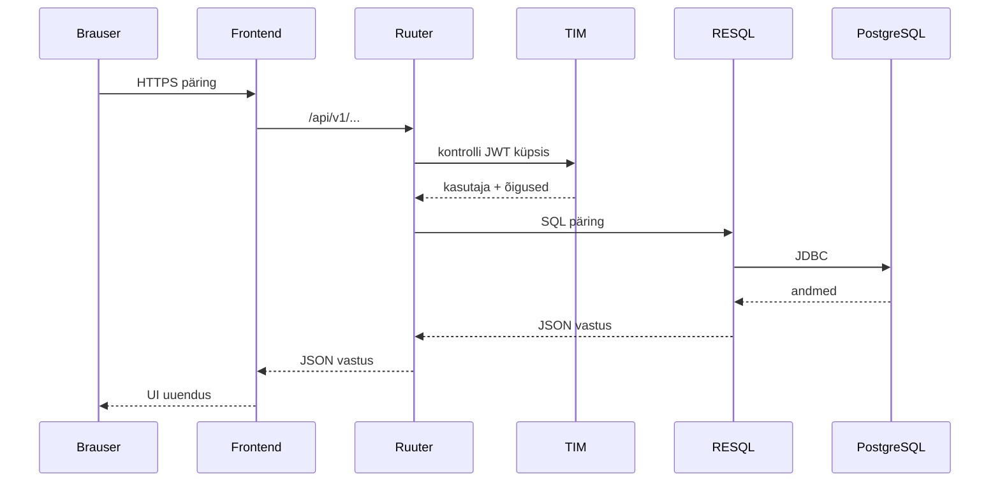

# LJVIS2 – Arhitektuuridokument

**Versioon:** 0.1  
**Kuupäev:** 2026-07-07  

---

## Sisukord

1. [Süsteemi ülevaade](#1-süsteemi-ülevaade)
2. [Arhitektuuristiil](#2-arhitektuuristiil)
3. [Süsteemi arhitektuuridiagramm](#3-süsteemi-arhitektuuridiagramm)
4. [Komponendid](#4-komponendid)
5. [Andmevood](#5-andmevood)
6. [API loogika](#6-api-loogika)
7. [Autentimine ja autoriseerimine](#7-autentimine-ja-autoriseerimine)
8. [Audit-logimine](#8-audit-logimine)
9. [Andmemudel](#9-andmemudel)
10. [Viited](#10-viited)

---

## 1. Süsteemi ülevaade

LJVIS2 on liiklusvalve infosüsteem, mis võimaldab:

- kasutajate ja kasutajagruppide haldust (admin ja lokaalne ulatus)
- klassifikaatorite haldust
- kontrollvormide sisestamist
- audit-logimist kõigi oluliste toimingute kohta

Süsteem töötab Docker Compose põhises dev/test keskkonnas ja on kavandatud AWS EKS-i deployment'iks. Avalik aadress dev-keskkonnas: `https://dev.liiklusvalve.ee/`.

---

## 2. Arhitektuuristiil

**DSL-põhine mikroteenuste orkestratsioon** — backend äriloogika on kirjutatud YAML DSL failidena (Ruuter), mida Ruuter engine täidab reaalajas. Ei kasutata traditsioonilist rakendusserverit ega raamistiku äriloogikat.

| Omadus | Väärtus |
|--------|---------|
| Frontend | React + Vite + TypeScript |
| API gateway | Ruuter (YAML DSL) |
| SQL kiht | RESQL (SQL failid → REST endpointid) |
| Andmebaas | PostgreSQL 14 |
| Skeemihaldus | Liquibase |
| Autentimine | TIM + TARA (OIDC) |
| Andmete transformatsioon | DMapper (Handlebars mallid) |

---

## 3. Süsteemi arhitektuuridiagramm



---

## 4. Komponendid

### 4.1 Frontend

- **Tehnoloogia:** React 18, Vite, TypeScript, i18next (et/en)
- **Asukoht:** `frontend/src/`
- **Struktuur:** feature-based (`features/users/`, `features/user-groups/`, `features/classifiers/`, jne)
- **API suhtlus:** `shared/api/client.ts` — kõik `get/post/put/delete` kutsed käivad läbi ühtse kliendi
- **Autentimine:** TIM sessiooniküpsis; sessiooni kontroll `AuthContext` kaudu
- **Marsruutimine:** React Router v6; kaitstud marsruudid `ProtectedRoute` komponendiga

Põhifunktsionaalsused:

| Moodul | Kirjeldus |
|--------|-----------|
| `features/users/` | Kasutajate nimekiri, detailvaade, loomine, muutmine |
| `features/user-groups/` | Kasutajagruppide haldus, asutused, õigused, liikmed |
| `features/classifiers/` | Klassifikaatorite ja väärtuste haldus |
| `features/audit-logs/` | Audit-logi vaatamine |
| `features/auth/` | Sisselogimine, sessiooni kontroll, väljalogimine |
| `features/control-forms/` | Kontrollvormide marsruutimine (LJVIS-133) |

### 4.2 Ruuter (API gateway + äriloogika)

- **Asukoht:** `DSL/Ruuter/ljvis/`
- **Meetodid:** `GET/`, `POST/`, `PUT/`, `DELETE/`
- **Struktuur:** HTTP meetod → versiooni tee → ressurss → toiming

Iga `.yml` fail on üks endpoint. Failitee = URL path:

```
DSL/Ruuter/ljvis/GET/v1/users/admin.yml   →   GET /v1/users/admin
DSL/Ruuter/ljvis/PUT/v1/users/admin.yml   →   PUT /v1/users/admin
```

Jagatud alamvoogud (ei ole HTTP endpointid):
- `DSL/Ruuter/ljvis/TEMPLATES/` — valideerimine, kasutajate autentimine, andmete arvutamine

Lähemalt: [`DSL/ARCHITECTURE.md`](../DSL/ARCHITECTURE.md)

### 4.3 RESQL

- **Asukoht:** `DSL/Resql/ljvis/`
- **Roll:** SQL failid muudetakse automaatselt REST endpointideks
- **Kutsumisviis:** Ruuter kutsub HTTP POST-iga `[#LJVIS_RESQL]/ressurss/päringunimi`
- **Andmebaas:** PostgreSQL, JDBC ühendus

### 4.4 DMapper

- **Asukoht:** `DSL/DMapper/`
- **Roll:** Andmete transformatsioon Handlebars mallide kaudu
- **Kasutus:** Ruuter kutsub DMapper-it, kui vastuse kuju vajab ümberkujundamist

### 4.5 TIM

- **Roll:** Autentimine ja sessioonihaldus
- **Protokoll:** OIDC (dev-s TARA Mock, prod-s päris TARA)
- **Suhtlus Ruuteriga:** Ruuter valideerib igal päringul JWT küpsise TIM-i vastu (`check-user-authority` mall)

### 4.6 Liquibase

- **Asukoht:** `DSL/Liquibase/`
- **Roll:** Andmebaasi skeemi versioonihaldus ja migratsioonid
- **Käivitamine:** Docker Compose'is pärast PostgreSQL healthcheck'i

---

## 5. Andmevood

### 5.1 Tüüpiline API päring (autenditud lugemine)

```
Brauser
  → HTTPS :443 → Frontend (Nginx)
  → /api/v1/... → Ruuter :8086
  → TIM: kontrolli JWT küpsis (check-user-authority)
  → RESQL :8090: SQL päring → PostgreSQL :5432
  → vastus tagasi Ruuteri kaudu Frontendile
```

### 5.2 Kirjutamisoperatsioon (nt kasutaja loomine)

```
Frontend (POST /v1/users/admin)
  → Ruuter: check-user-authority (TIM)
  → Ruuter: väljaväljade valideerimine (TEMPLATES)
  → RESQL: insert_user_account (PostgreSQL)
  → RESQL: insert_audit_event (PostgreSQL)
  → vastus Frontendile
```

### 5.3 Autentimisvoog

```
Brauser → Frontend → TIM (OIDC login)
  → TARA Mock (dev) / päris TARA (prod)
  → TIM tagastab JWT küpsise
  → Frontend salvestab sessiooni
```

### 5.4 Andmevoo diagramm



---

## 6. API loogika

### 6.1 URL-i konventsioon

Ruuter DSL kasutab **staatilisi path segmente** — dünaamilised identifikaatorid edastatakse **query parameetrina**.

| Muster | Näide | Selgitus |
|--------|-------|----------|
| Üksiku ressursi lugemine | `GET /v1/users/admin?q=<uuid>` | `?q=` on de facto standard ID-paramina |
| Nimekiri / otsing | `GET /v1/users/admin/search?q=Mari&page=0` | `/search` eraldi endpoint |
| Loomine | `POST /v1/users/admin` | body JSON |
| Muutmine | `PUT /v1/users/admin` | `id` body-s |
| Kustutamine | `DELETE /v1/user-groups/user?q=<id>` | `?q=` parameetrina |

Scope (`admin` \| `local`) on **staatiline path segment** — see määrab äriloogika ja õigustekontrolli ulatuse.

Lähemalt: [`docs/rest-api-design-guide.md`](rest-api-design-guide.md)

### 6.2 Ressursside kaupa

| Ressurss | Lugemine | Nimekiri | Loomine | Muutmine |
|----------|----------|----------|---------|----------|
| Kasutajad | `GET /v1/users/{scope}?q=` | `GET /v1/users/{scope}/search` | `POST /v1/users/{scope}` | `PUT /v1/users/{scope}` |
| Kasutajagrupid | `GET /v1/user-groups/{scope}?q=` | `GET /v1/user-groups/{scope}/search` | `POST /v1/user-groups` | `PUT /v1/user-groups` |
| Klassifikaatorid | `GET /v1/classifiers/classifier?id=` | `GET /v1/classifiers` | — | `PUT /v1/classifiers` |
| Audit-logi | `GET /v1/logs/log?q=` | `GET /v1/logs` | — | — |

Täielik loetelu: [`docs/api-endpoints.md`](api-endpoints.md)  
OpenAPI spetsifikatsioon: [`docs/openapi.yaml`](openapi.yaml)

### 6.3 Valideerimise loogika

Kõik kasutajaandmete sisestamise ja muutmise päringud läbivad:

1. `check-user-authority` — autentimine + õiguste kontroll
2. `user/validate-user-fields` — väljavalideerimine (kohustuslikud väljad, isikukood, e-post)
3. RESQL insert/update — andmebaasi kirjutamine
4. `log/insert_audit_event` — audit-sündmuse kirjutamine

Vea vorming (422) — RFC 7807 Problem Details:
```json
{
  "type": "https://ljvis.kemit.ee/problems/validation-error",
  "title": "Validation failed",
  "status": 422,
  "code": "ERR-422-004",
  "errors": [
    { "field": "personalCode", "code": "invalid_estonian_personal_code", "message": "Vigane isikukood" }
  ]
}
```

Frontend käsitleb automaatselt `applyValidationError` kaudu (`shared/api/errors.ts`).

Lähemalt: [`docs/db_errorhandling_rules.md`](db_errorhandling_rules.md)

---

## 7. Autentimine ja autoriseerimine

### 7.1 Autentimine

- Kõik API endpointid on kaitstud `.guard` failidega
- Guard kontrollib JWT küpsist TIM-i vastu (`check-user-authority` mall)
- Ebaõnnestunud autentimine → HTTP 403

### 7.2 Autoriseerimine

- Ressursipõhised õigused koodidega `ressurss.tegevus[.ulatus]`
- Näited: `user.list.admin`, `user_group.update`, `classifier.edit`
- Scope (`admin`/`local`) jõustab nii õiguse koodi kui ka andmefiltri (organisatsioon)

Guard-fail näide (`GET/v1/.guard`) — tegelik struktuur:
```yaml
check_for_cookie:
  switch:
    - condition: ${incoming.headers == null || incoming.headers.cookie == null}
      next: guard_fail
  next: authenticate

authenticate:
  template: "[#LJVIS_PROJECT_LAYER]/check-user-authority"
  requestType: templates
  headers:
    cookie: ${incoming.headers.cookie}
  result: authority_result

check_authority_result:
  switch:
    - condition: ${authority_result !== "false"}
      next: check_permission
  next: guard_fail

check_permission:
  switch:
    - condition: ${authority_result.permissions.matchesAny(REQUIRED_PERMS)}
      next: guard_success
  next: guard_fail

guard_success:
  return: "success"
  status: 200
  next: end

guard_fail:
  return: "unauthorized"
  status: 403
  next: end
```

Lähemalt: [`docs/rest-api-design-guide.md §6.4`](rest-api-design-guide.md)

Täielik maatriks: [`docs/permissions-matrix.md`](permissions-matrix.md)

---

## 8. Audit-logimine

Kõik olulised lugemis- ja kirjutamisoperatsioonid logitakse `audit_event` tabelisse.

| Väli | Kirjeldus |
|------|-----------|
| `event_id` | ULID (26 märki, Crockford base32). Primaarvvõti. Genereeritakse `log-audit-event` template'is enne INSERT-i. |
| `event_type` | Sündmuse tüüp, nt `user.update`, `user_group.create` |
| `event_category` | Kategooria, nt `user_management` |
| `actor_name` | Toimingu tegija nimi |
| `actor_personal_code_hash` | Toimingu tegija isikukoodi SHA-256 räsi (salted) — selgetekstilist isikukoodi ei salvestata |
| `description` | Inimloetav kirjeldus |
| `log_content` | JSONB detailid (muudetud väljad, ID-d) |
| `created_at` | Sündmuse aeg (UTC), serveri poolne timestamp |

Logimine toimub Ruuteri DSL lõpus (`logAuditEvent` samm läbi `TEMPLATES/audit/log-audit-event.yml`) pärast edukat andmebaasi kirjutamist.

Lähemalt: [`docs/audit-logging.md`](audit-logging.md)

---

## 9. Andmemudel

Põhilised tabelid:

| Tabel | Kirjeldus |
|-------|-----------|
| `user_account` | Kasutaja põhiandmed |
| `user_account_data_state` | Kasutaja andmete ajalugu (snapshot-põhine) |
| `user_group` | Kasutajagrupp |
| `user_group_user_account` | Kasutaja ↔ grupp seos |
| `user_group_organisation` | Grupp ↔ asutus seos |
| `user_group_permission` | Grupp ↔ õigus seos |
| `organisation` | Asutus |
| `permission` | Õigus |
| `classifier` | Klassifikaatori päis |
| `classifier_value` | Klassifikaatori väärtus (kehtivusperioodiga) |
| `audit_event` | Audit-logi sündmused |

Lähemalt: [`docs/data_model.md`](data_model.md)

---

## 10. Viited

| Dokument | Sisu |
|----------|------|
| [`DSL/ARCHITECTURE.md`](../DSL/ARCHITECTURE.md) | DSL failide struktuur, mallid, valideerimine |
| [`docs/api-endpoints.md`](api-endpoints.md) | Kõik API endpointid ja mock-teed |
| [`docs/openapi.yaml`](openapi.yaml) | OpenAPI 3 spetsifikatsioon |
| [`docs/rest-api-design-guide.md`](rest-api-design-guide.md) | REST API kujundamise reeglid |
| [`docs/permissions-matrix.md`](permissions-matrix.md) | Ressursside õiguste maatriks |
| [`docs/audit-logging.md`](audit-logging.md) | Audit-logimise loogika ja sündmused |
| [`docs/data_model.md`](data_model.md) | Andmemudel ja tabelite kirjeldused |
| [`docs/infrastructure-diagram.md`](infrastructure-diagram.md) | Taristu diagrammid (dev + AWS prod + C4) |
| [`docs/infrastructure-access-view.md`](infrastructure-access-view.md) | Ligipääsupiirangud ja võrgutsoonid |
| [`docs/logging-spec.md`](logging-spec.md) | Logimise vorming ja reeglid |
| [`docs/db_errorhandling_rules.md`](db_errorhandling_rules.md) | Andmebaasivigade käsitlus |
| [`docs/use-cases-ljvis.md`](use-cases-ljvis.md) | Kasutuslood (EPIC 02, EPIC 04) |
