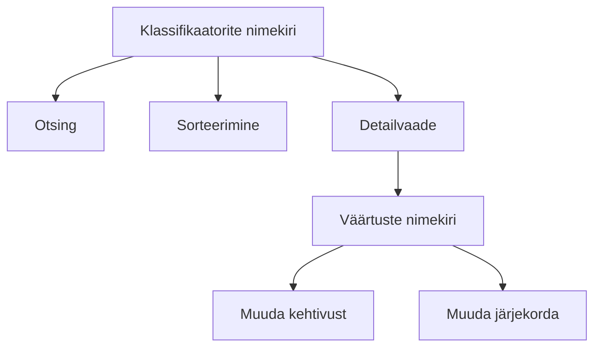
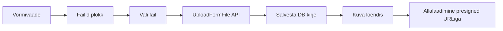

# LJVIS2 administraatorijuhend

## Administraatori sissejuhatus

Administraator haldab LJVIS2 kasutajaid, gruppe, õigusi ja klassifikaatoreid. Administraatorina saate määrata, kes milliseid vorme täita ja milliseid andmeid vaadata saab.

## Administraatori rollid

| Roll | Õigused | Ülesanded |
|---|---|---|
| Üldadministraator | `user.list.admin`, `user_group.list.admin`, `classifier.list`, `audit.read` | Hallatakse kõiki kasutajaid ja süsteemi seadeid |
| Organisatsiooni administraator | `user.list.local`, `user_group.list.local` | Hallatakse ainult oma organisatsiooni kasutajaid ja gruppe |
| Ametniku juht | `classifier.list`, `audit.read` | Jälgib tegevusi ja klassifikaatoreid |

## Administraatori sisselogimine

Administraatorid logivad sisse samasuguse TARA autentimisega nagu tavalised kasutajad. Erinevus seisneb selles, millised menüüpunktid kuvatakse — need sõltuvad Teie õigustest.

## Milliseid õigusi vaja on

| Funktsioon | Vajalik õigus |
|---|---|
| Kasutajate nimekiri | `user.list.admin` või `user.list.local` |
| Uue kasutaja lisamine | `user.create.admin` või `user.create.local` |
| Kasutaja muutmine | `user.edit.admin` või `user.edit.local` |
| Kasutajagruppide nimekiri | `user_group.list.admin` või `user_group.list.local` |
| Grupi muutmine | `user_group.update` |
| Klassifikaatorite haldus | `classifier.list` |
| Auditilogi vaatamine | `audit.read` |


## Kasutajate haldamine

Selles jaos kirjeldatakse, kuidas administraator saab LJVIS 2 süsteemis kasutajakontosid vaadata, luua, muuta ja hallata nende grupiliikmelisusi.

## 1. Vajalikud õigused

Kasutajate halamiseks peab sisselogitud kasutajal olema vastavad õigused:

| Tegevus | Nõutav õigus |
|---------|--------------|
| Kasutajate nimekirja vaatamine | `user.list.admin` või `user.list.local` |
| Ühe kasutaja detailvaate ja gruppide vaatamine | `user.read.admin` või `user.read.local` |
| Uue kasutaja loomine ja olemasoleva muutmine | `user.edit.admin` või `user.edit.local` |
| Kasutajagruppide detailinfo vaatamine | `user_group.read.admin` või `user_group.read.local` |

Kui `admin` õigus puudub, rakendatakse automaatselt `local` skoop, mis piirab ligipääsu ainult oma asutuse kasutajatele.

## 2. Kasutajate nimekirja avamine

Kasutajate nimekirja leiad peamenüüst valiku **Kasutajad** kaudu. Navigeerimisel avaneb lehekülg `/users`, mis kuvab kõik kasutajad, kellele sul on õigusega ligipääs.

Nimekirja päringu skoop määratakse automaatselt:

- kasutajal, kellel on õigus `user.list.admin`, laetakse kogu süsteemi kasutajaskond (`admin` skoop);
- kõigil teistel kuvatakse ainult sama asutuse kasutajad (`local` skoop).

## 3. Otsing, filtreerimine, sorteerimine ja leheküljed

Kasutajate nimekirja lehel saad:

- **Otsida** kasutajat nime, isikukoodi või muude tunnuste järgi ülaosas asuvas otsinguväljas.
- **Sorteerida** tulemusi veergude päiste kaudu. Vaikimisi on tulemused sorteeritud staatuse järgi (`status asc`) — aktiivsed kasutajad kuvatakse esimesena.
- **Lehitseda** tulemusi lehekülgede kaupa, kasutades nimekirja all olevat leheküljendust. Saad määrata ka lehekülje suuruse (`pageSize`), et korraga näidata rohkem või vähem kirjeid.
- **Vaadata grupiliikmelisusi**: kui kasutaja kuulub mitmesse gruppi, võidakse ta nimekirjas kuvada eraldi ridadena iga grupi kohta, et oleks lihtsam ülevaadet saada.

Otsinguparameetrid saadetakse HTTP GET päringuga lõpp-punkti `/v1/users/{scope}/search`. Täpsemad näited leiad allpool [Näidised](#6-näidised) jaotisest ja dokumendist `07-api-info.md`.

## 4. Uue kasutaja loomine

Uue kasutaja lisamiseks ava kasutajate nimekirja lehel nupp **Lisa kasutaja** (või mine otse aadressile `/users/new`). Avaanex lehele `UserCreatePage`. Järgmised väljad on kohustuslikud (tärniga tähistatud):

- **Eesnimi** (`firstName`) — kuni 200 tähemärki.
- **Perekonnanimi** (`lastName`) — kuni 200 tähemärki.
- **Isikukood** (`personalCode`) — ainult numbrid, kuni 11 märki.
- **Asutus** (`organisationId`) — vali rippmenüüst. Kohaliku administraatori (`local`) jaoks on see väli ette täidetud ja mittemuudetav.
- **Struktuuriüksus** (`structuralUnitName`) — valikuline, vali rippmenüüst vastavalt asutusele.
- **Ametinimetus** (`jobTitleName`) — kuni 100 tähemärki.
- **E-posti aadress** (`email`) — kuni 320 tähemärki.
- **Telefon** (`phone`) — valikuline.
- **Ligipääsu algus** (`accessStart`) — kuupäev, millal konto muutub aktiivseks.
- **Ligipääsu lõpp** (`accessEnd`) — valikuline kuupäev. Kui jätta tühjaks, on konto kehtiv piiramata ajani.

Pärast vajalike väljade täitmist vajuta **Salvesta**. Kui kõik andmed on korrektsed, suunatakse sind uue kasutaja detailvaatele, kus kuvatakse teade edukalt loodud kontost.

## 5. Kasutaja muutmine

Olemasoleva kasutaja muutmiseks klõpsa kasutajate nimekirjas soovitud kasutaja real. Avaanex detailvaates (`/users/{id}`) kuvatakse kasutaja põhiandmed ja grupiliikmelisused.

Muutmiseks:

1. Vajuta kastis **Muuda**.
2. Asenda või täienda vajalikud väljad (eesnimi, perekonnanimi, isikukood, asutus, struktuuriüksus, ametinimetus, e-post, telefon, ligipääsu algus/lõpp).
3. Vajuta **Salvesta**.

Kui kasutajal on aktiivsed grupiliikmelisused ja sa vahetad teda teise asutuse alla, kuvatakse hoiatus, et gruppide sidemed võivad muutuda. Peale salvestamist kuvatakse teade `Kasutaja andmed salvestatud` ja leht värskendatakse.

## 6. Kasutajagruppide vaatamine ja muutmine

Kasutaja detaillehel eraldi kastis kuvatakse kasutaja kuuluvus kasutajagruppidesse. Seal saad:

- **Vaadata aktiivseid gruppe** ja nende staatust.
- **Muuta gruppe**, kui sul on õigus `user.edit.admin` või `user.edit.local`. Vajuta **Muuda grupid**, vali soovitud grupid ja salvesta.
- **Avada grupi detailvaate**, kui sul on õigus `user_group.read.admin` või `user_group.read.local` — see võimaldab näha grupi õigusi ja liikmeid.

Kui süsteemis pole veel ühtegi kasutajagruppi loodud, kuvatakse vastav teade.

## 7. Näidised

Järgmised `curl` päringud illustreerivad, kuidas kasutajate nimekirja otsida ja uut kasutajat luua otse API kaudu. Täielikud lõpp-punktide kirjeldused, autentimise nõuded ja täiendavad näidised on dokumendis [`07-api-info.md`](./07-api-info.md).

### Kasutajate otsing

Otsi administraatori skoobis kasutajaid, kelle nimi või muu tekst sisaldab tähte `M`, ning tagasta esimene lehekülg 20 kirjetega:

```bash
curl -X GET "https://<base-url>/v1/users/admin/search?q=M&page=1&pageSize=20" \
  -H "Cookie: <COOKIE>"
```

> Asenda `<base-url>` rakenduse tegeliku baasaadressiga (nt `https://dev.liiklusvalve.ee`) ja `<COOKIE>` TARA/TIM sessiooniküpsise väärtusega.

### Uue kasutaja loomine

Loo uus kasutajakonto administraatori skoobis. Päringu kehas peavad olema vähemalt kohustuslikud väljad:

```bash
curl -X POST "https://<base-url>/v1/users/admin" \
  -H "Cookie: <COOKIE>" \
  -H "Content-Type: application/json" \
  -d '{
    "firstName": "Siim",
    "lastName": "Tamm",
    "personalCode": "39001010001",
    "organisationId": 7,
    "structuralUnit": "PÕHJA PREFEKTUUR",
    "jobTitle": "Senior analyst",
    "email": "siim.tamm@ppa.ee",
    "phone": "5555 1234",
    "accessStart": "2026-01-01",
    "accessEnd": null
  }'
```

Vastuseks tagastatakse loodud kasutaja andmed, sealhulgas unikaalne identifikaator (`id`), mille abil saab hiljem detailvaate avada või kontot muuta.


## Kasutajagrupid

Kasutajagrupid võimaldavad kasutajatele õigusi ja asutusi üheskoos hallata. Grupi kaudu saab määrata, millistesse asutustesse ja millisele funktsionaalsusele kasutajad juurdepääsu saavad. Üks kasutaja võib kuuluda mitmesse gruppi korraga.

## 1. Vajalikud õigused

Kasutajagruppidega tegelemiseks on vajalikud erinevad õigused sõltuvalt soovitud tegevusest ja ulatusest.

| Tegevus | Vajalik õigus |
|---------|---------------|
| Kasutajagruppide nimekirja vaatamine | `user_group.list.admin` (kõik asutused) või `user_group.list.local` (ainult oma asutus) |
| Ühe grupi detailvaate avamine | `user_group.read.admin` või `user_group.read.local` |
| Uue grupi loomine | `user_group.create` |
| Grupi nime, asutuste või õiguste muutmine | `user_group.update` |
| Kasutajate lisamine gruppi | `user_group.add_user` |
| Kasutajate eemaldamine grupist | `user_group.remove_user` |
| Grupi liikmete nimekirja vaatamine | `user_group.list_users.admin` või `user_group.list_users.local` |
| Sobivate kasutajate otsimine gruppi lisamiseks | `user_group.search_eligible_users` |

## 2. Kasutajagruppide nimekiri ja otsing

Kasutajagruppide lehele jõudes kuvatakse kõikide gruppide nimekiri. Vaikimisi on nimekiri sorteeritud grupi nime järgi kasvavas järjekorras (`name asc`).

Otsingulahtris saab sisestada grupi nime või osa sellest. Otsingu käivitamisel laetakse iga leitud grupi kohta ka sellega seotud asutuste nimed, et tulemusi oleks lihtsam üksteisest eristada. Tabelis võidakse sama grupi kohta kuvada mitu rida, kui grupp on seotud mitme asutusega.

Märkus. Kui grupi loomisel on valitud kõikidele asutustele ulatuv lipp (`coversAllOrganisations`), siis selle grupi puhul asutusi eraldi ei kuvata.

## 3. Uue grupi loomine

Uue grupi loomiseks ava leht **Lisa kasutajagrupp**. Vorm koosneb kolmest osast:

1. **Andmed** — sisesta grupi nimi. Nimi on kohustuslik ja võib olla kuni 50 tähemärki pikk.
2. **Seotud asutused** — vali tabelist asutused, millega grupi seosed luua. Võimalik on valida kõik nähtavad asutused korraga märkeruudu abil või valida asutusi ükshaaval.
3. **Grupi õigused** — vali tabelist õigused, mida grupiliikmetele anda. Nagu asutuste puhul, saab valida kõik õigused korraga või eraldi.

Kui nime või asutusi pole valitud, kuvatakse vastav veateade. Pärast salvestamist suunatakse sind äsjaloodud grupi detailvaatesse.

## 4. Kasutajate lisamine ja eemaldamine

### Kasutajate lisamine

Grupi detailvaates ava **Kasutajad** plokk. Kui sul on õigus `user_group.add_user`, näed nuppu **Lisa kasutaja**. Sellel klõpsates avaneb leht, kus saad otsida ja valida kasutajaid, keda gruppi lisada. Sobivaid kasutajaid otsitakse õiguse `user_group.search_eligible_users` alusel.

Pärast kasutajate lisamist kuvatakse detailvaates lühike edukateade ja uue liikme nimekiri värskendatakse.

### Kasutajate eemaldamine

Grupi liikmete tabelis on iga kasutaja rea lõpus **Eemalda** link, kui sul on õigus `user_group.remove_user`. Klõpsates seda, kuvatakse kinnitusdialoog. Kinnitamisel eemaldatakse kasutaja kohe grupist. Eemaldamine ei kustuta kasutajakontot, vaid ainult lõpetab grupikuuluvuse.

## 5. Asutuste lisamine ja eemaldamine

Grupi detailvaates ava **Seotud asutused** plokk. Kui sul on õigus `user_group.update`, saad asutusi muuta:

- Klõpsa **Muuda** või vastavat ikooni.
- Tabelis märgi või eemalda märkeruutudelt asutused.
- Salvesta muudatused.

Asutuste muutmisel saad valida kõik nähtavad asutused korraga või kombineerida asutusi vabalt. Pärast salvestamist värskendatakse grupi seosed. Kui muudad asutusi, võivad gruppi kuuluvate kasutajate juurdepääsud muutuda.

## 6. Õiguste seadmine

Grupi detailvaates ava **Grupi õigused** plokk. Kui sul on õigus `user_group.update`, saad õigusi muuta:

- Ava plokk ja klõpsa muutmiseks.
- Tabelis märgi või tühista soovitud õigused.
- Salvesta muudatused.

Õiguste muutmine jõustub kohe. Kõik grupi kasutajad saavad uued õigused, kui nende konto on aktiivne ja asutuslikud piirangud seda võimaldavad. Pärast salvestamist värskendatakse ka kasutaja seansis olevad õigused.

## 7. Levinud õiguste selgitused näidetega

Kasutajagruppide õigused kontrollivad, milliseid andmeid ja tegevusi kasutajad näevad. Siin on levinumate õiguste tähendused ja näited praktilisest kasutusest.

| Õigus | Selgitus | Näide |
|-------|----------|-------|
| `user_group.list.admin` | Saab kõiki kasutajagruppe otsida ja nimekirja vaadata. | Peakasutaja vaatab üle kõikide asutuste gruppid. |
| `user_group.list.local` | Saab otsida ja nimekirja vaadata ainult oma asutuse gruppe. | Asutuse administraator vaatab oma asutuse gruppe. |
| `user_group.read.admin` | Saab avada iga grupi detailvaate. | Kõikide grupide seadete kontrollimine. |
| `user_group.read.local` | Saab avada ainult oma asutusega seotud gruppide detailvaate. | Omane asutuse juhile. |
| `user_group.create` | Saab luua uusi kasutajagruppe. | Uue rolligrupi loomine, nt „PPA analüütikud“. |
| `user_group.update` | Saab muuta grupi nime, asutusi ja õigusi. | Grupi õiguste häälestamine. |
| `user_group.add_user` | Saab kasutajaid gruppi lisada. | Uue töötaja lisamine analüütikute gruppi. |
| `user_group.remove_user` | Saab eemaldada kasutajaid grupist. | Lahkuva töötaja eemaldamine rolligrupist. |
| `user.list.admin` / `user.list.local` | Saab vaadata kasutajate nimekirja vastavalt ulatusele. | Kasutajate otsimine gruppi lisamiseks. |
| `user.read.admin` / `user.read.local` | Saab vaadata kasutaja andmeid. | Grupi liikmete nimed klõpsatavad lingid. |

## 8. Näited päringutena (curl)

Järgmised näited kasutavad sama autentimise mudelit kui muud adminjuhendid: päringutes peab kaasas olema kehtiv TARA/TIM sessiooniküpsis. Koha täitjad:

- `https://<base-url>` — rakenduse baasaadress, nt `https://dev.liiklusvalve.ee`
- `<COOKIE>` — TARA/TIM sessiooniküpsise väärtus

### Kasutajagruppide otsing

Otsi nime järgi, lehekülg 1, 20 rida lehekülje kohta, administraatori skoobis:

```bash
curl -X GET "https://<base-url>/v1/user-groups/admin/search?q=analyst&page=1&pageSize=20" \
  -H "Cookie: <COOKIE>"
```

### Kasutajagrupi õiguste muutmine

Muuda grupi õigusi, määrates täieliku õiguste nimekirja. Kõik varem seotud õigused, mida siin ei ole, eemaldatakse:

```bash
curl -X PUT "https://<base-url>/v1/user-groups/permissions" \
  -H "Cookie: <COOKIE>" \
  -H "Content-Type: application/json" \
  -d '{
    "id": 12,
    "permissionIds": [3, 7, 15]
  }'
```

Otsese API otspunkti `PUT /v1/user-groups/permissions` puhul kasutatakse õiguste unikaalseid ID-sid (`permissionIds`), mitte koodinimesid. Kui soovid õiguste koodinimesega määrata, tehakse seda grupi loomisel `POST /v1/user-groups` päringus:

```bash
curl -X POST "https://<base-url>/v1/user-groups" \
  -H "Cookie: <COOKIE>" \
  -H "Content-Type: application/json" \
  -d '{
    "name": "PPA analüütik",
    "organisationIds": [7],
    "permissionCodes": ["user.list.local", "user.read.local"]
  }'
```


## Klassifikaatorite haldus

Klassifikaatorid on süsteemi viitede loendid. Näiteks riigid, maakonnad, teed, rikkumiste koodid, sanktsioonid ja ametikohad.

## Ligipääs

Menüü → **Haldus → Klassifikaatorid**

Õigus: `classifier.list`

## Klassifikaatorite nimekiri

Nimekiri kuvab kõik süsteemi klassifikaatorid. Iga klassifikaatori juures on:

- kood
- nimetus
- kehtivusperiood
- väärtuste arv



## Klassifikaatori väärtused

Avage klassifikaator, et näha selle väärtusi. Iga väärtus sisaldab:

| Väli | Selgitus |
|---|---|
| Kood | Unikaalne tunnus |
| Nimetus | Inimloetav nimetus |
| Kehtiv alates | Kuupäev, millest väärtus kehtib |
| Kehtiv kuni | Kuupäev, millest väärtus ei kehti |
| Järjekord | Kuvamise järjekord loendites |

## Klassifikaatori väärtuse muutmine

Saate muuta:

- kehtivusaega
- järjekorranumbrit

Koodi ja nimetuse muutmine võib mõjutada vormides juba sisestatud andmeid, seega tehke seda ettevaatlikult.

## Levinud klassifikaatorid

| Klassifikaator | Kasutus |
|---|---|
| Riigid | Vormide riigi valikud |
| Maakonnad | Aadressi- ja kontrolliandmed |
| Teed | Liitvormi tee valikud |
| Rikkumiste koodid | EL määruse rikkumised |
| Sanktsioonid | Sanktsioonide valikud |
| Ametikohad | Inspektorite ametikohad |

## API

Klassifikaatorite pärimiseks kasutatakse endpointi `/v1/classifiers/catalogue` või `/v1/classifiers/bundle`.


## Auditilogi

## Ülevaade

Auditilogi salvestab LJVIS 2 süsteemis toimunud olulised tegevused ja päringud. Iga kirje on kirjutuskaitstud (`INSERT-only`) — andmebaasis ei tohi logikirjeid muuta ega kustutada. See tagab, et igal hetkel on võimalik jälgida, kes milliseid kasutaja-, grupi-, klassifikaatori- või välispäritolu rikkumise vormidega seotud toiminguid tegi või milliseid andmeid vaatas.

Iga sündmus saab unikaalse `event_id` (ULID), serveripoolse ajatempli, tegija nime, sündmuse tüübi ja kategooria, inimloetava kirjelduse ning struktureeritud `log_content` JSON-i. Isikukoodid on andmebaasis alati SHA-256 räsis, plaintekstina neid ei säilitata.

## Vajalikud õigused

| Lõpp-punkt | Õigus | Selgitus |
|------------|-------|----------|
| Auditilogi nimekiri (`/v1/logs`) | `audit.read` | Loetleb ja otsib logikirjeid. |
| Üksiku kirje vaade (`/v1/logs/log`) | `audit.read` | Kuvab ühe sündmuse detailid. |
| CSV eksport (`/v1/logs/export`) | `audit.read` | Laadi logid alla CSV-failina. |
| Hash-ahela kontroll (`/v1/logs/verify`) | `audit.verify` | Verifitseeri ridadevahelise rägiahela terviklikkus. |

`audit.read` annab ligipääsu logidele; `audit.verify` on eraldi õigus, sest see võimaldab tuvastada, kas logitabeli kallutamiskindlus on säilinud.

## Mida logitakse

### Sündmuste kategooriad

Auditilogis jagunevad sündmused domeenideks:

- `user_management` — kasutajate vaatamine, otsimine, loomine, muutmine ja gruppide seadmine
- `user_group_management` — kasutajagruppide muutmine
- `classifier_management` — klassifikaatorite ja nende väärtuste vaatamine ja muutmine
- `control_form_management` — välispäritolu rikkumiste vormide loomine, muutmine ja vaatamine
- `access_control` — ligipääsurikked ja rate-limit rikked (planeeritud)

### Sündmuste tüübid ja tingimused

| `event_type` | `event_category` | Millal logitakse |
|--------------|------------------|------------------|
| `user.view` | `user_management` | Alati, kui avatakse kasutaja detailvaade. |
| `user.list.view` | `user_management` | Alati, kui vaadatakse kasutajate nimekirja. |
| `user.list.search` | `user_management` | Ainult siis, kui otsingusõna on vähemalt 3 tähemärki pikk. |
| `user.create` | `user_management` | Alati uue kasutaja loomisel. |
| `user.update` | `user_management` | Alati kasutaja andmete muutmisel. |
| `user.set_groups` | `user_management` | Alati, kui salvestatakse kasutaja grupiliikmelisusi, isegi kui muudatusi pole. |
| `user_group.update` | `user_group_management` | Alati, kui grupp (asutused, õigused, liikmed) muutub. |
| `classifier.view` | `classifier_management` | Alati klassifikaatori detailvaate avamisel. |
| `classifier.list.search` | `classifier_management` | Ainult siis, kui otsingusõna on vähemalt 3 tähemärki pikk. |
| `classifier_value.update` | `classifier_management` | Alati, kui muudetakse klassifikaatori väärtuse kehtivusaega. |
| `control_form.foreign_violation.create` | `control_form_management` | Alati, kui luuakse uus välispäritolu rikkumise vorm. |
| `control_form.foreign_violation.update` | `control_form_management` | Ainult siis, kui vähemalt üks väli muutus eelmise seisuga võrreldes. |
| `control_form.foreign_violation.view` | `control_form_management` | Ainult siis, kui vaataja ei ole vormi looja. |
| `authz.denied` | `access_control` | Kui ligipääsuloa kontroll keelab päringu (403). |
| `authz.scope_violation` | `access_control` | Kohaliku skoobi kasutaja proovib pääseda teise asutuse ressurssidele. |
| `input.rate_limited` | `access_control` | Kui päring lükatakse tagasi rate-limit rikkumise tõttu (429). |

Mõned toimingud logitakse ainult kindlate tingimuste täideminekul. Näiteks kasutajaotsing (`user.list.search`) või klassifikaatoriotsing (`classifier.list.search`) salvestatakse alles siis, kui otsingusõna on vähemalt 3 tähemärki pikk; lühema sisendi korral logitakse ainult nimekirja vaatamine (`*.list.view`).

### Logikirje väljad

Iga kirje sisaldab vähemalt järgmisi andmeid:

- `eventId` — unikaalne ULID-identifikaator
- `eventType` — sündmuse tüüp (nt `user.create`)
- `eventCategory` — sündmuse kategooria
- `actorName` — tegija kuvatav nimi
- `actorPersonalCodeHash` — tegija isikukoodi SHA-256 räsi
- `description` — inimloetav kirjelitus eesti keeles
- `logContent` — sündmuse detailid JSON-na (nt muudetud väljad, eelnevad ja uued väärtused)
- `createdAt` — serveripoolne ajatempel
- `traceId` / `spanId` — võimaldab siduda sündmuse `traceparent` päise kaudu logimis- ja jälgimistööriistadega

## Logide otsimine ja filtreerimine

Auditilogide nimekirja päringu aluseks on:

```text
GET /v1/logs
```

Päringuparameetrid:

- `search` — vabatekstiotsing (nt sündmuse tüüp, tegija nimi või kirjeldus)
- `page` — lehekülje number (vaikimisi `1`)
- `pageSize` — kirjete arv leheküljel
- `sorting` — sorteerimisparameeter; vaikimisi `createdAt desc`

Kasutajaliideses laaditakse logid lehekülgedena ja vaikimisi sorteeritakse uuemad enne. Kui soovid kindlat sündmustüüpi, sisesta `search` väljale nt `user.create` või `user_group.update`.

Logisid saab alla laadida ka CSV-failina:

```text
GET /v1/logs/export
```

CSV eksport kasutab samu `search`, `page`, `pageSize` ja `sorting` parameetreid.

## Üksiku kirje detailvaade

Üksiku sündmuse detailide nägemiseks kasuta:

```text
GET /v1/logs/log?q=<event_id>
```

Detailvaade kuvab:

- sündmuse identifikaatori, tüübi ja kategooria;
- tegija nime (`actorName`);
- sündmuse kirjeldus;
- sündmuse toimumise aja;
- `logContent` — struktureeritud JSON, mis sisaldab sündmuse spetsiifilisi andmeid (nt `targetPersonalCode`, `changedFields`, `formKey` vmt);
- `traceId` ja `spanId`, kui päringu käigus saadeti `traceparent` päis.

Kui tegija nime pole salvestatud, kuvatakse selle asemel `-`.

## Hash-ahela kontroll

Auditilogi ridad on omavahel seotud rägiahelaga. Iga uue kirje `row_hash` arvutatakse eelmise rea `row_hash`-i (`prev_row_hash`) põhjal. Kui ükski rida pole muudetud, kustutatud ega vahele jäänud, on ahel terviklik.

Ahela terviklikkust saab kontrollida lõpp-punktiga:

```text
GET /v1/logs/verify
```

Õigus: `audit.verify`.

Valikulised parameetrid:

- `from` — alustava sündmuse `event_id` (kaasa arvatud)
- `to` — lõpetava sündmuse `event_id` (kaasa arvatud)

Kui parameetreid ei ole, kontrollitakse kogu ahelat esimesest kirjerest viimase.

### Vastuse näited

Terviklik ahel:

```json
{
  "ok": true,
  "checked": 15234,
  "fromEventId": "01J...",
  "toEventId": "01J..."
}
```

Ahel rikutud:

```json
{
  "ok": false,
  "checked": 5721,
  "firstBreachEventId": "01J...",
  "reason": "prev_row_hash_mismatch",
  "fromEventId": "01J...",
  "toEventId": "01J..."
}
```

`firstBreachEventId` näitab esimese kahtlase sündmuse identifikaatorit. Kõnealuse kontrolli läbiviimiseks peab kasutaja olema `audit.verify` õigusega kasutajagrupis.

## Näited

### Auditilogi nimekirja pärimine

```bash
curl -X GET "https://<base-url>/v1/logs?search=user.create&page=1&pageSize=50" \
  -H "Cookie: <COOKIE>"
```

See päring tagastab kuni 50 kirjet, kus otsing vastab näiteks sündmuse tüübile `user.create`.

### Üksiku sündmuse detailid

```bash
curl -X GET "https://<base-url>/v1/logs/log?q=01JAB2C3D4E5F6G7H8J9K0M1N2" \
  -H "Cookie: <COOKIE>"
```

### Auditilogi CSV eksport

```bash
curl -X GET "https://<base-url>/v1/logs/export?search=classifier&pageSize=100" \
  -H "Cookie: <COOKIE>" \
  -o auditilogi.csv
```

### Hash-ahela verifitseerimine

```bash
curl -X GET "https://<base-url>/v1/logs/verify?from=01JAB2C3D4E5F6G7H8J9K0M1N2&to=01JZB9Y8X7W6V5U4T3S2R1Q0P9" \
  -H "Cookie: <COOKIE>"
```

Kui `from` ja `to` ära jätta, kontrollitakse kogu ahel. konkreetse vahemiku kontrolliks anna mõlemad identifikaatorid ette.


## Planeeritud riskihindamise administraatori vaade

> **Märkus:** See funktsioon on arendamisel (LJVIS2-152).

Administraatorid ja volitatud ametnikud saavad vaadata kõigi Eesti ettevõtete riskitasemete loendit. Samuti saavad nad avada iga ettevõtte detailvaate, mis kuvab sama teavet, mida ettevõtja esindaja näeb oma ettevõtte kohta.

## Ligipääs

Menüü → **Haldus → Riskitasemed** (tulevikus)

Õigus: `risk_report.list` (planeeritud)

## Loendi võimalused

Riskitasemete loend kuvab järgmised veerud:

| Veerg | Selgitus |
|---|---|
| Ettevõtte nimi | Ettevõtte ärinimi |
| Registrikood | Eesti 8-kohaline registrikood |
| Riskiskoor | Arvutatud R väärtus |
| Riskitase | Hall, Roheline, Kollane, Punane |
| Viimase arvutuse aeg | Millal skoor viimati arvutati |

## Filtreerimine ja sorteerimine

Administraatori vaates saab:

- filtreerida riskitaseme järgi
- otsida ettevõtte nime või registrikoodi järgi
- sorteerida riskiskoori või nime järgi
- eksportida andmeid CSV või Excelina

## Detailvaade

Detailvaates kuvatakse:

- ettevõtte põhiandmed
- riskiskoori koostis
- kontrollid, mis arvesse läksid
- kontrollid, mis välja jäeti
- algoritmi versioon

## Rollid ja õigused

| Õigus | Selgitus |
|---|---|
| `risk_report.list` | Vaadata kõigi ettevõtete riskitasemete loendit |
| `risk_report.view` | Avada üksiku ettevõtte detailvaadet |
| `risk_report.export` | Eksportida riskiloendeid |

## API

Planeeritud administraatori endpointid:

- `GET /v1/admin/risk-scores/list` — riskitasemete loend
- `GET /v1/citizen/risk-scores/my-company` — kodaniku oma ettevõtte vaade
- `POST /v1/risk-scores/recalculate` — ühe ettevõtte skoori uuesti arvutamine
- `POST /v1/risk-scores/current` — hetkeseisundi päring (kasutatakse ka ERRU CTUD liideses)


## LJVIS 2 API info

> See juhend käsitleb administraatori vaatenurgast peamisi HTTP-lõpp-punkte, mida kasutatakse kasutajate, kasutajagruppide, klassifikaatorite ja auditilogide haldamiseks.

## 1. Autentimine

Kõik lõpp-punktid eeldavad kehtivat TARA (TIM) sessiooniküpsist. Päringu vastu võetakse ainult siis, kui küpsis sisaldab kehtivat JWT-d. Testikeskkonnas võivad mõned mokklõpp-punktid olla saadaval ilma TARA autentimata — need on eraldi dokumenteeritud.

Järgmistes näidetes kasutatakse kohatäiteid:

- `https://<base-url>` — rakenduse baasaadress (nt `https://dev.liiklusvalve.ee`)
- `<COOKIE>` — TARA/TIM sessiooniküpsise väärtus

## 2. Kasutajate lõpp-punktid

`{scope}` võib olla `admin` (kõik asutused) või `local` (ainult oma asutus).

| Meetod | Tee | Nõutav õigus | Parameetrid | Kirjeldus |
|--------|-----|--------------|-------------|-----------|
| GET | `/v1/users/{scope}` | `user.read.admin` või `user.read.local` | `q` (UUID, päringus) | Tagastab ühe kasutaja detailandmed koos aktiivsete gruppidega. |
| POST | `/v1/users/{scope}` | `user.edit.admin` või `user.edit.local` | Päringu keha: `firstName`, `lastName`, `personalCode`, `organisationId`, `structuralUnit`, `jobTitle`, `email`, `phone` (valikuline), `accessStart`, `accessEnd` (valikuline) | Loob uue kasutajakonto. |
| PUT | `/v1/users/{scope}` | `user.edit.admin` või `user.edit.local` | Päringu keha: `id` ja uuendatavad väljad | Uuendab kasutaja isikuandmeid ja ligipääsuaega. |
| GET | `/v1/users/{scope}/search` | `user.list.admin` või `user.list.local` | `q` (otsing), `page`, `pageSize`, `sorting` | Tagastab leheküljestatud kasutajate nimekirja. |
| GET | `/v1/users/{scope}/groups` | `user.read.admin` või `user.read.local` | `q` (kasutaja UUID) | Tagastab kasutaja aktiivsed grupiliikmelisused. |
| PUT | `/v1/users/{scope}/groups` | `user.edit.admin` või `user.edit.local` | Päringu keha: `userId` ja gruppide nimekiri | Salvestab kasutaja grupiliikmelisused ühekorraga. |
| POST | `/v1/users/{scope}/check-personal-code` | `user.edit.admin` või `user.edit.local` | Päringu keha: `personalCode` | Kontrollib, kas isikukood on juba süsteemis olemas. |

### Näited

Kasutajate nimekirja otsing administraatori skoobis:

```bash
curl -X GET "https://<base-url>/v1/users/admin/search?q=M&page=1&pageSize=20" \
  -H "Cookie: <COOKIE>"
```

Uue kasutaja loomine:

```bash
curl -X POST "https://<base-url>/v1/users/admin" \
  -H "Cookie: <COOKIE>" \
  -H "Content-Type: application/json" \
  -d '{
    "firstName": "Siim",
    "lastName": "Tamm",
    "personalCode": "39001010001",
    "organisationId": 7,
    "structuralUnit": "PÕHJA PREFEKTUUR",
    "jobTitle": "Senior analyst",
    "email": "siim.tamm@ppa.ee",
    "phone": "5555 1234",
    "accessStart": "2026-01-01",
    "accessEnd": null
  }'
```

Isikukoodi olemasolu kontroll:

```bash
curl -X POST "https://<base-url>/v1/users/admin/check-personal-code" \
  -H "Cookie: <COOKIE>" \
  -H "Content-Type: application/json" \
  -d '{"personalCode": "39001010001"}'
```

## 3. Kasutajagruppide lõpp-punktid

`{scope}` võib olla `admin` või `local`.

| Meetod | Tee | Nõutav õigus | Parameetrid | Kirjeldus |
|--------|-----|--------------|-------------|-----------|
| GET | `/v1/user-groups/{scope}` | `user_group.read.admin` või `user_group.read.local` | `q` (grupi ID) | Tagastab ühe kasutajagrupi detailvaate. |
| GET | `/v1/user-groups/{scope}/search` | `user_group.list.admin` või `user_group.list.local` | `q` (otsing), `page`, `pageSize`, `sorting` | Otsib ja loetleb kasutajagrupid. |
| POST | `/v1/user-groups` | `user_group.create` | Keha: `name`, `organisationIds`, `permissionCodes` | Loob uue kasutajagrupi koos asutuste ja õiguste seostega. |
| PUT | `/v1/user-groups` | `user_group.update` | Keha: `id`, `name` | Uuendab kasutajagrupi nime. |
| GET | `/v1/user-groups/{scope}/organisations` | `user_group.read.admin` või `user_group.read.local` | `q` (grupi ID) | Tagastab grupiga seotud asutused. |
| PUT | `/v1/user-groups/organisations` | `user_group.update` | Keha: `id`, `organisationIds` | Seab grupi asutused. |
| GET | `/v1/user-groups/{scope}/permissions` | `user_group.read.admin` või `user_group.read.local` | `q` (grupi ID) | Tagastab grupi õigused. |
| PUT | `/v1/user-groups/permissions` | `user_group.update` | Keha: `id`, `permissionIds` | Seab grupi õigused. |
| GET | `/v1/user-groups/{scope}/users` | `user_group.list_users.admin` või `user_group.list_users.local` | `q` (grupi ID), `page`, `pageSize`, `sorting`, `search` | Loetleb grupi liikmed. |
| PUT | `/v1/user-groups/users` | `user_group.add_user` | Keha: `userGroupId`, `userAccountIds` | Lisab kasutajaid gruppi. |
| DELETE | `/v1/user-groups/user` | `user_group.remove_user` | `q` (grupi ID), `userId` | Eemaldab kasutaja grupist. |
| POST | `/v1/user-groups/available-users` | `user_group.search_eligible_users` | Keha: grupi ID ja otsinguparameetrid | Otsib gruppi lisamiseks sobivaid kasutajaid. |

### Näited

Kasutajagruppide otsing:

```bash
curl -X GET "https://<base-url>/v1/user-groups/admin/search?q=analyst&page=1&pageSize=20" \
  -H "Cookie: <COOKIE>"
```

Uue kasutajagrupi loomine:

```bash
curl -X POST "https://<base-url>/v1/user-groups" \
  -H "Cookie: <COOKIE>" \
  -H "Content-Type: application/json" \
  -d '{
    "name": "PPA analüütik",
    "organisationIds": [7],
    "permissionCodes": ["user.list.local", "user.read.local"]
  }'
```

Kasutajate lisamine gruppi:

```bash
curl -X PUT "https://<base-url>/v1/user-groups/users" \
  -H "Cookie: <COOKIE>" \
  -H "Content-Type: application/json" \
  -d '{
    "userGroupId": 12,
    "userAccountIds": [101, 102, 103]
  }'
```

## 4. Klassifikaatorite lõpp-punktid

| Meetod | Tee | Nõutav õigus | Parameetrid | Kirjeldus |
|--------|-----|--------------|-------------|-----------|
| GET | `/v1/classifiers` | `classifier.list` | `search`, `page`, `pageSize`, `sorting` | Tagastab klassifikaatorite leheküljestatud nimekirja. |
| GET | `/v1/classifiers/classifier` | `classifier.read` | `id` (päringus) | Tagastab ühe klassifikaatori päise. |
| PUT | `/v1/classifiers/classifier` | `classifier.edit` | Keha: `classifierId`, `name`, `description`, `code` | Uuendab klassifikaatori nime ja kirjeldust. |
| GET | `/v1/classifiers/values` | `classifier.read` | `classifierId`, `search`, `page`, `pageSize`, `sorting`, `activeOnly` | Tagastab klassifikaatori väärtuste nimekirja. |
| GET | `/v1/classifiers/value` | `classifier.read` | `id`, `valueId` | Tagastab ühe väärtuse detailid. |
| POST | `/v1/classifiers/value` | `classifier_value.edit` | Keha: `classifierId`, `code`, `name`, `validFrom`, `validUntil` | Lisab klassifikaatorile uue väärtuse. |
| PUT | `/v1/classifiers/value` | `classifier_value.edit` | Keha: `classifierValueId`, `validFrom`, `validUntil` | Uuendab väärtuse kehtivusperioodi. |
| POST | `/v1/classifiers/check-code` | `classifier_value.edit` | Keha: `classifierId`, `code` | Kontrollib, kas väärtuse kood on juba olemas. |
| GET | `/v1/classifiers/catalogue` | `classifier.list` | — | Tagastab kõik klassifikaatorikoodid ja nimed. |
| GET | `/v1/classifiers/bundle` | `classifier.read` | — | Tagastab kõik klassifikaatorid koos väärtustega. |

### Näited

Klassifikaatorite nimekiri:

```bash
curl -X GET "https://<base-url>/v1/classifiers?page=1&pageSize=20" \
  -H "Cookie: <COOKIE>"
```

Klassifikaatori nime uuendamine:

```bash
curl -X PUT "https://<base-url>/v1/classifiers/classifier" \
  -H "Cookie: <COOKIE>" \
  -H "Content-Type: application/json" \
  -d '{
    "classifierId": 1,
    "name": "Riikide ja territooriumide klassifikaator",
    "description": "ISO 3166 alusel",
    "code": "RTK"
  }'
```

Uue klassifikaatori väärtuse loomine:

```bash
curl -X POST "https://<base-url>/v1/classifiers/value" \
  -H "Cookie: <COOKIE>" \
  -H "Content-Type: application/json" \
  -d '{
    "classifierId": 1,
    "code": "DE",
    "name": "Saksamaa",
    "validFrom": "2026-01-01",
    "validUntil": null
  }'
```

## 5. Auditilogide lõpp-punktid

| Meetod | Tee | Nõutav õigus | Parameetrid | Kirjeldus |
|--------|-----|--------------|-------------|-----------|
| GET | `/v1/logs` | `audit.read` | `search`, `page`, `pageSize`, `sorting` | Tagastab auditilogi kirjed lehekülgedena. |
| GET | `/v1/logs/log` | `audit.read` | `q` (sündmuse ID) | Tagastab ühe auditilogi kirje. |
| GET | `/v1/logs/export` | `audit.read` | `search`, `page`, `pageSize`, `sorting` | Ekspordib auditilogi CSV-failina. |
| GET | `/v1/logs/verify` | `audit.verify` | `from` (valikuline), `to` (valikuline) | Kontrollib auditilogi hash-ahela terviklikkust. |

### Näited

Auditilogi nimekiri:

```bash
curl -X GET "https://<base-url>/v1/logs?search=login&page=1&pageSize=50" \
  -H "Cookie: <COOKIE>"
```

Hash-ahela verifitseerimine:

```bash
curl -X GET "https://<base-url>/v1/logs/verify?from=01JAB2C3D4E5F6G7H8J9K0M1N2" \
  -H "Cookie: <COOKIE>"
```


## Manuste haldus ja S3 hoiustamine

Selles jaos kirjeldatakse, kuidas vormidega seotud failid tehniliselt töölevad, millised on piirangud ning kuidas neid ajalooliselt jälgida.

## Lubatud failiformaadid ja suurused

Kasutajaliidese failivalik (`FileUploadBlock`) aktsepteerib vaikimisi järgmisi laiendeid:

```tsx
const ALLOWED_ACCEPT = '.pdf,.jpg,.jpeg,.png,.tiff';
const MAX_SIZE_MB = 10;
```

| Laiend | MIME-tüüp |
|---|---|
| `.pdf` | `application/pdf` |
| `.jpg`, `.jpeg` | `image/jpeg` |
| `.png` | `image/png` |
| `.tiff` | `image/tiff` |

S3 proxy konfiguratsioonis (`docker-compose.yml`) on vaikimisi lubatud MIME-tüübid laiemad:

- `application/pdf`
- `image/jpeg`
- `image/png`
- `application/vnd.etsi.asic-e+zip` (ASiC-e)
- `application/msword` (DOC)
- `application/vnd.openxmlformats-officedocument.wordprocessingml.document` (DOCX)

Suurusepiirangud:

| Kiht | Piirang |
|---|---|
| Frontend | 10 MB |
| S3 proxy (`S3_MAX_SIZE_MB`) | 20 MB |
| Failinime pikkus (`S3_MAX_FILENAME_LENGTH`) | 200 tähemärki |

## Kasutajaliidese sammud manuse lisamiseks

1. Ava vorm, millele soovid faili lisada.
2. Klõpsa plokis **Failid** (või sarnasel alal) nuppu **Lisa fail**.
3. Vali arvutist lubatud fail.
4. Kui vormi number on juba olemas, laaditakse fail automaatselt üles. Kui vormi number puudub, kuvatakse vihje: salvesta vorm kõigepealt.
5. Pärast üleslaadimist kuvatakse fail loendis. Klõpsates faili nime, avatakse uues vahekaardis allalaadimise link.



## Tehniline hoiustamine

### S3 võti

Iga fail salvestatakse S3-s kausta, mis on moodustatud vormi tüübist ja numbrist:

```
<form_type>/<form_number>/<file_name>
```

Näide:

```
foreign-violation-form/vr-2026-00123/luba.pdf
```

### Andmebaasi kirje

Andmebaasi tabelis `forms.form_attachment` hoitakse:

| Väli | Selgitus |
|---|---|
| `id` | Unikaalne kirje ID |
| `form_number` | Vormi number |
| `file_name` | Originaalne failinimi |
| `s3_key` | Täielik S3 objekti võti |
| `status` | `active` või `deleted` |
| `created_at` | Üleslaadimise aeg |
| `created_by` | Laadija isikukood |

## Kustutamine on pehme

Kasutajaliideses kustutatud manus ei kustu S3-st, vaid märgistatakse andmebaasis staatusega `deleted`. See tähendab, et faili sisu on endiselt S3-s olemas, kuid seda ei kuvata enam vormi vaates.

## Ajalooline vaade

### Andmebaasi kaudu

Iga üleslaadimise ja kustutamise tegevus jääb kirja tabelisse `forms.form_attachment`. Administraator saab päringuga näha:

- kõiki üleslaaditud faile kindla vormi numbri kohta
- iga faili laadimise ja kustutamise aega
- kes faili üles laadis või kustutas
- millised failid on aktiivsed ja millised kustutatud

Kui sama nimega fail uuesti üles laetakse, luuakse uus andmebaasi kirje, kuid S3 võti jääb samaks. Seega näitab `forms.form_attachment` üleslaadimiste ajalugu, kuid mitte alati iga versiooni sisu (kui S3 versioning ei ole lubatud).

### S3 versioning

Kui S3 bucketis on lubatud **S3 versioning**, salvestatakse sama võtme all ka varasemad versioonid. See võimaldab administraatoril taastada või vaadata vanemaid faile otse S3 konsooli või AWS CLI kaudu.

Näide S3 CLI-ga vanemate versioonide vaatamiseks:

```bash
aws s3api list-object-versions \
  --bucket <bucket-name> \
  --prefix foreign-violation-form/vr-2026-00123/ \
  --query 'Versions[*].[Key,VersionId,LastModified,Size]'
```

Vanema versiooni allalaadimiseks:

```bash
aws s3api get-object \
  --bucket <bucket-name> \
  --key foreign-violation-form/vr-2026-00123/luba.pdf \
  --version-id <version-id> \
  luba_vana.pdf
```

### Kasutajaliidese võimalused

Praeguses LJVIS2 liideses kuvatakse vormi vaates ainult aktiivsed manused. Kustutatud või varasemate versioonide taastamiseks tuleb administraatoril:

1. päringuid teha otse andmebaasi või auditilogi kaudu, et leida `s3_key` ja ajatemplid
2. kasutada S3 konsooli või CLI-d, kui versioning on lubatud
3. vajadusel taastada `forms.form_attachment` kirje staatus `active`-ks

## Auditilogi

Manuste üleslaadimine, allalaadimine ja kustutamine logitakse auditilogi sündmustega:

- `form.file.upload`
- `form.file.download`
- `form.file.delete`

Iga sündmus sisaldab faili nime, vormi numbrit, `s3_key`-d ja tegija andmeid.

## API lõpp-punktid

| Meetod | Lõpp-punkt | Selgitus |
|---|---|---|
| POST | `/v1/<form-type>/files/upload` | Lisa uus manus |
| GET/POST | `/v1/<form-type>/files/list` | Loetle aktiivsed manused |
| GET/POST | `/v1/<form-type>/files/download` | Hangi presigned allalaadimise URL |
| POST/DELETE | `/v1/<form-type>/files/delete` | Märgista manus kustutatuks |

Täpsemad autentimise, parameetrite ja `curl` näidised on dokumendis [`07-api-info.md`](./07-api-info.md).


