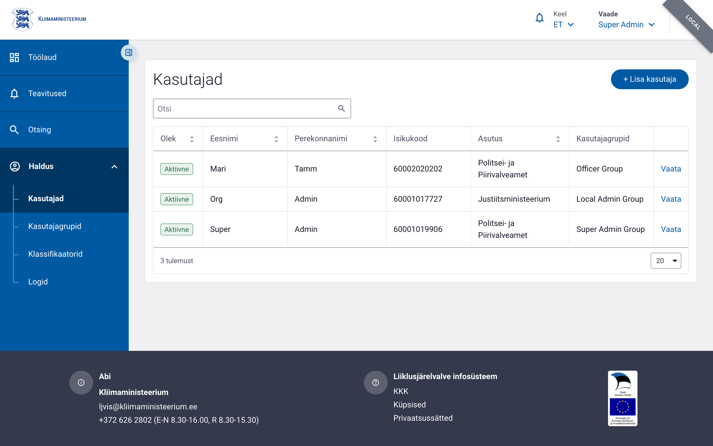
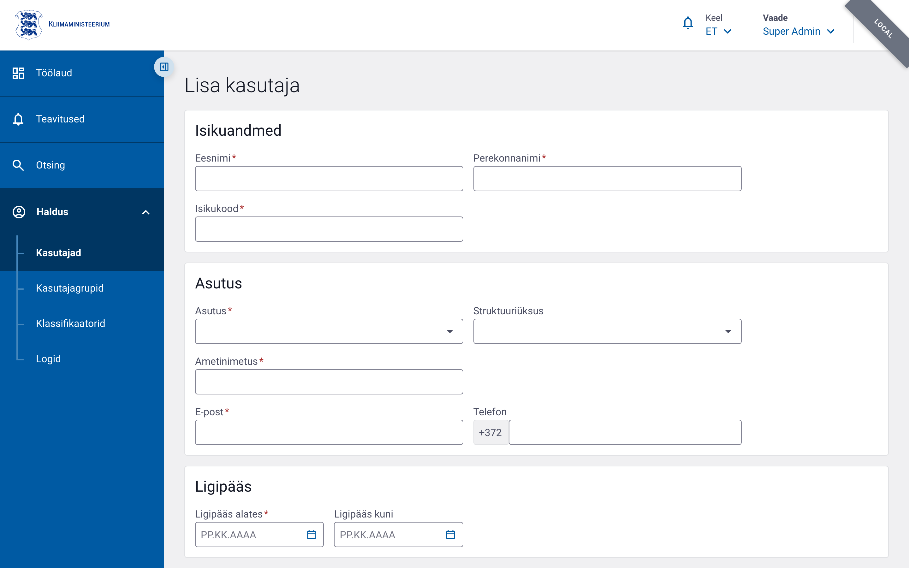
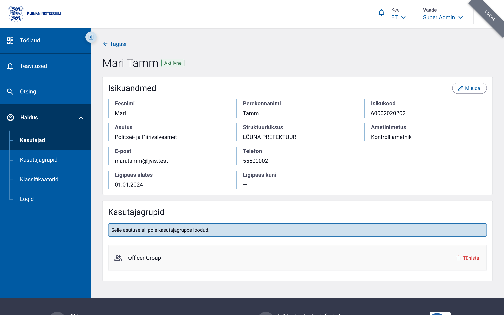

# Kasutajate haldamine

Selles jaos kirjeldatakse, kuidas administraator saab LJVIS 2 süsteemis kasutajakontosid vaadata, luua, muuta ja hallata nende grupiliikmelisusi.

## 1. Vajalikud õigused

Kasutajate halamiseks peab sisselogitud kasutajal olema vastavad õigused:

| Tegevus | Nõutav õigus |
|---------|--------------|
| Kasutajate nimekirja vaatamine | `user.list.admin` või `user.list.local` |
| Ühe kasutaja detailvaate ja gruppide vaatamine | `user.read.admin` või `user.read.local` |
| Uue kasutaja loomine ja olemasoleva muutmine | `user.edit.admin` või `user.edit.local` |
| Kasutajagruppide detailinfo vaatamine | `user_group.read.admin` või `user_group.read.local` |

Kui `admin` õigus puudub, rakendatakse automaatselt `local` skoop, mis piirab ligipääsu ainult oma asutuse kasutajatele.

## 2. Kasutajate nimekirja avamine

Kasutajate nimekirja leiad peamenüüst valiku **Haldus → Kasutajad** kaudu. Navigeerimisel avaneb lehekülg `/users`, mis kuvab kõik kasutajad, kellele sul on õigusega ligipääs.



Nimekirja päringu skoop määratakse automaatselt:

- kasutajal, kellel on õigus `user.list.admin`, laetakse kogu süsteemi kasutajaskond (`admin` skoop);
- kõigil teistel kuvatakse ainult sama asutuse kasutajad (`local` skoop).

## 3. Otsing, filtreerimine, sorteerimine ja leheküljed

Kasutajate nimekirja lehel saad:

- **Otsida** kasutajat nime, isikukoodi või muude tunnuste järgi ülaosas asuvas otsinguväljas.
- **Sorteerida** tulemusi veergude päiste kaudu. Vaikimisi on tulemused sorteeritud staatuse järgi (`status asc`) — aktiivsed kasutajad kuvatakse esimesena.
- **Lehitseda** tulemusi lehekülgede kaupa, kasutades nimekirja all olevat leheküljendust. Saad määrata ka lehekülje suuruse (`pageSize`), et korraga näidata rohkem või vähem kirjeid.
- **Vaadata grupiliikmelisusi**: kui kasutaja kuulub mitmesse gruppi, võidakse ta nimekirjas kuvada eraldi ridadena iga grupi kohta, et oleks lihtsam ülevaadet saada.

Otsinguparameetrid saadetakse HTTP GET päringuga lõpp-punkti `/v1/users/{scope}/search`. Täpsemad näited leiad allpool [Näidised](#6-näidised) jaotisest ja dokumendist `07-api-info.md`.

## 4. Uue kasutaja loomine

Uue kasutaja lisamiseks ava kasutajate nimekirja lehel nupp **Lisa kasutaja** (või mine otse aadressile `/users/new`). Avaneb kasutaja loomise vorm.



Järgmised väljad on kohustuslikud (tärniga tähistatud):

- **Eesnimi** (`firstName`) — kuni 200 tähemärki.
- **Perekonnanimi** (`lastName`) — kuni 200 tähemärki.
- **Isikukood** (`personalCode`) — ainult numbrid, kuni 11 märki.
- **Asutus** (`organisationId`) — vali rippmenüüst. Kohaliku administraatori (`local`) jaoks on see väli ette täidetud ja mittemuudetav.
- **Struktuuriüksus** (`structuralUnitName`) — valikuline, vali rippmenüüst vastavalt asutusele.
- **Ametinimetus** (`jobTitleName`) — kuni 100 tähemärki.
- **E-posti aadress** (`email`) — kuni 320 tähemärki.
- **Telefon** (`phone`) — valikuline.
- **Ligipääsu algus** (`accessStart`) — kuupäev, millal konto muutub aktiivseks.
- **Ligipääsu lõpp** (`accessEnd`) — valikuline kuupäev. Kui jätta tühjaks, on konto kehtiv piiramata ajani.

Pärast vajalike väljade täitmist vajuta **Salvesta**. Kui kõik andmed on korrektsed, suunatakse sind uue kasutaja detailvaatele, kus kuvatakse teade edukalt loodud kontost.

## 5. Kasutaja muutmine

Olemasoleva kasutaja muutmiseks klõpsa kasutajate nimekirjas soovitud kasutaja real. Avanevas detailvaates (`/users/{id}`) kuvatakse kasutaja põhiandmed ja grupiliikmelisused.



Muutmiseks:

1. Vajuta kastis **Muuda**.
2. Asenda või täienda vajalikud väljad (eesnimi, perekonnanimi, isikukood, asutus, struktuuriüksus, ametinimetus, e-post, telefon, ligipääsu algus/lõpp).
3. Vajuta **Salvesta**.

Kui kasutajal on aktiivsed grupiliikmelisused ja sa vahetad teda teise asutuse alla, kuvatakse hoiatus, et gruppide sidemed võivad muutuda. Peale salvestamist kuvatakse teade `Kasutaja andmed salvestatud` ja leht värskendatakse.

## 6. Kasutajagruppide vaatamine ja muutmine

Kasutaja detaillehel eraldi kastis kuvatakse kasutaja kuuluvus kasutajagruppidesse. Seal saad:

- **Vaadata aktiivseid gruppe** ja nende staatust.
- **Muuta gruppe**, kui sul on õigus `user.edit.admin` või `user.edit.local`. Vajuta **Muuda grupid**, vali soovitud grupid ja salvesta.
- **Avada grupi detailvaate**, kui sul on õigus `user_group.read.admin` või `user_group.read.local` — see võimaldab näha grupi õigusi ja liikmeid.

Kui süsteemis pole veel ühtegi kasutajagruppi loodud, kuvatakse vastav teade.

## 7. Näidised

Järgmised `curl` päringud illustreerivad, kuidas kasutajate nimekirja otsida ja uut kasutajat luua otse API kaudu. Täielikud lõpp-punktide kirjeldused, autentimise nõuded ja täiendavad näidised on dokumendis [`07-api-info.md`](./07-api-info.md).

### Kasutajate otsing

Otsi administraatori skoobis kasutajaid, kelle nimi või muu tekst sisaldab tähte `M`, ning tagasta esimene lehekülg 20 kirjetega:

```bash
curl -X GET "https://<base-url>/v1/users/admin/search?q=M&page=1&pageSize=20" \
  -H "Cookie: <COOKIE>"
```

> Asenda `<base-url>` rakenduse tegeliku baasaadressiga (nt `https://dev.liiklusvalve.ee`) ja `<COOKIE>` TARA/TIM sessiooniküpsise väärtusega.

### Uue kasutaja loomine

Loo uus kasutajakonto administraatori skoobis. Päringu kehas peavad olema vähemalt kohustuslikud väljad:

```bash
curl -X POST "https://<base-url>/v1/users/admin" \
  -H "Cookie: <COOKIE>" \
  -H "Content-Type: application/json" \
  -d '{
    "firstName": "Siim",
    "lastName": "Tamm",
    "personalCode": "39001010001",
    "organisationId": 7,
    "structuralUnit": "PÕHJA PREFEKTUUR",
    "jobTitle": "Senior analyst",
    "email": "siim.tamm@ppa.ee",
    "phone": "5555 1234",
    "accessStart": "2026-01-01",
    "accessEnd": null
  }'
```

Vastuseks tagastatakse loodud kasutaja andmed, sealhulgas unikaalne identifikaator (`id`), mille abil saab hiljem detailvaate avada või kontot muuta.
