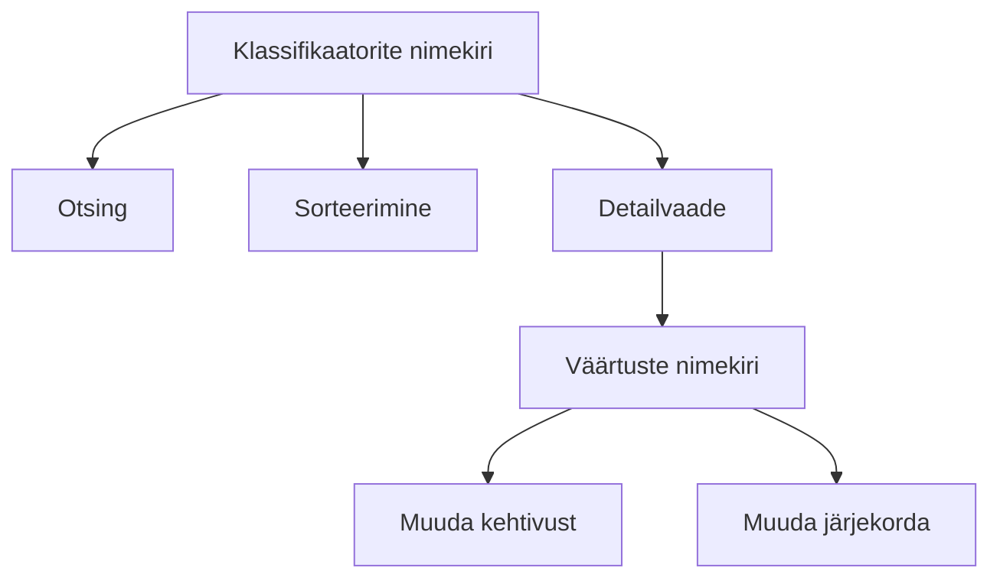

# Klassifikaatorite haldus

Klassifikaatorid on süsteemi viitede loendid. Näiteks riigid, maakonnad, teed, rikkumiste koodid, sanktsioonid ja ametikohad.

## Ligipääs

Menüü → **Haldus → Klassifikaatorid**

Õigus: `classifier.list`

## Klassifikaatorite nimekiri

Nimekiri kuvab kõik süsteemi klassifikaatorid. Iga klassifikaatori juures on:

- kood
- nimetus
- kehtivusperiood
- väärtuste arv

## Klassifikaatori väärtused

Avage klassifikaator, et näha selle väärtusi. Iga väärtus sisaldab:

| Väli | Selgitus |
|---|---|
| Kood | Unikaalne tunnus |
| Nimetus | Inimloetav nimetus |
| Kehtiv alates | Kuupäev, millest väärtus kehtib |
| Kehtiv kuni | Kuupäev, millest väärtus ei kehti |
| Järjekord | Kuvamise järjekord loendites |

## Klassifikaatori väärtuse muutmine

Saate muuta:

- kehtivusaega
- järjekorranumbrit

Koodi ja nimetuse muutmine võib mõjutada vormides juba sisestatud andmeid, seega tehke seda ettevaatlikult.

## Levinud klassifikaatorid

| Klassifikaator | Kasutus |
|---|---|
| Riigid | Vormide riigi valikud |
| Maakonnad | Aadressi- ja kontrolliandmed |
| Teed | Liitvormi tee valikud |
| Rikkumiste koodid | EL määruse rikkumised |
| Sanktsioonid | Sanktsioonide valikud |
| Ametikohad | Inspektorite ametikohad |

## API

Klassifikaatorite pärimiseks kasutatakse endpointi `/v1/classifiers/catalogue` või `/v1/classifiers/bundle`.
