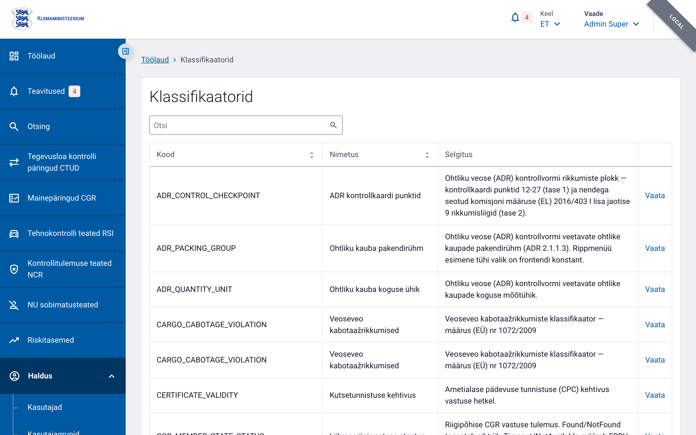
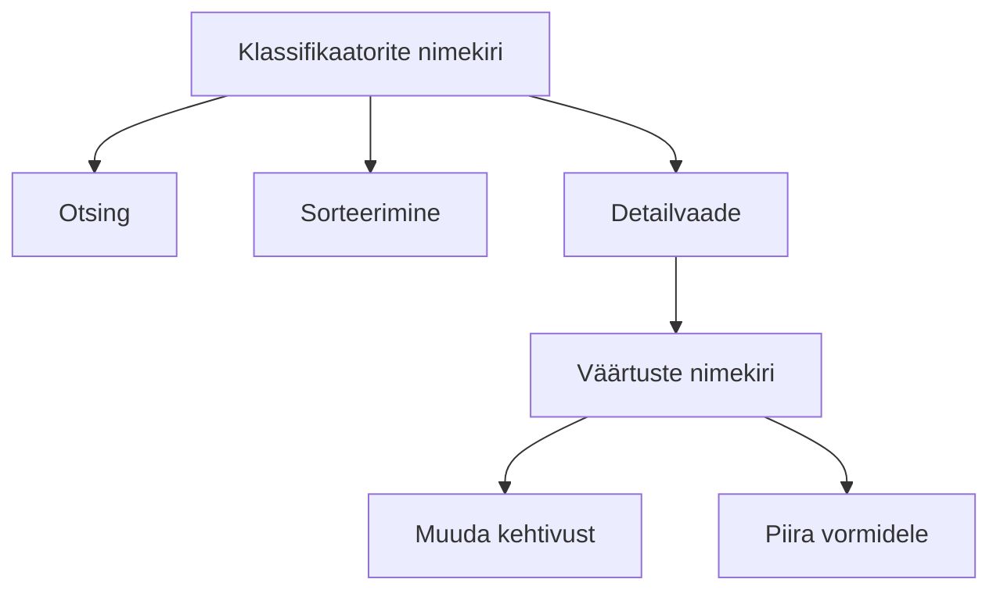
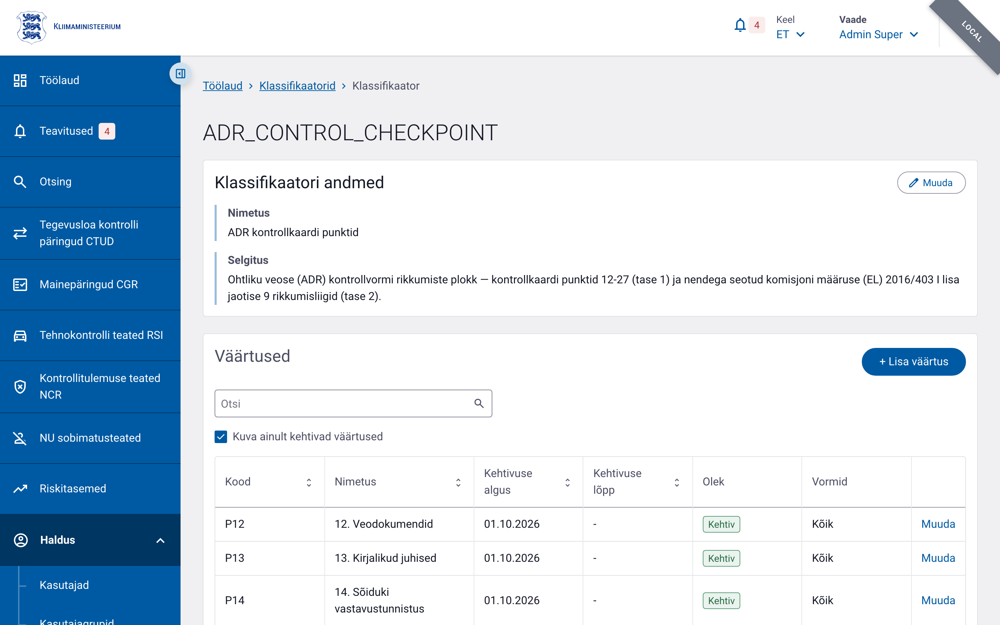
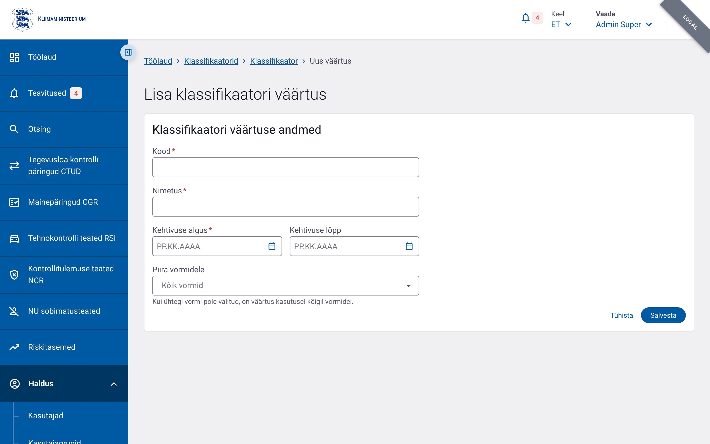
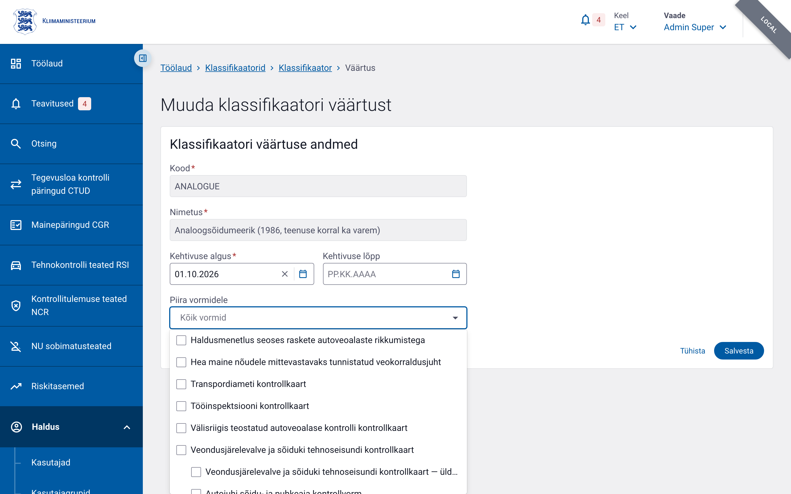

# Klassifikaatorite haldus

Klassifikaatorid on süsteemi viitede loendid. Näiteks riigid, maakonnad, teed, rikkumiste koodid, sanktsioonid ja ametikohad.

## Ligipääs

Menüü → **Haldus → Klassifikaatorid**

Õigus: `classifier.list`

## Klassifikaatorite nimekiri

Nimekiri kuvab kõik süsteemi klassifikaatorid. Iga klassifikaatori juures on:

- kood
- nimetus
- selgitus

```mermaid
flowchart TD
    A[Klassifikaatorite nimekiri] --> B[Otsing]
    A --> C[Sorteerimine]
    A --> D[Detailvaade]
    D --> E[Väärtuste nimekiri]
    E --> F[Muuda kehtivust]
    E --> G[Piira vormidele]
```

## Klassifikaatori väärtused

Avage klassifikaator, et näha selle andmeid ja väärtuste tabelit:

Õigus: `classifier.read`. Lüliti **Kuva ainult kehtivad väärtused** peidab lõpetatud väärtused.

Iga väärtus sisaldab:

| Väli | Selgitus |
|---|---|
| Kood | Unikaalne tunnus |
| Nimetus | Inimloetav nimetus |
| Kehtivuse algus | Kuupäev, millest väärtus kehtib |
| Kehtivuse lõpp | Kuupäev, millest väärtus enam ei kehti (tühi = tähtajatu) |
| Olek | Kehtiv / Lõpetatud |
| Vormid | Vormid, millel väärtus on valikus. „Kõik“ = piirangut pole (vt [Väärtuse piiramine vormidele](#väärtuse-piiramine-vormidele)) |

Uue väärtuse lisamiseks klõpsake detailvaates **+ Lisa väärtus**. Õigus: `classifier_value.edit`.

## Klassifikaatori väärtuse muutmine

Klõpsake väärtuse real **Muuda**. Saate muuta:

- kehtivuse algust ja lõppu
- vormipiirangut (**Piira vormidele**)

Kood ja nimetus on muutmisel lukus, sest vormidesse salvestatakse väärtuse kood. Väärtuse kasutuse lõpetamiseks määrake kehtivuse lõpp.

## Väärtuse piiramine vormidele

Mitut klassifikaatorit kasutavad mitu vormi, näiteks PPA sõidu- ja puhkeaja vorm ja TRAM kontrollkaart. Välja **Piira vormidele** abil saab määrata, millistel vormidel väärtus valikus kuvatakse.

- **Ühtegi vormi pole valitud** (vaikimisi): väärtus on kasutusel kõigil vormidel.
- **Valitud on üks või mitu vormi**: väärtus kuvatakse valikus ainult nendel vormidel. Teistel vormidel seda valida ei saa.

Valikus on tipptaseme vormid (nt Tööinspektsiooni kontrollkaart, TRAM kontrollkaart) eraldi. Veondusjärelevalve (SP) vormid on ühe rühmana:

- rühma päise märkeruuduga valite korraga kõik SP alamvormid ja koondvormi üldandmed;
- „… — üldandmed“ tähendab koondvormi enda välju (nt struktuuriüksus, tee, sõiduki kategooria);
- iga alamvormi (autojuht, meeskonnaliige, sõiduki ja haagise tehnokaart, ohtlik veos, autoveo katkestamine) saab valida ka eraldi.

Pange tähele:

- Piirang kehtib vormi **täitmisel ja muutmisel**. Vormi vaatamisel kuvatakse ka varem salvestatud väärtus, mis on hiljem vormilt piiratud.
- TRAM kontrollkaardi sees olev autojuhi osa kasutab TRAM kontrollkaardi piirangut, mitte PPA autojuhi vormi oma.
- Muudatus jõuab vormidele pärast lehe uuesti laadimist.
- ERRU vormidel (CTUD, CGR, RSI, NCR, NU) piirangut ei rakendata.
- Iga muudatus (vana ja uus vormide loend) salvestatakse auditilogisse.

## Levinud klassifikaatorid

| Klassifikaator | Kasutus |
|---|---|
| Riigid | Vormide riigi valikud |
| Maakonnad | Aadressi- ja kontrolliandmed |
| Teed | Koondvormi tee valikud |
| Rikkumiste koodid | EL määruse rikkumised |
| Sanktsioonid | Sanktsioonide valikud |
| Ametikohad | Inspektorite ametikohad |

## API

Klassifikaatorite pärimiseks kasutatakse endpointi `/v1/classifiers/catalogue` või `/v1/classifiers/bundle`.
