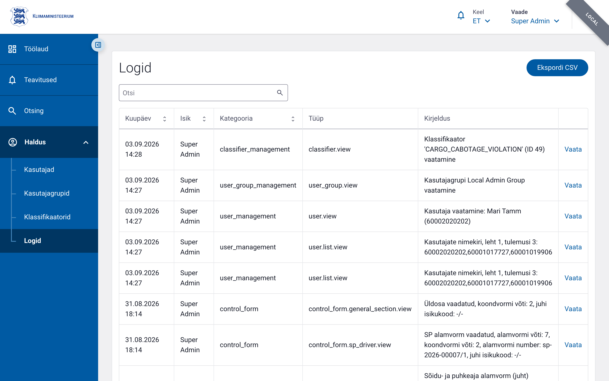

# Auditilogi

## Ülevaade

Auditilogi salvestab LJVIS 2 süsteemis toimunud olulised tegevused ja päringud. Iga kirje on kirjutuskaitstud (`INSERT-only`) — andmebaasis ei tohi logikirjeid muuta ega kustutada. See tagab, et igal hetkel on võimalik jälgida, kes milliseid kasutaja-, grupi-, klassifikaatori- või välispäritolu rikkumise vormidega seotud toiminguid tegi või milliseid andmeid vaatas.

Iga sündmus saab unikaalse `event_id` (ULID), serveripoolse ajatempli, tegija nime, sündmuse tüübi ja kategooria, inimloetava kirjelduse ning struktureeritud `log_content` JSON-i. Isikukoodid on andmebaasis alati SHA-256 räsis, plaintekstina neid ei säilitata.

## Vajalikud õigused

| Lõpp-punkt | Õigus | Selgitus |
|------------|-------|----------|
| Auditilogi nimekiri (`/v1/logs`) | `audit.read` | Loetleb ja otsib logikirjeid. |
| Üksiku kirje vaade (`/v1/logs/log`) | `audit.read` | Kuvab ühe sündmuse detailid. |
| CSV eksport (`/v1/logs/export`) | `audit.read` | Laadi logid alla CSV-failina. |
| Hash-ahela kontroll (`/v1/logs/verify`) | `audit.verify` | Verifitseeri ridadevahelise rägiahela terviklikkus. |

`audit.read` annab ligipääsu logidele; `audit.verify` on eraldi õigus, sest see võimaldab tuvastada, kas logitabeli kallutamiskindlus on säilinud.

Auditilogi avaneb menüüst **Haldus → Logid**. Loendi paremas ülanurgas on nupp **Ekspordi CSV**.



## Mida logitakse

### Sündmuste kategooriad

Auditilogis jagunevad sündmused domeenideks:

- `user_management` — kasutajate vaatamine, otsimine, loomine, muutmine ja gruppide seadmine
- `user_group_management` — kasutajagruppide muutmine
- `classifier_management` — klassifikaatorite ja nende väärtuste vaatamine ja muutmine
- `control_form_management` — välispäritolu rikkumiste vormide loomine, muutmine ja vaatamine
- `access_control` — ligipääsurikked ja rate-limit rikked (planeeritud)

### Sündmuste tüübid ja tingimused

| `event_type` | `event_category` | Millal logitakse |
|--------------|------------------|------------------|
| `user.view` | `user_management` | Alati, kui avatakse kasutaja detailvaade. |
| `user.list.view` | `user_management` | Alati, kui vaadatakse kasutajate nimekirja. |
| `user.list.search` | `user_management` | Ainult siis, kui otsingusõna on vähemalt 3 tähemärki pikk. |
| `user.create` | `user_management` | Alati uue kasutaja loomisel. |
| `user.update` | `user_management` | Alati kasutaja andmete muutmisel. |
| `user.set_groups` | `user_management` | Alati, kui salvestatakse kasutaja grupiliikmelisusi, isegi kui muudatusi pole. |
| `user_group.update` | `user_group_management` | Alati, kui grupp (asutused, õigused, liikmed) muutub. |
| `classifier.view` | `classifier_management` | Alati klassifikaatori detailvaate avamisel. |
| `classifier.list.search` | `classifier_management` | Ainult siis, kui otsingusõna on vähemalt 3 tähemärki pikk. |
| `classifier_value.update` | `classifier_management` | Alati, kui muudetakse klassifikaatori väärtuse kehtivusaega. |
| `control_form.foreign_violation.create` | `control_form_management` | Alati, kui luuakse uus välispäritolu rikkumise vorm. |
| `control_form.foreign_violation.update` | `control_form_management` | Ainult siis, kui vähemalt üks väli muutus eelmise seisuga võrreldes. |
| `control_form.foreign_violation.view` | `control_form_management` | Ainult siis, kui vaataja ei ole vormi looja. |
| `authz.denied` | `access_control` | Kui ligipääsuloa kontroll keelab päringu (403). |
| `authz.scope_violation` | `access_control` | Kohaliku skoobi kasutaja proovib pääseda teise asutuse ressurssidele. |
| `input.rate_limited` | `access_control` | Kui päring lükatakse tagasi rate-limit rikkumise tõttu (429). |

Mõned toimingud logitakse ainult kindlate tingimuste täideminekul. Näiteks kasutajaotsing (`user.list.search`) või klassifikaatoriotsing (`classifier.list.search`) salvestatakse alles siis, kui otsingusõna on vähemalt 3 tähemärki pikk; lühema sisendi korral logitakse ainult nimekirja vaatamine (`*.list.view`).

### Logikirje väljad

Iga kirje sisaldab vähemalt järgmisi andmeid:

- `eventId` — unikaalne ULID-identifikaator
- `eventType` — sündmuse tüüp (nt `user.create`)
- `eventCategory` — sündmuse kategooria
- `actorName` — tegija kuvatav nimi
- `actorPersonalCodeHash` — tegija isikukoodi SHA-256 räsi
- `description` — inimloetav kirjelitus eesti keeles
- `logContent` — sündmuse detailid JSON-na (nt muudetud väljad, eelnevad ja uued väärtused)
- `createdAt` — serveripoolne ajatempel
- `traceId` / `spanId` — võimaldab siduda sündmuse `traceparent` päise kaudu logimis- ja jälgimistööriistadega

## Logide otsimine ja filtreerimine

Auditilogide nimekirja päringu aluseks on:

```text
GET /v1/logs
```

Päringuparameetrid:

- `search` — vabatekstiotsing (nt sündmuse tüüp, tegija nimi või kirjeldus)
- `page` — lehekülje number (vaikimisi `1`)
- `pageSize` — kirjete arv leheküljel
- `sorting` — sorteerimisparameeter; vaikimisi `createdAt desc`

Kasutajaliideses laaditakse logid lehekülgedena ja vaikimisi sorteeritakse uuemad enne. Kui soovid kindlat sündmustüüpi, sisesta `search` väljale nt `user.create` või `user_group.update`.

Logisid saab alla laadida ka CSV-failina:

```text
GET /v1/logs/export
```

CSV eksport kasutab samu `search`, `page`, `pageSize` ja `sorting` parameetreid.

## Üksiku kirje detailvaade

Üksiku sündmuse detailide nägemiseks kasuta:

```text
GET /v1/logs/log?q=<event_id>
```

Detailvaade kuvab:

- sündmuse identifikaatori, tüübi ja kategooria;
- tegija nime (`actorName`);
- sündmuse kirjeldus;
- sündmuse toimumise aja;
- `logContent` — struktureeritud JSON, mis sisaldab sündmuse spetsiifilisi andmeid (nt `targetPersonalCode`, `changedFields`, `formKey` vmt);
- `traceId` ja `spanId`, kui päringu käigus saadeti `traceparent` päis.

Kui tegija nime pole salvestatud, kuvatakse selle asemel `-`.

## Hash-ahela kontroll

Auditilogi ridad on omavahel seotud rägiahelaga. Iga uue kirje `row_hash` arvutatakse eelmise rea `row_hash`-i (`prev_row_hash`) põhjal. Kui ükski rida pole muudetud, kustutatud ega vahele jäänud, on ahel terviklik.

Ahela terviklikkust saab kontrollida lõpp-punktiga:

```text
GET /v1/logs/verify
```

Õigus: `audit.verify`.

Valikulised parameetrid:

- `from` — alustava sündmuse `event_id` (kaasa arvatud)
- `to` — lõpetava sündmuse `event_id` (kaasa arvatud)

Kui parameetreid ei ole, kontrollitakse kogu ahelat esimesest kirjerest viimase.

### Vastuse näited

Terviklik ahel:

```json
{
  "ok": true,
  "checked": 15234,
  "fromEventId": "01J...",
  "toEventId": "01J..."
}
```

Ahel rikutud:

```json
{
  "ok": false,
  "checked": 5721,
  "firstBreachEventId": "01J...",
  "reason": "prev_row_hash_mismatch",
  "fromEventId": "01J...",
  "toEventId": "01J..."
}
```

`firstBreachEventId` näitab esimese kahtlase sündmuse identifikaatorit. Kõnealuse kontrolli läbiviimiseks peab kasutaja olema `audit.verify` õigusega kasutajagrupis.

## Näited

### Auditilogi nimekirja pärimine

```bash
curl -X GET "https://<base-url>/v1/logs?search=user.create&page=1&pageSize=50" \
  -H "Cookie: <COOKIE>"
```

See päring tagastab kuni 50 kirjet, kus otsing vastab näiteks sündmuse tüübile `user.create`.

### Üksiku sündmuse detailid

```bash
curl -X GET "https://<base-url>/v1/logs/log?q=01JAB2C3D4E5F6G7H8J9K0M1N2" \
  -H "Cookie: <COOKIE>"
```

### Auditilogi CSV eksport

```bash
curl -X GET "https://<base-url>/v1/logs/export?search=classifier&pageSize=100" \
  -H "Cookie: <COOKIE>" \
  -o auditilogi.csv
```

### Hash-ahela verifitseerimine

```bash
curl -X GET "https://<base-url>/v1/logs/verify?from=01JAB2C3D4E5F6G7H8J9K0M1N2&to=01JZB9Y8X7W6V5U4T3S2R1Q0P9" \
  -H "Cookie: <COOKIE>"
```

Kui `from` ja `to` ära jätta, kontrollitakse kogu ahel. konkreetse vahemiku kontrolliks anna mõlemad identifikaatorid ette.
