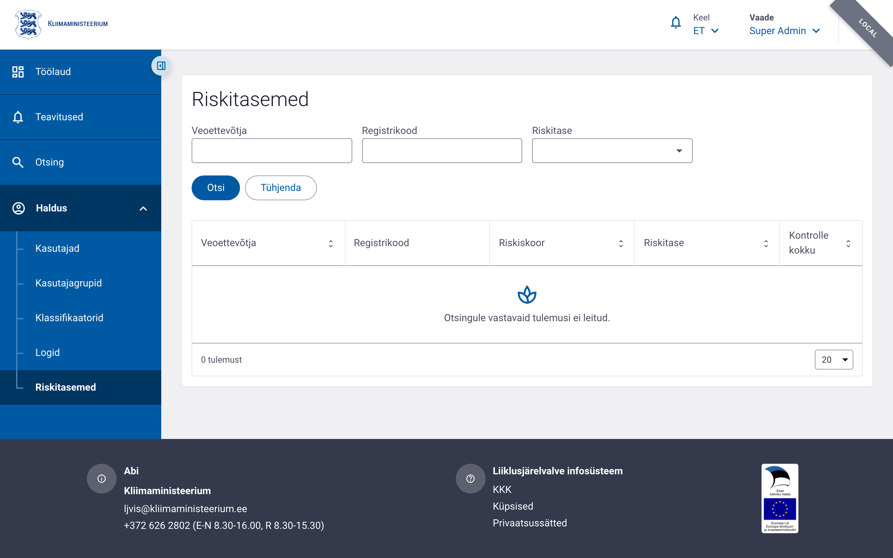

# Riskihindamine — administraatori vaade

Administraatorid ja volitatud ametnikud saavad vaadata kõigi Eesti ettevõtete riskitasemete loendit. Samuti saavad nad avada iga ettevõtte detailvaate, mis kuvab sama teavet, mida ettevõtja esindaja näeb oma ettevõtte kohta.

## Ligipääs

Menüü → **Haldus → Riskitasemed**

Õigus: `risk_report.list`

## Loendi võimalused

Riskitasemete loend kuvab järgmised veerud:

| Veerg | Selgitus |
|---|---|
| Ettevõtte nimi | Ettevõtte ärinimi |
| Registrikood | Eesti 8-kohaline registrikood |
| Riskiskoor | Arvutatud R väärtus |
| Riskitase | Hall, Roheline, Kollane, Punane |
| Viimase arvutuse aeg | Millal skoor viimati arvutati |

## Filtreerimine ja sorteerimine

Administraatori vaates saab:

- filtreerida riskitaseme järgi
- otsida ettevõtte nime või registrikoodi järgi
- sorteerida riskiskoori või nime järgi
- eksportida andmeid CSV või Excelina

## Detailvaade

Detailvaates kuvatakse:

- ettevõtte põhiandmed
- riskiskoori koostis
- kontrollid, mis arvesse läksid
- kontrollid, mis välja jäeti
- algoritmi versioon

## Rollid ja õigused

| Õigus | Selgitus |
|---|---|
| `risk_report.list` | Vaadata kõigi ettevõtete riskitasemete loendit |
| `risk_report.view` | Avada üksiku ettevõtte detailvaadet |
| `risk_report.export` | Eksportida riskiloendeid |

## API

- `GET /v1/admin/risk-scores/list` — riskitasemete loend
- `GET /v1/citizen/risk-scores/my-company` — kodaniku oma ettevõtte vaade
- `POST /v1/risk-scores/recalculate` — ühe ettevõtte skoori uuesti arvutamine
- `POST /v1/risk-scores/current` — hetkeseisundi päring (kasutatakse ka ERRU CTUD liideses)
