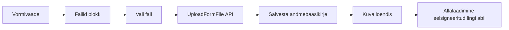

# Manuste haldus ja S3 hoiustamine

Selles jaos kirjeldatakse, kuidas vormidega seotud failid tehniliselt töötavad, millised on piirangud ning kuidas nende ajalugu jälgida.

## Lubatud failiformaadid ja suurused

Kasutajaliidese failivalik (`FileUploadBlock`) aktsepteerib vaikimisi järgmisi laiendeid:

```tsx
const ALLOWED_ACCEPT = '.pdf,.jpg,.jpeg,.png,.tiff';
const MAX_SIZE_MB = 10;
```

| Laiend | MIME-tüüp |
|---|---|
| `.pdf` | `application/pdf` |
| `.jpg`, `.jpeg` | `image/jpeg` |
| `.png` | `image/png` |
| `.tiff` | `image/tiff` |

S3-puhverserveri seadistuses (`docker-compose.yml`) on vaikimisi lubatud MIME-tüüpide loend laiem:

- `application/pdf`
- `image/jpeg`
- `image/png`
- `application/vnd.etsi.asic-e+zip` (ASiC-e)
- `application/msword` (DOC)
- `application/vnd.openxmlformats-officedocument.wordprocessingml.document` (DOCX)

Suurusepiirangud:

| Kiht | Piirang |
|---|---|
| Frontend | 10 MB |
| S3 proxy (`S3_MAX_SIZE_MB`) | 20 MB |
| Failinime pikkus (`S3_MAX_FILENAME_LENGTH`) | 200 tähemärki |

## Kasutajaliidese sammud manuse lisamiseks

1. Ava vorm, millele soovid faili lisada.
2. Klõpsa plokis **Failid** (või sarnasel alal) nuppu **Lisa fail**.
3. Vali arvutist lubatud fail.
4. Kui vormi number on juba olemas, laaditakse fail automaatselt üles. Kui vormi number puudub, kuvatakse vihje: salvesta vorm kõigepealt.
5. Pärast üleslaadimist kuvatakse fail loendis. Klõpsates faili nime, avatakse uues vahekaardis allalaadimise link.



## Tehniline hoiustamine

### S3 võti

Iga fail salvestatakse S3-s kausta, mis on moodustatud vormi tüübist ja numbrist:

```
<form_type>/<form_number>/<file_name>
```

Näide:

```
foreign-violation-form/vr-2026-00123/luba.pdf
```

### Andmebaasi kirje

Andmebaasi tabelis `forms.form_attachment` hoitakse:

| Väli | Selgitus |
|---|---|
| `id` | Unikaalne kirje ID |
| `form_number` | Vormi number |
| `file_name` | Originaalne failinimi |
| `s3_key` | Täielik S3 objekti võti |
| `status` | `active` või `deleted` |
| `created_at` | Üleslaadimise aeg |
| `created_by` | Laadija isikukood |

## Kustutamine on pehme

Kasutajaliideses kustutatud manus ei kustu S3-st, vaid märgistatakse andmebaasis staatusega `deleted`. See tähendab, et faili sisu on endiselt S3-s olemas, kuid seda ei kuvata enam vormi vaates.

## Ajalooline vaade

### Andmebaasi kaudu

Iga üleslaadimise ja kustutamise tegevus jääb kirja tabelisse `forms.form_attachment`. Administraator saab päringuga näha:

- kõiki üleslaaditud faile kindla vormi numbri kohta
- iga faili laadimise ja kustutamise aega
- kes faili üles laadis või kustutas
- millised failid on aktiivsed ja millised kustutatud

Kui sama nimega fail uuesti üles laetakse, luuakse uus andmebaasi kirje, kuid S3 võti jääb samaks. Seega näitab `forms.form_attachment` üleslaadimiste ajalugu, kuid mitte alati iga versiooni sisu (kui S3 versioonihaldus ei ole lubatud).

### S3 versioonihaldus

Kui S3-hoidlas on lubatud **S3 versioonihaldus**, salvestatakse sama võtme all ka varasemad versioonid. See võimaldab administraatoril taastada või vaadata vanemaid faile otse S3 konsooli või AWS CLI kaudu.

Näide S3 CLI-ga vanemate versioonide vaatamiseks:

```bash
aws s3api list-object-versions \
  --bucket <bucket-name> \
  --prefix foreign-violation-form/vr-2026-00123/ \
  --query 'Versions[*].[Key,VersionId,LastModified,Size]'
```

Vanema versiooni allalaadimiseks:

```bash
aws s3api get-object \
  --bucket <bucket-name> \
  --key foreign-violation-form/vr-2026-00123/luba.pdf \
  --version-id <version-id> \
  luba_vana.pdf
```

### Kasutajaliidese võimalused

Praeguses LJVIS2 liideses kuvatakse vormi vaates ainult aktiivsed manused. Kustutatud või varasemate versioonide taastamiseks tuleb administraatoril:

1. päringuid teha otse andmebaasi või auditilogi kaudu, et leida `s3_key` ja ajatemplid
2. kasutada S3 konsooli või CLI-d, kui versioning on lubatud
3. vajadusel taastada `forms.form_attachment` kirje staatus `active`-ks

## Auditilogi

Manuste üleslaadimine, allalaadimine ja kustutamine logitakse auditilogi sündmustega:

- `form.file.upload`
- `form.file.download`
- `form.file.delete`

Iga sündmus sisaldab faili nime, vormi numbrit, `s3_key`-d ja tegija andmeid.

## API lõpp-punktid

| Meetod | Lõpp-punkt | Selgitus |
|---|---|---|
| POST | `/v1/<form-type>/files/upload` | Lisa uus manus |
| GET/POST | `/v1/<form-type>/files/list` | Loetle aktiivsed manused |
| GET/POST | `/v1/<form-type>/files/download` | Hangi eelsigneeritud allalaadimislink |
| POST/DELETE | `/v1/<form-type>/files/delete` | Märgista manus kustutatuks |

Täpsemad autentimise, parameetrite ja `curl` näidised on dokumendis [`07-api-info.md`](./07-api-info.md).
