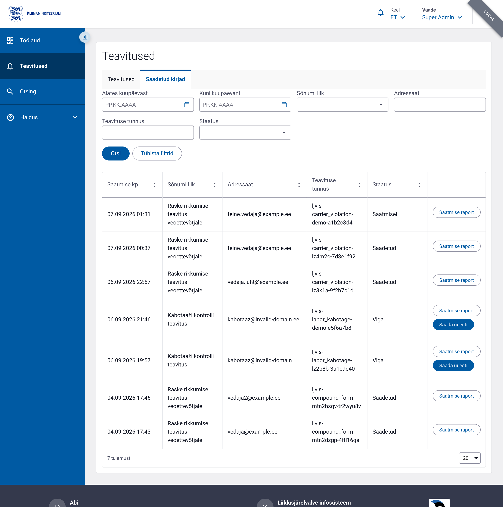

# Teavitused

## Ülevaade

**Teavitused** koondab ühte kohta kõik LJVIS 2 poolt saadetud teavitused: nii
rakendusesisesed (töölaua kella-teavitused) kui ka väliskanali kaudu — üle
**X-tee Postkast 2.0 teenuse** — e-postiga saadetud kirjad. Peakasutaja saab
jälgida saatmise õnnestumist, näha vea põhjust ja ebaõnnestunud teavituse
**muutmata kujul uuesti saata**.

Väline saatmine käib X-tee kaudu (`X-Road-Client: <instants>/GOV/70001231/ljvis2`,
teenus `<instants>/GOV/70006317/postkast`). LJVIS 2 ei säilita Postkast 2.0
juurdepääsutõendeid — kutse autentitakse turvaserveri kaudu. Iga saatmiskirje
saab LJVIS-i antud unikaalse **teavituse tunnuse** (`notification_key`), mis
liigub X-tee päisesse ja mille järgi saab saadetist hiljem tuvastada.

Saatmislogi on **täiendatav (append-only)**: uuesti saatmine loob alati uue rea
oma teavituse tunnusega, algne ebaõnnestunud kirje jääb muutmata «Viga»
staatusesse.

## Vajalikud õigused

| Tegevus | Õigus | Selgitus |
|---------|-------|----------|
| Saadetud teavituste nimekiri (`GET /v1/notifications/outbound-log/list`) | `notification.list` | Loetleb ja filtreerib väliskanali saatmiskirjeid. Ilma selle õiguseta vahekaart «Saadetud teavitused» ei ole nähtav. |
| Saatmise raport (`GET /v1/notifications/outbound-log/recipients`) | `notification.list` | Kuvab ühe saatmiskirje adressaadi(te) saatmistulemuse. |
| Teavituse uuesti saatmine (`POST /v1/notifications/outbound-log/resend/send`) | `notification.resend` | Saadab ebaõnnestunud teavituse muutmata kujul uuesti. |

Varasem koondõigus `notification.admin` on asendatud kahe eraldiseisva
õigusega: `notification.list` (vaatamine) ja `notification.resend` (uuesti
saatmine). Uuendus lisab mõlemad automaatselt kõikidele kasutajagruppidele,
kus varem oli `notification.admin`.

Teavituste vaade avaneb menüüst **Haldus → Teavitused**. Rakendusesisesed
teavitused on vahekaardil «Minu teavitused», väliskanali saatmislogi
vahekaardil «Saadetud teavitused» (nähtav ainult `notification.list`
õigusega).



## Saatmislogi veerud

| Veerg | Sisu |
|-------|------|
| Saatmise kp | Teavituse loomise/saatmise kuupäev ja kellaaeg. |
| Sõnumi liik | Teavituse liik (nt «Raske rikkumise teavitus veoettevõtjale»). |
| Adressaat | E-posti aadress, kuhu teavitus saadeti (salvestatakse saatmise hetkel). |
| Teavituse tunnus | LJVIS-i antud unikaalne identifikaator (`notification_key`). |
| Staatus | `Saatmisel`, `Saadetud` või `Viga` (vt allpool). |

«Viga» staatusega real kuvatakse veerus hiirekursori all **kohtspikker** vea
põhjusega (Postkast 2.0 veakood või -kirjeldus). Kõiki veerge (v.a tegevused)
saab **sorteerida**; vaikimisi on nimekiri saatmise kuupäeva järgi kahanevas
järjekorras.

### Staatused

Kasutajale kuvatakse kolm staatust:

| Kuvatav staatus | Tähendus |
|-----------------|----------|
| Saatmisel | Teavitus on järjekorras (`queued`) või Postkast 2.0 töötleb seda (`in_progress`). Lõppstaatust ei ole veel saabunud. |
| Saadetud | Postkast 2.0 kinnitas, et teavitus on adressaadile edastatud (`sent`). |
| Viga | Saatmine ebaõnnestus (`error`) — vigane aadress, vale kanal, Postkast 2.0 veateade või lõppstaatuse mittesaabumine lubatud aja jooksul. |

Postkast 2.0 ei teavita saatmise lõpptulemusest ise. Taustatöö
`notification-status-sync` (CronManager, iga 5 min) küsib lõppstaatuseta
teavituste seisu X-tee kaudu ja värskendab staatuse. Kui lõppstaatust ei
saabu **24 tunni jooksul või 48 kontrollikatse järel**, sunnitakse staatus
«Viga»-ks — ükski teavitus ei jää lõputult «Saatmisel» olekusse.

## Filtreerimine

Saatmislogi päring:

```text
GET /v1/notifications/outbound-log/list
```

Filtrid (kõik valikulised):

- `dateFrom`, `dateTo` — saatmise kuupäevavahemik (kaasa arvatud)
- `notificationType` — teavituse liik (klassifikaatori kood)
- `recipient` — adressaadi e-post, osaline vaste (`ILIKE`)
- `notificationKey` — teavituse tunnus, täpne vaste
- `status` — `queued`, `in_progress`, `sent` või `error`
- `sortBy` + `sortDir` — sorteerimisveerg ja suund (vaikimisi `send_date` / `desc`)
- `page`, `pageSize` — lehekülg ja lehekülje suurus

Kui filtritele ei vasta ühtegi kirjet, kuvatakse tabeli asemel tekst
«Otsingule vastavaid teavitusi ei leitud.».

Iga nimekirja avamine logitakse auditisse sündmusega `notification.list.view`
(kategooria `notification_management`), sest vaates kuvatakse isikuandmeid
(adressaatide e-posti aadresse). Kirjeldusse salvestatakse rakendatud
filtrid, lehekülg ning kuvatud teavituse tunnused ja adressaadid.

## Teavituse uuesti saatmine

«Saada uuesti» nupp kuvatakse **ainult «Viga» staatusega ridadel** ja ainult
`notification.resend` õigusega kasutajale. Nupule vajutades küsitakse
kinnitust ning seejärel saadetakse teavitus **muutmata kujul** — sama
adressaat, sama keel ja samad malli muutujate väärtused, mis on salvestatud
ebaõnnestunud katse juures.

Uuesti saatmine:

- loob **uue** saatmiskirje oma teavituse tunnusega (`original_log_id` viitab
  ebaõnnestunud kirjele);
- ei muuda algset «Viga» kirjet;
- logitakse auditisse sündmusega `notification.resend.manual` (kategooria
  `notification_management`) — kirjeldus sisaldab algset ja uut teavituse
  tunnust, adressaati, eelmise katse vea põhjust ja uut staatust.

Kui algkirje ei ole «Viga» staatuses, tagastab lõpp-punkt `409 Conflict` —
õnnestunud või saatmisel oleva teavituse dubleerimist ei lubata.

## Auditisündmused

| `event_type` | `event_category` | Millal logitakse |
|--------------|------------------|------------------|
| `notification.list.view` | `notification_management` | Alati saatmislogi nimekirja avamisel. |
| `notification.resend.manual` | `notification_management` | Alati teavituse käsitsi uuesti saatmisel. |

## Näited

### Saatmislogi pärimine

```bash
curl -X GET "https://<base-url>/v1/notifications/outbound-log/list?status=error&dateFrom=2026-09-01&pageSize=50" \
  -H "Cookie: <COOKIE>"
```

### Ühe saatmiskirje raport

```bash
curl -X GET "https://<base-url>/v1/notifications/outbound-log/recipients?q=<log_id>" \
  -H "Cookie: <COOKIE>"
```

### Ebaõnnestunud teavituse uuesti saatmine

```bash
curl -X POST "https://<base-url>/v1/notifications/outbound-log/resend/send?q=<log_id>" \
  -H "Cookie: <COOKIE>"
```

Vastuseks tagastatakse uue saatmiskirje `logId`, `notificationKey` ja
`status`.
