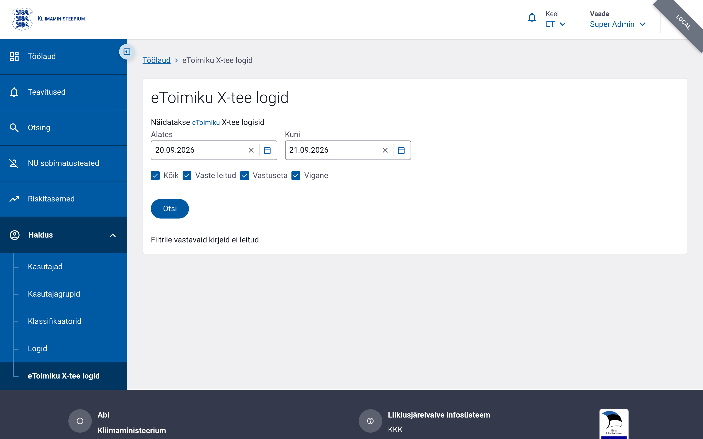

# eToimiku X-tee logid

## Ülevaade

**eToimiku X-tee logid** kuvab administraatorile eToimiku
`AnnaIsikuKvalifikatsioonid` teenuse kaudu tehtud X-tee päringute
täieliku ajaloo — nii käsitsi vormilt tehtud otsingud (vt E-toimiku
kvalifikatsiooni kontroll) kui ka öised automaatsed taustatöö
(cron) päringud, mis kontrollivad, kas menetlusotsus on jõustunud
(sõidukeeld, autojuhi SP-vorm, tramm-kontrollkaart, tehnokontrolli
vormid).

Vaade on auditi/järelvalve tööriist: iga rida sisaldab **väljuva
päringu ja saabunud vastuse täissisu** (mitte kokkuvõtet), et
administraator saaks kontrollida, mida süsteem eToimikuga täpselt
vahetas. Kuna sisu sisaldab isikuandmeid (isikukood, X-tee päringu/
vastuse täissisu), on iga avamine logitud auditisse.

## Vajalikud õigused

| Tegevus | Õigus | Selgitus |
|---------|-------|----------|
| Logide nimekiri (`GET /v1/xroad/etoimik/logs/list`) | `xroad.log.read` | Loetleb ja filtreerib eToimiku X-tee integratsioonilogi. Ilma selle õiguseta menüüpunkt «eToimiku X-tee logid» ei ole nähtav ja otsenavigeerimine annab «Teil puudub ligipääs sellele lehele». |

`xroad.log.read` on antud **ainult Super Admin Groupile** — logi sisaldab
isikuandmeid üle asutuste piiride, samamoodi kui `audit.read` (mitte
`audit.read.local`) on piiratud Super Adminiga.

Vaade avaneb vasakmenüüst **Haldus > eToimiku X-tee logid**.



## Filtreerimine

Lehe ülaosas on filtririba:

- **Kuupäevavahemik** (`Alates` / `Kuni`) — päringu loomise aeg
  (`created_at`). Vaikimisi **eile — täna**.
- **Staatuse checkboxid**: `Vaste leitud`, `Vastuseta`, `Vigased`, ja
  tuletatud `Kõik`.
  - `Kõik` märkimine/eemaldamine mõjutab kõiki kolme staatust korraga.
  - Ühe staatuse eemaldamine eemaldab automaatselt ka `Kõik` märke
    (tuletatud olek — näitab, et valik ei ole enam "kõik").
  - Kui kõik kolm on märkimata, ei kuvata ühtegi rida.

Filtrid rakenduvad "Otsi" nupu vajutamisel.

### Staatuste tähendus

| Staatus | Tähendus |
|---------|----------|
| **Vaste leitud** (`found`) | eToimikust saadi kasulik info, mida sai kasutada kontrollkaardi andmete täiendamiseks (nt jõustunud menetlusotsus). |
| **Vastuseta** (`not_found`) | Päring õnnestus, aga midagi ei leitud (tühi vastus või otsitav isik/juhtum ei ühti). |
| **Vigane** (`error`) | X-tee/XTR päring ise ebaõnnestus (nt HTTP viga, ühenduse katkemine). |

## Tabeli veerud

| Veerg | Sisu |
|-------|------|
| Päringu aeg | Millal päring eToimikule tehti. |
| Vorm | Kontrollkaart/vorm, mille andmete põhjal päring tehti — link vormile, kui see on tuvastatav. |
| Staatus | Vaste leitud / Vastuseta / Vigane (vt eespool). |
| Väljuv päring | Nupp "Vaata päringut" — avab modaali eToimikule saadetud päringu täissisuga (JSON). |
| Saabunud vastus | Nupp "Vaata vastust" — avab modaali eToimikust saabunud vastuse täissisuga (JSON). |


## Auditisündmused

| `event_type` | `event_category` | Millal logitakse |
|--------------|------------------|------------------|
| `xroad.log.view` | `xroad_integration_log` | Alati logide nimekirja avamisel — kirjeldusse salvestatakse rakendatud filtrid, lehekülg ja kuvatud kirjete id-d. |

## Näide

```bash
curl -X GET "https://<base-url>/v1/xroad/etoimik/logs/list?dateFrom=2026-09-16&dateTo=2026-09-17&includeFound=true&includeNotFound=true&includeError=false" \
  -H "Cookie: <COOKIE>"
```

Vastuseks tagastatakse `{ content: [...], total: N }`.
