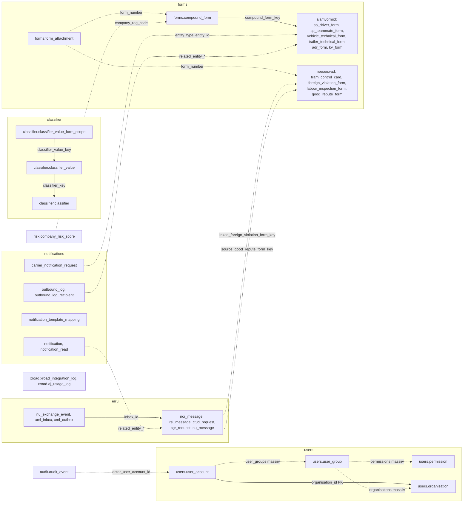
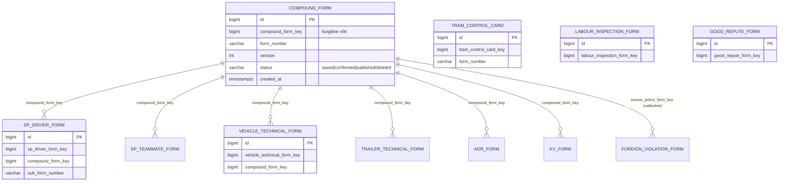
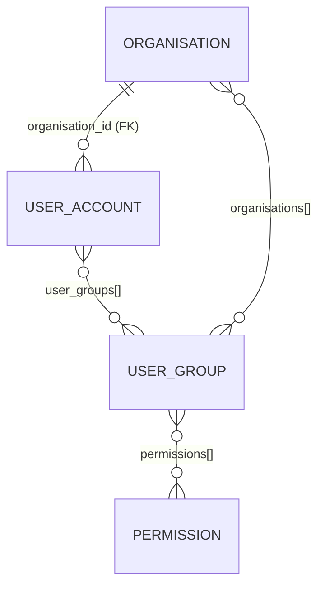
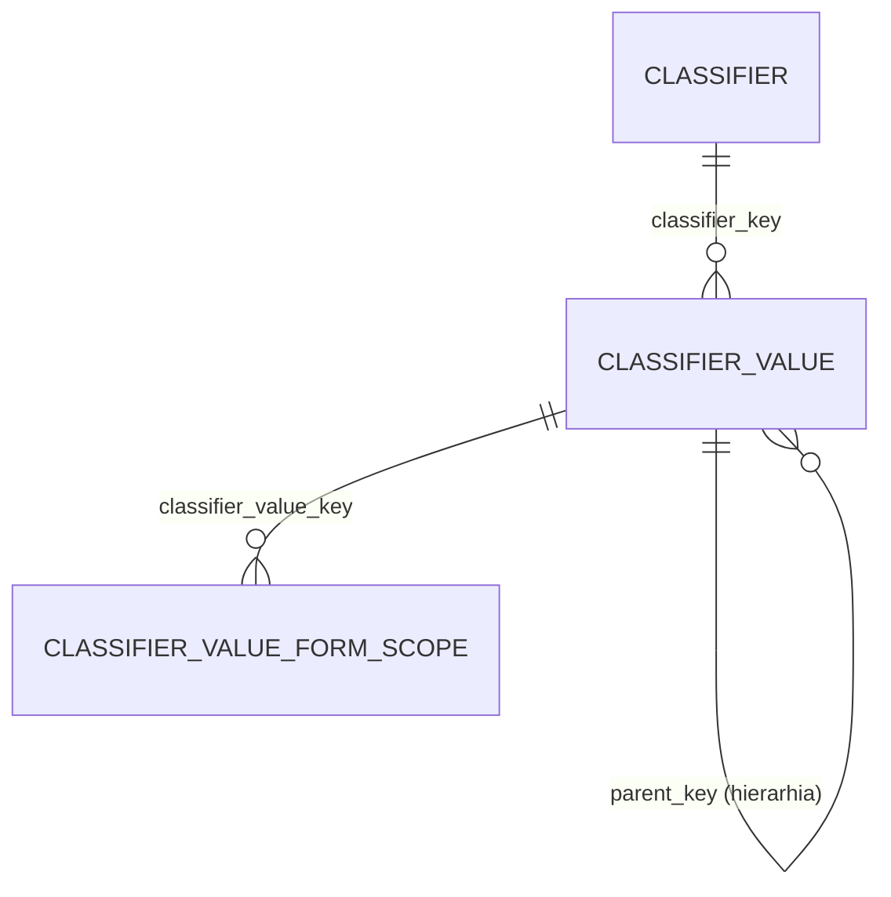
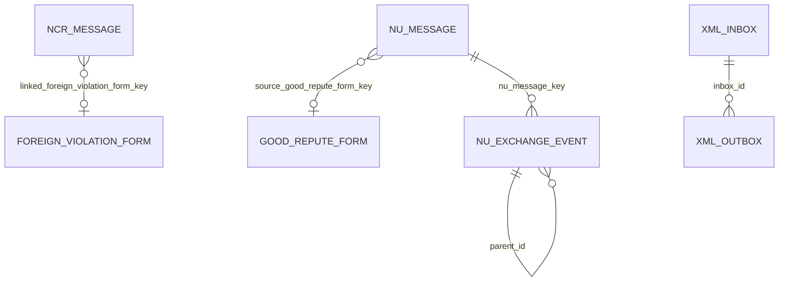
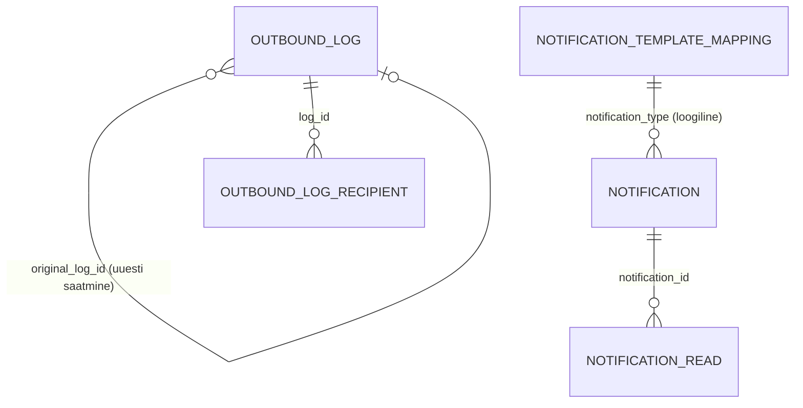

# Andmemudel: ER-skeem ja seosed

**Täielik veergude loend:** [andmemudel-skeem.md](andmemudel-skeem.md) (genereeritud Liquibase'ist,
`python3 scripts/generate-erd.py`; CI kontrollib aktuaalsust: `--check`).
Selles failis on käsitsi hoitav **ülevaade seostest**. Vanem, normaliseeritud mudelit kirjeldav
[data_model.md](../workingdocs/data_model.md) on ajalooline ja ei vasta enam INSERT-only mudelile.

## 1. Mudeli põhimõtted

| Põhimõte | Selgitus |
|---|---|
| **INSERT-only snapshot** | Enamikus tabelites lisab iga muudatus uue rea. „Kehtiv seis" = viimane rida loogilise võtme (`<olem>_key`) kohta (`DISTINCT ON (<key>) ORDER BY created_at DESC`), kui `status <> 'deleted'` |
| **Loogilised võtmed** | Snapshot-tabelite vahel ei ole FK-sid. Seosed on „paljad" `BIGINT` võtmed (nt `compound_form_key`); kehtestab rakendus |
| **Massiivväljad** | Mitu seost hoitakse massiividena (`users.user_account.user_groups BIGINT[]`, `users.user_group.permissions`, `organisations`) |
| **Skeemid** | `users`, `classifier`, `forms`, `erru`, `notifications`, `risk`, `audit`, `xroad` |
| **Auditiahel** | `audit.audit_event` on räsiahelaga (`audit.chain_tip`), tõendab muutumatust |
| **Arhiiv** | Eraldi andmebaas `ljvis_arhiiv_db` skeemiga `archive` (`archive.form_snapshot`, JSONB `payload`); [juhend](../admin-guide/13-arhiveerimine.md) |

## 2. Ülevaade skeemide kaupa

Pidev joon = andmebaasi FK; punktiirjoon = loogiline võti / massiiv (andmebaas ei jõusta).

## 3. Vormid (`forms`)

Alamvormide hulk: `sp_driver_form`, `sp_teammate_form`, `vehicle_technical_form`, `trailer_technical_form`, `adr_form`, `kv_form`
(kõik `compound_form_key`). Iseseisvad (ilma koondvormita): `tram_control_card`, `foreign_violation_form`, `labour_inspection_form`, `good_repute_form`.
Sama loogilise võtmega read on ühe vormi versioonid.

## 4. Kasutajad ja õigused (`users`)

## 5. Klassifikaatorid (`classifier`)

`classifier_value_form_scope` piirab väärtuse nähtavuse vormitüüpidele (tühi = kõigile; [ADR-011](../workingdocs/architecture-decisions.md)).

## 6. ERRU (`erru`)

Ülejäänud sõnumitabelid (`rsi_message`, `ctud_request`, `cgr_request`) seostuvad vahetuse tunnuste (`technical_id`,
`workflow_id`, `business_case_id`) kaudu; `ncr_autodispatch_log` seob sõidu- ja puhkeaja vormi (`sp_form_key`, `sp_form_type`)
saadetud NCR-iga.

## 7. Teavitused (`notifications`)

Vt [teavituste spetsifikatsioon](../specs/teavitused-spetsifikatsioon.md).

## 8. Muud skeemid

| Tabel | Eesmärk |
|---|---|
| `risk.company_risk_score` | Ettevõtte riskiskoori ajalugu (INSERT-only), võti `company_reg_code` |
| `audit.audit_event`, `audit.chain_tip`, `audit.config` | Auditilogi räsiahelaga; sool `audit.config`-is ([ADR-004](../workingdocs/architecture-decisions.md)) |
| `xroad.xroad_integration_log` | Kõigi X-tee integratsioonide logi |
| `xroad.aj_usage_log` | Andmejälgija kasutusinfo (append-only, [ADR-005](../workingdocs/architecture-decisions.md)) |
| `forms.form_attachment` | Manuste metaandmed; failid S3-s (`s3_key`) |

## 9. Hooldus

Skeemimuudatus = Liquibase changeset. Pärast muudatust käivita `python3 scripts/generate-erd.py` ja kontrolli, et
skeemidokument on kaasa uuendatud; seoste ülevaate (see fail) uuenda käsitsi, kui lisandub tabel või seos.
