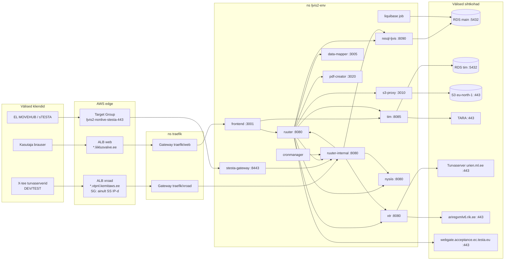

# LJVIS2 võrguühendused — NetworkPolicy ja AWS Security Group'ide alus

Dokument loetleb kõik LJVIS2 komponentide sisse- (ingress) ja väljaminevad (egress)
ühendused, et nende põhjal ehitada Kubernetes NetworkPolicy'd (EKS, namespace
`ljvis2-<env>`) ja AWS-i kihi Security Group'id.

**Allikad** (seis 2026-09-23):

- ljvis-2 repo: `docker-compose.yml`, `constants.ini`, `ruuter.yaml`, `ruuter-internal.yaml`,
  `xtr.yaml`, `cronmanager.yaml`, `DSL/**` (tegelikud kutsed),
  `frontend/nginx.conf`
- ljvis2-devops repo (`origin/main`): `charts/*/values.yaml` (eriti Ruuterite
  `internal_requests.allowed_urls`), `environments/{dev,test,prelive}/values/*.yaml`,
  HTTPRoute'id ja `stesta-gateway` TargetGroupBinding

Ruuterite `allowed_urls` on juba rakenduse tasemel väljuva liikluse allowlist — NetworkPolicy
peab sellega kokku langema (L3/L4), mitte olema laiem.

---

## 1. Komponendid

Kõik komponendid on ClusterIP Service'id namespace'is `ljvis2-<env>`. Service nimi =
`fullnameOverride` (= `app.kubernetes.io/name` label, kontrollida kemitcharti väljundist).

| Komponent | Service port → containerPort | Roll | Avalik sisenemine |
|---|---|---|---|
| `frontend` | 3001 → 3001 | nginx: React build + reverse proxy `/api/`, `/tim/`, `/developer/` | jah, *web* plane (Traefik) |
| `ruuter` | 8080 → 8080 | avalik API-ruuter (DSL/Ruuter) | ei (ainult frontendi kaudu) |
| `ruuter-internal` | 8080 → 8080 | sisemine ruuter: cron, X-tee teenuse pakkumine, ERRU callback'id | jah, *xroad* plane (`POST /ljvis/xroad/provide/*`) |
| `tim` | 8085 → 8085 | autentimine (TARA OIDC, JWT) | ei (ainult frontendi `/tim/` kaudu) |
| `resql-ljvis` | 8090 → 8090 | SQL-teenus → RDS | ei |
| `data-mapper` | 3005 → 3005 | Handlebars-mallid | ei |
| `xtr` | 8080 → 8080 | X-tee klient (SOAP + REST passthrough) → turvaserver | ei |
| `s3-proxy` | 3010 → 3010 | manuste üles-/allalaadimine S3-sse | ei |
| `nysiis` | 8080 → 8080 | ERRU NYSIIS võtme arvutus (Java sidecar) | ei |
| `pdf-creator` | 3020 → 3020 | PDF-i genereerimine (WeasyPrint, väliseid ressursse ei laadi — `url_fetcher=deny_resources`) | ei |
| `cronmanager` | 8080 → 8080 | ajastatud tööd (curl → ruuter-internal) | ei |
| `stesta-gateway` | 443 → 8443 (TLS), health 8081 | ERRU/MOVEHUB sissetulevate callback'ide TLS-värav | jah, AWS Target Group `ljvis2-nonlive-stesta-443` (hetkel ainult **dev**) |
| Liquibase Job (resql-ljvis chart, Argo sync-wave −1) | — | skeemimigratsioon | ei |

Lokaalses docker-compose'is olevad `database`, `tim-postgresql`, `tara-mock`,
`liquibase-arhiiv` **ei ole** k8s-is — nende asemel on RDS ja päris TARA.

---

## 2. Liiklusskeem



Lisaks käivad brauserist otse (klastrist mööda, NetworkPolicy't ei puuduta):
TARA sisselogimisleht (redirect) ja S3 presigned URL-id manuste allalaadimisel (TTL 300 s).

---

## 3. Ingress komponentide kaupa

„Allikas" = kes tohib ühenduda. Kõik portid TCP.

| Sihtmärk : port | Lubatud allikas | Põhjus / tee |
|---|---|---|
| `frontend:3001` | ns `traefik` (Gateway `web`) | avalik veeb `dev/demo/prelive.liiklusvalve.ee`, sh WebSocket `/api/notifications/connect` (upgrade peab läbi ALB+Traefiku käima) |
| `ruuter:8080` | `frontend` | nginx `/api/` → `/ljvis/`, `/developer/` → `/xtee-mock/`, WS |
| | `ruuter-internal` | `POST /ljvis/v1/ws-broadcast/send` (teavituste push), `/ljvis/v1/erru/mock/*`, `/ljvis/v1/postkast/mock/*` |
| | `ruuter` ise | ERRU mock-hub (`ERRU_*_ENDPOINT` dev/CI väärtused viitavad `ruuter:8080/.../erru/mock`) |
| `ruuter-internal:8080` | ns `traefik` (Gateway `xroad`) | X-tee teenuse pakkumine, HTTPRoute lubab ainult `POST /ljvis/xroad/provide/*` |
| | `stesta-gateway` | ERRU/MOVEHUB sissetulevad päringud ja vastused |
| | `ruuter` | `/ljvis/auth/log-login`, `/notification/create`, `/notification/send-postkast`, `/risk-scores/{current,controls,recalculate}` |
| | `cronmanager` | `/ljvis/cron/*`, `/ljvis/users/deactivate-expired` |
| | `ruuter-internal` ise | `/notification/create`, `/risk-scores/recalculate` |
| `tim:8085` | `frontend` | nginx `/tim/` (login, callback, cookie) |
| | `ruuter` | tokeni valideerimine, kasutajainfo (`LJVIS_TIM`, admin token) |
| `resql-ljvis:8090` | `ruuter`, `ruuter-internal` | kõik SQL-päringud (`LJVIS_RESQL`, `LJVIS_RESQL_ARHIIV`) |
| `data-mapper:3005` | `ruuter` | `LJVIS_DMAPPER_HBS` (ruuter-internal ei kasuta) |
| `xtr:8080` | `ruuter`, `ruuter-internal` | kõik X-tee kutsed (`LJVIS_XTR`) |
| `s3-proxy:3010` | `ruuter` | manuste upload/presign |
| `nysiis:8080` | `ruuter`, `ruuter-internal` | ERRU otsinguvõtmed |
| `pdf-creator:3020` | `ruuter` | PDF-i genereerimine |
| `cronmanager:8080` | — (keegi) | admin-API (`/execute`, `/reload`) ainult `kubectl port-forward` kaudu; ingress võib täielikult keelata |
| `stesta-gateway:8443` | AWS LB (TargetGroupBinding, `targetType: ip` → liiklus tuleb LB/VPC aadressidelt otse pod IP-le) | MOVEHUB callback'id |
| `stesta-gateway:8081` | kubelet / LB health check | `/healthz` |
| Kõik | kubelet (node IP-d) | startup/readiness/liveness probe'id pordil `http` |

---

## 4. Egress komponentide kaupa

Kõigil podidel lisaks: **DNS → `kube-system/kube-dns` UDP+TCP 53** (`stesta-gateway` kasutab
`kube-dns.kube-system.svc.cluster.local` resolverit otse).

### 4.1 Klastrisisene

| Allikas | Sihtmärk : port |
|---|---|
| `frontend` | `ruuter:8080`, `tim:8085` |
| `ruuter` | `resql-ljvis:8090`, `data-mapper:3005`, `tim:8085`, `ruuter-internal:8080`, `ruuter:8080` (ise), `xtr:8080`, `s3-proxy:3010`, `nysiis:8080`, `pdf-creator:3020` |
| `ruuter-internal` | `resql-ljvis:8090`, `xtr:8080`, `nysiis:8080`, `ruuter:8080`, `ruuter-internal:8080` (ise) |
| `cronmanager` | `ruuter-internal:8080` |
| `stesta-gateway` | `ruuter-internal:8080` |
| `tim`, `resql-ljvis`, `data-mapper`, `xtr`, `s3-proxy`, `nysiis`, `pdf-creator`, Liquibase | — (klastrisiseseid kutseid ei tee) |

### 4.2 Klastrist välja

| Allikas | Sihtkoht | Port | Märkus |
|---|---|---|---|
| `resql-ljvis` | RDS `ljvis2-<env>-main` | 5432 | vt tabel 5 |
| Liquibase Job | RDS `ljvis2-<env>-main` | 5432 | sama baas, master-kasutaja |
| `tim` | RDS `ljvis2-<env>-tim` | 5432 | sessioonid, TIM skeem |
| `tim` | `tara-test.ria.ee` (live: `tara.ria.ee`) | 443 | OIDC discovery, JWKS, token endpoint |
| `xtr` | X-tee turvaserver `urien.ml.ee` | 443 | mTLS; kõik X-tee SOAP + REST (RR, Postkast, Liiklusregister, MTR, e-Toimik, Äriregister) |
| `xtr` | `ariregxmlv6.rik.ee` | 443 | **otse, mitte X-tee kaudu** — ainult `ar/ettevottegaSeotudIsikud_v1` |
| `s3-proxy` | S3 `s3.eu-north-1.amazonaws.com` | 443 | soovitavalt S3 Gateway VPC endpoint (prefix list `com.amazonaws.eu-north-1.s3`) |
| `ruuter` | `webgate.acceptance.ec.testa.eu` | 443 | ERRU/RSI väljaminev MOVEHUB (`additionalAllowedUrls` kõigis kolmes keskkonnas). sTESTA võrk — kontrollida, kas marsruut käib üle avaliku interneti või sTESTA ühenduse |
| `ruuter-internal` | `webgate.acceptance.ec.testa.eu` | 443 | **tingimuslik**: NCR autodispatch cron (`cron/erru-ncr-autodispatch.yml`) kasutab `ERRU_NCR_ENDPOINT`-i. Kui SSM-i `constants.ini` suunab selle webgate'i (mitte XTR-i/mock'i), vajab ka `ruuter-internal` seda egressi **ja** `additionalAllowedUrls` kirjet — praegu seal pole |
| `ruuter` | `urien.ml.ee` | 443 | **ainult allowlistis, tegelikult ei kasutata** — `XROAD_SECURITY_SERVER` on deprecated, RR/Postkast käivad XTR-i kaudu. Vt p 7 |
| `frontend`, `data-mapper`, `nysiis`, `pdf-creator`, `cronmanager`, `stesta-gateway` | — | — | välist egressi ei vaja |

---

## 5. Välised sihtkohad keskkonniti

| | dev | test | prelive |
|---|---|---|---|
| Namespace | `ljvis2-dev` | `ljvis2-test` | `ljvis2-prelive` |
| Web hostname | `dev.liiklusvalve.ee` | `demo.liiklusvalve.ee` | `prelive.liiklusvalve.ee` |
| X-tee provider hostname | `ljvis2dev.xtpnl.kemitaws.ee` | `ljvis2test.xtpnl.kemitaws.ee` | `ljvis2prelive.xtpnl.kemitaws.ee` |
| RDS main | `ljvis2-dev-main.c5sqauyqqiov.eu-north-1.rds.amazonaws.com:5432` | `ljvis2-test-main.czm4aemymnzl.eu-north-1.rds.amazonaws.com:5432` | `ljvis2-prelive-main.cp26gics4ot5.eu-north-1.rds.amazonaws.com:5432` |
| RDS tim | SSM `/ljvis2/dev/db/tim/tim/host` | SSM `/ljvis2/test/db/tim/tim/host` | SSM `/ljvis2/prelive/db/tim/tim/host` |
| TARA | `tara-test.ria.ee` | `tara-test.ria.ee` | `tara-test.ria.ee` |
| X-tee turvaserver (instance) | `urien.ml.ee:443` (ee-test) | `urien.ml.ee:443` (ee-test) | `urien.ml.ee:443` (ee-test) |
| ERRU hub | `webgate.acceptance.ec.testa.eu` | sama | sama |
| sTESTA sissetulev | `stesta-gateway` (TG `ljvis2-nonlive-stesta-443`) | puudub | puudub |

---

## 6. AWS-kihi reeglid (Security Group / ALB / RDS)

NetworkPolicy katab ainult podidevahelise ja podist väljuva liikluse. AWS-i poolel peavad olema:

| Ressurss | Inbound | Allikas |
|---|---|---|
| Web ALB (`traefik/web`) | 443 | 0.0.0.0/0 (või PPA võrgud, kui avalik ligipääs pole vajalik) |
| X-tee ALB (`traefik/xroad`) | 443 | **ainult** DEV ja TEST turvaserveri avalikud IP-d (juba nii seadistatud) |
| sTESTA LB → TG `ljvis2-nonlive-stesta-443` | 443 | MOVEHUB/sTESTA lähteaadressid; LB → pod IP 8443 (+ health check port) |
| RDS `*-main` SG | 5432 | EKS pod/node SG (resql-ljvis, Liquibase) |
| RDS `*-tim` SG | 5432 | EKS pod/node SG (tim) |
| EKS node/pod SG outbound | 443 | NAT GW kaudu: `urien.ml.ee`, `ariregxmlv6.rik.ee`, `tara-test.ria.ee`, `webgate.acceptance.ec.testa.eu`; S3 läbi VPC endpointi |

Märkus: ESO (ExternalSecrets → SSM cross-account `900977801442`) ja pildi tõmbamine
`harbor.kemitaws.ee`-st toimuvad väljaspool LJVIS2 namespace'i (ESO kontroller, kubelet), seega
LJVIS2 NetworkPolicy neid ei mõjuta.

---

## 7. Soovitused NetworkPolicy ehitamiseks

1. **Default deny** kogu namespace'ile (Ingress + Egress), seejärel lubada ainult tabelite 3 ja 4
   ühendused. `podSelector`-id komponendi label'i järgi, mitte `allowFromNamespace` —
   kemitcharti `allowFromNamespace: true` lubab kõik namespace'i podid, mis on laiem kui vaja
   (nt `pdf-creator` → `resql-ljvis` oleks lubatud).
2. **DNS** eraldi poliitikana kõigile podidele.
3. **Välised FQDN-id**: tavaline NetworkPolicy ei oska FQDN-i. Valikud:
   - `ipBlock` konkreetsete IP-dega (urien.ml.ee, ariregxmlv6.rik.ee — küsida omanikelt stabiilsed
     aadressid; TARA ja EL webgate võivad IP-sid vahetada),
   - või `ipBlock 0.0.0.0/0 except <VPC/klastri CIDR>` port 443 **ainult** nendele podidele,
     kellel välist egressi vaja (`xtr`, `tim`, `s3-proxy`, `ruuter`) — FQDN-kitsendus jääb
     rakenduse allowlisti (Ruuter `allowed_urls`, XTR DSL-id) peale,
   - või Cilium/Calico FQDN-poliitika, kui platvorm toetab.
4. **RDS**: `ipBlock` VPC andmebaasi-subnettide CIDR, port 5432, ainult `resql-ljvis`,
   Liquibase Job'i pod ja `tim`.
5. **Kubelet probe'id**: kontrollida, kas EKS VPC CNI network policy agent laseb node'i
   probe'd default-deny korral läbi; vajadusel lubada node subnet'i CIDR ingressina.

### Näide: default deny + DNS

```yaml
apiVersion: networking.k8s.io/v1
kind: NetworkPolicy
metadata:
  name: default-deny
  namespace: ljvis2-dev
spec:
  podSelector: {}
  policyTypes: [Ingress, Egress]
---
apiVersion: networking.k8s.io/v1
kind: NetworkPolicy
metadata:
  name: allow-dns
  namespace: ljvis2-dev
spec:
  podSelector: {}
  policyTypes: [Egress]
  egress:
    - to:
        - namespaceSelector:
            matchLabels: { kubernetes.io/metadata.name: kube-system }
          podSelector:
            matchLabels: { k8s-app: kube-dns }
      ports:
        - { port: 53, protocol: UDP }
        - { port: 53, protocol: TCP }
```

### Näide: `resql-ljvis`

```yaml
apiVersion: networking.k8s.io/v1
kind: NetworkPolicy
metadata:
  name: resql-ljvis
  namespace: ljvis2-dev
spec:
  podSelector:
    matchLabels: { app.kubernetes.io/name: resql-ljvis }
  policyTypes: [Ingress, Egress]
  ingress:
    - from:
        - podSelector: { matchLabels: { app.kubernetes.io/name: ruuter } }
        - podSelector: { matchLabels: { app.kubernetes.io/name: ruuter-internal } }
      ports:
        - { port: 8090, protocol: TCP }
  egress:
    - to:
        - ipBlock: { cidr: <RDS subnettide CIDR> }
      ports:
        - { port: 5432, protocol: TCP }
```

Teised komponendid samal mustril tabelite 3 ja 4 järgi.

---

## 8. Tähelepanekud ja lahtised küsimused

| # | Tähelepanek | Ettepanek |
|---|---|---|
| 1 | `ruuter-internal` NetworkPolicy (devops `d9e64a6`) lubab egressi **80/443 kõikjale**, kuid tema `allowed_urls` ei sisalda ühtegi välist URL-i (`additionalAllowedUrls: []`). Ainus võimalik väline sihtkoht on `ERRU_NCR_ENDPOINT` (vt 4.2). | Kui NCR käib XTR-i kaudu: eemaldada 80/443 väljaminev, jätta namespace'i peerid (resql, xtr, nysiis, ruuter, ise) + DNS. Kui otse webgate'i: ainult 443 ja ainult see sihtkoht. |
| 2 | `ruuter-internal` `allowFromNamespace: true` lubab kõik namespace'i podid. | Kitsendada: `ruuter`, `cronmanager`, `stesta-gateway`, ise + Traefik. |
| 3 | `ruuter` allowlistis on `xroad.securityServer: https://urien.ml.ee`, aga `XROAD_SECURITY_SERVER` on deprecated ja ükski DSL ei kutsu turvaserverit otse. Charti kommentaar („RR otse turvaserverisse") on aegunud. | Eemaldada `ruuter` → urien.ml.ee; X-tee egress ainult `xtr`-ilt. |
| 4 | `xtr` → `ariregxmlv6.rik.ee` on otse-HTTPS, mitte X-tee. | Teadlik erand; lubada eraldi. |
| 5 | ERRU väljaminev (`ruuter` → `webgate.acceptance.ec.testa.eu`) — `constants.ini` kommentaar ütleb, et toodangus peaks see käima XTR-i ERRU liidese kaudu, devops allowlist lubab aga Ruuterist otse. | Kinnitada tegelik tee (SSM `constants.ini` `ERRU_*_ENDPOINT` väärtused) ja kas webgate on avalikust internetist või ainult sTESTA kaudu ligipääsetav. |
| 6 | `LJVIS_RESQL_ARHIIV` (ADR-010, `ljvis_arhiiv_db`) — resql-ljvis chartis on ainult datasource `ljvis`. | Kui arhiivibaas tuleb eraldi RDS-i/hosti, lisada ka see resql egressi. |
| 7 | `stesta-gateway` on ainult dev-is. | test/prelive jaoks sama poliitika, kui MOVEHUB sinna tuleb. |
| 8 | Live-keskkonnas muutuvad: TARA → `tara.ria.ee`, X-tee instance `ee`, turvaserver, ERRU hub (acceptance → live). | Uuendada p 5 tabel enne live'i. |
