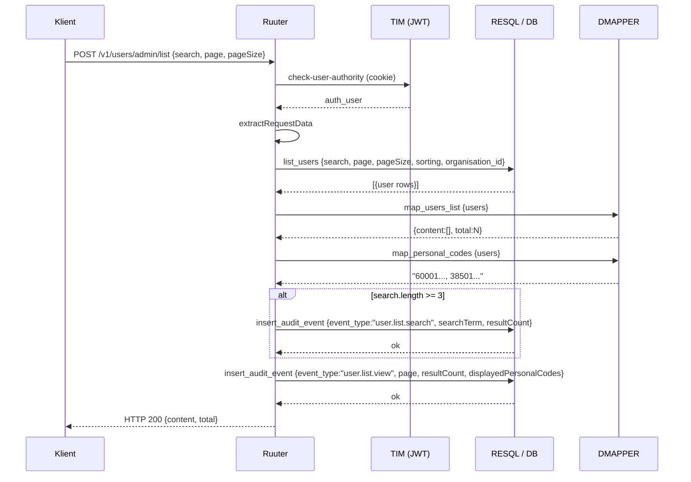
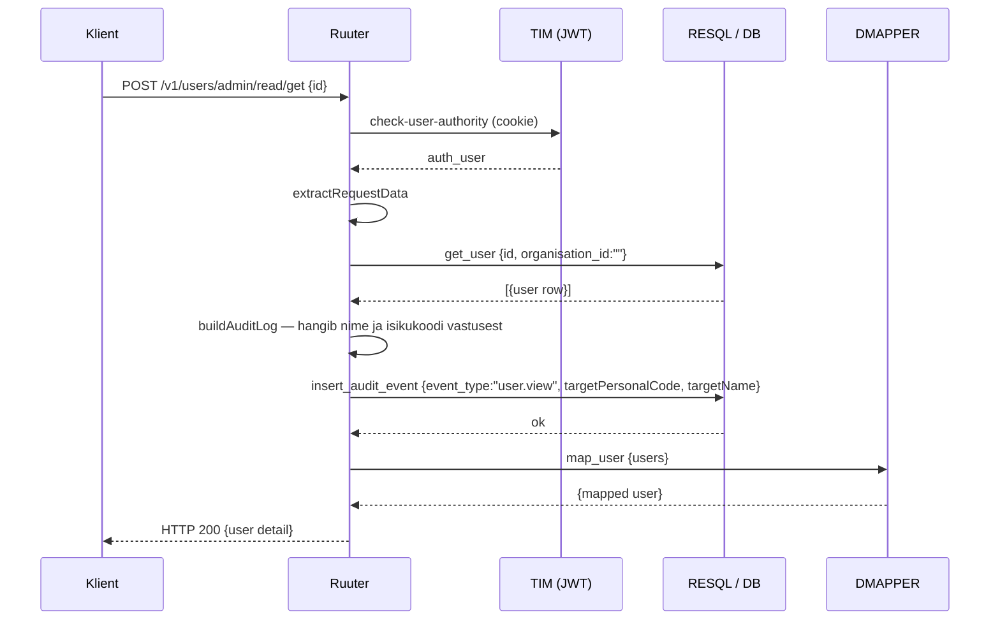
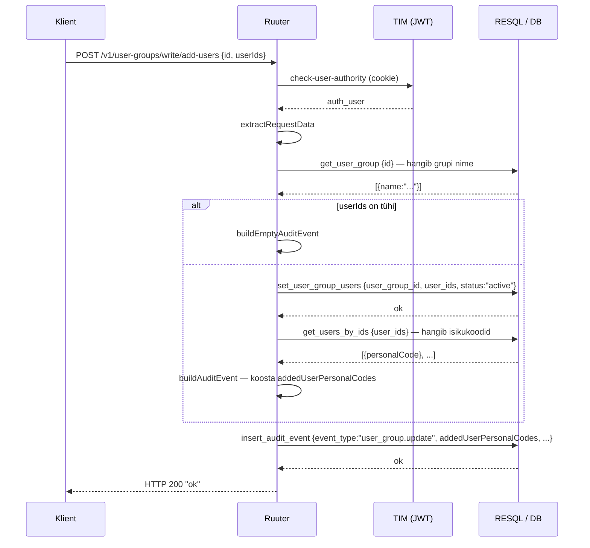

# Audit sündmuste logimine

## Ülevaade

Kõik audit sündmused kirjutatakse `audit.audit_event` tabelisse RESQL kaudu (`POST [LJVIS_RESQL]/log/insert_audit_event`). Tabel on **INSERT-only** — kirjeid ei kustutata ega uuendata.

---

## Logitavad väljad

| Väli | Kirjeldus |
|---|---|
| `event_type` | Toimingu tüüp (vt loend allpool) |
| `event_category` | Valdkond: `user_management`, `user_group_management`, `classifier_management` |
| `actor_name` | Toimingu tegija nimi (hangib JWT-st) |
| `actor_personal_code` | Toimingu tegija isikukood (hangib JWT-st) |
| `description` | Inimloetav eestikeelne kirjeldus |
| `log_content` | JSON-objekt täiendavate andmetega |
| `created_by` | Sama mis `actor_name` |

---

## Sündmuse tüübid ja tingimused

| `event_type` | `event_category` | Millal logitakse |
|---|---|---|
| `user.view` | `user_management` | **Alati** kasutaja detailvaate avamisel |
| `user.list.view` | `user_management` | **Alati** kasutajate nimekirja vaatamisel |
| `user.list.search` | `user_management` | **Ainult** kui `search.length >= 3` |
| `user.create` | `user_management` | **Alati** uue kasutaja loomisel |
| `user.update` | `user_management` | **Alati** kasutajaandmete muutmisel |
| `user.set_groups` | `user_management` | **Alati** grupiliikmesuste salvestamisel (ka tühja muudatuse korral) |
| `user_group.update` | `user_group_management` | **Alati** grupi muutmisel (kasutajad, organisatsioonid, õigused) |
| `classifier.view` | `classifier_management` | **Alati** klassifikaatori detailvaate avamisel |
| `classifier.list.search` | `classifier_management` | **Ainult** kui `search.length >= 3` |
| `classifier_value.update` | `classifier_management` | **Alati** klassifikaatori väärtuse kehtivuse muutmisel |

---

## Logimise töövoog

Iga Ruuter YML järgib sama malli:

```
1. get_user_context    → hangib JWT-st kasutajaandmed
2. Äriloogika          → RESQL päring (INSERT/UPDATE)
3. buildAuditLog       → kirjelduse ja log_content JSON-i koostamine
4. logAuditEvent       → INSERT audit.audit_event (RESQL kaudu)
5. mapResponse         → vastuse teisendus (DMAPPER)
6. returnSuccess       → vastus kliendile
```


> **NB!** Kirjutamisoperatsioonidel logitakse **enne** vastuse tagastamist (samm 4 enne 5).  
> Lugemisoperatsioonidel (list, view) logitakse **pärast** RESQL vastuse saamist, kasutades vastuses olevaid andmeid (nt isikukoodid, nimed).

---

## Tingimuslik logimine

Mõned operatsioonid logitakse ainult teatud tingimusel:

```
search.length >= 3  →  user.list.search      (kasutajate otsing)
search.length >= 3  →  classifier.list.search (klassifikaatorite otsing)
```

Ilma otsinguta nimekirjavaatamine logib `user.list.view`, aga mitte eraldi otsingusündmust.

---

## `log_content` välja struktuur näidete kaupa

**`user.view`**
```json
{
  "targetPersonalCode": "60001017727",
  "targetName": "Kairi Sepp",
  "scope": "allOrganisations",
  "organisationId": null
}
```

**`user.update`** (organisatsiooni muutusega)
```json
{
  "targetPersonalCode": "60001017727",
  "targetName": "Kairi Sepp",
  "changedFields": ["organisation_id", "email"],
  "previousOrganisationId": 1,
  "newOrganisationId": 2,
  "removedGroupIds": [10, 11]
}
```

**`user.set_groups`**
```json
{
  "targetPersonalCode": "60001017727",
  "targetName": "Kairi Sepp",
  "addedGroupIds": [3, 5],
  "removedGroupIds": [1]
}
```

**`user_group.update`** (kasutajate lisamine)
```json
{
  "targetGroupId": 7,
  "changedFields": [],
  "addedOrganisationIds": [],
  "removedOrganisationIds": [],
  "addedPermissionCodes": [],
  "removedPermissionCodes": [],
  "addedUserPersonalCodes": ["60001017727", "38501220002"],
  "removedUserPersonalCodes": [],
  "cascadeRemovedPersonalCodes": []
}
```

**`classifier.view`**
```json
{
  "classifierId": "42",
  "classifierCode": "RTK"
}
```

---

## Andmevoo sequence diagrammid

### Kirjutamisoperatsioon (nt `user.create`, `user.update`)


### Lugemisoperatsioon nimekirjaga (nt `user.list.*`)



### Lugemisoperatsioon detailvaatega (nt `user.view`, `classifier.view`)



### Grupi kasutajate muutmine (nt `user_group.update`)



---

## Viited

- Audit tabeli definitsioon: `DSL/Liquibase/changelog/20260605100000-initial-audit.sql`
- Audit lugemise otspunktid: `DSL/Ruuter/ljvis/POST/v1/logs/read/`
- OpenAPI: `docs/openapi.yaml` — tag `logs`
