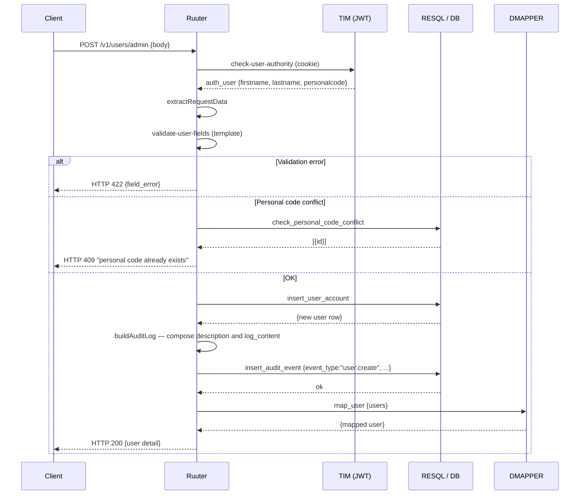
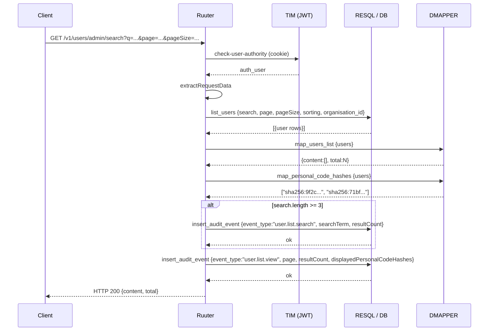
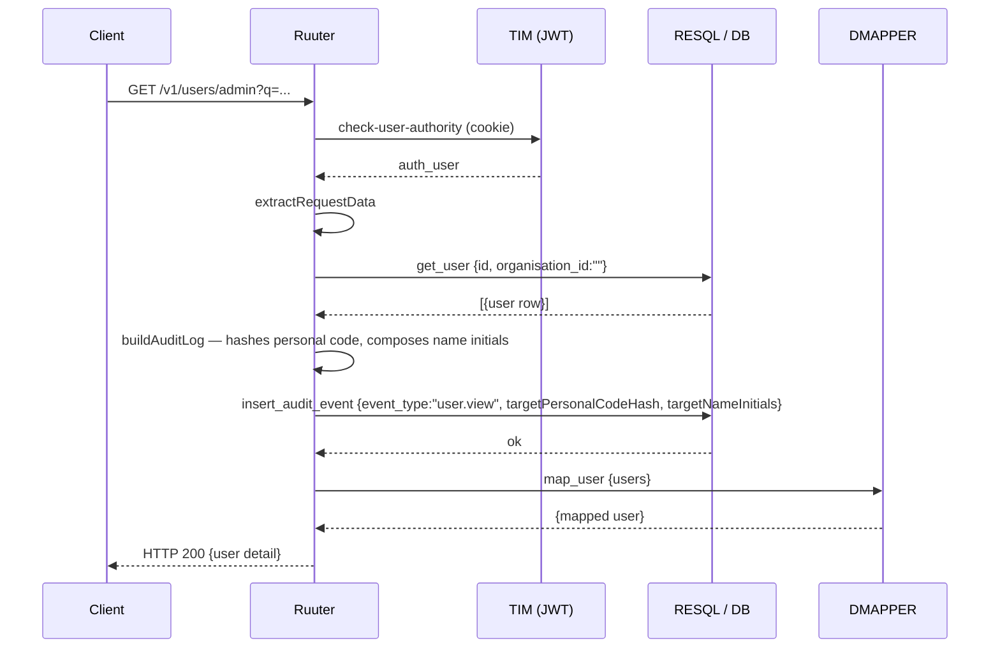
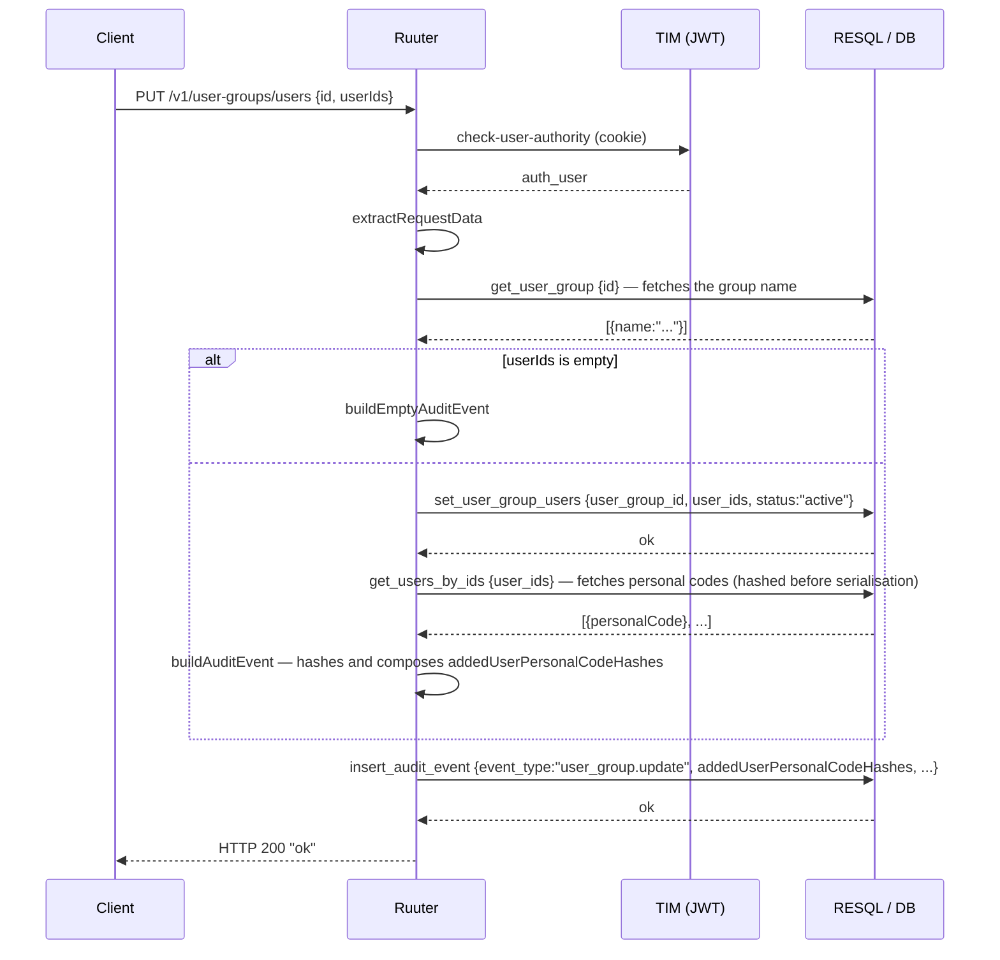

# Audit event logging

## Overview

All audit events are written to the `audit.audit_event` table via RESQL (`POST [LJVIS_RESQL]/log/insert_audit_event`). The table is **INSERT-only** — rows are never deleted or updated.

---

## Logged fields

| Field | Description |
|---|---|
| `event_type` | Action type (see list below) |
| `event_category` | Domain: `user_management`, `user_group_management`, `classifier_management`, `control_form_management` |
| `actor_name` | Actor's name (sourced from JWT) |
| `actor_personal_code_hash` | SHA-256 hash of the actor's personal code, keyed with the audit salt (`sha256(personalCode || audit_salt)`); sourced from JWT. Cleartext personal codes are never stored. |
| `description` | Human-readable Estonian description |
| `log_content` | JSON object with additional data |
| `created_by` | Same as `actor_name` |

---

## Event types and conditions

| `event_type` | `event_category` | When logged |
|---|---|---|
| `user.view` | `user_management` | **Always** when opening a user's detail view |
| `user.list.view` | `user_management` | **Always** when viewing the user list |
| `user.list.search` | `user_management` | **Only** when `search.length >= 3` |
| `user.create` | `user_management` | **Always** when creating a new user |
| `user.update` | `user_management` | **Always** when updating user data |
| `user.set_groups` | `user_management` | **Always** when saving group memberships (even an empty change) |
| `user_group.update` | `user_group_management` | **Always** when updating a group (users, organisations, permissions) |
| `classifier.view` | `classifier_management` | **Always** when opening a classifier's detail view |
| `classifier.list.search` | `classifier_management` | **Only** when `search.length >= 3` |
| `classifier_value.update` | `classifier_management` | **Always** when changing a classifier value's validity |
| `control_form.foreign_violation.create` | `control_form_management` | **Always** when creating a new foreign violation form (first save) |
| `control_form.foreign_violation.update` | `control_form_management` | **Only** when at least one field changed (compared to the previous snapshot) |
| `control_form.foreign_violation.view` | `control_form_management` | **Only** when the viewer differs from the form's creator |
| `authz.denied` | matching resource | **Always** when `.guard` or an endpoint denies access due to a missing permission (403). `log_content.requiredPermission`, `log_content.endpoint`. |
| `authz.scope_violation` | matching resource | **Always** when a local-scope user attempts to access a resource in a different organisation. `log_content.attemptedOrganisationId`, `log_content.actorOrganisationId`. |
| `input.rate_limited` | matching resource | **Always** when a request is rejected due to a rate-limit violation (429). `log_content.limitBucket`, `log_content.retryAfterSeconds`. |

---

## Logging workflow

Every Ruuter YML follows the same template:

```
1. get_user_context    → sources user data from JWT
2. Business logic      → RESQL query (INSERT/UPDATE)
3. buildAuditLog       → composes description and log_content JSON
4. logAuditEvent       → INSERT audit.audit_event (via RESQL)
5. mapResponse         → response transform (DMAPPER)
6. returnSuccess       → response to client
```


> **NB!** On write operations the event is logged **before** the response is returned (step 4 before 5).
> On read operations (list, view) the event is logged **after** the RESQL response arrives. Personal codes are hashed with `sha256(personalCode || audit_salt)` in the `buildAuditLog` step before the `insert_audit_event` call — cleartext personal codes never reach the `audit.audit_event` table (see `logging-spec.md` §6 and item 19).

---

## Conditional logging

Some operations are logged only under certain conditions:

```
search.length >= 3  →  user.list.search      (user search)
search.length >= 3  →  classifier.list.search (classifier search)
```

Without a search, a list view logs `user.list.view` but no separate search event.

---

## `log_content` field structure by example

**`user.view`**
```json
{
  "targetPersonalCodeHash": "sha256:9f2c4b8e…d1a0",
  "targetNameInitials": "K.S.",
  "scope": "allOrganisations",
  "organisationId": null
}
```

**`user.update`** (with organisation change)
```json
{
  "targetPersonalCodeHash": "sha256:9f2c4b8e…d1a0",
  "targetNameInitials": "K.S.",
  "changedFields": ["organisation_id", "email"],
  "previousOrganisationId": 1,
  "newOrganisationId": 2,
  "removedGroupIds": [10, 11]
}
```

**`user.set_groups`**
```json
{
  "targetPersonalCodeHash": "sha256:9f2c4b8e…d1a0",
  "targetNameInitials": "K.S.",
  "addedGroupIds": [3, 5],
  "removedGroupIds": [1]
}
```

**`user_group.update`** (adding users)
```json
{
  "targetGroupId": 7,
  "changedFields": [],
  "addedOrganisationIds": [],
  "removedOrganisationIds": [],
  "addedPermissionCodes": [],
  "removedPermissionCodes": [],
  "addedUserPersonalCodeHashes": ["sha256:9f2c4b8e…d1a0", "sha256:71bfa03e…af12"],
  "removedUserPersonalCodeHashes": [],
  "cascadeRemovedPersonalCodeHashes": []
}
```

**`classifier.view`**
```json
{
  "classifierId": "42",
  "classifierCode": "RTK"
}
```

**`control_form.foreign_violation.create`**
```json
{
  "formKey": "vr-2026-00001/V"
}
```

**`control_form.foreign_violation.update`**
```json
{
  "formKey": "vr-2026-00001/V",
  "changedFields": ["reporting_country_code", "sanction_code"]
}
```

**`control_form.foreign_violation.view`**
```json
{
  "formKey": "vr-2026-00001/V"
}
```

---

## Data flow sequence diagrams

### Write operation (e.g. `user.create`, `user.update`)



### Read operation with a list (e.g. `user.list.*`)



### Read operation with a detail view (e.g. `user.view`, `classifier.view`)



### Updating a group's users (e.g. `user_group.update`)



---

## References

- Audit table definition: `DSL/Liquibase/changelog/20260605100000-initial-audit.sql`
- Audit read endpoints: `DSL/Ruuter/ljvis/GET/v1/logs/`
- OpenAPI: `docs/openapi.yaml` — tags `logs`, `foreign-violation-forms`
