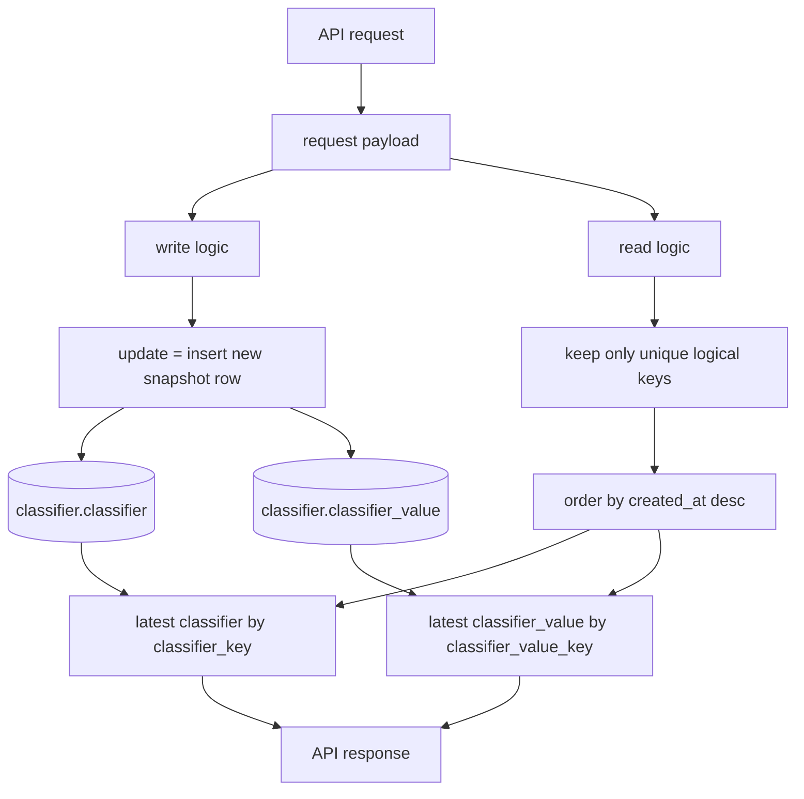

# Klassifikaatorite denormaliseeritud mudeli näidispäringud

See dokument näitab, kuidas teha päringuid **ainult uue Liquibase snapshot-mudeli** järgi.

Fookus on kolmel teemal:

- klassifikaatori nime muutmine
- klassifikaatori väärtuse lisamine klassifikaatori alla
- lugemise ja kirjutamise loogiline skeem

## Mudeli lühireegel

Uues mudelis:

- `UPDATE` ei muuda olemasolevat rida
- iga muudatus tähendab **uut `INSERT`-i**
- kehtiv seis leitakse alati põhimõttel:
  - **unikaalne loogiline võti**
  - **viimane rida `created_at` järgi**

Klassifikaatorite puhul on loogilised võtmed:

- `classifier.classifier.classifier_key`
- `classifier.classifier_value.classifier_value_key`

## 1. Klassifikaatori nime muutmine

Näide: muuta klassifikaatori nimi `riik` -> `Riigid`.

Eeldus:

- klassifikaatori ärikood on näiteks `RIIK`
- nimi muutub, aga `classifier_key` ja `code` jäävad samaks
- muudatus tehakse uue rea lisamisega tabelisse `classifier.classifier`

### Näidispäring

```sql
WITH latest_classifier AS (
    SELECT DISTINCT ON (classifier_key)
        classifier_key,
        code,
        name,
        description
    FROM classifier.classifier
    WHERE code = 'RIIK'
    ORDER BY classifier_key, created_at DESC
)
INSERT INTO classifier.classifier (
    classifier_key,
    code,
    name,
    description,
    created_by
)
SELECT
    classifier_key,
    code,
    'Riigid',
    description,
    '60001019906'
FROM latest_classifier;
```

### Mida see teeb

- leiab klassifikaatori viimase snapshoti
- võtab sealt sama `classifier_key` ja `code`
- muudab ainult `name` välja
- lisab uue rea
- vana rida jääb ajalukku alles

## 2. Klassifikaatori väärtuse lisamine klassifikaatori alla

Näide: lisada klassifikaatori `RIIK` alla uus väärtus `Torgu kuningriik`.

Eeldus:

- klassifikaatori ärikood on `RIIK`
- uue väärtuse kood on näiteks `TORGU_KUNINGRIIK`
- uuele väärtusele tekib uus loogiline võti `classifier_value_key`

### Näidispäring

```sql
WITH latest_classifier AS (
    SELECT DISTINCT ON (classifier_key)
        classifier_key,
        code,
        name
    FROM classifier.classifier
    WHERE code = 'RIIK'
    ORDER BY classifier_key, created_at DESC
)
INSERT INTO classifier.classifier_value (
    classifier_value_key,
    classifier_key,
    code,
    name,
    valid_from,
    valid_until,
    created_by
)
SELECT
    nextval('classifier.seq_classifier_value_key'),
    classifier_key,
    'TORGU_KUNINGRIIK',
    'Torgu kuningriik',
    CURRENT_DATE,
    NULL,
    '60001019906'
FROM latest_classifier;
```

### Mida see teeb

- leiab klassifikaatori `RIIK` viimase snapshoti
- võtab sealt `classifier_key` väärtuse
- loob uue klassifikaatori väärtuse
- annab sellele uue `classifier_value_key`
- lisab uue rea tabelisse `classifier.classifier_value`

## 3. Baasipäringute loogiline skeem

Allolev skeem näitab põhimõtet:

- sisend tuleb API kaudu
- kirjutamisel tehakse alati `INSERT`
- lugemisel võetakse alati viimased read `created_at` järgi
- tulemus peab olema unikaalne loogilise võtme järgi



## 4. Näidis lugemispäringud

### 4.1. Kõigi klassifikaatorite viimane seis

```sql
SELECT DISTINCT ON (classifier_key)
    id,
    classifier_key,
    code,
    name,
    description,
    created_at,
    created_by
FROM classifier.classifier
ORDER BY classifier_key, created_at DESC;
```

### 4.2. Ühe klassifikaatori viimane seis koodi järgi

```sql
SELECT DISTINCT ON (classifier_key)
    id,
    classifier_key,
    code,
    name,
    description,
    created_at,
    created_by
FROM classifier.classifier
WHERE code = 'RIIK'
ORDER BY classifier_key, created_at DESC;
```

### 4.3. Ühe klassifikaatori kõik viimased väärtused

```sql
WITH latest_classifier AS (
    SELECT DISTINCT ON (classifier_key)
        classifier_key,
        code
    FROM classifier.classifier
    WHERE code = 'RIIK'
    ORDER BY classifier_key, created_at DESC
)
SELECT DISTINCT ON (cv.classifier_value_key)
    cv.id,
    cv.classifier_value_key,
    cv.classifier_key,
    cv.code,
    cv.name,
    cv.valid_from,
    cv.valid_until,
    cv.created_at,
    cv.created_by
FROM classifier.classifier_value cv
JOIN latest_classifier lc
    ON lc.classifier_key = cv.classifier_key
ORDER BY cv.classifier_value_key, cv.created_at DESC;
```

## 5. Loogika kokkuvõte

### Kirjutamine

- API saadab sisendi
- teenus leiab vajadusel viimase snapshoti
- muudab vajalikud väljad mälus / päringu sees
- teeb uue `INSERT`-i
- olemasolevaid ridu ei muudeta

### Lugemine

- andmeid ei loeta lihtsalt kõigi ridade hulgast
- esmalt grupeeritakse loogilise võtme järgi
- seejärel võetakse iga võtme kohta **viimane rida `created_at` järgi**
- tulemuses huvitavad ainult **unikaalsed hetkel kehtivad snapshotid**

## 6. Põhireegel ühe lausega

Selles mudelis tähendab **muutmine = uus `INSERT`**, ning **lugemine = `DISTINCT ON (logical_key)` + `ORDER BY created_at DESC`**.
