# LJVIS 2 — Client Data Model

## 1. Introduction

This document describes the LJVIS 2 data model — what data the system stores and how it is related.

## 2. ER Diagram

```mermaid
erDiagram
    %% EPIC_02 BEGIN
    organisation {
        BIGSERIAL id PK
        VARCHAR(500) name
        VARCHAR(50) code
        TIMESTAMPTZ created_at
        VARCHAR(100) created_by
    }
    user_account {
        BIGSERIAL id PK
        VARCHAR(20) personal_code
        TIMESTAMPTZ created_at
        VARCHAR(100) created_by
    }
    user_account_data_state {
        BIGSERIAL id PK
        BIGINT user_account_id FK
        VARCHAR(200) first_name
        VARCHAR(200) last_name
        BIGINT organisation_id FK
        VARCHAR(320) email
        VARCHAR(50) phone
        VARCHAR(100) structural_unit
        VARCHAR(100) job_title
        DATE access_start
        DATE access_end
        TIMESTAMPTZ created_at
        VARCHAR(100) created_by
    }
    user_account_state {
        BIGSERIAL id PK
        BIGINT user_account_id FK
        VARCHAR(50) status
        TIMESTAMPTZ created_at
        VARCHAR(100) created_by
    }
    user_group {
        BIGSERIAL id PK
        TIMESTAMPTZ created_at
        VARCHAR(100) created_by
    }
    user_group_name_state {
        BIGSERIAL id PK
        BIGINT user_group_id FK
        VARCHAR(50) name
        TIMESTAMPTZ created_at
        VARCHAR(100) created_by
    }
    permission {
        BIGSERIAL id PK
        VARCHAR(100) code
        VARCHAR(500) description
        TIMESTAMPTZ created_at
        VARCHAR(100) created_by
    }
    user_account_user_group {
        BIGSERIAL id PK
        BIGINT user_account_id FK
        BIGINT user_group_id FK
        TIMESTAMPTZ created_at
        VARCHAR(100) created_by
    }
    user_account_user_group_state {
        BIGSERIAL id PK
        BIGINT user_account_user_group_id FK
        VARCHAR(50) status
        TIMESTAMPTZ created_at
        VARCHAR(100) created_by
    }
    user_group_organisation {
        BIGSERIAL id PK
        BIGINT user_group_id FK
        BIGINT organisation_id FK
        TIMESTAMPTZ created_at
        VARCHAR(100) created_by
    }
    user_group_organisation_state {
        BIGSERIAL id PK
        BIGINT user_group_organisation_id FK
        VARCHAR(50) status
        TIMESTAMPTZ created_at
        VARCHAR(100) created_by
    }
    user_group_permission {
        BIGSERIAL id PK
        BIGINT user_group_id FK
        BIGINT permission_id FK
        TIMESTAMPTZ created_at
        VARCHAR(100) created_by
    }
    user_group_permission_state {
        BIGSERIAL id PK
        BIGINT user_group_permission_id FK
        VARCHAR(50) status
        TIMESTAMPTZ created_at
        VARCHAR(100) created_by
    }
    user_account_latest {
        BIGSERIAL id PK
        BIGINT user_account_id FK
        VARCHAR(20) personal_code
        VARCHAR(200) first_name
        VARCHAR(200) last_name
        VARCHAR(320) email
        VARCHAR(50) phone
        VARCHAR(100) structural_unit
        VARCHAR(100) job_title
        BIGINT organisation_id
        VARCHAR(500) organisation_name
        DATE access_start
        DATE access_end
        VARCHAR(50) status
        JSONB user_groups
        TIMESTAMPTZ created_at
        VARCHAR(100) created_by
    }
    user_group_latest {
        BIGSERIAL id PK
        BIGINT user_group_id FK
        VARCHAR(50) name
        JSONB organisations
        BOOLEAN covers_all_organisations
        JSONB permissions
        TIMESTAMPTZ created_at
        VARCHAR(100) created_by
    }
    %% EPIC_02 END

    %% EPIC_04 BEGIN
    classifier {
        BIGSERIAL id PK
        VARCHAR(50) code
        TIMESTAMPTZ created_at
        BIGINT created_by FK
    }
    classifier_name_state {
        BIGSERIAL id PK
        BIGINT classifier_id FK
        VARCHAR(100) name
        VARCHAR(250) description
        TIMESTAMPTZ created_at
        BIGINT created_by FK
    }
    classifier_value {
        BIGSERIAL id PK
        BIGINT classifier_id FK
        VARCHAR(100) code
        VARCHAR(500) name
        TIMESTAMPTZ created_at
        BIGINT created_by FK
    }
    classifier_value_validity_state {
        BIGSERIAL id PK
        BIGINT classifier_value_id FK
        DATE valid_from
        DATE valid_until
        TIMESTAMPTZ created_at
        BIGINT created_by FK
    }
    classifier_latest {
        BIGSERIAL id PK
        BIGINT classifier_id FK
        VARCHAR(50) code
        VARCHAR(100) name
        VARCHAR(250) description
        TIMESTAMPTZ created_at
        BIGINT created_by FK
    }
    classifier_value_latest {
        BIGSERIAL id PK
        BIGINT classifier_value_id FK
        BIGINT classifier_id FK
        VARCHAR(50) classifier_code
        VARCHAR(100) code
        VARCHAR(500) name
        DATE valid_from
        DATE valid_until
        BOOLEAN is_valid
        TIMESTAMPTZ created_at
        BIGINT created_by FK
    }
    %% EPIC_04 END

    %% RELATIONS EPIC_02 BEGIN
    organisation ||--o{ user_account : "employs"
    organisation ||--o{ user_group_organisation : "linked to groups"
    user_account ||--o{ user_account_data_state : "has data history"
    user_account ||--o{ user_account_state : "has states"
    user_account ||--o{ user_account_user_group : "member of groups"
    organisation ||--o{ user_account_data_state : "referenced by snapshots"
    user_group ||--o{ user_account_user_group : "has members"
    user_group ||--o{ user_group_organisation : "linked to organisations"
    user_group ||--o{ user_group_permission : "has permissions"
    user_group ||--o{ user_group_name_state : "has name history"
    user_account_user_group ||--o{ user_account_user_group_state : "has states"
    user_group_organisation ||--o{ user_group_organisation_state : "has states"
    user_group_permission ||--o{ user_group_permission_state : "has states"
    permission ||--o{ user_group_permission : "granted to groups"
    user_account ||--o{ user_account_latest : "has latest snapshots"
    user_group ||--o{ user_group_latest : "has latest snapshots"
    %% RELATIONS EPIC_02 END

    %% RELATIONS EPIC_04 BEGIN
    classifier ||--o{ classifier_name_state : "has name versions"
    classifier ||--o{ classifier_value : "has values"
    classifier_value ||--o{ classifier_value_validity_state : "has validity states"
    classifier ||--o{ classifier_latest : "has latest snapshots"
    classifier_value ||--o{ classifier_value_latest : "has latest snapshots"
    %% RELATIONS EPIC_04 END
```



## 3. Database Tables

<!-- EPIC_02 BEGIN -->

**`organisation`**

| Column | Type | Mandatory | Primary key |
|---|---|---|---|
| `id` | BIGSERIAL | Yes | Yes |
| `name` | VARCHAR(500) | Yes |  |
| `code` | VARCHAR(50) | Yes |  |
| `created_at` | TIMESTAMPTZ | Yes |  |
| `created_by` | VARCHAR(100) | Yes |  |

**`user_account`**

| Column | Type | Mandatory | Primary key |
|---|---|---|---|
| `id` | BIGSERIAL | Yes | Yes |
| `personal_code` | VARCHAR(20) | Yes |  |
| `created_at` | TIMESTAMPTZ | Yes |  |
| `created_by` | VARCHAR(100) | Yes |  |

**`user_account_data_state`**

| Column | Type | Mandatory | Primary key |
|---|---|---|---|
| `id` | BIGSERIAL | Yes | Yes |
| `user_account_id` | BIGINT | Yes |  |
| `first_name` | VARCHAR(200) | Yes |  |
| `last_name` | VARCHAR(200) | Yes |  |
| `organisation_id` | BIGINT | Yes |  |
| `email` | VARCHAR(320) | Yes |  |
| `phone` | VARCHAR(50) | No |  |
| `structural_unit` | VARCHAR(100) | Yes |  |
| `job_title` | VARCHAR(100) | Yes |  |
| `access_start` | DATE | Yes |  |
| `access_end` | DATE | No |  |
| `created_at` | TIMESTAMPTZ | Yes |  |
| `created_by` | VARCHAR(100) | Yes |  |

**`user_account_state`**

| Column | Type | Mandatory | Primary key |
|---|---|---|---|
| `id` | BIGSERIAL | Yes | Yes |
| `user_account_id` | BIGINT | Yes |  |
| `status` | VARCHAR(50) | Yes |  |
| `created_at` | TIMESTAMPTZ | Yes |  |
| `created_by` | VARCHAR(100) | Yes |  |

**`user_group`**

| Column | Type | Mandatory | Primary key |
|---|---|---|---|
| `id` | BIGSERIAL | Yes | Yes |
| `created_at` | TIMESTAMPTZ | Yes |  |
| `created_by` | VARCHAR(100) | Yes |  |

**`user_group_name_state`**

| Column | Type | Mandatory | Primary key |
|---|---|---|---|
| `id` | BIGSERIAL | Yes | Yes |
| `user_group_id` | BIGINT | Yes |  |
| `name` | VARCHAR(50) | Yes |  |
| `created_at` | TIMESTAMPTZ | Yes |  |
| `created_by` | VARCHAR(100) | Yes |  |

**`permission`**

| Column | Type | Mandatory | Primary key |
|---|---|---|---|
| `id` | BIGSERIAL | Yes | Yes |
| `code` | VARCHAR(100) | Yes |  |
| `description` | VARCHAR(500) | Yes |  |
| `created_at` | TIMESTAMPTZ | Yes |  |
| `created_by` | VARCHAR(100) | Yes |  |

**`user_account_user_group`**

| Column | Type | Mandatory | Primary key |
|---|---|---|---|
| `id` | BIGSERIAL | Yes | Yes |
| `user_account_id` | BIGINT | Yes |  |
| `user_group_id` | BIGINT | Yes |  |
| `created_at` | TIMESTAMPTZ | Yes |  |
| `created_by` | VARCHAR(100) | Yes |  |

**`user_account_user_group_state`**

| Column | Type | Mandatory | Primary key |
|---|---|---|---|
| `id` | BIGSERIAL | Yes | Yes |
| `user_account_user_group_id` | BIGINT | Yes |  |
| `status` | VARCHAR(50) | Yes |  |
| `created_at` | TIMESTAMPTZ | Yes |  |
| `created_by` | VARCHAR(100) | Yes |  |

**`user_group_organisation`**

| Column | Type | Mandatory | Primary key |
|---|---|---|---|
| `id` | BIGSERIAL | Yes | Yes |
| `user_group_id` | BIGINT | Yes |  |
| `organisation_id` | BIGINT | Yes |  |
| `created_at` | TIMESTAMPTZ | Yes |  |
| `created_by` | VARCHAR(100) | Yes |  |

**`user_group_organisation_state`**

| Column | Type | Mandatory | Primary key |
|---|---|---|---|
| `id` | BIGSERIAL | Yes | Yes |
| `user_group_organisation_id` | BIGINT | Yes |  |
| `status` | VARCHAR(50) | Yes |  |
| `created_at` | TIMESTAMPTZ | Yes |  |
| `created_by` | VARCHAR(100) | Yes |  |

**`user_group_permission`**

| Column | Type | Mandatory | Primary key |
|---|---|---|---|
| `id` | BIGSERIAL | Yes | Yes |
| `user_group_id` | BIGINT | Yes |  |
| `permission_id` | BIGINT | Yes |  |
| `created_at` | TIMESTAMPTZ | Yes |  |
| `created_by` | VARCHAR(100) | Yes |  |

**`user_group_permission_state`**

| Column | Type | Mandatory | Primary key |
|---|---|---|---|
| `id` | BIGSERIAL | Yes | Yes |
| `user_group_permission_id` | BIGINT | Yes |  |
| `status` | VARCHAR(50) | Yes |  |
| `created_at` | TIMESTAMPTZ | Yes |  |
| `created_by` | VARCHAR(100) | Yes |  |

**`user_account_latest`**

| Column | Type | Mandatory | Primary key |
|---|---|---|---|
| `id` | BIGSERIAL | Yes | Yes |
| `user_account_id` | BIGINT | Yes |  |
| `personal_code` | VARCHAR(20) | Yes |  |
| `first_name` | VARCHAR(200) | Yes |  |
| `last_name` | VARCHAR(200) | Yes |  |
| `email` | VARCHAR(320) | Yes |  |
| `phone` | VARCHAR(50) | No |  |
| `structural_unit` | VARCHAR(100) | Yes |  |
| `job_title` | VARCHAR(100) | Yes |  |
| `organisation_id` | BIGINT | Yes |  |
| `organisation_name` | VARCHAR(500) | Yes |  |
| `access_start` | DATE | Yes |  |
| `access_end` | DATE | No |  |
| `status` | VARCHAR(50) | Yes |  |
| `user_groups` | JSONB | Yes |  |
| `created_at` | TIMESTAMPTZ | Yes |  |
| `created_by` | VARCHAR(100) | Yes |  |

**`user_group_latest`**

| Column | Type | Mandatory | Primary key |
|---|---|---|---|
| `id` | BIGSERIAL | Yes | Yes |
| `user_group_id` | BIGINT | Yes |  |
| `name` | VARCHAR(50) | Yes |  |
| `organisations` | JSONB | Yes |  |
| `covers_all_organisations` | BOOLEAN | Yes |  |
| `permissions` | JSONB | Yes |  |
| `created_at` | TIMESTAMPTZ | Yes |  |
| `created_by` | VARCHAR(100) | Yes |  |

<!-- EPIC_02 END -->

<!-- EPIC_04 BEGIN -->

**`classifier`**

| Column | Type | Mandatory | Primary key |
|---|---|---|---|
| `id` | BIGSERIAL | Yes | Yes |
| `code` | VARCHAR(50) | Yes |  |
| `created_at` | TIMESTAMPTZ | Yes |  |
| `created_by` | BIGINT | Yes |  |

**`classifier_name_state`**

| Column | Type | Mandatory | Primary key |
|---|---|---|---|
| `id` | BIGSERIAL | Yes | Yes |
| `classifier_id` | BIGINT | Yes |  |
| `name` | VARCHAR(100) | Yes |  |
| `description` | VARCHAR(250) | No |  |
| `created_at` | TIMESTAMPTZ | Yes |  |
| `created_by` | BIGINT | Yes |  |

**`classifier_value`**

| Column | Type | Mandatory | Primary key |
|---|---|---|---|
| `id` | BIGSERIAL | Yes | Yes |
| `classifier_id` | BIGINT | Yes |  |
| `code` | VARCHAR(100) | Yes |  |
| `name` | VARCHAR(500) | Yes |  |
| `created_at` | TIMESTAMPTZ | Yes |  |
| `created_by` | BIGINT | Yes |  |

**`classifier_value_validity_state`**

| Column | Type | Mandatory | Primary key |
|---|---|---|---|
| `id` | BIGSERIAL | Yes | Yes |
| `classifier_value_id` | BIGINT | Yes |  |
| `valid_from` | DATE | Yes |  |
| `valid_until` | DATE | No |  |
| `created_at` | TIMESTAMPTZ | Yes |  |
| `created_by` | BIGINT | Yes |  |

**`classifier_latest`**

| Column | Type | Mandatory | Primary key |
|---|---|---|---|
| `id` | BIGSERIAL | Yes | Yes |
| `classifier_id` | BIGINT | Yes |  |
| `code` | VARCHAR(50) | Yes |  |
| `name` | VARCHAR(100) | Yes |  |
| `description` | VARCHAR(250) | No |  |
| `created_at` | TIMESTAMPTZ | Yes |  |
| `created_by` | BIGINT | Yes |  |

**`classifier_value_latest`**

| Column | Type | Mandatory | Primary key |
|---|---|---|---|
| `id` | BIGSERIAL | Yes | Yes |
| `classifier_value_id` | BIGINT | Yes |  |
| `classifier_id` | BIGINT | Yes |  |
| `classifier_code` | VARCHAR(50) | Yes |  |
| `code` | VARCHAR(100) | Yes |  |
| `name` | VARCHAR(500) | Yes |  |
| `valid_from` | DATE | Yes |  |
| `valid_until` | DATE | No |  |
| `is_valid` | BOOLEAN | Yes |  |
| `created_at` | TIMESTAMPTZ | Yes |  |
| `created_by` | BIGINT | Yes |  |

<!-- EPIC_04 END -->

## 4. Table Business Descriptions

<!-- EPIC_02 BEGIN -->
| Table | Business description |
|-------|----------------------|
| `organisation` | Organisations (agencies) that users belong to; fixed list, not managed via the application UI. |
| `user_account` | Immutable identity row for user accounts; mutable fields live in `user_account_data_state`. |
| `user_account_data_state` | Attribute-history snapshot of mutable user fields (name, organisation, structural unit, job title, contact, access period); latest row gives current values. |
| `user_account_state` | State tracking for user accounts (“Aktiivne”, “Deaktiveerimisel”, “Mitteaktiivne”); each state change is a new row. |
| `user_group` | Named user groups that bundle permissions; groups are never removed. Identity row only — name is tracked in `user_group_name_state`. |
| `user_group_name_state` | Name history for user groups; latest row gives the current name. |
| `permission` | Fixed catalogue of system permissions (menu items and functions). |
| `user_account_user_group` | Many-to-many link between users and groups. |
| `user_account_user_group_state` | State tracking for user–group membership; each change is a new row. |
| `user_group_organisation` | Many-to-many link between groups and organisations. |
| `user_group_organisation_state` | State tracking for group–organisation membership; each change is a new row. |
| `user_group_permission` | Many-to-many link between groups and permissions. |
| `user_group_permission_state` | State tracking for group–permission membership; each change is a new row. |
| `user_account_latest` | Denormalized snapshot of current user state for read views; latest row per user gives fully assembled data without sub-queries. |
| `user_group_latest` | Denormalized snapshot of current group state for read views; latest row per group gives fully assembled data without sub-queries. <!-- EPIC_02 END --><!-- EPIC_04 BEGIN -->|
| `classifier` | Classifier header with the immutable business code; the code is the stable identifier used by all other epics. Name and description are versioned in a separate state table. |
| `classifier_name_state` | Version history of a classifier’s name and description; current values are determined by the latest row. |
| `classifier_value` | A single value belonging to a classifier (e.g. “EE — Eesti”); carries the value’s immutable code and name. |
| `classifier_value_validity_state` | State history of a value’s validity period; a value is currently valid when the latest state has `valid_from ≤ today` and no end date or end date in the future. Validity changes (ending, extending, re-opening) are appended as new state rows. |
| `classifier_latest` | Denormalized snapshot of current classifier state for read views; latest row per classifier gives fully assembled data without sub-queries. |
| `classifier_value_latest` | Denormalized snapshot of current classifier value state for read views; latest row per value gives fully assembled data without sub-queries. |
<!-- EPIC_04 END -->

## 5. Key Relationships and Business Terms

<!-- EPIC_02 BEGIN -->

**Users and organisations.** Each user belongs to exactly one organisation. `user_account` is an immutable identity row (`id`, `personal_code`) whose mutable data (including `organisation_id`) lives in `user_account_data_state` — every data change is stored as a new snapshot row and the latest row gives the current values. The relationship between `user_account_data_state` and `organisation` is therefore 1:N (an organisation may have many users, but a user always has exactly one organisation). User account state changes (“Aktiivne”, “Deaktiveerimisel”, “Mitteaktiivne”) are tracked separately in `user_account_state`, where each state change is its own row and the latest row shows the user’s current state.

**Users and user groups.** Users and user groups have a many-to-many (M:N) relationship: the same user may belong to multiple groups and the same group may contain multiple users. The link is maintained in `user_account_user_group`, with membership state changes (addition and removal) collected in `user_account_user_group_state`.

**User groups and organisations.** User groups also have a many-to-many (M:N) relationship with organisations — the link determines which organisations’ users a particular group can cover. The link is stored in `user_group_organisation`, with state changes in `user_group_organisation_state`. When a group is intended to cover all organisations, links to every catalogue organisation are created at creation time (snapshot). A derived flag `coversAllOrganisations` is computed at read time (`true` when the count of active `user_group_organisation` rows equals the `organisation` catalogue size) — it is not stored as a separate DB column.

**User groups and permissions.** User groups bundle permissions: the same many-to-many (M:N) pattern applies between `user_group` and `permission` — a group may have multiple permissions and the same permission may belong to multiple groups. The link is stored in `user_group_permission`, with state changes in `user_group_permission_state`.

**User group naming.** A group’s name may change over time. Each name change is stored as a new row in `user_group_name_state` (append only), so the current name is always the latest row and all previous names remain as historical data. The `user_group` table itself does not change after creation.

**State history.** For every membership, link, and user account, change history is maintained in the corresponding state table (`*_state`), so the system retains a complete record of who changed a membership, permission assignment, or user state and when. Previous rows are never deleted or modified — a new change is always a new row.

**Latest snapshots.** `user_account_latest` and `user_group_latest` provide denormalized read-optimised views of the current user and group state respectively, assembling data from multiple tables into a single row per entity for fast retrieval without sub-queries.

<!-- EPIC_02 END -->

<!-- EPIC_04 BEGIN -->

**Classifiers and values.** Each `classifier` represents a controlled list (e.g. the country/territory classifier “RTK”). The classifier’s human-readable name and description are versioned in `classifier_name_state` (latest row wins), while the classifier’s immutable business code stays on the header table. Each classifier owns zero or more `classifier_value` entries — these carry the value’s immutable code and name.

**Value validity.** Each `classifier_value` has its validity period tracked in `classifier_value_validity_state` (1:N). A value is considered currently valid when the latest state row has `valid_from ≤ today` and no end date or an end date in the future. Validity changes — including ending, extending, and re-opening — are appended as new state rows. Ending a value sets `valid_until` to a user-chosen date; re-opening sets `valid_until` to NULL or a future date. Previous rows remain intact.

**Latest snapshots.** `classifier_latest` and `classifier_value_latest` provide denormalized read-optimised views of the current classifier and value state respectively, assembling data from multiple tables into a single row per entity for fast retrieval without sub-queries.

**Cross-epic reference.** All tables in this epic reference `user_account(id)` from EPIC 02 via the `created_by` column, tracking which internal user performed the action.

<!-- EPIC_04 END -->

## 6. DDL Script

Below is the SQL script that creates the database tables described above.

```sql
-- EPIC_02 BEGIN
-- ============================================================
-- EPIC 02 — Kasutajate haldamine — DDL
-- Database: PostgreSQL
-- Pattern: INSERT-only (no UPDATE / DELETE / JOIN)
-- ============================================================

-- 1. organisation
CREATE TABLE organisation (
    id              BIGSERIAL       NOT NULL,
    name            VARCHAR(500)    NOT NULL,
    code            VARCHAR(50)     NOT NULL,
    created_at      TIMESTAMPTZ     NOT NULL DEFAULT now(),
    created_by      VARCHAR(100)    NOT NULL,
    CONSTRAINT pk_organisation PRIMARY KEY (id),
    CONSTRAINT uq_organisation_code UNIQUE (code)
);

COMMENT ON TABLE  organisation IS 'Organisations (agencies) registered in the system';
COMMENT ON COLUMN organisation.id IS 'Primary key';
COMMENT ON COLUMN organisation.name IS 'Official name of the organisation';
COMMENT ON COLUMN organisation.code IS 'Unique registry code of the organisation';
COMMENT ON COLUMN organisation.created_at IS 'Row creation timestamp';
COMMENT ON COLUMN organisation.created_by IS 'User or process that created the row';

CREATE INDEX idx_organisation_name ON organisation (name);

-- NOTE: organisation has no state table. Organisations are a fixed list, not manageable
-- via the application UI; new organisations are added at development time based on a
-- request to Kliimaministeerium (confirmed on 21.04.2026 analysis meeting).

-- 2. user_account (immutable identity row)
CREATE TABLE user_account (
    id              BIGSERIAL       NOT NULL,
    personal_code   VARCHAR(20)     NOT NULL,
    created_at      TIMESTAMPTZ     NOT NULL DEFAULT now(),
    created_by      VARCHAR(100)    NOT NULL,
    CONSTRAINT pk_user_account PRIMARY KEY (id),
    CONSTRAINT uq_user_account_personal_code UNIQUE (personal_code)
);

COMMENT ON TABLE  user_account IS 'Immutable identity row for user accounts. Mutable fields (name, organisation, contact, access period) live in user_account_data_state (INSERT-only attribute-history snapshot; latest row wins).';
COMMENT ON COLUMN user_account.id IS 'Primary key';
COMMENT ON COLUMN user_account.personal_code IS 'Estonian personal identification code (isikukood); immutable identity field';
COMMENT ON COLUMN user_account.created_at IS 'Row creation timestamp';
COMMENT ON COLUMN user_account.created_by IS 'User or process that created the row';

CREATE INDEX idx_user_account_personal_code ON user_account (personal_code);

-- INSERT-ONLY COMPLIANCE: mutable fields previously stored directly on user_account
-- (first_name, last_name, organisation_id, structural_unit, job_title, email, phone, access_start, access_end)
-- have been moved to user_account_data_state — INSERT-only attribute-history snapshot.
-- The latest row (ORDER BY created_at DESC LIMIT 1) gives the current values.
-- This brings user_account into compliance with HD4 Lisa 7 (only INSERT and SELECT;
-- UPDATE/DELETE/JOIN strictly forbidden) without a written deviation request.

-- 2b. user_account_data_state (INSERT-only attribute-history snapshot)
CREATE TABLE user_account_data_state (
    id              BIGSERIAL       NOT NULL,
    user_account_id BIGINT          NOT NULL,
    first_name      VARCHAR(200)    NOT NULL,
    last_name       VARCHAR(200)    NOT NULL,
    organisation_id BIGINT          NOT NULL,
    email           VARCHAR(320)    NOT NULL,
    phone           VARCHAR(50),
    structural_unit VARCHAR(100)    NOT NULL,
    job_title       VARCHAR(100)    NOT NULL,
    access_start    DATE            NOT NULL,
    access_end      DATE,
    created_at      TIMESTAMPTZ     NOT NULL DEFAULT now(),
    created_by      VARCHAR(100)    NOT NULL,
    CONSTRAINT pk_user_account_data_state PRIMARY KEY (id),
    CONSTRAINT fk_uads_user_account FOREIGN KEY (user_account_id) REFERENCES user_account (id),
    CONSTRAINT fk_uads_organisation FOREIGN KEY (organisation_id) REFERENCES organisation (id)
);

COMMENT ON TABLE  user_account_data_state IS 'INSERT-only attribute-history snapshot of mutable user fields; latest row by created_at is the current version';
COMMENT ON COLUMN user_account_data_state.id IS 'Primary key';
COMMENT ON COLUMN user_account_data_state.user_account_id IS 'FK to user_account';
COMMENT ON COLUMN user_account_data_state.first_name IS 'First name of the user at the time the row was inserted';
COMMENT ON COLUMN user_account_data_state.last_name IS 'Last name (family name) of the user at the time the row was inserted';
COMMENT ON COLUMN user_account_data_state.organisation_id IS 'FK to the organisation the user belongs to at the time the row was inserted';
COMMENT ON COLUMN user_account_data_state.email IS 'E-mail address at the time the row was inserted';
COMMENT ON COLUMN user_account_data_state.phone IS 'Phone number at the time the row was inserted (optional, format: digits and spaces only; UI displays fixed +372 prefix not stored here)';
COMMENT ON COLUMN user_account_data_state.structural_unit IS 'Structural unit (subdivision) of the organisation at the time the row was inserted. Currently a hardcoded dropdown (LÕUNA PREFEKTUUR, IDA PREFEKTUUR, LÄÄNE PREFEKTUUR, PÕHJA PREFEKTUUR, KLIM, TRAM); will become an FK to a classifier table in a future EPIC';
COMMENT ON COLUMN user_account_data_state.job_title IS 'Job title of the user at the time the row was inserted (free text, max 100 chars)';
COMMENT ON COLUMN user_account_data_state.access_start IS 'Date from which access is granted (inclusive) at the time the row was inserted';
COMMENT ON COLUMN user_account_data_state.access_end IS 'Date until which access is granted (inclusive) at the time the row was inserted; NULL = no end date';
COMMENT ON COLUMN user_account_data_state.created_at IS 'Row creation timestamp; ordering key for latest-snapshot resolution';
COMMENT ON COLUMN user_account_data_state.created_by IS 'User or process that created the row';

CREATE INDEX idx_uads_user_account_id_created_at ON user_account_data_state (user_account_id, created_at DESC);
CREATE INDEX idx_uads_organisation_id ON user_account_data_state (organisation_id);
CREATE INDEX idx_uads_first_name ON user_account_data_state (first_name);
CREATE INDEX idx_uads_last_name ON user_account_data_state (last_name);
CREATE INDEX idx_uads_access_end ON user_account_data_state (access_end);

-- 4. user_account_state
CREATE TABLE user_account_state (
    id              BIGSERIAL       NOT NULL,
    user_account_id BIGINT          NOT NULL,
    status          VARCHAR(50)     NOT NULL,
    created_at      TIMESTAMPTZ     NOT NULL DEFAULT now(),
    created_by      VARCHAR(100)    NOT NULL,
    CONSTRAINT pk_user_account_state PRIMARY KEY (id),
    CONSTRAINT fk_user_account_state_ua FOREIGN KEY (user_account_id) REFERENCES user_account (id)
);

COMMENT ON TABLE  user_account_state IS 'INSERT-only state history for user accounts';
COMMENT ON COLUMN user_account_state.id IS 'Primary key';
COMMENT ON COLUMN user_account_state.user_account_id IS 'FK to user_account';
COMMENT ON COLUMN user_account_state.status IS 'State code: active, pending_deactivation, inactive';
COMMENT ON COLUMN user_account_state.created_at IS 'Row creation timestamp';
COMMENT ON COLUMN user_account_state.created_by IS 'User or process that created the row';

CREATE INDEX idx_user_account_state_ua_id ON user_account_state (user_account_id);
CREATE INDEX idx_user_account_state_created_at ON user_account_state (created_at);
CREATE INDEX idx_user_account_state_ua_id_created_at ON user_account_state (user_account_id, created_at DESC);

-- 5. user_group (immutable identity row)
CREATE TABLE user_group (
    id          BIGSERIAL       NOT NULL,
    created_at  TIMESTAMPTZ     NOT NULL DEFAULT now(),
    created_by  VARCHAR(100)    NOT NULL,
    CONSTRAINT pk_user_group PRIMARY KEY (id)
);

COMMENT ON TABLE  user_group IS 'Named user groups that bundle permissions; identity row only. Display name lives in user_group_name_state (INSERT-only attribute history).';
COMMENT ON COLUMN user_group.id IS 'Primary key';
COMMENT ON COLUMN user_group.created_at IS 'Row creation timestamp';
COMMENT ON COLUMN user_group.created_by IS 'User or process that created the row';

-- NOTE: user_group has no status state table. User groups are never removed after
-- creation; temporary access is handled by adding/removing a user from a group via
-- user_account_user_group_state (confirmed on 21.04.2026 analysis meeting).
-- INSERT-ONLY COMPLIANCE: the previous mutable columns (name, covers_all_organisations)
-- have been removed in favour of:
--   * user_group_name_state — INSERT-only attribute history for the display name;
--     latest row (ORDER BY created_at DESC LIMIT 1) gives the current name.
--   * coversAllOrganisations is computed at read time as
--     ( count(active user_group_organisation rows for the group)
--       == count(*) FROM organisation ). It is no longer stored.
-- This brings user_group into compliance with HD4 Lisa 7 (only INSERT and SELECT;
-- UPDATE/DELETE/JOIN strictly forbidden) without a written deviation request.

-- 5b. user_group_name_state (INSERT-only attribute history)
CREATE TABLE user_group_name_state (
    id              BIGSERIAL       NOT NULL,
    user_group_id   BIGINT          NOT NULL,
    name            VARCHAR(50)     NOT NULL,
    created_at      TIMESTAMPTZ     NOT NULL DEFAULT now(),
    created_by      VARCHAR(100)    NOT NULL,
    CONSTRAINT pk_user_group_name_state PRIMARY KEY (id),
    CONSTRAINT fk_ugns_user_group FOREIGN KEY (user_group_id) REFERENCES user_group (id)
);

COMMENT ON TABLE  user_group_name_state IS 'INSERT-only history of user_group display name changes; latest row by created_at is the current name';
COMMENT ON COLUMN user_group_name_state.id IS 'Primary key';
COMMENT ON COLUMN user_group_name_state.user_group_id IS 'FK to user_group';
COMMENT ON COLUMN user_group_name_state.name IS 'Display name of the user group at the time the row was inserted';
COMMENT ON COLUMN user_group_name_state.created_at IS 'Row creation timestamp; ordering key for latest-name resolution';
COMMENT ON COLUMN user_group_name_state.created_by IS 'User or process that created the row';

CREATE INDEX idx_ugns_user_group_id_created_at ON user_group_name_state (user_group_id, created_at DESC);
CREATE INDEX idx_ugns_name_lower ON user_group_name_state (LOWER(name));

-- 3. permission
CREATE TABLE permission (
    id              BIGSERIAL       NOT NULL,
    code            VARCHAR(100)    NOT NULL,
    description     VARCHAR(500)    NOT NULL,
    created_at      TIMESTAMPTZ     NOT NULL DEFAULT now(),
    created_by      VARCHAR(100)    NOT NULL,
    CONSTRAINT pk_permission PRIMARY KEY (id),
    CONSTRAINT uq_permission_code UNIQUE (code)
);

COMMENT ON TABLE  permission IS 'Fixed catalogue of system permissions (resource.action codes)';
COMMENT ON COLUMN permission.id IS 'Primary key';
COMMENT ON COLUMN permission.code IS 'Unique permission code (e.g. user.list.admin)';
COMMENT ON COLUMN permission.description IS 'Human-readable description of the permission';
COMMENT ON COLUMN permission.created_at IS 'Row creation timestamp';
COMMENT ON COLUMN permission.created_by IS 'User or process that created the row';

CREATE INDEX idx_permission_code ON permission (code);

-- 4. user_account_user_group (many-to-many link)
CREATE TABLE user_account_user_group (
    id              BIGSERIAL       NOT NULL,
    user_account_id BIGINT          NOT NULL,
    user_group_id   BIGINT          NOT NULL,
    created_at      TIMESTAMPTZ     NOT NULL DEFAULT now(),
    created_by      VARCHAR(100)    NOT NULL,
    CONSTRAINT pk_user_account_user_group PRIMARY KEY (id),
    CONSTRAINT fk_uaug_user_account FOREIGN KEY (user_account_id) REFERENCES user_account (id),
    CONSTRAINT fk_uaug_user_group FOREIGN KEY (user_group_id) REFERENCES user_group (id)
);

COMMENT ON TABLE  user_account_user_group IS 'Many-to-many link between users and user groups';
COMMENT ON COLUMN user_account_user_group.id IS 'Primary key';
COMMENT ON COLUMN user_account_user_group.user_account_id IS 'FK to user_account';
COMMENT ON COLUMN user_account_user_group.user_group_id IS 'FK to user_group';
COMMENT ON COLUMN user_account_user_group.created_at IS 'Row creation timestamp';
COMMENT ON COLUMN user_account_user_group.created_by IS 'User or process that created the row';

CREATE INDEX idx_uaug_user_account_id ON user_account_user_group (user_account_id);
CREATE INDEX idx_uaug_user_group_id ON user_account_user_group (user_group_id);

-- 5. user_account_user_group_state
CREATE TABLE user_account_user_group_state (
    id                          BIGSERIAL       NOT NULL,
    user_account_user_group_id  BIGINT          NOT NULL,
    status                      VARCHAR(50)     NOT NULL,
    created_at                  TIMESTAMPTZ     NOT NULL DEFAULT now(),
    created_by                  VARCHAR(100)    NOT NULL,
    CONSTRAINT pk_uaug_state PRIMARY KEY (id),
    CONSTRAINT fk_uaug_state_uaug FOREIGN KEY (user_account_user_group_id) REFERENCES user_account_user_group (id)
);

COMMENT ON TABLE  user_account_user_group_state IS 'INSERT-only state history for user–group membership';
COMMENT ON COLUMN user_account_user_group_state.id IS 'Primary key';
COMMENT ON COLUMN user_account_user_group_state.user_account_user_group_id IS 'FK to user_account_user_group';
COMMENT ON COLUMN user_account_user_group_state.status IS 'State code: active, removed';
COMMENT ON COLUMN user_account_user_group_state.created_at IS 'Row creation timestamp';
COMMENT ON COLUMN user_account_user_group_state.created_by IS 'User or process that created the row';

CREATE INDEX idx_uaug_state_uaug_id ON user_account_user_group_state (user_account_user_group_id);
CREATE INDEX idx_uaug_state_created_at ON user_account_user_group_state (created_at);
CREATE INDEX idx_uaug_state_uaug_id_created_at ON user_account_user_group_state (user_account_user_group_id, created_at DESC);

-- 6. user_group_organisation (many-to-many link)
CREATE TABLE user_group_organisation (
    id              BIGSERIAL       NOT NULL,
    user_group_id   BIGINT          NOT NULL,
    organisation_id BIGINT          NOT NULL,
    created_at      TIMESTAMPTZ     NOT NULL DEFAULT now(),
    created_by      VARCHAR(100)    NOT NULL,
    CONSTRAINT pk_user_group_organisation PRIMARY KEY (id),
    CONSTRAINT fk_ugo_user_group FOREIGN KEY (user_group_id) REFERENCES user_group (id),
    CONSTRAINT fk_ugo_organisation FOREIGN KEY (organisation_id) REFERENCES organisation (id)
);

COMMENT ON TABLE  user_group_organisation IS 'Many-to-many link between user groups and organisations';
COMMENT ON COLUMN user_group_organisation.id IS 'Primary key';
COMMENT ON COLUMN user_group_organisation.user_group_id IS 'FK to user_group';
COMMENT ON COLUMN user_group_organisation.organisation_id IS 'FK to organisation';
COMMENT ON COLUMN user_group_organisation.created_at IS 'Row creation timestamp';
COMMENT ON COLUMN user_group_organisation.created_by IS 'User or process that created the row';

CREATE INDEX idx_ugo_user_group_id ON user_group_organisation (user_group_id);
CREATE INDEX idx_ugo_organisation_id ON user_group_organisation (organisation_id);

-- 7. user_group_organisation_state
CREATE TABLE user_group_organisation_state (
    id                          BIGSERIAL       NOT NULL,
    user_group_organisation_id  BIGINT          NOT NULL,
    status                      VARCHAR(50)     NOT NULL,
    created_at                  TIMESTAMPTZ     NOT NULL DEFAULT now(),
    created_by                  VARCHAR(100)    NOT NULL,
    CONSTRAINT pk_ugo_state PRIMARY KEY (id),
    CONSTRAINT fk_ugo_state_ugo FOREIGN KEY (user_group_organisation_id) REFERENCES user_group_organisation (id)
);

COMMENT ON TABLE  user_group_organisation_state IS 'INSERT-only state history for group–organisation membership';
COMMENT ON COLUMN user_group_organisation_state.id IS 'Primary key';
COMMENT ON COLUMN user_group_organisation_state.user_group_organisation_id IS 'FK to user_group_organisation';
COMMENT ON COLUMN user_group_organisation_state.status IS 'State code: active, removed';
COMMENT ON COLUMN user_group_organisation_state.created_at IS 'Row creation timestamp';
COMMENT ON COLUMN user_group_organisation_state.created_by IS 'User or process that created the row';

CREATE INDEX idx_ugo_state_ugo_id ON user_group_organisation_state (user_group_organisation_id);
CREATE INDEX idx_ugo_state_created_at ON user_group_organisation_state (created_at);

-- 8. user_group_permission (many-to-many link)
CREATE TABLE user_group_permission (
    id              BIGSERIAL       NOT NULL,
    user_group_id   BIGINT          NOT NULL,
    permission_id   BIGINT          NOT NULL,
    created_at      TIMESTAMPTZ     NOT NULL DEFAULT now(),
    created_by      VARCHAR(100)    NOT NULL,
    CONSTRAINT pk_user_group_permission PRIMARY KEY (id),
    CONSTRAINT fk_ugp_user_group FOREIGN KEY (user_group_id) REFERENCES user_group (id),
    CONSTRAINT fk_ugp_permission FOREIGN KEY (permission_id) REFERENCES permission (id)
);

COMMENT ON TABLE  user_group_permission IS 'Many-to-many link between user groups and permissions';
COMMENT ON COLUMN user_group_permission.id IS 'Primary key';
COMMENT ON COLUMN user_group_permission.user_group_id IS 'FK to user_group';
COMMENT ON COLUMN user_group_permission.permission_id IS 'FK to permission';
COMMENT ON COLUMN user_group_permission.created_at IS 'Row creation timestamp';
COMMENT ON COLUMN user_group_permission.created_by IS 'User or process that created the row';

CREATE INDEX idx_ugp_user_group_id ON user_group_permission (user_group_id);
CREATE INDEX idx_ugp_permission_id ON user_group_permission (permission_id);

-- 9. user_group_permission_state
CREATE TABLE user_group_permission_state (
    id                          BIGSERIAL       NOT NULL,
    user_group_permission_id    BIGINT          NOT NULL,
    status                      VARCHAR(50)     NOT NULL,
    created_at                  TIMESTAMPTZ     NOT NULL DEFAULT now(),
    created_by                  VARCHAR(100)    NOT NULL,
    CONSTRAINT pk_ugp_state PRIMARY KEY (id),
    CONSTRAINT fk_ugp_state_ugp FOREIGN KEY (user_group_permission_id) REFERENCES user_group_permission (id)
);

COMMENT ON TABLE  user_group_permission_state IS 'INSERT-only state history for group–permission membership';
COMMENT ON COLUMN user_group_permission_state.id IS 'Primary key';
COMMENT ON COLUMN user_group_permission_state.user_group_permission_id IS 'FK to user_group_permission';
COMMENT ON COLUMN user_group_permission_state.status IS 'State code: active, removed';
COMMENT ON COLUMN user_group_permission_state.created_at IS 'Row creation timestamp';
COMMENT ON COLUMN user_group_permission_state.created_by IS 'User or process that created the row';

CREATE INDEX idx_ugp_state_ugp_id ON user_group_permission_state (user_group_permission_id);
CREATE INDEX idx_ugp_state_created_at ON user_group_permission_state (created_at);

-- 10. user_account_latest (INSERT-only denormalized read-optimised snapshot)
CREATE TABLE user_account_latest (
    id                  BIGSERIAL       NOT NULL,
    user_account_id     BIGINT          NOT NULL,
    personal_code       VARCHAR(20)     NOT NULL,
    first_name          VARCHAR(200)    NOT NULL,
    last_name           VARCHAR(200)    NOT NULL,
    email               VARCHAR(320)    NOT NULL,
    phone               VARCHAR(50),
    structural_unit     VARCHAR(100)    NOT NULL,
    job_title           VARCHAR(100)    NOT NULL,
    organisation_id     BIGINT          NOT NULL,
    organisation_name   VARCHAR(500)    NOT NULL,
    access_start        DATE            NOT NULL,
    access_end          DATE,
    status              VARCHAR(50)     NOT NULL,
    user_groups         JSONB           NOT NULL DEFAULT '[]',
    created_at          TIMESTAMPTZ     NOT NULL DEFAULT now(),
    created_by          VARCHAR(100)    NOT NULL,
    CONSTRAINT pk_user_account_latest PRIMARY KEY (id),
    CONSTRAINT fk_ual_user_account FOREIGN KEY (user_account_id) REFERENCES user_account (id)
);

COMMENT ON TABLE  user_account_latest IS 'INSERT-only denormalized snapshot of the current user state for all read views. Latest row per user_account_id (ORDER BY created_at DESC LIMIT 1) gives fully assembled data without sub-queries at read time. Rebuilt by a Ruuter RESQL rebuild endpoint after every write operation that changes user data.';
COMMENT ON COLUMN user_account_latest.id IS 'Primary key';
COMMENT ON COLUMN user_account_latest.user_account_id IS 'FK to user_account; identifies which user this snapshot belongs to';
COMMENT ON COLUMN user_account_latest.personal_code IS 'Denormalized from user_account.personal_code';
COMMENT ON COLUMN user_account_latest.first_name IS 'Denormalized from latest user_account_data_state row';
COMMENT ON COLUMN user_account_latest.last_name IS 'Denormalized from latest user_account_data_state row';
COMMENT ON COLUMN user_account_latest.email IS 'Denormalized from latest user_account_data_state row';
COMMENT ON COLUMN user_account_latest.phone IS 'Denormalized from latest user_account_data_state row; NULL = not provided';
COMMENT ON COLUMN user_account_latest.structural_unit IS 'Denormalized from latest user_account_data_state row; hardcoded dropdown value, future classifier FK';
COMMENT ON COLUMN user_account_latest.job_title IS 'Denormalized from latest user_account_data_state row; free text job title';
COMMENT ON COLUMN user_account_latest.organisation_id IS 'Denormalized from latest user_account_data_state row';
COMMENT ON COLUMN user_account_latest.organisation_name IS 'Denormalized from organisation.name at snapshot time';
COMMENT ON COLUMN user_account_latest.access_start IS 'Denormalized from latest user_account_data_state row';
COMMENT ON COLUMN user_account_latest.access_end IS 'Denormalized from latest user_account_data_state row; NULL = no end date';
COMMENT ON COLUMN user_account_latest.status IS 'Denormalized from latest user_account_state row; values: active, pending_deactivation, inactive';
COMMENT ON COLUMN user_account_latest.user_groups IS 'JSONB array of active group memberships with current names: [{id, name}, ...]. Assembled from user_account_user_group, user_account_user_group_state and user_group_name_state at snapshot time.';
COMMENT ON COLUMN user_account_latest.created_at IS 'Row creation timestamp; ordering key for latest-snapshot resolution';
COMMENT ON COLUMN user_account_latest.created_by IS 'Ruuter flow or process that inserted this snapshot row (e.g. ruuter:user_account_data_state_create)';

CREATE INDEX idx_ual_user_account_id_created_at ON user_account_latest (user_account_id, created_at DESC);
CREATE INDEX idx_ual_first_name_lower ON user_account_latest (LOWER(first_name));
CREATE INDEX idx_ual_last_name_lower ON user_account_latest (LOWER(last_name));
CREATE INDEX idx_ual_organisation_id ON user_account_latest (organisation_id);
CREATE INDEX idx_ual_status ON user_account_latest (status);
CREATE INDEX idx_ual_user_groups_gin ON user_account_latest USING GIN (user_groups);

-- 11. user_group_latest (INSERT-only denormalized read-optimised snapshot)
CREATE TABLE user_group_latest (
    id                          BIGSERIAL       NOT NULL,
    user_group_id               BIGINT          NOT NULL,
    name                        VARCHAR(50)     NOT NULL,
    organisations               JSONB           NOT NULL DEFAULT '[]',
    covers_all_organisations    BOOLEAN         NOT NULL DEFAULT false,
    permissions                 JSONB           NOT NULL DEFAULT '[]',
    created_at                  TIMESTAMPTZ     NOT NULL DEFAULT now(),
    created_by                  VARCHAR(100)    NOT NULL,
    CONSTRAINT pk_user_group_latest PRIMARY KEY (id),
    CONSTRAINT fk_ugl_user_group FOREIGN KEY (user_group_id) REFERENCES user_group (id)
);

COMMENT ON TABLE  user_group_latest IS 'INSERT-only denormalized snapshot of the current user group state for all read views. Latest row per user_group_id (ORDER BY created_at DESC LIMIT 1) gives fully assembled data without sub-queries at read time. Rebuilt by a Ruuter RESQL rebuild endpoint after every write operation that changes group data.';
COMMENT ON COLUMN user_group_latest.id IS 'Primary key';
COMMENT ON COLUMN user_group_latest.user_group_id IS 'FK to user_group; identifies which group this snapshot belongs to';
COMMENT ON COLUMN user_group_latest.name IS 'Denormalized from latest user_group_name_state row';
COMMENT ON COLUMN user_group_latest.organisations IS 'JSONB array of active organisation links: [{id, name}, ...]. Assembled from user_group_organisation, user_group_organisation_state and organisation at snapshot time.';
COMMENT ON COLUMN user_group_latest.covers_all_organisations IS 'Computed at snapshot time: count(active user_group_organisation rows for this group) == count(*) FROM organisation. Stored to avoid re-computation at read time.';
COMMENT ON COLUMN user_group_latest.permissions IS 'JSONB array of active permissions: [{id, code, description}, ...]. Assembled from user_group_permission, user_group_permission_state and permission at snapshot time.';
COMMENT ON COLUMN user_group_latest.created_at IS 'Row creation timestamp; ordering key for latest-snapshot resolution';
COMMENT ON COLUMN user_group_latest.created_by IS 'Ruuter flow or process that inserted this snapshot row (e.g. ruuter:user_group_name_state_create)';

CREATE INDEX idx_ugl_user_group_id_created_at ON user_group_latest (user_group_id, created_at DESC);
CREATE INDEX idx_ugl_name_lower ON user_group_latest (LOWER(name));
CREATE INDEX idx_ugl_organisations_gin ON user_group_latest USING GIN (organisations);
-- EPIC_02 END
-- EPIC_04 BEGIN
-- ============================================================
-- EPIC 04 \u2014 Klassifikaatorite haldamine \u2014 DDL
-- Database: PostgreSQL 17+
-- Pattern: INSERT-only (no UPDATE / DELETE / JOIN)
-- ============================================================

-- 1. classifier
CREATE TABLE classifier (
    id              BIGSERIAL       NOT NULL,
    code            VARCHAR(50)     NOT NULL,
    created_at      TIMESTAMPTZ     NOT NULL DEFAULT now(),
    created_by      BIGINT          NOT NULL,
    CONSTRAINT pk_classifier PRIMARY KEY (id),
    CONSTRAINT uq_classifier_code UNIQUE (code),
    CONSTRAINT fk_c_created_by FOREIGN KEY (created_by) REFERENCES user_account (id)
);

COMMENT ON TABLE  classifier IS 'Classifier header \u2014 immutable business code. Name and description live in classifier_name_state.';
COMMENT ON COLUMN classifier.id IS 'Primary key';
COMMENT ON COLUMN classifier.code IS 'Stable business code of the classifier (e.g. RTK). Immutable after creation (NFR-SEC-05).';
COMMENT ON COLUMN classifier.created_at IS 'Row creation timestamp';
COMMENT ON COLUMN classifier.created_by IS 'FK to user_account.id (EPIC 02) \u2014 internal user who created the classifier';

CREATE INDEX idx_classifier_code ON classifier (code);

-- 2. classifier_name_state
CREATE TABLE classifier_name_state (
    id              BIGSERIAL       NOT NULL,
    classifier_id   BIGINT          NOT NULL,
    name            VARCHAR(100)    NOT NULL,
    description     VARCHAR(250),
    created_at      TIMESTAMPTZ     NOT NULL DEFAULT now(),
    created_by      BIGINT          NOT NULL,
    CONSTRAINT pk_classifier_name_state PRIMARY KEY (id),
    CONSTRAINT fk_cns_classifier FOREIGN KEY (classifier_id) REFERENCES classifier (id),
    CONSTRAINT fk_cns_created_by FOREIGN KEY (created_by) REFERENCES user_account (id)
);

COMMENT ON TABLE  classifier_name_state IS 'INSERT-only version history of a classifier name and description. Latest row = current.';
COMMENT ON COLUMN classifier_name_state.id IS 'Primary key';
COMMENT ON COLUMN classifier_name_state.classifier_id IS 'FK to classifier';
COMMENT ON COLUMN classifier_name_state.name IS 'Human-readable classifier name (e.g. "Riikide ja territooriumide klassifikaator"); max 100 characters';
COMMENT ON COLUMN classifier_name_state.description IS 'Free-text explanation of the classifier; optional; max 250 characters';
COMMENT ON COLUMN classifier_name_state.created_at IS 'Row creation timestamp; ordering key for deriving the current version';
COMMENT ON COLUMN classifier_name_state.created_by IS 'FK to user_account.id (EPIC 02) \u2014 internal user who created this version row';

CREATE INDEX idx_cns_classifier_id_created_at ON classifier_name_state (classifier_id, created_at DESC);
CREATE INDEX idx_cns_name ON classifier_name_state (name);

-- 3. classifier_value
CREATE TABLE classifier_value (
    id              BIGSERIAL       NOT NULL,
    classifier_id   BIGINT          NOT NULL,
    code            VARCHAR(100)    NOT NULL,
    name            VARCHAR(500)    NOT NULL,
    created_at      TIMESTAMPTZ     NOT NULL DEFAULT now(),
    created_by      BIGINT          NOT NULL,
    CONSTRAINT pk_classifier_value PRIMARY KEY (id),
    CONSTRAINT fk_cv_classifier FOREIGN KEY (classifier_id) REFERENCES classifier (id),
    CONSTRAINT uq_classifier_value_code UNIQUE (classifier_id, code),
    CONSTRAINT fk_cv_created_by FOREIGN KEY (created_by) REFERENCES user_account (id)
);

COMMENT ON TABLE  classifier_value IS 'A single value belonging to a classifier. Carries the value''s immutable code and name; validity lives in classifier_value_validity_state.';
COMMENT ON COLUMN classifier_value.id IS 'Primary key';
COMMENT ON COLUMN classifier_value.classifier_id IS 'FK to classifier \u2014 the owning classifier';
COMMENT ON COLUMN classifier_value.code IS 'Business code of the value within the classifier (e.g. EE). Unique per classifier. Immutable (NFR-SEC-05).';
COMMENT ON COLUMN classifier_value.name IS 'Human-readable name of the value (e.g. Eesti). Immutable \u2014 to rename, end the value and add a new one.';
COMMENT ON COLUMN classifier_value.created_at IS 'Row creation timestamp';
COMMENT ON COLUMN classifier_value.created_by IS 'FK to user_account.id (EPIC 02) \u2014 internal user who created the value';

CREATE INDEX idx_cv_classifier_id ON classifier_value (classifier_id);
CREATE INDEX idx_cv_code ON classifier_value (code);
CREATE INDEX idx_cv_name ON classifier_value (name);

-- 4. classifier_value_validity_state
CREATE TABLE classifier_value_validity_state (
    id                      BIGSERIAL       NOT NULL,
    classifier_value_id     BIGINT          NOT NULL,
    valid_from              DATE            NOT NULL,
    valid_until             DATE,
    created_at              TIMESTAMPTZ     NOT NULL DEFAULT now(),
    created_by              BIGINT          NOT NULL,
    CONSTRAINT pk_classifier_value_validity_state PRIMARY KEY (id),
    CONSTRAINT fk_cvvs_value FOREIGN KEY (classifier_value_id) REFERENCES classifier_value (id),
    CONSTRAINT ck_cvvs_period CHECK (valid_until IS NULL OR valid_until > valid_from),
    CONSTRAINT fk_cvvs_created_by FOREIGN KEY (created_by) REFERENCES user_account (id)
);

COMMENT ON TABLE  classifier_value_validity_state IS 'INSERT-only state history of a classifier value''s validity period. Latest row = current validity. Validity changes (ending, extending, re-opening) = INSERT with updated valid_from and/or valid_until.';
COMMENT ON COLUMN classifier_value_validity_state.id IS 'Primary key';
COMMENT ON COLUMN classifier_value_validity_state.classifier_value_id IS 'FK to classifier_value';
COMMENT ON COLUMN classifier_value_validity_state.valid_from IS 'Start date of validity (inclusive)';
COMMENT ON COLUMN classifier_value_validity_state.valid_until IS 'End date of validity (exclusive \u2014 value is NOT valid on this date); NULL = no end date / currently open-ended';
COMMENT ON COLUMN classifier_value_validity_state.created_at IS 'Row creation timestamp; ordering key for deriving the current validity';
COMMENT ON COLUMN classifier_value_validity_state.created_by IS 'FK to user_account.id (EPIC 02) \u2014 internal user who created this validity state row';

CREATE INDEX idx_cvvs_value_id_created_at ON classifier_value_validity_state (classifier_value_id, created_at DESC);
CREATE INDEX idx_cvvs_valid_until ON classifier_value_validity_state (valid_until);

-- 5. classifier_latest (INSERT-only denormalized read-optimised snapshot)
CREATE TABLE classifier_latest (
    id              BIGSERIAL       NOT NULL,
    classifier_id   BIGINT          NOT NULL,
    code            VARCHAR(50)     NOT NULL,
    name            VARCHAR(100)    NOT NULL,
    description     VARCHAR(250),
    created_at      TIMESTAMPTZ     NOT NULL DEFAULT now(),
    created_by      BIGINT          NOT NULL,
    CONSTRAINT pk_classifier_latest PRIMARY KEY (id),
    CONSTRAINT fk_cl_classifier FOREIGN KEY (classifier_id) REFERENCES classifier (id),
    CONSTRAINT fk_cl_created_by FOREIGN KEY (created_by) REFERENCES user_account (id)
);

COMMENT ON TABLE  classifier_latest IS 'INSERT-only denormalized snapshot of the current classifier state for all read views. Latest row per classifier_id (ORDER BY created_at DESC LIMIT 1) gives fully assembled data without sub-queries at read time. Rebuilt by a Ruuter RESQL rebuild endpoint after every write operation that changes classifier data.';
COMMENT ON COLUMN classifier_latest.id IS 'Primary key';
COMMENT ON COLUMN classifier_latest.classifier_id IS 'FK to classifier; identifies which classifier this snapshot belongs to';
COMMENT ON COLUMN classifier_latest.code IS 'Denormalized from classifier.code';
COMMENT ON COLUMN classifier_latest.name IS 'Denormalized from latest classifier_name_state row';
COMMENT ON COLUMN classifier_latest.description IS 'Denormalized from latest classifier_name_state row; NULL = not provided';
COMMENT ON COLUMN classifier_latest.created_at IS 'Row creation timestamp; ordering key for latest-snapshot resolution';
COMMENT ON COLUMN classifier_latest.created_by IS 'FK to user_account.id (EPIC 02) \u2014 internal user whose action triggered this snapshot rebuild';

CREATE INDEX idx_cl_classifier_id_created_at ON classifier_latest (classifier_id, created_at DESC);
CREATE INDEX idx_cl_code ON classifier_latest (code);
CREATE INDEX idx_cl_name_lower ON classifier_latest (LOWER(name));

-- 6. classifier_value_latest (INSERT-only denormalized read-optimised snapshot)
CREATE TABLE classifier_value_latest (
    id                  BIGSERIAL       NOT NULL,
    classifier_value_id BIGINT          NOT NULL,
    classifier_id       BIGINT          NOT NULL,
    classifier_code     VARCHAR(50)     NOT NULL,
    code                VARCHAR(100)    NOT NULL,
    name                VARCHAR(500)    NOT NULL,
    valid_from          DATE            NOT NULL,
    valid_until         DATE,
    is_valid            BOOLEAN         NOT NULL DEFAULT true,
    created_at          TIMESTAMPTZ     NOT NULL DEFAULT now(),
    created_by          BIGINT          NOT NULL,
    CONSTRAINT pk_classifier_value_latest PRIMARY KEY (id),
    CONSTRAINT fk_cvl_classifier_value FOREIGN KEY (classifier_value_id) REFERENCES classifier_value (id),
    CONSTRAINT fk_cvl_created_by FOREIGN KEY (created_by) REFERENCES user_account (id)
);

COMMENT ON TABLE  classifier_value_latest IS 'INSERT-only denormalized snapshot of the current classifier value state for all read views. Latest row per classifier_value_id (ORDER BY created_at DESC LIMIT 1) gives fully assembled data without sub-queries at read time. Rebuilt by a Ruuter RESQL rebuild endpoint after every write operation that changes value data.';
COMMENT ON COLUMN classifier_value_latest.id IS 'Primary key';
COMMENT ON COLUMN classifier_value_latest.classifier_value_id IS 'FK to classifier_value; identifies which value this snapshot belongs to';
COMMENT ON COLUMN classifier_value_latest.classifier_id IS 'Denormalized from classifier_value.classifier_id; enables filtering values by classifier without sub-query';
COMMENT ON COLUMN classifier_value_latest.classifier_code IS 'Denormalized from classifier.code; enables filtering values by classifier code without sub-query';
COMMENT ON COLUMN classifier_value_latest.code IS 'Denormalized from classifier_value.code';
COMMENT ON COLUMN classifier_value_latest.name IS 'Denormalized from classifier_value.name';
COMMENT ON COLUMN classifier_value_latest.valid_from IS 'Denormalized from latest classifier_value_validity_state row; start date of validity (inclusive)';
COMMENT ON COLUMN classifier_value_latest.valid_until IS 'Denormalized from latest classifier_value_validity_state row; end date of validity (exclusive \u2014 value is NOT valid on this date); NULL = no end date';
COMMENT ON COLUMN classifier_value_latest.is_valid IS 'Computed at snapshot time: valid_from <= CURRENT_DATE AND (valid_until IS NULL OR valid_until > CURRENT_DATE). Stored to avoid re-computation at read time.';
COMMENT ON COLUMN classifier_value_latest.created_at IS 'Row creation timestamp; ordering key for latest-snapshot resolution';
COMMENT ON COLUMN classifier_value_latest.created_by IS 'FK to user_account.id (EPIC 02) \u2014 internal user whose action triggered this snapshot rebuild';

CREATE INDEX idx_cvl_classifier_value_id_created_at ON classifier_value_latest (classifier_value_id, created_at DESC);
CREATE INDEX idx_cvl_classifier_id ON classifier_value_latest (classifier_id);
CREATE INDEX idx_cvl_classifier_code ON classifier_value_latest (classifier_code);
CREATE INDEX idx_cvl_code ON classifier_value_latest (code);
CREATE INDEX idx_cvl_is_valid ON classifier_value_latest (is_valid);
-- EPIC_04 END
```
