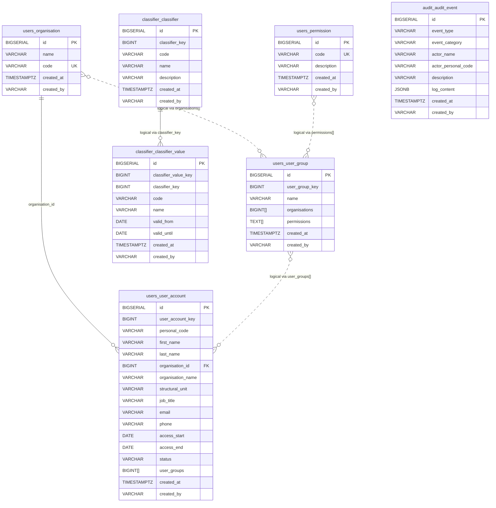

# LJVIS2 uus andmebaasi skeem

See dokument kirjeldab **uut denormaliseeritud andmemudelit**.

## Peamised muutused

- **Vana normaliseeritud mudel** on asendatud **INSERT-only** mudeliga
- eraldi `*_state`, `*_latest` ja junction-tabeleid enam põhiskeemis ei ole
- tabelid on jagatud skeemidesse: `users` (kasutajahaldus), `classifier` (klassifikaatorid) ja `audit` (audit log)
- mitmed seosed on nüüd hoitud **array-väljades** või **loogiliste võtmetena**, mitte klassikaliste FK-dena

## Nimekonventsioon

- Kõik tabeli- ja veerunimed on esitatud kujul `snake_case`
- Loogilised identiteedid kasutavad samuti `snake_case` kuju, näiteks `user_account_key`, `user_group_key`, `classifier_key` ja `classifier_value_key`
- Massiivväljad kasutavad `snake_case` mitmust, näiteks `organisations`, `permissions` ja `user_groups`

## ER diagramm



## Tabelid

### `users.organisation`

Püsikataloog organisatsioonidele.

- Füüsiline PK: `id`
- Ärivõti: `code`
- Sellele viitab `users.user_account.organisation_id`

### `users.permission`

Püsikataloog õigustele.

- Füüsiline PK: `id`
- Ärivõti: `code`
- `users.user_group.permissions` hoiab õigusi `TEXT[]` kujul permission code väärtustena

### `users.user_group`

Denormaliseeritud kasutajagrupi snapshot-tabel.

- Füüsiline PK: `id`
- Loogiline identiteet: `user_group_key` (võetakse `users.seq_user_group_key` järjestusest)
- Iga muudatus lisab **uue täieliku rea**
- Kehtiv seis leitakse: latest row per `user_group_key`

Olulised väljad:

- `organisations BIGINT[]`
  - organisatsioonide ID-de massiiv
  - loogiline seos `users.organisation.id` vastu

- `permissions TEXT[]`
  - õiguste koodide massiiv
  - loogiline seos `users.permission.code` vastu

### `users.user_account`

Denormaliseeritud kasutaja snapshot-tabel.

- Füüsiline PK: `id`
- Loogiline identiteet: `user_account_key` (võetakse `users.seq_user_account_key` järjestusest)
- Iga muudatus lisab **uue täieliku rea**
- Kehtiv seis leitakse: latest row per `user_account_key`

Olulised väljad:

- `organisation_id`
  - ainus klassikaline FK selles põhiosas
  - viitab `users.organisation.id`

- `organisation_name`
  - hoitakse denormaliseeritult rea sees

- `user_groups BIGINT[]`
  - kasutajale kuuluvate gruppide `user_group_key` massiiv
  - loogiline seos `users.user_group.user_group_key` vastu

### `classifier.classifier`

Denormaliseeritud klassifikaatori snapshot-tabel.

- Füüsiline PK: `id`
- Loogiline identiteet: `classifier_key` (võetakse `classifier.seq_classifier_key` järjestusest)
- `code` on ärikood
- Iga muudatus lisab uue snapshot-rea

### `classifier.classifier_value`

Denormaliseeritud klassifikaatori väärtuse snapshot-tabel.

- Füüsiline PK: `id`
- Loogiline identiteet: `classifier_value_key` (võetakse `classifier.seq_classifier_value_key` järjestusest)
- `classifier_key` viitab loogiliselt klassifikaatorile
- DB tasemel FK-d ei ole, sest `classifier.classifier.classifier_key` ei ole unikaalne snapshot-mudelis

### `audit.audit_event`

INSERT-only audit logi tabel.

- Füüsiline PK: `id`
- Iga audit sündmus lisab uue rea
- Täielikult denormaliseeritud - ei ole FK-d teistele tabelitele
- `log_content` on JSONB väli, mis hoiab sündmuse-spetsiifilisi andmeid

Olulised väljad:

- `event_type VARCHAR(100)`
  - sündmuse tüüp kujul `resource.action[.qualifier]` (nt `user.create`, `auth.login.success`)
  - definitsioonid on rakenduse koodis, mitte kataloogitabelis

- `event_category VARCHAR(50)`
  - sündmuse kategooria filtreerimiseks: `authentication`, `user_management`, `classifier_management`, `access_control`, `system_process`

- `actor_name VARCHAR(400)`
  - tegija kuvatav nimi (nt "Mari Mustikas")
  - denormaliseeritud tekst - ei ole FK kasutajale

- `actor_personal_code VARCHAR(50)`
  - tegija isikukood
  - salvestatud selges tekstis audit logis

- `log_content JSONB`
  - paindlik JSONB väli sündmuse-spetsiifilistele andmetele
  - võimalikud võtmed: `targetPersonalCode`, `targetName`, `organisationId`, `scope`, `searchTerm`, `displayedPersonalCodes`, `changedFields`, `addedGroups`, `removedGroups`, jne

## Seoste tõlgendus

Uues mudelis tuleb eristada kahte tüüpi seoseid.

### Füüsilised FK seosed

Need on päriselt andmebaasi constraintid:

- `users.user_account.organisation_id -> users.organisation.id`

### Loogilised seosed

Need eksisteerivad andmemudelis, aga mitte klassikalise FK-na:

- `users.user_group.organisations[] -> users.organisation.id`
- `users.user_group.permissions[] -> users.permission.code`
- `users.user_account.user_groups[] -> users.user_group.user_group_key`
- `classifier.classifier_value.classifier_key -> classifier.classifier.classifier_key`

## Snapshot-mudeli loogika

Uues skeemis ei uuendata ridu tavapärase `UPDATE` loogikaga.

Selle asemel:

- iga muudatus lisab **uue rea**
- kehtiv seis leitakse `created_at` järgi
- loogiline identiteet ei ole füüsiline PK, vaid:
  - `user_account_key` (võetakse `users.seq_user_account_key` järjestusest)
  - `user_group_key` (võetakse `users.seq_user_group_key` järjestusest)
  - `classifier_key` (võetakse `classifier.seq_classifier_key` järjestusest)
  - `classifier_value_key` (võetakse `classifier.seq_classifier_value_key` järjestusest)

## Järjestused (Sequences)

Loogiliste identiteetide genereerimiseks kasutatakse PostgreSQL järjestusi:

**Users skeem:**
- `users.seq_user_account_key` - genereerib `user_account_key` väärtused
- `users.seq_user_group_key` - genereerib `user_group_key` väärtused

**Classifier skeem:**
- `classifier.seq_classifier_key` - genereerib `classifier_key` väärtused
- `classifier.seq_classifier_value_key` - genereerib `classifier_value_key` väärtused

Iga uus kasutaja, grupp või klassifikaator saab unikaalse loogilise võtme vastavast järjestusest, mis jääb muutumatuks kogu olemasolu ajal, isegi kui füüsilised read muutuvad.

## Skeemi lühivaade

```mermaid
flowchart LR
    ORG[users.organisation]
    PERM[users.permission]
    UG[users.user_group\nuser_group_key\norganisations[]\npermissions[]]
    UA[users.user_account\nuser_account_key\norganisation_id\nuser_groups[]]
    C[classifier.classifier\nclassifier_key]
    CV[classifier.classifier_value\nclassifier_value_key\nclassifier_key]
    AE[audit.audit_event\nevent_type\nlog_content JSONB]

    UA --> ORG
    UG -. organisations[] .-> ORG
    UG -. permissions[] .-> PERM
    UA -. user_groups[] .-> UG
    CV -. classifier_key .-> C
```

## Mida vana skeemiga võrreldes enam ei ole

Denormaliseeritud mudel asendab varasema lähenemise, kus olid eraldi:

- `user_account_data_state`
- `user_account_state`
- `user_account_user_group`
- `user_group_name_state`
- `user_group_organisation`
- `user_group_permission`
- `*_latest` tabelid
- `classifier_name_state`
- `classifier_value_validity_state`
- `classifier_latest`
- `classifier_value_latest`


