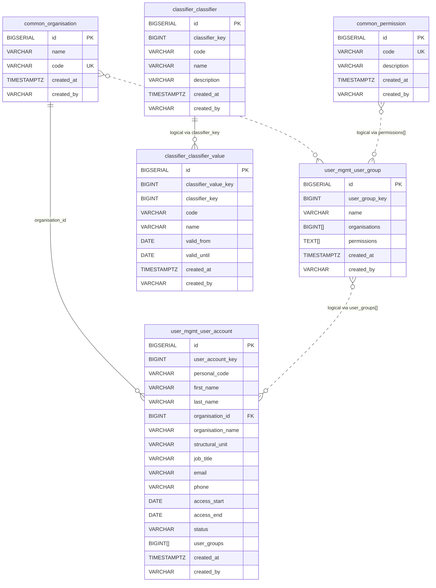

# LJVIS2 uus andmebaasi skeem

See dokument kirjeldab **uut denormaliseeritud andmemudelit**, mis tuli `feature/denormalized-tables` Liquibase skriptidest.

## Peamised muutused

- **Vana normaliseeritud mudel** on asendatud **INSERT-only snapshot** mudeliga
- `user_account` ja `user_group` hoiavad nüüd ühes reas kogu hetke-snapshoti
- eraldi `*_state`, `*_latest` ja junction-tabeleid enam põhiskeemis ei ole
- domeenid on jagatud eraldi skeemidesse: `common`, `user_mgmt`, `classifier`
- mitmed seosed on nüüd hoitud **array-väljades** või **loogiliste võtmetena**, mitte klassikaliste FK-dena

## Nimekonventsioon

- Kõik tabeli- ja veerunimed on esitatud kujul `snake_case`
- Loogilised identiteedid kasutavad samuti `snake_case` kuju, näiteks `user_account_key`, `user_group_key`, `classifier_key` ja `classifier_value_key`
- Massiivväljad kasutavad `snake_case` mitmust, näiteks `organisations`, `permissions` ja `user_groups`

## ER diagramm



## Tabelid

### `common.organisation`

Püsikataloog organisatsioonidele.

- Füüsiline PK: `id`
- Ärivõti: `code`
- Sellele viitab `user_mgmt.user_account.organisation_id`

### `common.permission`

Püsikataloog õigustele.

- Füüsiline PK: `id`
- Ärivõti: `code`
- `user_mgmt.user_group.permissions` hoiab õigusi `TEXT[]` kujul permission code väärtustena

### `user_mgmt.user_group`

Denormaliseeritud kasutajagrupi snapshot-tabel.

- Füüsiline PK: `id`
- Loogiline identiteet: `user_group_key`
- Iga muudatus lisab **uue täieliku rea**
- Kehtiv seis leitakse: latest row per `user_group_key`

Olulised väljad:

- `organisations BIGINT[]`
  - organisatsioonide ID-de massiiv
  - loogiline seos `common.organisation.id` vastu

- `permissions TEXT[]`
  - õiguste koodide massiiv
  - loogiline seos `common.permission.code` vastu

### `user_mgmt.user_account`

Denormaliseeritud kasutaja snapshot-tabel.

- Füüsiline PK: `id`
- Loogiline identiteet: `user_account_key`
- Iga muudatus lisab **uue täieliku rea**
- Kehtiv seis leitakse: latest row per `user_account_key`

Olulised väljad:

- `organisation_id`
  - ainus klassikaline FK selles põhiosas
  - viitab `common.organisation.id`

- `organisation_name`
  - hoitakse denormaliseeritult rea sees

- `user_groups BIGINT[]`
  - kasutajale kuuluvate gruppide `user_group_key` massiiv
  - loogiline seos `user_mgmt.user_group.user_group_key` vastu

### `classifier.classifier`

Denormaliseeritud klassifikaatori snapshot-tabel.

- Füüsiline PK: `id`
- Loogiline identiteet: `classifier_key`
- `code` on ärikood
- Iga muudatus lisab uue snapshot-rea

### `classifier.classifier_value`

Denormaliseeritud klassifikaatori väärtuse snapshot-tabel.

- Füüsiline PK: `id`
- Loogiline identiteet: `classifier_value_key`
- `classifier_key` viitab loogiliselt klassifikaatorile
- DB tasemel FK-d ei ole, sest `classifier.classifier.classifier_key` ei ole unikaalne snapshot-mudelis

## Seoste tõlgendus

Uues mudelis tuleb eristada kahte tüüpi seoseid.

### Füüsilised FK seosed

Need on päriselt andmebaasi constraintid:

- `user_mgmt.user_account.organisation_id -> common.organisation.id`

### Loogilised seosed

Need eksisteerivad andmemudelis, aga mitte klassikalise FK-na:

- `user_mgmt.user_group.organisations[] -> common.organisation.id`
- `user_mgmt.user_group.permissions[] -> common.permission.code`
- `user_mgmt.user_account.user_groups[] -> user_mgmt.user_group.user_group_key`
- `classifier.classifier_value.classifier_key -> classifier.classifier.classifier_key`

## Snapshot-mudeli loogika

Uues skeemis ei uuendata ridu tavapärase `UPDATE` loogikaga.

Selle asemel:

- iga muudatus lisab **uue rea**
- kehtiv seis leitakse `created_at` järgi
- loogiline identiteet ei ole füüsiline PK, vaid:
  - `user_account_key`
  - `user_group_key`
  - `classifier_key`
  - `classifier_value_key`

## Skeemi lühivaade

```mermaid
flowchart LR
    ORG[common.organisation]
    PERM[common.permission]
    UG[user_mgmt.user_group\nuser_group_key\norganisations[]\npermissions[]]
    UA[user_mgmt.user_account\nuser_account_key\norganisation_id\nuser_groups[]]
    C[classifier.classifier\nclassifier_key]
    CV[classifier.classifier_value\nclassifier_value_key\nclassifier_key]

    UA --> ORG
    UG -. organisations[] .-> ORG
    UG -. permissions[] .-> PERM
    UA -. user_groups[] .-> UG
    CV -. classifier_key .-> C
```

## Mida vana skeemiga võrreldes enam ei ole

Denormaliseeritud mudel asendab varasema lähenemise, kus olid eraldi:

- `user_account_data_state`
- `user_account_state`
- `user_account_user_group`
- `user_group_name_state`
- `user_group_organisation`
- `user_group_permission`
- `*_latest` tabelid
- `classifier_name_state`
- `classifier_value_validity_state`
- `classifier_latest`
- `classifier_value_latest`

## Kokkuvõte

Uus mudel on:

- **snapshot-põhine**
- **denormaliseeritud**
- osaliselt **array-põhiste loogiliste seostega**
- lugemisel taastatav `latest row per logical key` loogikaga

Infra või arenduse vaatest on kõige olulisem mõista, et see ei ole enam klassikaline tugevalt FK-dega normaliseeritud ER-mudel, vaid **append-only loogikaga snapshot-andmemudel**.
