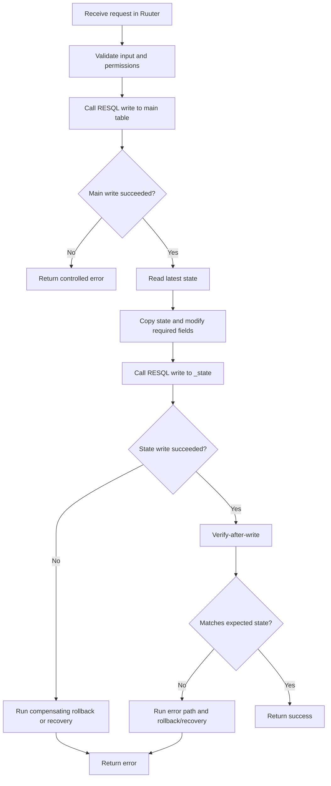
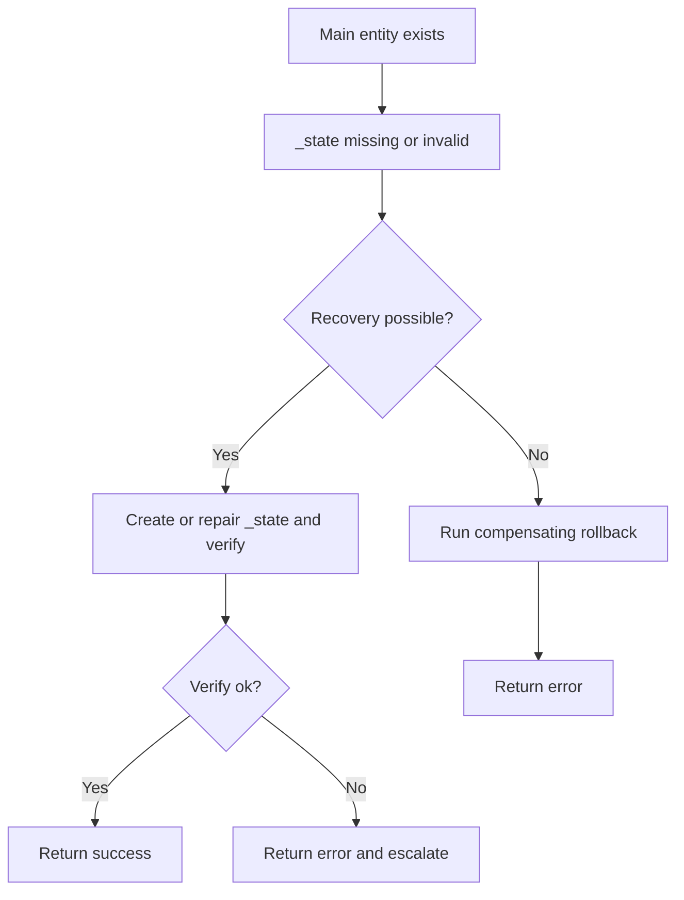
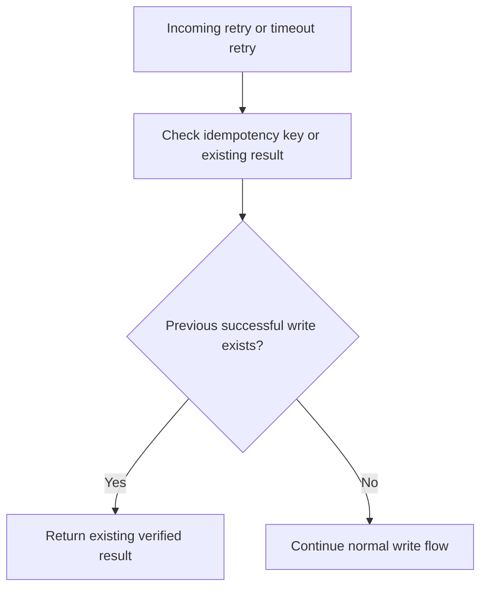

# Database Error Handling Rules

See dokument kirjeldab põhimõtteid, corner case'e ja vooge, mida tuleb järgida kõigi Ruuter + RESQL põhiste andmekirjutuste korral.

## 1. Põhiprintsiibid

- Kogu äriloogika realiseeritakse Ruuteris.
- RESQL täidab ainult andmeoperatsioone ja tagastab andmebaasi tulemused.
- Enne `success` vastust on kohustuslik `verify-after-write`.
- Kui mitmeastmelise voo hilisem samm ebaõnnestub, peab Ruuter käivitama kompenseeriva rollback voo RESQL endpointide kaudu.
- `partial success` ei ole lubatud lõppseis; see tuleb kas taastada või parandada.

## 2. Kohustuslikud reeglid

| Reegel | Nõue |
|--------|------|
| Verify-after-write | Pärast iga kirjutust tuleb vastav kirje andmebaasist tagasi lugeda ja oodatud väärtustega võrrelda |
| Compensating rollback | Kui hilisem samm ebaõnnestub, peab olema defineeritud kompenseeriv voog |
| Idempotency | Retry / timeout ei tohi tekitada topeltkirjeid ega topelt-state muutusi |
| Latest state rule | `latest state` leidmise reegel peab olema üheselt määratud |
| Constraint handling | Constraint erroril peab olema selge error-path ja vajadusel rollback |
| Stale read handling | Kui verify loeb tagasi vale/vananenud seisu, ei tohi tagastada success vastust |
| Partial success handling | Põhitabel olemas, `_state` puudub/poolik → peab olema recovery või rollback |

## 3. State-management reeglid

### 3.1 `_state` kirjutuse muster

1. loe viimane kehtiv state,
2. kopeeri kogu olemasolev state kirje,
3. muuda ainult vajalikud väljad,
4. salvesta uus `_state` kirje,
5. loe salvestatud `_state` kirje tagasi,
6. võrdle seda oodatud sisuga,
7. alles siis märgi operatsioon õnnestunuks.

### 3.2 Latest-state reegel

`latest state` peab olema leitav deterministlikult. Ei piisa lausest „võta viimane kirje”.

Soovituslik reegel:
- esmalt `created_at DESC`,
- seejärel tehniline tie-breaker (`id DESC` või muu unikaalne järjestusväli).

Sama reegel peab kehtima:
- enne uue `_state` kirje loomist,
- verify-after-write kontrollis,
- kõikides lugemispäringutes, mis tagastavad aktiivse seisu.

## 4. Corner case'id ja põhimõttelised lahendused

### 4.1 Põhitabeli kirjutus ebaõnnestub
- **Juhtum:** esmane INSERT ei õnnestu.
- **Lahendus:** tagasta error; `_state` kirjutust ei alustata.

### 4.2 Põhitabel õnnestub, `_state` kirjutus ebaõnnestub
- **Juhtum:** põhiobjekt on loodud, aga äriseis puudub.
- **Lahendus:** käivita kompenseeriv rollback või parandusvoog; ära tagasta success vastust.

### 4.3 `_state` kirjutus õnnestub, verify-after-write ebaõnnestub
- **Juhtum:** DB tagastatud seis ei vasta oodatule.
- **Lahendus:** käsitle kui ebaõnnestumist; käivita error-path ja vajadusel rollback.

### 4.4 Retry pärast timeouti
- **Juhtum:** Ruuter ei saanud õigel ajal vastust, kuid DB võis kirjutuse ära teha.
- **Lahendus:** kasuta idempotency võtit või muud dubleerimist vältivat mehhanismi; enne uut kirjutust kontrolli olemasolevat tulemust.

### 4.5 Parallel writes / race condition
- **Juhtum:** kaks päringut loevad sama latest-state kirjet ja loovad vastuolulise uue state'i.
- **Lahendus:** defineeri konkurentsi käsitlus; vajadusel lisa tehniline lukustus- või versioonikontrolli strateegia.

### 4.6 Constraint error state kopeerimisel
- **Juhtum:** kopeeritud kirjes puudub nõutud väli või rikutakse unikaalsusreeglit.
- **Lahendus:** tagasta kontrollitud error ja käivita rollback/recovery loogika.

### 4.7 Stale read
- **Juhtum:** verify loeb vananenud või vale kirje tagasi.
- **Lahendus:** kasuta üheselt määratud latest-state reeglit; mismatch tähendab errorit, mitte successi.

### 4.8 Partial success
- **Juhtum:** põhitabeli kirje on olemas, `_state` puudub või äriseis on poolik.
- **Lahendus:** skill peab nõudma eksplitsiitset recovery või rollback sammu; see olukord ei tohi jääda dokumenteerimata.

## 5. Failure-handling vood

### 5.1 Üldine kirjutusvoog

### 5.2 Partial-success voog

### 5.3 Retry / idempotency voog

## 6. Mida epicu DSL plaan peab sellest kasutama

Iga `docs/imp/epic_XX_dsl_plan.md` peab viitama sellele failile ja kirjeldama vähemalt:
- millistes sammudes toimub verify-after-write,
- milline on rollback või recovery voog,
- kuidas leitakse `latest state`,
- kuidas välditakse duplicate retry juhtumeid,
- kuidas käsitletakse partial success olukordi,
- millised vead on funktsionaalsed ja millised tehnilised.
