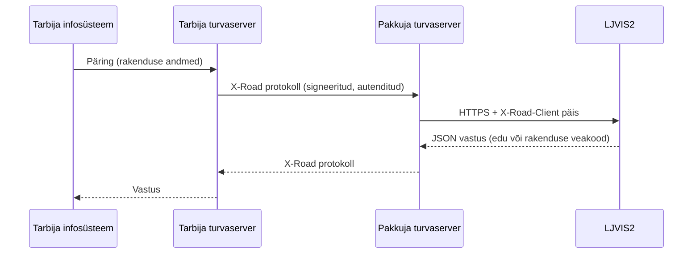

# X-tee liidestumine ja turve

## Pakkuja identifikaator

| Keskkond | Pakkuja |
|---|---|
| DEV | `ee-dev/GOV/70001231/ljvis2` |
| TEST | `ee-test/GOV/70001231/ljvis2` |
| Toodang | `EE/GOV/70001231/ljvis2` |

Tarbija kasutab **enda keskkonna turvaserverit**. Selle URL sõltub tarbija seadistusest; `dev.liiklusvalve.ee` ei ole X-tee turvaserver.

Päris URL-i näide:

```text
https://<tarbija-turvaserver>/r1/ee-dev/GOV/70001231/ljvis2/IsikuKontroll/v1
```

Mocki URL sama operatsiooni jaoks:

```text
https://dev.liiklusvalve.ee/developer/xroad/v1/isiku-kontroll
```

Teenusekood, versioon ja sihttee tuleb turvaserveris tegeliku konfiguratsiooniga kooskõlastada. [Teenuste tabel ja näited](services.md) ning [publitseerimise juhend](../xtee/00-xtee-teenused-publikatsiooni-juhend.md) annavad vastavused. Masinloetav leping: [XroadOpenapi.yaml](../xtee/XroadOpenapi.yaml).

Pärispäringu tee:



Testimiseks (ilma turvaserverita) asendub PS→L osa avaliku mockiga, vt allpool.

## Eeltingimused ja õigused

1. Tarbija alamsüsteem on registreeritud samas X-tee keskkonnas kui pakkuja.
2. Tarbija turvaserveri ühendus ja TLS-seadistus on korras.
3. Pakkuja turvaserveris on soovitud teenus publitseeritud ning tarbijale antud teenuse kasutusõigus.
4. Päris teenused ei ole üldise avaliku veebidomeeni kaudu kasutatavad, need on kättesaadavad ainult pakkuja turvaserveri kaudu.

Turvaserver vastutab tarbija autentimise ja teenuseõiguste kontrolli eest. Päise käsitsi lisamine ei asenda seda.
Rakenduse POST-teenused kontrollivad neljaosalist `X-Road-Client` päist. Mocki keelatud tarbija `ee-dev/GOV/70000000/denied` on ainult teststsenaarium, mitte päris õiguste register.

## Päised

| Päis | Kasutus |
|---|---|
| `Content-Type: application/json` | Kõik POST-teenused |
| `X-Road-Client` | POST-teenustes kohustuslik `instance/memberClass/memberCode/subsystem`; puuduv või vigane kuju annab 403 |
| `X-Road-UserId` | AJ `findUsage` puhul kohustuslik, väärtus peab täpselt võrduma `userCode` query parameetriga |
| `X-Mock-Scenario` | **Ainult mockis**, `empty` või `server-error`; päris teenuse lepingusse ei kuulu |

AJ `usagePeriod` ja `heartbeat` handler ei nõua `X-Road-UserId` ega rakenduse tasemel `X-Road-Client` päist.
Päris turvaserveri kaudu pöördudes on tarbija identifikaator ja teenuse kasutusõigus siiski vajalikud.
Mock ei nõua ametniku sessiooni, TARA autentimist ega platvormi API võtit.

## HTTP-vastuse ümbris

Pakutavad teenused kasutavad Ruuteri vaikeümbrist: HTTP JSON-kehas on `response` väli, mille väärtus on JSON-tekst. Mock säilitab sama kuju nii edu- kui ka rakenduse veavastustes. Loe esmalt HTTP-keha JSON-ina, seejärel tee `JSON.parse(body.response)`. Näiteks HTTP-keha `{"response":"{\"confirmed\":1}"}` annab lahtiparsimisel `{ "confirmed": 1 }`.

Teenuste näidetes on näidatud nii HTTP-keha kui ka `response` välja lahtiparsitud sisu. `/developer/health/ready` tagastab otse JSON-objekti.

Ära saada avalikku mocki päris isikukoode, menetlusandmeid ega saladusi. Mock ei salvesta rakenduse tasemel andmeid, kuid ühine proxy või infrastruktuur võib logida URL-e.
