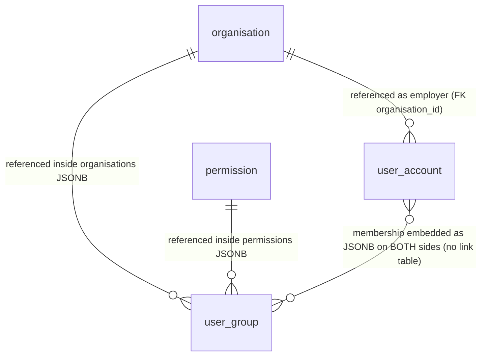

# EPIC 02 — Data Model (v2, all-denormalized)

## Design principles for this variant

1. **One denormalized table per entity / read view.** No `_state`, `_data_state`, junction, or `_latest` companion tables.
2. **INSERT-only, current = latest row.** Every change appends a complete new snapshot row. The current state of an entity is `... WHERE <entity>_key = :k ORDER BY created_at DESC LIMIT 1`. History is preserved as older rows.
3. **Logical entity key.** Because an entity now spans many physical rows, each entity is identified by a stable `<entity>_key BIGINT`, allocated once from a dedicated sequence at creation and copied onto every subsequent snapshot row of that entity. The per-row surrogate `id BIGSERIAL` remains the physical primary key.
4. **Relationships embedded as JSONB on every reading side.** M:N relationships are denormalized into JSONB arrays on each entity that reads them (a user carries its `user_groups`; a group carries its `members`, `organisations`, `permissions`). There are no link tables.
5. **Fixed catalogues stay flat.** `organisation` and `permission` are externally managed catalogues (Pattern D); they are already single flat tables and double as the lookup source for denormalized names.
6. **No rebuild step.** Since each write directly composes and inserts the full snapshot, there is no separate normalized source to synchronise — eliminating the v1 Ruuter rebuild flows. The cost of this is documented in §10.

## 1. Entity Overview

| Entity | Table name | Database | Pattern | Description | Used by tasks |
|--------|-----------|----------|---------|-------------|---------------|
| Organisation | `organisation` | Application DB | D | Fixed catalogue of organisations (agencies); not managed via the UI; lookup source for denormalized organisation names | 1, 2, 3, 4, 5, 6 |
| Permission | `permission` | Application DB | D | Fixed catalogue of system permissions (resource.action codes); lookup source for denormalized permission data | 5, 6 |
| User account (snapshot) | `user_account` | Application DB | denormalized snapshot | One INSERT-only denormalized row per user state; carries all scalar fields, status, and the user's active groups as JSONB. Current = latest row per `user_account_key` | 1, 2, 3, 6, 7 |
| User group (snapshot) | `user_group` | Application DB | denormalized snapshot | One INSERT-only denormalized row per group state; carries name, the covers-all flag, and organisations / permissions / members as JSONB. Current = latest row per `user_group_key` | 1, 3, 4, 5, 6 |

## 2. ER Diagram



> In this variant the user↔group many-to-many is **not** a junction table. The same membership fact is denormalized into `user_account.user_groups` and `user_group.members`; both must be (re)written together on every membership change (see §10).

## 3. DDL Script

```sql
-- EPIC_02 BEGIN
-- ============================================================
-- EPIC 02 — Kasutajate haldamine — DDL (v2, ALL-DENORMALIZED)
-- Database: PostgreSQL
-- Pattern: INSERT-only; one denormalized snapshot table per entity.
--          Current state = latest row (ORDER BY <entity>_key, created_at DESC LIMIT 1).
-- ============================================================

-- Entity-key sequences (allocate the stable logical identity for each entity).
-- One value is drawn at entity creation and copied onto every later snapshot row.
CREATE SEQUENCE seq_user_account_key;
CREATE SEQUENCE seq_user_group_key;

-- 1. organisation (fixed catalogue — Pattern D, already flat)
CREATE TABLE organisation (
    id              BIGSERIAL       NOT NULL,
    name            VARCHAR(500)    NOT NULL,
    code            VARCHAR(50)     NOT NULL,
    created_at      TIMESTAMPTZ     NOT NULL DEFAULT now(),
    created_by      BIGINT          NOT NULL,
    CONSTRAINT pk_organisation PRIMARY KEY (id),
    CONSTRAINT uq_organisation_code UNIQUE (code)
);

COMMENT ON TABLE  organisation IS 'Fixed catalogue of organisations (agencies). Not managed via the application UI; rows are added at development time on request to Kliimaministeerium. Doubles as the lookup source for organisation_name denormalized onto user_account.';
COMMENT ON COLUMN organisation.id IS 'Primary key';
COMMENT ON COLUMN organisation.name IS 'Official name of the organisation';
COMMENT ON COLUMN organisation.code IS 'Unique registry code of the organisation';
COMMENT ON COLUMN organisation.created_at IS 'Row creation timestamp';
COMMENT ON COLUMN organisation.created_by IS 'user_account_key of the actor/process that created the row (no enforceable FK in v2 — see §10)';

CREATE INDEX idx_organisation_name ON organisation (name);

-- NOTE: organisation has no state table. Pattern D fixed catalogue managed outside the
-- application UI (confirmed on 21.04.2026 analysis meeting).

-- 2. permission (fixed catalogue — Pattern D, already flat)
CREATE TABLE permission (
    id              BIGSERIAL       NOT NULL,
    code            VARCHAR(100)    NOT NULL,
    description     VARCHAR(500)    NOT NULL,
    created_at      TIMESTAMPTZ     NOT NULL DEFAULT now(),
    created_by      BIGINT          NOT NULL,
    CONSTRAINT pk_permission PRIMARY KEY (id),
    CONSTRAINT uq_permission_code UNIQUE (code)
);

COMMENT ON TABLE  permission IS 'Fixed catalogue of system permissions (resource.action codes). Managed at development time. Doubles as the lookup source for permissions denormalized into user_group.permissions.';
COMMENT ON COLUMN permission.id IS 'Primary key';
COMMENT ON COLUMN permission.code IS 'Unique permission code (e.g. user.list.admin)';
COMMENT ON COLUMN permission.description IS 'Human-readable description of the permission';
COMMENT ON COLUMN permission.created_at IS 'Row creation timestamp';
COMMENT ON COLUMN permission.created_by IS 'user_account_key of the actor/process that created the row (no enforceable FK in v2 — see §10)';

CREATE INDEX idx_permission_code ON permission (code);

-- NOTE: permission has no state table. Pattern D fixed catalogue.

-- 3. user_account (denormalized INSERT-only snapshot — one row per user state)
CREATE TABLE user_account (
    id                  BIGSERIAL       NOT NULL,
    user_account_key    BIGINT          NOT NULL,
    personal_code       VARCHAR(20)     NOT NULL,
    first_name          VARCHAR(200)    NOT NULL,
    last_name           VARCHAR(200)    NOT NULL,
    organisation_id     BIGINT          NOT NULL,
    organisation_name   VARCHAR(500)    NOT NULL,
    structural_unit     VARCHAR(100)    NOT NULL,
    job_title           VARCHAR(100)    NOT NULL,
    email               VARCHAR(320)    NOT NULL,
    phone               VARCHAR(50),
    access_start        DATE            NOT NULL,
    access_end          DATE,
    status              VARCHAR(50)     NOT NULL,
    user_groups         JSONB           NOT NULL DEFAULT '[]',
    created_at          TIMESTAMPTZ     NOT NULL DEFAULT now(),
    created_by          BIGINT          NOT NULL,
    CONSTRAINT pk_user_account PRIMARY KEY (id),
    CONSTRAINT fk_ua_organisation FOREIGN KEY (organisation_id) REFERENCES organisation (id)
);

COMMENT ON TABLE  user_account IS 'Denormalized INSERT-only snapshot of a user. Every change (data edit, status change, group membership change) appends a complete new row. Current state of a user = latest row for its user_account_key (ORDER BY created_at DESC LIMIT 1). Replaces the v1 user_account + user_account_data_state + user_account_state + user_account_user_group(+_state) + user_account_latest tables.';
COMMENT ON COLUMN user_account.id IS 'Per-row physical primary key';
COMMENT ON COLUMN user_account.user_account_key IS 'Stable logical identity of the user (from seq_user_account_key). All snapshot rows of one user share this value; it groups history. NOT unique (many rows per user).';
COMMENT ON COLUMN user_account.personal_code IS 'Estonian personal identification code (isikukood). Logically immutable across snapshots of one user; not enforceable as UNIQUE in v2 because multiple rows exist per user (uniqueness enforced at the orchestration layer). UI renders this field disabled after creation.';
COMMENT ON COLUMN user_account.first_name IS 'First name as of this snapshot';
COMMENT ON COLUMN user_account.last_name IS 'Last name (family name) as of this snapshot';
COMMENT ON COLUMN user_account.organisation_id IS 'FK to organisation (catalogue) the user belongs to as of this snapshot';
COMMENT ON COLUMN user_account.organisation_name IS 'Denormalized copy of organisation.name as of this snapshot';
COMMENT ON COLUMN user_account.structural_unit IS 'Structural unit as of this snapshot. Currently a hardcoded dropdown (LÕUNA PREFEKTUUR, IDA PREFEKTUUR, LÄÄNE PREFEKTUUR, PÕHJA PREFEKTUUR, KLIM, TRAM); future classifier FK';
COMMENT ON COLUMN user_account.job_title IS 'Job title as of this snapshot (free text, max 100 chars)';
COMMENT ON COLUMN user_account.email IS 'E-mail address as of this snapshot';
COMMENT ON COLUMN user_account.phone IS 'Phone number as of this snapshot (optional; digits and spaces only; UI shows fixed +372 prefix not stored here)';
COMMENT ON COLUMN user_account.access_start IS 'Date from which access is granted (inclusive) as of this snapshot';
COMMENT ON COLUMN user_account.access_end IS 'Date until which access is granted (inclusive) as of this snapshot; NULL = no end date';
COMMENT ON COLUMN user_account.status IS 'Lifecycle status as of this snapshot: active, pending_deactivation, inactive';
COMMENT ON COLUMN user_account.user_groups IS 'JSONB array of the user''s active group memberships: [{"id": <user_group_key>, "name": <current group name>}, ...]. Same fact is mirrored on user_group.members; both are rewritten together on membership change (see §10).';
COMMENT ON COLUMN user_account.created_at IS 'Snapshot creation timestamp; ordering key for latest-row resolution';
COMMENT ON COLUMN user_account.created_by IS 'user_account_key of the actor that produced this snapshot (no enforceable FK in v2 — see §10)';

CREATE INDEX idx_ua_key_created_at ON user_account (user_account_key, created_at DESC);
CREATE INDEX idx_ua_personal_code ON user_account (personal_code);
CREATE INDEX idx_ua_first_name_lower ON user_account (LOWER(first_name));
CREATE INDEX idx_ua_last_name_lower ON user_account (LOWER(last_name));
CREATE INDEX idx_ua_organisation_id ON user_account (organisation_id);
CREATE INDEX idx_ua_status ON user_account (status);
CREATE INDEX idx_ua_user_groups_gin ON user_account USING GIN (user_groups);

-- 4. user_group (denormalized INSERT-only snapshot — one row per group state)
CREATE TABLE user_group (
    id                          BIGSERIAL       NOT NULL,
    user_group_key              BIGINT          NOT NULL,
    name                        VARCHAR(50)     NOT NULL,
    covers_all_organisations    BOOLEAN         NOT NULL DEFAULT false,
    organisations               JSONB           NOT NULL DEFAULT '[]',
    permissions                 JSONB           NOT NULL DEFAULT '[]',
    members                     JSONB           NOT NULL DEFAULT '[]',
    created_at                  TIMESTAMPTZ     NOT NULL DEFAULT now(),
    created_by                  BIGINT          NOT NULL,
    CONSTRAINT pk_user_group PRIMARY KEY (id)
);

COMMENT ON TABLE  user_group IS 'Denormalized INSERT-only snapshot of a user group. Every change (rename, organisation change, permission change, membership change) appends a complete new row. Current state of a group = latest row for its user_group_key (ORDER BY created_at DESC LIMIT 1). Replaces the v1 user_group + user_group_name_state + user_group_organisation(+_state) + user_group_permission(+_state) + user_group_latest tables.';
COMMENT ON COLUMN user_group.id IS 'Per-row physical primary key';
COMMENT ON COLUMN user_group.user_group_key IS 'Stable logical identity of the group (from seq_user_group_key). All snapshot rows of one group share this value. NOT unique (many rows per group). Referenced by user_account.user_groups[].id.';
COMMENT ON COLUMN user_group.name IS 'Display name of the group as of this snapshot (max 50 chars)';
COMMENT ON COLUMN user_group.covers_all_organisations IS 'TRUE when the group is linked to every organisation in the catalogue as of this snapshot (computed at write time: size(organisations) == count(*) FROM organisation). UI shortcut flag.';
COMMENT ON COLUMN user_group.organisations IS 'JSONB array of active organisation links: [{"id": <organisation.id>, "name": <organisation.name>}, ...]; [] if none';
COMMENT ON COLUMN user_group.permissions IS 'JSONB array of active permissions: [{"id": <permission.id>, "code": ..., "description": ...}, ...]; [] if none';
COMMENT ON COLUMN user_group.members IS 'JSONB array of active members: [{"userAccountKey": <user_account_key>, "firstName": ..., "lastName": ..., "personalCode": ...}, ...]; [] if none. Same fact mirrored on user_account.user_groups; both rewritten together on membership change (see §10).';
COMMENT ON COLUMN user_group.created_at IS 'Snapshot creation timestamp; ordering key for latest-row resolution';
COMMENT ON COLUMN user_group.created_by IS 'user_account_key of the actor that produced this snapshot (no enforceable FK in v2 — see §10)';

CREATE INDEX idx_ug_key_created_at ON user_group (user_group_key, created_at DESC);
CREATE INDEX idx_ug_name_lower ON user_group (LOWER(name));
CREATE INDEX idx_ug_organisations_gin ON user_group USING GIN (organisations);
CREATE INDEX idx_ug_permissions_gin ON user_group USING GIN (permissions);
CREATE INDEX idx_ug_members_gin ON user_group USING GIN (members);
-- EPIC_02 END
```

## 4. Table Definitions

#### `organisation`

| Column | Type | Mandatory | Primary key | Comment |
|--------|------|-----------|-------------|---------|
| id | BIGSERIAL | Y | Y | Primary key |
| name | VARCHAR(500) | Y | | Official name of the organisation |
| code | VARCHAR(50) | Y | | Unique registry code of the organisation |
| created_at | TIMESTAMPTZ | Y | | Row creation timestamp |
| created_by | BIGINT | Y | | user_account_key of the actor/process that created the row (no enforceable FK in v2) |

#### `permission`

| Column | Type | Mandatory | Primary key | Comment |
|--------|------|-----------|-------------|---------|
| id | BIGSERIAL | Y | Y | Primary key |
| code | VARCHAR(100) | Y | | Unique permission code (e.g. user.list.admin) |
| description | VARCHAR(500) | Y | | Human-readable description of the permission |
| created_at | TIMESTAMPTZ | Y | | Row creation timestamp |
| created_by | BIGINT | Y | | user_account_key of the actor/process that created the row (no enforceable FK in v2) |

#### `user_account`

> Denormalized INSERT-only snapshot. Current state of a user = latest row per `user_account_key` (ORDER BY `created_at` DESC LIMIT 1). Every data, status, or membership change appends a complete new row.

| Column | Type | Mandatory | Primary key | Comment |
|--------|------|-----------|-------------|---------|
| id | BIGSERIAL | Y | Y | Per-row physical primary key |
| user_account_key | BIGINT | Y | | Stable logical identity of the user; groups all snapshot rows of one user; not unique |
| personal_code | VARCHAR(20) | Y | | Estonian personal code; logically immutable; uniqueness enforced at orchestration layer, not DB |
| first_name | VARCHAR(200) | Y | | First name as of this snapshot |
| last_name | VARCHAR(200) | Y | | Last name as of this snapshot |
| organisation_id | BIGINT | Y | | FK to organisation as of this snapshot |
| organisation_name | VARCHAR(500) | Y | | Denormalized copy of organisation.name as of this snapshot |
| structural_unit | VARCHAR(100) | Y | | Structural unit as of this snapshot; hardcoded dropdown, future classifier FK |
| job_title | VARCHAR(100) | Y | | Job title as of this snapshot (free text) |
| email | VARCHAR(320) | Y | | E-mail address as of this snapshot |
| phone | VARCHAR(50) | N | | Phone number as of this snapshot; UI shows +372 prefix not stored |
| access_start | DATE | Y | | Access start date (inclusive) as of this snapshot |
| access_end | DATE | N | | Access end date (inclusive) as of this snapshot; NULL = no end date |
| status | VARCHAR(50) | Y | | Lifecycle status: active, pending_deactivation, inactive |
| user_groups | JSONB | Y | | Active group memberships `[{id, name}, ...]`; mirrored on user_group.members |
| created_at | TIMESTAMPTZ | Y | | Snapshot creation timestamp; latest-row ordering key |
| created_by | BIGINT | Y | | user_account_key of the actor (no enforceable FK in v2) |

#### `user_group`

> Denormalized INSERT-only snapshot. Current state of a group = latest row per `user_group_key` (ORDER BY `created_at` DESC LIMIT 1). Every rename, organisation/permission/membership change appends a complete new row.

| Column | Type | Mandatory | Primary key | Comment |
|--------|------|-----------|-------------|---------|
| id | BIGSERIAL | Y | Y | Per-row physical primary key |
| user_group_key | BIGINT | Y | | Stable logical identity of the group; groups all snapshot rows; not unique |
| name | VARCHAR(50) | Y | | Display name as of this snapshot |
| covers_all_organisations | BOOLEAN | Y | | TRUE when linked to all catalogue organisations; computed at write time |
| organisations | JSONB | Y | | Active organisation links `[{id, name}, ...]` |
| permissions | JSONB | Y | | Active permissions `[{id, code, description}, ...]` |
| members | JSONB | Y | | Active members `[{userAccountKey, firstName, lastName, personalCode}, ...]`; mirrored on user_account.user_groups |
| created_at | TIMESTAMPTZ | Y | | Snapshot creation timestamp; latest-row ordering key |
| created_by | BIGINT | Y | | user_account_key of the actor (no enforceable FK in v2) |

## 5. Table Business Descriptions

| Table | Business description |
|-------|----------------------|
| `organisation` | Fixed catalogue of agencies a user can belong to; maintained outside the application UI. |
| `permission` | Fixed catalogue of system permissions (menu items and functions) that can be granted to groups. |
| `user_account` | The complete current and historical state of each user account, with one self-contained snapshot row per change. |
| `user_group` | The complete current and historical state of each permission group, including its organisations, permissions, and members embedded inline. |

## 6. Key Relationships and Business Terms

**Users and organisations.** Each user belongs to exactly one organisation. The organisation is referenced by `user_account.organisation_id` (a real FK to the catalogue) and the organisation's name is also copied into `user_account.organisation_name` so list and detail views need no lookup. Because the catalogue is externally managed and stable, renames are rare; when they occur, every user snapshot already written keeps the name it had at write time until the user is next re-snapshotted.

**Users and groups (the denormalized many-to-many).** Membership is a many-to-many relationship with no link table in this variant. The same membership fact is stored twice: as an entry in `user_account.user_groups` on the user side and as an entry in `user_group.members` on the group side. Each side serves a different read view (a user's groups vs. a group's members) without cross-table aggregation. The trade-off is that a single membership change requires writing fresh snapshots on **both** the affected user and the affected group within one transaction, and a group rename requires re-snapshotting every member user (cascade) — see §10.

**Groups, organisations, and permissions.** A group's organisation scope and granted permissions are embedded as JSONB arrays (`organisations`, `permissions`) on the group snapshot. `covers_all_organisations` is a computed convenience flag, true when the embedded organisation array covers the entire catalogue. Scope filtering uses the embedded `organisations` array via the GIN index rather than a separate link table.

**Lifecycle.** A user's lifecycle status (`active → pending_deactivation → inactive`) is a column on the user snapshot rather than a separate state table; a status change is just another snapshot row. Groups are never removed; access is controlled by adding or removing members.

## 7. State Diagrams

`status` is now a plain column on the `user_account` snapshot rather than a dedicated state table, but the permitted transitions are unchanged:

### user_account.status

```
active → pending_deactivation → inactive
```

- **active**: user has a valid access period; default on creation.
- **pending_deactivation**: `access_end` set to today/past (Task 2 manual save).
- **inactive**: nightly process (Task 7) has emptied the user's `user_groups`; user can no longer log in.
- Transition `inactive → active` is possible by setting a future/absent `access_end` and re-adding groups. Each transition is a new snapshot row.

Group membership has no separate state machine in v2: a membership is "active" while it is present in both `user_account.user_groups` and `user_group.members`; "removal" is producing new snapshots on both sides that omit the entry. The historical fact is preserved in the older snapshot rows.

## 8. Latest Dataset Tables

**Not applicable / merged.** In v1 the `_latest` tables were a separate denormalized tier derived from normalized source tables. In v2 there is no separate tier — `user_account` and `user_group` **are** the denormalized snapshot tables and serve every read view directly. The list/detail/edit views are all satisfied by `... ORDER BY <entity>_key, created_at DESC LIMIT 1` reads plus GIN-indexed JSONB containment for reverse lookups (e.g. members of a group via `user_account.user_groups @> '[{"id": <groupKey>}]'`, or directly via `user_group.members`).

## 9. Write Flows (no rebuild step)

### 9.1 Pattern

There is no normalized source to synchronise, so v1's "INSERT into source, then rebuild snapshot" two-step collapses into a single composed INSERT. Each write flow:

```
Write flow: "<operation>"
  Step 1: Read the current latest snapshot(s) of the affected entity(ies).
  Step 2: INSERT one new fully-composed snapshot row per affected entity
          (carrying forward unchanged fields + applying the change + embedding current JSONB arrays).
  Step 3: Return the new latest row(s) to the front-end (confirms actual DB state, not input echo).
```

### 9.2 Write mapping

| Write flow | Snapshot INSERT(s) |
|---|---|
| Create user | `user_account` (new `user_account_key`, status `active`, `user_groups=[]`) |
| Edit user data | `user_account` (carry forward status + `user_groups`, apply edited fields) |
| Change user status | `user_account` (carry forward all fields, set new `status`) |
| Assign user to group | `user_account` (add entry to `user_groups`) **and** `user_group` (add entry to `members`) — both in one transaction |
| Remove user from group | `user_account` (drop entry from `user_groups`) **and** `user_group` (drop entry from `members`) — both in one transaction |
| Create user group | `user_group` (new `user_group_key`, embedded `organisations`/`permissions`, `members=[]`) |
| Rename group | `user_group` (carry forward arrays, set new `name`) **and** one new `user_account` snapshot per member (to refresh `user_groups[].name`) — cascade |
| Change group organisations | `user_group` (new `organisations`, recompute `covers_all_organisations`); when membership is cascaded off, also `user_account` per affected member |
| Change group permissions | `user_group` (new `permissions`) |
| Nightly deactivation (Task 7) | `user_account` per deactivated user (empty `user_groups`, set `status=inactive`) **and** `user_group` per affected group (drop member entries) |

### 9.3 Scope limitation

Concrete RESQL/SQL file content belongs in task specifications, not in this epic data model. The cascade and dual-write obligations above are the architecturally significant part and are the central risk of this variant (§10).

## 10. Known Gaps

This variant was produced to evaluate the all-denormalized proposal. The following are **critical trade-offs**, not minor gaps:

1. **No authoritative source of truth / unrecoverable inconsistency.** In v1 the `_latest` snapshots are *derived* from normalized source tables, so they can always be rebuilt if they drift. In v2 the snapshot rows *are* the source of truth. A failed or partial multi-table write (e.g. the user-side snapshot is written but the group-side snapshot fails) leaves permanently inconsistent data with nothing to rebuild from. This must be mitigated with strict single-transaction writes and is the single largest risk of the approach.

2. **The synchronisation work does not disappear — it moves into the write path.** The developers' pain (normalized↔denormalized sync) is replaced by **dual-write synchronisation** between the two sides of every M:N relationship (`user_account.user_groups` ↔ `user_group.members`). The complexity is relocated, not removed, and now executes on the critical write path instead of an asynchronous rebuild.

3. **Cascade write amplification on shared entities.** Renaming a group, or changing its organisation scope when members are dropped, requires writing a fresh `user_account` snapshot for *every* affected member. For large groups this is a large, fan-out write per edit. The same cascade exists in v1's rebuild flows but there it is an idempotent, retryable, recoverable rebuild rather than part of the primary transaction.

4. **Reduced audit precision.** v1's per-attribute `_state` tables make "what changed and why" explicit (a name change touches only `*_name_state`). In v2 every change appends a full snapshot, so determining which field actually changed requires diffing consecutive snapshot rows. History is preserved but its granularity is coarser.

5. **Weakened referential integrity / `created_by` contract.** Because an entity now spans many rows keyed by a non-unique `*_key`, you cannot place a `UNIQUE` constraint on `personal_code` or a real FK from `created_by` to a single user identity row. `created_by` is stored as a bare `BIGINT` user_account_key with no enforceable FK, and `personal_code` uniqueness must be enforced in the orchestration layer. The cross-epic `created_by → user_account(id)` identity contract from the project rules cannot be honoured as a DB constraint in this variant.

6. **JSONB denormalized copies can go stale.** Names embedded in JSONB (`user_groups[].name`, `members[].firstName`) are point-in-time copies. Keeping them current requires the cascade re-snapshots in §9; any missed cascade silently shows stale names with no FK to catch it.

7. **Storage and row-churn growth.** Full-snapshot-per-change plus cascade re-snapshots multiply row counts faster than v1's targeted `_state` inserts. An archival strategy (CronManager, as in v1 §8) is still required and becomes more important.

8. **Catalogue tables remain normalized.** `organisation` and `permission` are kept as flat fixed catalogues (Pattern D); a literally "zero normalized tables" model is not achievable while their names/codes must be looked up and referenced. This is an intentional, documented exception to the all-denormalized rule.
