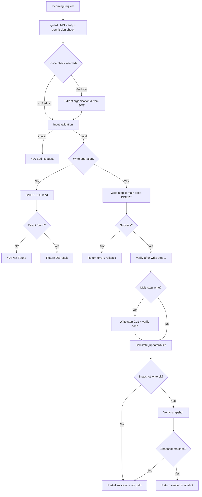

# Epic 02 DSL Plan — Kasutajate haldamine

## 1. Meta

- **Epic number:** `02`
- **Epic title:** `Kasutajate haldamine (User Management)`
- **Epic link:** `https://github.com/kemit-ee/ljvis-2/issues/2`
- **Target branch:** `feature/epic_02_dsl`
- **Related docs:**
  - `docs/data_model.md`
  - `docs/permissions-matrix.md`
  - `docs/errors.json`
  - `docs/db_errorhandling_rules.md`

## 2. Epicu kokkuvõte

Epic 02 katab kasutajate ja kasutajagruppide haldamise admin-liideses. Kasutajal on muutumatu isikukood (`user_account`), mille andmed (nimi, asutus, kontakt, juurdepääsuperiood) on versioneeritud `user_account_data_state`-is ning staatus on `user_account_state`-is. Kasutajagruppidel on nimi (`user_group_name_state`) ning seosed asutuste (`user_group_organisation*`) ja õigustega (`user_group_permission*`). Grupiliikmelisus on `user_account_user_group*`-is. Read-päringud kasutavad `user_account_latest` ja `user_group_latest` snapshot-tabeleid. Pärast iga kirjutust ehitatakse vastav snapshot ümber `state_updater` kaudu.

## 3. Scope ja väljaspool scope'i

### Scope
- Kasutajate pagineeritud nimekiri (otsing, sortimine, admin/lokaalne ulatus)
- Kasutaja detailvaade
- Isikukoodi unikaalsuse eelkontroll
- Kasutaja loomine
- Kasutaja andmete muutmine
- Kasutaja asutuse muutmine
- Asutuste valikute laadimine (kasutajagrupi vormi jaoks)
- Kasutaja kasutajagruppide laadimine
- Kasutajale saadaolevate gruppide laadimine
- Kasutaja kasutajagruppide bulk-salvestus (lisamine + eemaldamine)
- Kasutajagruppide pagineeritud nimekiri (admin/lokaalne ulatus)
- Kasutajagrupi detailvaade
- Kasutajagrupi loomine (grupp + asutused + õigused)
- Kasutajagrupi muutmine (nimi / asutused / õigused)
- Kasutajagrupi liikmete nimekiri
- Liikmeks sobivate kasutajate otsing
- Liikme lisamine gruppi
- Liikme eemaldamine grupist
- Asutuste kataloogi laadimine (modaalid)
- Õiguste kataloogi laadimine

### Out of scope
- Kasutaja kustutamine — arhitektuuriliselt keelatud; "kustutamine" = juurdepääsuaja lõpetamine
- Õiguste otse kasutajale määramine — ainult grupi kaudu
- Öine deaktiveerimisprotsess — eraldi ajastatud töö, mitte DSL endpoint

## 4. Sisendallikad ja tõlgendus

| Allikas | Kuidas kasutatakse |
|---------|--------------------|
| Epic issue #2 + subtasks #3–#8 | Funktsionaalne vajadus |
| `docs/data_model.md` | Kõik EPIC_02 tabelid |
| `docs/db_errorhandling_rules.md` | Failure-handling, rollback, verify-after-write |
| `docs/permissions-matrix.md` | `.guard` ja ligipääsutabel |
| `docs/errors.json` | API veavastused |

## 5. Loodavate failide täpne nimekiri

### RESQL SQL failid (iam/user — 12 faili)

| Failitee | Tüüp | Eesmärk |
|---------|------|---------|
| `DSL/Resql/POST/iam/user/v1/list.sql` | SQL | Kasutajate pagineeritud nimekiri `user_account_latest`-ist |
| `DSL/Resql/POST/iam/user/v1/mock_list.sql` | SQL | Mock nimekiri |
| `DSL/Resql/POST/iam/user/v1/get.sql` | SQL | Kasutaja detailvaade `user_account_latest`-ist |
| `DSL/Resql/POST/iam/user/v1/mock_get.sql` | SQL | Mock detailvaade |
| `DSL/Resql/POST/iam/user/v1/check_personal_code_exists.sql` | SQL | Isikukoodi unikaalsuse kontroll |
| `DSL/Resql/POST/iam/user/v1/mock_check_personal_code_exists.sql` | SQL | Mock koodikontroll |
| `DSL/Resql/POST/iam/user/v1/create.sql` | SQL | INSERT user_account + user_account_data_state + user_account_state |
| `DSL/Resql/POST/iam/user/v1/mock_create.sql` | SQL | Mock create kinnitusrida |
| `DSL/Resql/POST/iam/user/v1/update.sql` | SQL | INSERT user_account_data_state (andmete muutus) |
| `DSL/Resql/POST/iam/user/v1/mock_update.sql` | SQL | Mock update kinnitusrida |
| `DSL/Resql/POST/iam/user/v1/change_organisation.sql` | SQL | INSERT user_account_data_state (asutus muutub) + remove active group memberships |
| `DSL/Resql/POST/iam/user/v1/mock_change_organisation.sql` | SQL | Mock change-org kinnitusrida |

### RESQL SQL failid (iam/user_group_membership — 6 faili)

| Failitee | Tüüp | Eesmärk |
|---------|------|---------|
| `DSL/Resql/POST/iam/user_group_membership/v1/get.sql` | SQL | Kasutaja aktiivsed grupid `user_account_latest.user_groups`-ist |
| `DSL/Resql/POST/iam/user_group_membership/v1/mock_get.sql` | SQL | Mock |
| `DSL/Resql/POST/iam/user_group_membership/v1/available.sql` | SQL | Kasutaja asutusega seotud saadaolevad grupid `user_group_latest`-ist |
| `DSL/Resql/POST/iam/user_group_membership/v1/mock_available.sql` | SQL | Mock |
| `DSL/Resql/POST/iam/user_group_membership/v1/save.sql` | SQL | INSERT user_account_user_group + state (added) + INSERT removed state |
| `DSL/Resql/POST/iam/user_group_membership/v1/mock_save.sql` | SQL | Mock |

### RESQL SQL failid (iam/user_group — 16 faili)

| Failitee | Tüüp | Eesmärk |
|---------|------|---------|
| `DSL/Resql/POST/iam/user_group/v1/list.sql` | SQL | Kasutajagruppide pagineeritud nimekiri `user_group_latest`-ist |
| `DSL/Resql/POST/iam/user_group/v1/mock_list.sql` | SQL | Mock nimekiri |
| `DSL/Resql/POST/iam/user_group/v1/get.sql` | SQL | Kasutajagrupi detailvaade `user_group_latest`-ist |
| `DSL/Resql/POST/iam/user_group/v1/mock_get.sql` | SQL | Mock detailvaade |
| `DSL/Resql/POST/iam/user_group/v1/create.sql` | SQL | INSERT user_group + name_state + org_links + org_states + perm_links + perm_states |
| `DSL/Resql/POST/iam/user_group/v1/mock_create.sql` | SQL | Mock create |
| `DSL/Resql/POST/iam/user_group/v1/update.sql` | SQL | INSERT user_group_name_state / org/perm sync (lisamine + eemaldamine) |
| `DSL/Resql/POST/iam/user_group/v1/mock_update.sql` | SQL | Mock update |
| `DSL/Resql/POST/iam/user_group/v1/list_users.sql` | SQL | Grupi liikmete pagineeritud nimekiri `user_account_latest`-ist |
| `DSL/Resql/POST/iam/user_group/v1/mock_list_users.sql` | SQL | Mock liikmete nimekiri |
| `DSL/Resql/POST/iam/user_group/v1/search_eligible_users.sql` | SQL | Gruppi sobivad kasutajad `user_account_latest`-ist |
| `DSL/Resql/POST/iam/user_group/v1/mock_search_eligible_users.sql` | SQL | Mock otsing |
| `DSL/Resql/POST/iam/user_group/v1/add_user.sql` | SQL | INSERT user_account_user_group + active state |
| `DSL/Resql/POST/iam/user_group/v1/mock_add_user.sql` | SQL | Mock lisamine |
| `DSL/Resql/POST/iam/user_group/v1/remove_user.sql` | SQL | INSERT removed state for user_account_user_group_state |
| `DSL/Resql/POST/iam/user_group/v1/mock_remove_user.sql` | SQL | Mock eemaldamine |

### RESQL SQL failid (iam/organisation — 2 faili)

| Failitee | Tüüp | Eesmärk |
|---------|------|---------|
| `DSL/Resql/POST/iam/organisation/v1/list.sql` | SQL | Asutuste nimekiri kasutajagrupi vormi jaoks |
| `DSL/Resql/POST/iam/organisation/v1/mock_list.sql` | SQL | Mock asutuste nimekiri |

### RESQL SQL failid (iam/permission — 2 faili, GET)

| Failitee | Tüüp | Eesmärk |
|---------|------|---------|
| `DSL/Resql/GET/iam/permission/v1/list.sql` | SQL | Õiguste kataloog (parameetrita) |
| `DSL/Resql/GET/iam/permission/v1/mock_list.sql` | SQL | Mock õiguste kataloog |

### state_updater SQL failid (4 faili)

| Failitee | Tüüp | Eesmärk |
|---------|------|---------|
| `DSL/Resql/POST/state_updater/user_account_latest/build.sql` | SQL | INSERT user_account_latest snapshot |
| `DSL/Resql/POST/state_updater/user_account_latest/mock_build.sql` | SQL | Mock snapshot |
| `DSL/Resql/POST/state_updater/user_group_latest/build.sql` | SQL | INSERT user_group_latest snapshot |
| `DSL/Resql/POST/state_updater/user_group_latest/mock_build.sql` | SQL | Mock snapshot |

### Ruuter DSL failid — users (14 faili + 1 guard)

| Failitee | Tüüp | Eesmärk |
|---------|------|---------|
| `DSL/Ruuter/api/POST/v1/admin/users/.guard` | Guard | user.list.admin/local, user.read.admin/local, user.edit.admin/local |
| `DSL/Ruuter/api/POST/v1/admin/users/list.yml` | Ruuter DSL | Kasutajate nimekiri voog |
| `DSL/Ruuter/api/POST/v1/admin/users/mock_list.yml` | Ruuter DSL | Mock |
| `DSL/Ruuter/api/POST/v1/admin/users/get.yml` | Ruuter DSL | Detailvaade voog |
| `DSL/Ruuter/api/POST/v1/admin/users/mock_get.yml` | Ruuter DSL | Mock |
| `DSL/Ruuter/api/POST/v1/admin/users/check-personal-code-exists.yml` | Ruuter DSL | Koodikontroll voog |
| `DSL/Ruuter/api/POST/v1/admin/users/mock_check-personal-code-exists.yml` | Ruuter DSL | Mock |
| `DSL/Ruuter/api/POST/v1/admin/users/create.yml` | Ruuter DSL | Loomine voog (verify + snapshot) |
| `DSL/Ruuter/api/POST/v1/admin/users/mock_create.yml` | Ruuter DSL | Mock |
| `DSL/Ruuter/api/POST/v1/admin/users/update.yml` | Ruuter DSL | Muutmine voog (verify + snapshot) |
| `DSL/Ruuter/api/POST/v1/admin/users/mock_update.yml` | Ruuter DSL | Mock |
| `DSL/Ruuter/api/POST/v1/admin/users/change-organisation.yml` | Ruuter DSL | Asutuse muutmine voog |
| `DSL/Ruuter/api/POST/v1/admin/users/mock_change-organisation.yml` | Ruuter DSL | Mock |
| `DSL/Ruuter/api/POST/v1/admin/users/organisations/options.yml` | Ruuter DSL | Asutuste valikud voog |
| `DSL/Ruuter/api/POST/v1/admin/users/organisations/mock_options.yml` | Ruuter DSL | Mock |

### Ruuter DSL failid — user-groups/users (8 faili, alamkaust)

| Failitee | Tüüp | Eesmärk |
|---------|------|---------|
| `DSL/Ruuter/api/POST/v1/admin/users/user-groups/get.yml` | Ruuter DSL | Kasutaja grupid voog |
| `DSL/Ruuter/api/POST/v1/admin/users/user-groups/mock_get.yml` | Ruuter DSL | Mock |
| `DSL/Ruuter/api/POST/v1/admin/users/user-groups/available.yml` | Ruuter DSL | Saadaolevad grupid voog |
| `DSL/Ruuter/api/POST/v1/admin/users/user-groups/mock_available.yml` | Ruuter DSL | Mock |
| `DSL/Ruuter/api/POST/v1/admin/users/user-groups/save.yml` | Ruuter DSL | Bulk-salvestus voog (verify + snapshot) |
| `DSL/Ruuter/api/POST/v1/admin/users/user-groups/mock_save.yml` | Ruuter DSL | Mock |

### Ruuter DSL failid — user-groups (14 faili + 1 guard)

| Failitee | Tüüp | Eesmärk |
|---------|------|---------|
| `DSL/Ruuter/api/POST/v1/admin/user-groups/.guard` | Guard | user_group.list.admin/local, user_group.read.admin/local, user_group.create, user_group.update jt |
| `DSL/Ruuter/api/POST/v1/admin/user-groups/list.yml` | Ruuter DSL | Kasutajagruppide nimekiri voog |
| `DSL/Ruuter/api/POST/v1/admin/user-groups/mock_list.yml` | Ruuter DSL | Mock |
| `DSL/Ruuter/api/POST/v1/admin/user-groups/get.yml` | Ruuter DSL | Detailvaade voog |
| `DSL/Ruuter/api/POST/v1/admin/user-groups/mock_get.yml` | Ruuter DSL | Mock |
| `DSL/Ruuter/api/POST/v1/admin/user-groups/create.yml` | Ruuter DSL | Loomine voog (verify + snapshot) |
| `DSL/Ruuter/api/POST/v1/admin/user-groups/mock_create.yml` | Ruuter DSL | Mock |
| `DSL/Ruuter/api/POST/v1/admin/user-groups/update.yml` | Ruuter DSL | Muutmine voog (verify + snapshot) |
| `DSL/Ruuter/api/POST/v1/admin/user-groups/mock_update.yml` | Ruuter DSL | Mock |
| `DSL/Ruuter/api/POST/v1/admin/user-groups/users/list.yml` | Ruuter DSL | Liikmete nimekiri voog |
| `DSL/Ruuter/api/POST/v1/admin/user-groups/users/mock_list.yml` | Ruuter DSL | Mock |
| `DSL/Ruuter/api/POST/v1/admin/user-groups/users/search-eligible.yml` | Ruuter DSL | Sobivate kasutajate otsing voog |
| `DSL/Ruuter/api/POST/v1/admin/user-groups/users/mock_search-eligible.yml` | Ruuter DSL | Mock |
| `DSL/Ruuter/api/POST/v1/admin/user-groups/users/add.yml` | Ruuter DSL | Liikme lisamine voog (verify + snapshot) |
| `DSL/Ruuter/api/POST/v1/admin/user-groups/users/mock_add.yml` | Ruuter DSL | Mock |
| `DSL/Ruuter/api/POST/v1/admin/user-groups/users/remove.yml` | Ruuter DSL | Liikme eemaldamine voog (verify + snapshot) |
| `DSL/Ruuter/api/POST/v1/admin/user-groups/users/mock_remove.yml` | Ruuter DSL | Mock |

### Ruuter DSL failid — organisations (2 faili + 1 guard)

| Failitee | Tüüp | Eesmärk |
|---------|------|---------|
| `DSL/Ruuter/api/POST/v1/admin/organisations/.guard` | Guard | organisation.list |
| `DSL/Ruuter/api/POST/v1/admin/organisations/list.yml` | Ruuter DSL | Asutuste kataloog voog |
| `DSL/Ruuter/api/POST/v1/admin/organisations/mock_list.yml` | Ruuter DSL | Mock |

### Ruuter DSL failid — permissions (2 faili + 1 guard, GET)

| Failitee | Tüüp | Eesmärk |
|---------|------|---------|
| `DSL/Ruuter/api/GET/v1/admin/permissions/.guard` | Guard | permission.list |
| `DSL/Ruuter/api/GET/v1/admin/permissions/list.yml` | Ruuter DSL | Õiguste kataloog voog (parameetrita GET) |
| `DSL/Ruuter/api/GET/v1/admin/permissions/mock_list.yml` | Ruuter DSL | Mock |

### Dokumentatsioon (2 faili)

| Failitee | Tüüp | Eesmärk |
|---------|------|---------|
| `docs/resql/epic_02/README.md` | Documentation | Epicu tehniline kokkuvõte |
| `docs/resql/epic_02/paigaldusjuhend.md` | Documentation | Paigaldusjuhend |

## 6. Andmemudel ja ärireeglid

### Seotud tabelid

| Tabel | Kasutus |
|-------|---------|
| `user_account` | Immutable identity (isikukood) |
| `user_account_data_state` | INSERT-only atribuutide ajalugu; `ORDER BY created_at DESC, id DESC LIMIT 1` = kehtiv |
| `user_account_state` | INSERT-only staatus ajalugu (active/pending_deactivation/inactive) |
| `user_group` | Immutable grupi identity rida |
| `user_group_name_state` | INSERT-only nime ajalugu |
| `user_group_organisation` + `_state` | M:N grupp-asutus seos + staatus |
| `user_group_permission` + `_state` | M:N grupp-õigus seos + staatus |
| `user_account_user_group` + `_state` | M:N kasutaja-grupp liikmelisus + staatus |
| `organisation` | Asutuste kataloog (ainult lugemine) |
| `permission` | Õiguste kataloog (ainult lugemine) |
| `user_account_latest` | Fat snapshot — `ORDER BY created_at DESC, id DESC LIMIT 1` per `user_account_id` |
| `user_group_latest` | Fat snapshot — `ORDER BY created_at DESC, id DESC LIMIT 1` per `user_group_id` |

### Latest state reegel

```sql
ORDER BY created_at DESC, id DESC LIMIT 1
```

### Snapshot rebuild

- Pärast iga `user_account*` kirjutust → `state_updater/user_account_latest/build`
- Pärast iga `user_group*` kirjutust → `state_updater/user_group_latest/build`
- Grupi nime muutus vajab ka kõigi grupi liikmete `user_account_latest` rebuild (Task 06 märkus)

## 7. Detailne Ruuteri loogika

### users/list
1. Valideeri: `page`, `pageSize`
2. Kontrolli scope: kui JWT-s on `user.list.local` aga mitte `user.list.admin` → lisa `:organisationId` filter JWT-st
3. Kutsu `iam/user/list`
4. Tagasta DB tulemus

### users/get
1. Valideeri: `userId`
2. Kutsu `iam/user/get`
3. Kui tulemus tühi → 404
4. Tagasta DB tulemus

### users/check-personal-code-exists
1. Valideeri: `personalCode`
2. Kutsu `iam/user/check_personal_code_exists`
3. Tagasta `{ "exists": true/false }`

### users/create
1. Valideeri: `personalCode`, `firstName`, `lastName`, `organisationId`, `structuralUnit`, `jobTitle`, `email`, `accessStart`
2. INSERT `user_account` (isikukood)
3. Verify-after-write
4. INSERT `user_account_data_state` (kõik andmed)
5. Verify-after-write
6. INSERT `user_account_state` (status=`active`)
7. Verify-after-write
8. Kutsu `state_updater/user_account_latest/build`
9. Verify snapshot
10. Tagasta snapshot

### users/update
1. Valideeri: `userId`, vähemalt üks muudetav väli
2. INSERT `user_account_data_state`
3. Verify-after-write
4. Kutsu `state_updater/user_account_latest/build`
5. Verify snapshot
6. Tagasta snapshot

### users/change-organisation
1. Valideeri: `userId`, `organisationId`
2. INSERT `user_account_data_state` (uue asutusega)
3. INSERT `removed` state kõigile aktiivsetele `user_account_user_group` seostele
4. Verify-after-write mõlemale sammule
5. Kutsu `state_updater/user_account_latest/build`
6. Verify snapshot
7. Tagasta snapshot

### users/organisations/options
1. Scope: admin näeb kõiki, lokaalne näeb ainult oma asutust
2. Kutsu `iam/organisation/list`
3. Tagasta nimekiri

### users/user-groups/get
1. Valideeri: `userId`
2. Kutsu `iam/user_group_membership/get`
3. Tagasta aktiivsed grupid

### users/user-groups/available
1. Valideeri: `userId`
2. Kutsu `iam/user_group_membership/available` (filtreerib `user_group_latest.organisations` JSONB järgi)
3. Tagasta saadaolevad grupid

### users/user-groups/save
1. Valideeri: `userId`; vähemalt üks `added[]` või `removed[]` element
2. Iga `added` grupi jaoks: INSERT `user_account_user_group` + INSERT `active` state
3. Iga `removed` grupi jaoks: INSERT `removed` state
4. Verify-after-write kõigile kirjutustele
5. Kutsu `state_updater/user_account_latest/build`
6. Verify snapshot
7. Tagasta snapshot

### user-groups/list
1. Scope: `user_group.list.local` → filtreeri `user_group_latest.organisations` JSONB JWT `organisationId` järgi
2. Kutsu `iam/user_group/list`
3. Tagasta nimekiri

### user-groups/get
1. Valideeri: `userGroupId`
2. Kutsu `iam/user_group/get`
3. Tagasta detailvaade

### user-groups/create
1. Valideeri: `name`, vähemalt üks `organisationId`
2. INSERT `user_group`
3. INSERT `user_group_name_state`
4. Iga `organisationId` jaoks: INSERT `user_group_organisation` + INSERT `active` state
5. Iga `permissionId` jaoks: INSERT `user_group_permission` + INSERT `active` state
6. Verify-after-write kõigile sammudele
7. Kutsu `state_updater/user_group_latest/build`
8. Verify snapshot
9. Tagasta snapshot

### user-groups/update
1. Valideeri: `userGroupId`
2. Kui `name` muutus → INSERT `user_group_name_state`
3. Asutuste sync: lisatavad → INSERT link + `active` state; eemaldatavad → INSERT `removed` state
4. Õiguste sync: sama muster
5. Verify-after-write
6. Kutsu `state_updater/user_group_latest/build`
7. Verify snapshot
8. Tagasta snapshot

### user-groups/users/list
1. Valideeri: `userGroupId`, `page`, `pageSize`
2. Kutsu `iam/user_group/list_users`
3. Tagasta liikmete nimekiri

### user-groups/users/search-eligible
1. Valideeri: `userGroupId`, `query`
2. Kutsu `iam/user_group/search_eligible_users`
3. Tagasta sobivad kasutajad

### user-groups/users/add
1. Valideeri: `userGroupId`, `userId`
2. INSERT `user_account_user_group`
3. INSERT `active` state
4. Verify-after-write
5. Kutsu `state_updater/user_account_latest/build` (userId)
6. Verify snapshot
7. Tagasta snapshot

### user-groups/users/remove
1. Valideeri: `userGroupId`, `userId`
2. INSERT `removed` state
3. Verify-after-write
4. Kutsu `state_updater/user_account_latest/build` (userId)
5. Verify snapshot
6. Tagasta snapshot

### organisations/list
1. Kutsu `iam/organisation/list`
2. Tagasta nimekiri

### permissions/list (GET)
1. Kutsu `iam/permission/list` (GET, parameetrid puuduvad)
2. Tagasta nimekiri

## 8. Ruuteri kontrollide Mermaid flow



## 9. Permissions matrix põhine ligipääsutabel

| Endpoint | Nõutud permission | Scope | Anonüümne |
|----------|-------------------|-------|-----------|
| `/api/v1/admin/users/list` | `user.list.admin` OR `user.list.local` | admin/lokaalne | Ei |
| `/api/v1/admin/users/get` | `user.read.admin` OR `user.read.local` | admin/lokaalne | Ei |
| `/api/v1/admin/users/check-personal-code-exists` | `user.edit.admin` OR `user.edit.local` | admin/lokaalne | Ei |
| `/api/v1/admin/users/create` | `user.edit.admin` OR `user.edit.local` | admin/lokaalne | Ei |
| `/api/v1/admin/users/update` | `user.edit.admin` OR `user.edit.local` | admin/lokaalne | Ei |
| `/api/v1/admin/users/change-organisation` | `user.edit.admin` | admin only | Ei |
| `/api/v1/admin/users/organisations/options` | `user.edit.admin` OR `user.edit.local` | admin/lokaalne | Ei |
| `/api/v1/admin/users/user-groups/get` | `user.read.admin` OR `user.read.local` | admin/lokaalne | Ei |
| `/api/v1/admin/users/user-groups/available` | `user.edit.admin` OR `user.edit.local` | admin/lokaalne | Ei |
| `/api/v1/admin/users/user-groups/save` | `user.edit.admin` OR `user.edit.local` | admin/lokaalne | Ei |
| `/api/v1/admin/user-groups/list` | `user_group.list.admin` OR `user_group.list.local` | admin/lokaalne | Ei |
| `/api/v1/admin/user-groups/get` | `user_group.read.admin` OR `user_group.read.local` | admin/lokaalne | Ei |
| `/api/v1/admin/user-groups/create` | `user_group.create` | admin only | Ei |
| `/api/v1/admin/user-groups/update` | `user_group.update` | admin only | Ei |
| `/api/v1/admin/user-groups/users/list` | `user_group.list_users.admin` OR `user_group.list_users.local` | admin/lokaalne | Ei |
| `/api/v1/admin/user-groups/users/search-eligible` | `user_group.search_eligible_users` | admin/lokaalne | Ei |
| `/api/v1/admin/user-groups/users/add` | `user_group.add_user` | admin only | Ei |
| `/api/v1/admin/user-groups/users/remove` | `user_group.remove_user` | admin only | Ei |
| `/api/v1/admin/organisations/list` | `organisation.list` | admin/lokaalne | Ei |
| `/api/v1/admin/permissions/list` | `permission.list` | admin only | Ei |

**Scope enforcement (lokaalne kontohaldur):**
- `users/list`, `user-groups/list`, `user-groups/users/list`: guard lisab JWT `organisationId` filtri RESQL kehale
- `users/change-organisation`, `user-groups/create`, `user-groups/update`, `user-groups/users/add/remove`: ainult admin

## 10. Failure-handling ja state-management

Viide: `docs/db_errorhandling_rules.md`

| Olukord | Lahendus |
|---------|----------|
| `user_account` INSERT õnnestub, `data_state` ebaõnnestub | Error path; kasutaja on loodud ilma andmeteta → partial success → 500 |
| `data_state` INSERT õnnestub, `account_state` ebaõnnestub | Error path; kasutajal puudub olek |
| Mõni `user_account_user_group` lisamine õnnestub, mõni ebaõnnestub | Partial success; tagasta 500; rollback pole võimalik (INSERT-only), logi ebakonsistents |
| `state_updater/build` ebaõnnestub pärast edukat kirjutust | Snapshot on vananenud; error path; järgmine päring loob uue |
| `save` (bulk user-groups) duplikaatne add | Constraint error → 409 Conflict |

**Idempotency:** `users/create` — isikukoodi kontroll enne loomist; duplicate → 409. `user-groups/create` — nime kontroll soovituslik.

## 11. SQL / Ruuter / Guard checklist

- [ ] Kõik read kasutavad `*_latest` snapshot tabeleid
- [ ] SQL-is puudub `JOIN`
- [ ] SQL-is puudub `UPDATE`
- [ ] SQL-is puudub `DELETE`
- [ ] Kõik write vood sisaldavad verify-after-write sammu
- [ ] Kõik write vood kutsuvad `state_updater/build`
- [ ] `state_updater` SQL-idel puudub `v1/` versiooni kiht
- [ ] Snapshot verify on kirjeldatud enne success vastust
- [ ] Rollback / recovery voog on kirjeldatud
- [ ] Partial success on kirjeldatud
- [ ] Idempotency/rerun risk on käsitletud
- [ ] Guard reeglid klapivad permission matrixiga
- [ ] Scope enforcement (lokaalne kontohaldur) on `list` endpointides
- [ ] Mock failid on planeeritud kõigile
- [ ] GET ainult `permissions/list` (parameetrita)
- [ ] Dokumentatsiooni failid on planeeritud

## 12. Avatud küsimused

- `users/.guard` katab kõiki `/admin/users/` endpointe — eraldi alamkaustu (`/user-groups/`) kaetakse sama guard-iga (sama kausta)
- `user-groups/update` — asutuste/õiguste sync kasutab Ruuteris diff-loogikat: Ruuter võrdleb sissetulevat nimekirja `user_group_latest`-ist loetud praeguse seisuga
- Grupi nime muutus (Task 06) peaks ideaalis triggima ka kõigi liikmete `user_account_latest` rebuild — see on Task 06 märkus; selle epicu DSL-is käsitleme `user_group_latest` rebuildi, `user_account_latest` massiivset rebuildi eraldi voona
