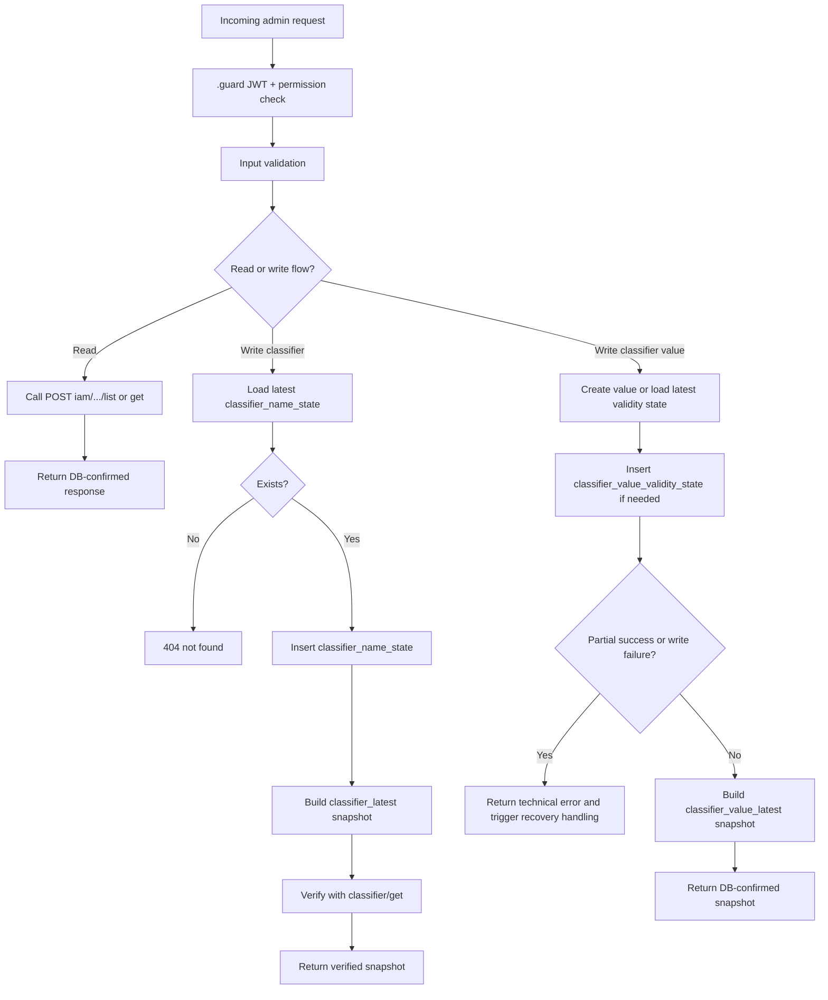

# Epic 09 DSL Plan — Klassifikaatorite haldamine

## 1. Meta

- **Epic number:** `09`
- **Epic title:** `Klassifikaatorite haldamine`
- **Epic link:** `https://github.com/kemit-ee/ljvis-2/issues/9`
- **Target branch:** `feature/epic_09_dsl`
- **Related docs:**
  - `docs/data_model.md`
  - `docs/permissions-matrix.md`
  - `docs/errors.json`
  - `docs/db_errorhandling_rules.md`
  - `docs/resql/epic_09/README.md`
  - `docs/resql/epic_09/paigaldusjuhend.md`

## 2. Epicu kokkuvõte

Epic 09 katab admin-liidese klassifikaatorite ja klassifikaatori väärtuste lugemise ning muutmise vood. Klassifikaatori päis on talletatud muutumatus `classifier` tabelis, mille loetavad väljad saadakse `classifier_name_state` kaudu kokku ehitatud `classifier_latest` snapshotist. Klassifikaatori väärtused elavad `classifier_value` tabelis ning nende kehtivusperiood on append-only kujul `classifier_value_validity_state` tabelis; loetav vaade saadakse `classifier_value_latest` snapshotist. Kõik write-vood kasutavad verify-after-write mustrit ning pärast kirjutust kutsutakse vastav `state_updater` rebuild, et lõppvastus põhineks snapshoti kinnitatud seisul. Epic sisaldab ka skeemimuudatust, mille jaoks on loodud Liquibase triplet ja indeksid state/latest tabelitele.

## 3. Scope ja väljaspool scope'i

### Scope
- Klassifikaatorite pagineeritud nimekiri
- Klassifikaatori detailvaade
- Klassifikaatori nime ja kirjelduse muutmine
- Klassifikaatori väärtuste pagineeritud nimekiri
- Väärtuse koodi unikaalsuse eelkontroll
- Uue klassifikaatori väärtuse loomine
- Klassifikaatori väärtuse kehtivusperioodi muutmine
- `classifier_latest` snapshot rebuild
- `classifier_value_latest` snapshot rebuild
- Epic 09 skeemimuudatuse Liquibase migration

### Out of scope
- Uue klassifikaatori loomine
- Klassifikaatori kustutamine
- Klassifikaatori väärtuse füüsiline kustutamine
- Public/consumer read endpointid
- Ruuteri GET endpointid

## 4. Sisendallikad ja tõlgendus

| Allikas | Kuidas kasutatakse |
|---------|--------------------|
| Epic issue + subtasks | Funktsionaalne vajadus classifier/classifier_value voogude jaoks |
| `docs/data_model.md` | `classifier*`, `classifier_value*`, `*_latest` ja append-only mudeli valideerimine |
| `docs/db_errorhandling_rules.md` | Verify-after-write, rollback, partial success, stale read ja idempotency reeglid |
| Permissions matrix | `.guard` õiguste määramine admin endpointidele |
| Errors catalog | 401/403/404/409/500/503 vastuste joondamine |
| `docs/resql/epic_09/README.md` | Juba loodud Epic 09 SQL/Ruuter failide loend ja ärivoogude kirjeldus |
| `docs/resql/epic_09/paigaldusjuhend.md` | Paigaldusjärjekord ja runtime path-mudel |
| `DSL/Liquibase/changelog/20260527153102-epic-09-classifier-management-schema.*` | Skeemimuudatuse ja indeksite täpne kirjeldus |

## 5. Loodavate failide täpne nimekiri

| Failitee | Tüüp | Eesmärk |
|---------|------|---------|
| `DSL/Resql/POST/iam/classifier/v1/list.sql` | SQL | Klassifikaatorite pagineeritud nimekiri snapshotist |
| `DSL/Resql/POST/iam/classifier/v1/mock_list.sql` | SQL | Mock klassifikaatorite nimekiri |
| `DSL/Resql/POST/iam/classifier/v1/get.sql` | SQL | Ühe klassifikaatori detail snapshotist |
| `DSL/Resql/POST/iam/classifier/v1/mock_get.sql` | SQL | Mock klassifikaatori detail |
| `DSL/Resql/POST/iam/classifier/v1/update.sql` | SQL | Uus `classifier_name_state` kirje |
| `DSL/Resql/POST/iam/classifier/v1/mock_update.sql` | SQL | Mock uuenduse vastus |
| `DSL/Resql/POST/iam/classifier/v1/get_latest_name_state.sql` | SQL | Viimase nime/state eelkontroll enne muutmist |
| `DSL/Resql/POST/iam/classifier/v1/mock_get_latest_name_state.sql` | SQL | Mock latest-state kontroll |
| `DSL/Resql/POST/iam/classifier_value/v1/list.sql` | SQL | Klassifikaatori väärtuste pagineeritud nimekiri snapshotist |
| `DSL/Resql/POST/iam/classifier_value/v1/mock_list.sql` | SQL | Mock väärtuste nimekiri |
| `DSL/Resql/POST/iam/classifier_value/v1/check_code_exists.sql` | SQL | Väärtuse koodi unikaalsuse kontroll |
| `DSL/Resql/POST/iam/classifier_value/v1/mock_check_code_exists.sql` | SQL | Mock koodi olemasolu kontroll |
| `DSL/Resql/POST/iam/classifier_value/v1/create.sql` | SQL | Uue klassifikaatori väärtuse loomine |
| `DSL/Resql/POST/iam/classifier_value/v1/mock_create.sql` | SQL | Mock create vastus |
| `DSL/Resql/POST/iam/classifier_value/v1/create_validity_state.sql` | SQL | Esmase kehtivus-state kirje loomine |
| `DSL/Resql/POST/iam/classifier_value/v1/mock_create_validity_state.sql` | SQL | Mock validity create vastus |
| `DSL/Resql/POST/iam/classifier_value/v1/update.sql` | SQL | Uus `classifier_value_validity_state` kirje |
| `DSL/Resql/POST/iam/classifier_value/v1/mock_update.sql` | SQL | Mock validity update vastus |
| `DSL/Resql/POST/iam/classifier_value/v1/get_latest_validity_state.sql` | SQL | Viimase kehtivus-state kontroll |
| `DSL/Resql/POST/iam/classifier_value/v1/mock_get_latest_validity_state.sql` | SQL | Mock latest validity state |
| `DSL/Resql/POST/state_updater/classifier_latest/build.sql` | SQL | `classifier_latest` snapshot rebuild |
| `DSL/Resql/POST/state_updater/classifier_latest/mock_build.sql` | SQL | Mock snapshot rebuild vastus |
| `DSL/Resql/POST/state_updater/classifier_value_latest/build.sql` | SQL | `classifier_value_latest` snapshot rebuild |
| `DSL/Resql/POST/state_updater/classifier_value_latest/mock_build.sql` | SQL | Mock snapshot rebuild vastus |
| `DSL/Ruuter/api/POST/v1/admin/classifiers/.guard` | Guard | Ligipääs `classifiers/*` endpointidele |
| `DSL/Ruuter/api/POST/v1/admin/classifiers/list.yml` | Ruuter DSL | Klassifikaatorite listi voog |
| `DSL/Ruuter/api/POST/v1/admin/classifiers/mock_list.yml` | Ruuter DSL | Mock listi voog |
| `DSL/Ruuter/api/POST/v1/admin/classifiers/get.yml` | Ruuter DSL | Klassifikaatori detaili voog |
| `DSL/Ruuter/api/POST/v1/admin/classifiers/mock_get.yml` | Ruuter DSL | Mock detaili voog |
| `DSL/Ruuter/api/POST/v1/admin/classifiers/update.yml` | Ruuter DSL | Klassifikaatori nime/kirjelduse muutmise voog |
| `DSL/Ruuter/api/POST/v1/admin/classifiers/mock_update.yml` | Ruuter DSL | Mock update voog |
| `DSL/Ruuter/api/POST/v1/admin/classifier-values/.guard` | Guard | Ligipääs `classifier-values/*` endpointidele |
| `DSL/Ruuter/api/POST/v1/admin/classifier-values/list.yml` | Ruuter DSL | Väärtuste listi voog |
| `DSL/Ruuter/api/POST/v1/admin/classifier-values/mock_list.yml` | Ruuter DSL | Mock väärtuste list |
| `DSL/Ruuter/api/POST/v1/admin/classifier-values/check_code_exists.yml` | Ruuter DSL | Koodi eelkontrolli voog |
| `DSL/Ruuter/api/POST/v1/admin/classifier-values/mock_check_code_exists.yml` | Ruuter DSL | Mock eelkontroll |
| `DSL/Ruuter/api/POST/v1/admin/classifier-values/create.yml` | Ruuter DSL | Väärtuse loomise voog |
| `DSL/Ruuter/api/POST/v1/admin/classifier-values/mock_create.yml` | Ruuter DSL | Mock loomise voog |
| `DSL/Ruuter/api/POST/v1/admin/classifier-values/update.yml` | Ruuter DSL | Kehtivusperioodi muutmise voog |
| `DSL/Ruuter/api/POST/v1/admin/classifier-values/mock_update.yml` | Ruuter DSL | Mock update voog |
| `DSL/Liquibase/changelog/20260527153102-epic-09-classifier-management-schema.sql` | Liquibase | Epic 09 skeemimuudatus ja indeksid |
| `DSL/Liquibase/changelog/20260527153102-epic-09-classifier-management-schema-rollback.sql` | Liquibase | Skeemimuudatuse rollback |
| `DSL/Liquibase/changelog/20260527153102-epic-09-classifier-management-schema.xml` | Liquibase | Liquibase changeset viitega forward/rollback SQL-idele |
| `docs/resql/epic_09/README.md` | Documentation | Epic 09 tehniline kokkuvõte |
| `docs/resql/epic_09/paigaldusjuhend.md` | Documentation | Paigaldusjuhend |

## 6. Andmemudel ja ärireeglid

### Seotud tabelid
- `classifier` — immutable classifier root, sisaldab unikaalset `code`
- `classifier_name_state` — append-only nimi/kirjeldus ajalugu
- `classifier_value` — immutable väärtuse tüvi (`classifier_id`, `code`, `name`)
- `classifier_value_validity_state` — append-only kehtivusperioodide ajalugu
- `classifier_latest` — fat snapshot klassifikaatori lugemiseks
- `classifier_value_latest` — fat snapshot väärtuste lugemiseks koos `is_valid` väljaga

### Read mudelid
- `classifiers/list` ja `classifiers/get` loevad `classifier_latest` tabelist
- `classifier-values/list` loeb `classifier_value_latest` tabelist
- Verify samm pärast `classifiers/update` loeb `classifier_latest` tabelist
- `classifier-values/create` ja `classifier-values/update` lõppvastus tuleb `classifier_value_latest` snapshot rebuildi tulemusest

### Write mudelid
- Klassifikaatori muutmine lisab uue kirje `classifier_name_state` tabelisse
- Väärtuse loomine lisab kirje `classifier_value` tabelisse ja seejärel algse kirje `classifier_value_validity_state` tabelisse
- Väärtuse muutmine lisab uue kirje `classifier_value_validity_state` tabelisse
- Ühtegi `UPDATE` ega `DELETE` käsku ei kasutata

### Latest state reegel
- `classifier_name_state` latest leitakse `classifier_id` järgi `ORDER BY created_at DESC, id DESC LIMIT 1`
- `classifier_value_validity_state` latest leitakse `classifier_value_id` järgi `ORDER BY created_at DESC, id DESC LIMIT 1`
- Snapshot rebuild peab alati kasutama viimast state-kirjet ja tagastama DB-kinnitatud tulemuse

### Liquibase ja indeksid
Epic 09 muudab skeemi, seega blueprint sisaldab Liquibase tripletit. Olemasolev migration lisab järgmised olulised indeksid:
- `idx_cns_classifier_id_created_at` — kiire latest lookup `classifier_name_state` tabelis
- `idx_cvvs_value_id_created_at` — kiire latest lookup `classifier_value_validity_state` tabelis
- `idx_cl_classifier_id_created_at`, `idx_cl_code`, `idx_cl_name_lower` — classifier read/list/sort mustrid
- `idx_cvl_classifier_value_id_created_at`, `idx_cvl_classifier_id`, `idx_cvl_classifier_code`, `idx_cvl_code`, `idx_cvl_is_valid` — value list/filter/current-valid mustrid

## 7. Detailne Ruuteri loogika

### classifiers/list
1. Guard kontrollib JWT olemasolu ja vähemalt üht õigust: `classifier.list`, `classifier.read` või `classifier.edit`.
2. Ruuter valideerib `page`, `pageSize` ja valikulise `search` välja.
3. Kutsub `[#LOCAL_RESQL]/ljvis2/iam/classifier/v1/list`.
4. Tagastab DB vastuse muutmata kujul.

### classifiers/get
1. Guard kontrollib JWT ja õiguseid.
2. Valideeritakse `classifierId`.
3. Kutsub `[#LOCAL_RESQL]/ljvis2/iam/classifier/v1/get`.
4. Kui vastus puudub, tagastab 404.
5. Muidu tagastab DB-kinnitatud snapshoti.

### classifiers/update
1. Kaustapõhine guard kontrollib JWT olemasolu ja baasõiguseid, kuid endpoint ise kontrollib enne write sammu eraldi `classifier.edit` õigust.
2. Valideeritakse `classifierId`, `name`, valikuline `description`, `createdBy`.
3. Kutsub `[#LOCAL_RESQL]/ljvis2/iam/classifier/v1/get_latest_name_state`, et veenduda klassifikaatori olemasolus.
4. Kui kirjet ei leita, tagastab 404.
5. Kutsub `[#LOCAL_RESQL]/ljvis2/iam/classifier/v1/update`, mis lisab uue `classifier_name_state` kirje.
6. Kontrollib, et write vastus ei oleks tühi.
7. Kutsub `[#LOCAL_RESQL]/ljvis2/state_updater/classifier_latest/build` snapshoti rebuildiks.
8. Kui rebuild vastus on tühi, tagastab tehnilise vea.
9. Kutsub `[#LOCAL_RESQL]/ljvis2/iam/classifier/v1/get`, et verify-after-write põhjal tagastada lõppseis.
10. Tagastab ainult verifitseeritud snapshoti.

### classifier-values/list
1. Guard kontrollib JWT ja õiguseid `classifier.read` või `classifier_value.edit`.
2. Valideeritakse `classifierId`, `page`, `pageSize`.
3. Kutsub `[#LOCAL_RESQL]/ljvis2/iam/classifier_value/v1/list`.
4. Tagastab DB-kinnitatud nimekirja.

### classifier-values/check_code_exists
1. Kaustapõhine guard kontrollib JWT olemasolu ja baasõiguseid, kuid endpoint ise kontrollib eraldi `classifier_value.edit` õigust.
2. Valideeritakse `classifierId` ja `code`.
3. Kutsub `[#LOCAL_RESQL]/ljvis2/iam/classifier_value/v1/check_code_exists`.
4. Tagastab olemasolu bool-vastuse.

### classifier-values/create
1. Kaustapõhine guard kontrollib JWT olemasolu ja baasõiguseid, kuid endpoint ise kontrollib enne write sammu eraldi `classifier_value.edit` õigust.
2. Valideeritakse `classifierId`, `code`, `name`, `validFrom`, valikuline `validUntil`, `createdBy`.
3. Kutsub `[#LOCAL_RESQL]/ljvis2/iam/classifier_value/v1/check_code_exists` ja katkestab voo `409` conflict vastusega, kui kood on juba kasutusel.
4. Kutsub `[#LOCAL_RESQL]/ljvis2/iam/classifier_value/v1/create`.
5. Kui create vastus puudub, tagastab tehnilise vea.
6. Kutsub `[#LOCAL_RESQL]/ljvis2/iam/classifier_value/v1/create_validity_state` loodud `classifierValueId` põhjal.
7. Kui validity state kirjutus ebaõnnestub, tekib partial-success olukord, mis tuleb käsitleda tehnilise veana ja taastamisvoona.
8. Kutsub `[#LOCAL_RESQL]/ljvis2/state_updater/classifier_value_latest/build` snapshot rebuildiks.
9. Kui snapshot rebuild ebaõnnestub, tagastab tehnilise vea.
10. Tagastab snapshot rebuildi DB-kinnitatud tulemuse.

### classifier-values/update
1. Kaustapõhine guard kontrollib JWT olemasolu ja baasõiguseid, kuid endpoint ise kontrollib enne write sammu eraldi `classifier_value.edit` õigust.
2. Valideeritakse `classifierValueId`, `validFrom`, valikuline `validUntil`, `createdBy`.
3. Kutsub `[#LOCAL_RESQL]/ljvis2/iam/classifier_value/v1/get_latest_validity_state`, et veenduda väärtuse olemasolus.
4. Kui latest state puudub, tagastab 404.
5. Kutsub `[#LOCAL_RESQL]/ljvis2/iam/classifier_value/v1/update`, mis lisab uue kehtivus-state kirje.
6. Kontrollib, et write vastus ei oleks tühi.
7. Kutsub `[#LOCAL_RESQL]/ljvis2/state_updater/classifier_value_latest/build` snapshot rebuildiks.
8. Kui rebuild ebaõnnestub, tagastab tehnilise vea.
9. Tagastab rebuilditud snapshoti.

### state_updater/classifier_latest/build
1. Sisendiks `classifierId`, `createdBy`.
2. Loeb `classifier` ja viimase `classifier_name_state` kirje.
3. Lisab uue `classifier_latest` snapshot kirje.
4. Tagastab lisatud snapshot rea.

### state_updater/classifier_value_latest/build
1. Sisendiks `classifierValueId`, `createdBy`.
2. Loeb `classifier_value`, viimase kehtivus-state kirje ning vajaliku klassifikaatori koodi.
3. Arvutab `is_valid` välja kehtivuskuupäevade järgi.
4. Lisab uue `classifier_value_latest` snapshot kirje.
5. Tagastab lisatud snapshot rea.

## 8. Ruuteri kontrollide flow

## 9. Permissions matrix põhine ligipääsutabel

| Endpoint | Permission | Roles | Scope rule | Anonymous |
|----------|------------|-------|------------|-----------|
| `/api/v1/admin/classifiers/list` | `classifier.list` OR `classifier.read` OR `classifier.edit` | admin | puudub | No |
| `/api/v1/admin/classifiers/get` | `classifier.list` OR `classifier.read` OR `classifier.edit` | admin | puudub | No |
| `/api/v1/admin/classifiers/update` | `classifier.edit` | admin | endpointi write-check peab `classifier.edit` eraldi kinnitama | No |
| `/api/v1/admin/classifier-values/list` | `classifier.read` OR `classifier_value.edit` | admin | puudub | No |
| `/api/v1/admin/classifier-values/check_code_exists` | `classifier_value.edit` | admin | endpointi permission-check peab `classifier_value.edit` eraldi kinnitama | No |
| `/api/v1/admin/classifier-values/create` | `classifier_value.edit` | admin | endpointi write-check peab `classifier_value.edit` eraldi kinnitama | No |
| `/api/v1/admin/classifier-values/update` | `classifier_value.edit` | admin | endpointi write-check peab `classifier_value.edit` eraldi kinnitama | No |

## 10. Failure-handling ja state-management

Viide: `docs/db_errorhandling_rules.md`

- **Verify-after-write:** `classifiers/update` peab pärast state kirjet ehitama snapshoti ja lugema selle uuesti üle `classifiers/get` kaudu.
- **Classifier value create partial success:** kui `classifier_value` kirje luuakse, aga `create_validity_state` ebaõnnestub, on süsteem osalises eduseisundis. Sellisel juhul ei tohi tagastada success-vastust; vajalik on recovery või kompenseeriv käsitlus.
- **Snapshot rebuild failure:** kui `state_updater` ebaõnnestub, ei tohi success-vastust tagastada, sest read-mudel ei ole veel kooskõlas.
- **Not found handling:** update-vood kontrollivad olemasolu latest-state päringuga ja tagastavad 404 enne write sammu.
- **Constraint handling:** `classifier.code` on unikaalne ja `classifier_value` kasutab unikaalset `(classifier_id, code)` piirangut; enne code-põhist write sammu tuleb teha eelkontroll ning duplikaadi korral tagastada funktsionaalne conflict.
- **Stale read risk:** lõppvastus peab põhinema kas snapshot rebuildi vastusel või eraldi verify lugemisel, mitte sisendi peegeldusel.
- **Idempotency:** `check_code_exists` vähendab duplicate create riski, kuid tegelik kaitse peab jääma DB constrainti tasemele. `update` vood ei ole rangelt idempotentsed, sest iga edukas muutus lisab uue state kirje.
- **Latest state rule:** kõik state-tabelite lugemised peavad kasutama `created_at DESC, id DESC` järjestust, et sama ajatempli korral jääks deterministlik järjekord.

## 11. SQL / Ruuter / Guard checklist

- [ ] Kõik read kasutavad `*_latest` snapshot tabeleid
- [ ] SQL-is puudub `JOIN`
- [ ] SQL-is puudub `UPDATE`
- [ ] SQL-is puudub `DELETE`
- [ ] Kõik write vood sisaldavad verify-after-write või DB-kinnitatud snapshot sammu
- [ ] Kõik state muudatused on append-only kujul
- [ ] Rollback või recovery voog on kirjeldatud
- [ ] Partial success on classifier value create voo jaoks kirjeldatud
- [ ] Idempotency/rerun risk on käsitletud
- [ ] Guard reeglid klapivad permissions loogikaga
- [ ] `edit` / `update` / `create` endpointid teevad vajadusel endpointi-tasemel range write-permission kontrolli
- [ ] Code-põhised write endpointid teevad enne DB write sammu `check_code_exists` või samaväärse eelkontrolli
- [ ] Mock failid on planeeritud kõigile production failidele
- [ ] Liquibase triplet on olemas
- [ ] `_state` / `_status` indeksid on põhjendatud
- [ ] `*_latest` indeksid on põhjendatud
- [ ] `state_updater` URL-id kasutavad kuju `[#LOCAL_RESQL]/ljvis2/state_updater/<entiteet>/build`
- [ ] Tavalised RESQL URL-id kasutavad kuju `[#LOCAL_RESQL]/ljvis2/iam/<entiteet>/v1/<operatsioon>`

## 12. Avatud küsimused

- Kas snapshot rebuildi ebaõnnestumisel on vaja eraldi kompenseerivat RESQL taastamisvoogu või piisab tehnilisest veast ja operatiivseks käsitluseks logimisest?
