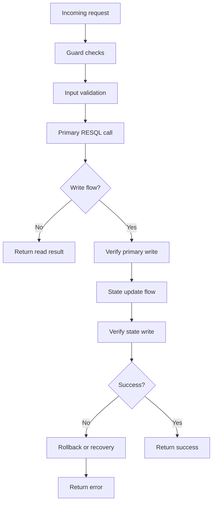

# Epic XX DSL Plan

See fail on epicu XX DSL blueprint

## 1. Meta

- **Epic number:** `XX`
- **Epic title:** `<Epic title>`
- **Epic link:** `<GitHub issue link>`
- **Target branch:** `feature/epic_XX_dsl`
- **Related docs:**
  - `docs/data_model.md`
  - `docs/permissions-matrix.md` või `planning/docs/permissions-matrix.md`
  - `docs/errors.json` või `planning/docs/errors.json`
  - `docs/db_errorhandling_rules.md`

## 2. Epicu kokkuvõte

Kirjelda 3–7 lausega:
- mida epic funktsionaalselt teeb,
- millised üksused/entiteedid on seotud,
- millised ärivoogude sammud tuleb katta,
- millised read/write vood tekivad.

## 3. Scope ja väljaspool scope'i

### Scope
- `<funktsioon 1>`
- `<funktsioon 2>`

### Out of scope
- `<teadlikult välja jäetud teema>`

## 4. Sisendallikad ja tõlgendus

| Allikas | Kuidas kasutatakse |
|---------|--------------------|
| Epic issue + subtasks | Funktsionaalne vajadus |
| `docs/data_model.md` | Tabelid, väljad, `_latest` mudel |
| `docs/db_errorhandling_rules.md` | Failure-handling, rollback, verify-after-write |
| Permissions matrix | `.guard` ja ligipääsutabel |
| Errors catalog | API veavastused |

## 5. Loodavate failide täpne nimekiri

| Failitee | Tüüp | Eesmärk |
|---------|------|---------|
| `DSL/Resql/POST/<module>/<entity>/v1/<operation>.sql` | SQL | Production query |
| `DSL/Resql/POST/<module>/<entity>/v1/mock_<operation>.sql` | SQL | Mock query |
| `DSL/Ruuter/api/POST/v1/admin/<entity>/<operation>.yml` | Ruuter DSL | Production route |
| `DSL/Ruuter/mockapi/POST/v1/admin/<entity>/<operation>.yml` | Ruuter DSL | Mock route |
| `DSL/Ruuter/api/POST/v1/admin/<entity>/.guard` | Guard | Ligipääsureegel |
| `DSL/Ruuter/mockapi/POST/v1/admin/<entity>/.guard` | Guard | Tingimusteta lubav mock guard |
| `docs/<epic_folder>/README.md` | Documentation | Epicu tehniline kokkuvõte |
| `docs/<epic_folder>/paigaldusjuhend.md` | Documentation | Paigaldusjuhend |

Lisa siia päris epicu puhul iga reaalse faili kohta eraldi rida ja lühikommentaar.

## 6. Andmemudel ja ärireeglid

- Kirjelda seotud tabeleid ja miks neid kasutatakse.
- Kirjelda, millised read kasutavad `*_latest` tabeleid.
- Kirjelda, millised kirjutused tekitavad uue `_state` kirje.
- Kirjelda, mis on `latest state` leidmise täpne reegel.

## 7. Detailne Ruuteri loogika

Kirjelda iga endpointi voog sammudena:

1. sisendi valideerimine,
2. autoriseerimine (`.guard`),
3. esmane RESQL päring või kirjutus,
4. verify-after-write,
5. vajadusel `_state` kirjutus,
6. rollback või recovery voog,
7. lõppvastus.

Kui endpoint kasutab `GET` meetodit, siis see tohib olla ainult parameetrita listpäring ning Ruuter ei tohi RESQL-ile saata body, query ega path parameetreid.

## 8. Ruuteri kontrollide Mermaid flow

Epicu tegelikus plaanis asenda see diagramm konkreetse voo ja otsustustega.

## 9. Permissions matrix põhine ligipääsutabel

| Endpoint | Permission | Roles | Scope rule | Anonymous |
|----------|------------|-------|------------|-----------|
| `/api/v1/admin/<entity>/<operation>` | `<permission.code>` | `<roles>` | `<rule>` | No |

## 10. Failure-handling ja state-management epicu lõikes

Viita `docs/db_errorhandling_rules.md` failile ja täpsusta epicu-spetsiifiliselt:
- mis on võimalikud partial-success olukorrad,
- milline rollback või recovery voog kehtib,
- millal loetakse operatsioon edukaks,
- millal tagastatakse funktsionaalne error,
- millal tagastatakse tehniline error.

## 11. SQL / Ruuter / Guard checklist

- [ ] Kõik read kasutavad lubatud mudeleid (`*_latest`, kui vaja)
- [ ] SQL-is puudub `JOIN`
- [ ] SQL-is puudub `UPDATE`
- [ ] SQL-is puudub `DELETE`
- [ ] Kõik write vood sisaldavad verify-after-write sammu
- [ ] Kõik `_state` muudatused kasutavad kopeeri-ja-muuda mustrit
- [ ] Rollback või recovery voog on kirjeldatud
- [ ] Partial success on kirjeldatud
- [ ] Idempotency/rerun risk on käsitletud
- [ ] Guard reeglid klapivad permission matrixiga
- [ ] Mock failid on planeeritud
- [ ] GET endpointid on ainult parameetrita listide jaoks
- [ ] GET vood ei edasta RESQL-ile sisendparameetreid
- [ ] Dokumentatsiooni failid on planeeritud

## 12. Avatud küsimused

- `<küsimus 1>`
- `<küsimus 2>`
