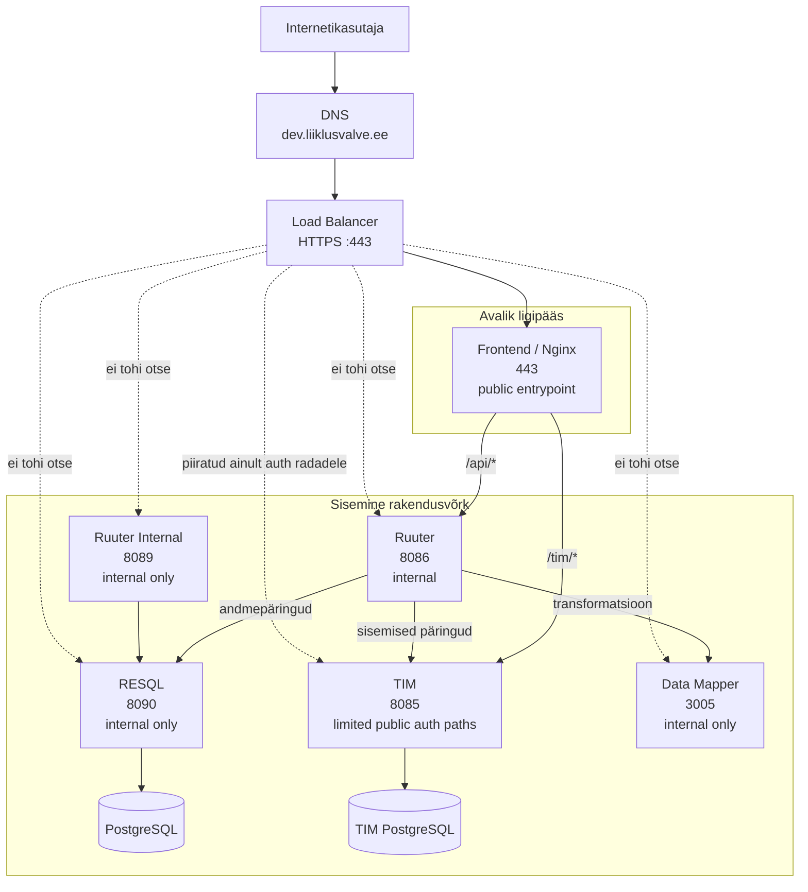

# LJVIS2 infra-spetsiifiline ligipääsuvaade

See dokument on mõeldud **infra / platvormi / võrgu** vaatele.
Fookus ei ole rakenduse sisemisel loogikal, vaid sellel:

- milline on **avalik sissepääs** süsteemi
- millised komponendid on **internetist kättesaadavad**
- millised komponendid on **ainult sisemiselt kättesaadavad**
- kuidas peab liiklus liikuma läbi `Load Balancer` -> `Frontend` -> `Ruuter` / `TIM`
- milliste teenusteni **ei tohi** avalik liiklus jõuda, näiteks `RESQL`

## Eesmärk

Infra vaatest on oluline, et:

- **Load Balancer** võtaks vastu välise HTTPS liikluse
- liiklus jõuaks esmalt **Frontend** teenuseni
- `Frontend` suunaks edasi ainult vajalikud rajad
- `Ruuter`, `Ruuter Internal`, `RESQL` ja `Data Mapper` ei oleks otse avalikult eksponeeritud, kui selleks ei ole eraldi põhjendatud vajadust
- `TIM` oleks avalikult kättesaadav ainult autentimiseks vajalike endpointide ulatuses
- `RESQL` oleks **ainult sisemise võrgu teenus**

## Avalik aadress

- **Dev / test avalik aadress**: `https://dev.liiklusvalve.ee/`
- **Transport**: HTTPS
- **Frontend**: kuulab porti `443`
- **Dev sertifikaat**: self-signed

## Infra taristu diagramm

## Ligipääsu põhimõte

### Avalikult lubatud

- **Load Balancer / Ingress**
  - võtab vastu HTTPS liikluse aadressile `dev.liiklusvalve.ee`

- **Frontend**
  - on avalik sisenemispunkt
  - kuulab porti `443`
  - teenindab UI-d
  - suunab päringud edasi sisemistele teenustele

### Piiratud avaliku ligipääsuga

- **TIM**
  - vajab autentimisvoo jaoks piiratud avalikku ligipääsu
  - soovituslikult ainult kindlatele radadele, näiteks `/tim/*`
  - ei tohiks olla üldise public teenusena täielikult avatav

### Avalikult mittelubatud

- **Ruuter**
  - ei tohiks olla otse internetist kättesaadav
  - sinna peaks jõudma ainult `Frontend` kaudu

- **RESQL**
  - ei tohi olla internetist kättesaadav
  - sellele peab ligi pääsema ainult rakenduse sisemine kiht, eeskätt `Ruuter`

- **Ruuter Internal**
  - ainult sisemiste voogude jaoks
  - mitte avalikustada

- **Data Mapper**
  - ainult sisemine teenus
  - mitte avalikustada

- **Andmebaasid**
  - mitte avalikud
  - ainult teenuste sisemised ühendused

## Soovituslik path-based routing

Infra vaatest võiks avalik liiklus olla piiratud järgmiste teedega:

- **`/`**
  - Frontendi staatiline sisu

- **`/api/*`**
  - jõuab `Frontend` kaudu `Ruuter` teenuseni

- **`/tim/*`**
  - jõuab `Frontend` kaudu `TIM` teenuseni
  - need on TIM-i avalikult vajalikud autentimise endpointid

See tähendab, et avalik liiklus ei tohiks minna otse selliste teenusteni nagu:

- `RESQL`
- `Ruuter Internal`
- `Data Mapper`
- andmebaasid

## Liiklusvood

### Lubatud voog

1. Kasutaja teeb HTTPS päringu aadressile `https://dev.liiklusvalve.ee/`
2. `Load Balancer` suunab liikluse `Frontend` teenusele
3. `Frontend` teenindab UI-d või suunab edasi:
   - `/api/*` -> `Ruuter`
   - `/tim/*` -> `TIM`
4. `Ruuter` võib edasi suhelda sisemiselt teenustega:
   - `RESQL`
   - `Data Mapper`
   - `TIM`
5. `TIM` teenindab autentimiseks vajalikud endpointid ja suhtleb vajadusel edasi oma sisemiste sõltuvustega
6. `RESQL` suhtleb andmebaasiga

### Mitte-lubatud voog

Järgmised vood peaksid olema infra tasemel blokeeritud või vähemalt mitte eksponeeritud:

- `Internet -> RESQL`
- `Internet -> Ruuter Internal`
- `Internet -> Data Mapper`
- `Internet -> Database`
- `Internet -> TIM PostgreSQL`
- `Internet -> Ruuter` otse, kui arhitektuur näeb ette, et sisenemine käib läbi `Frontend`-i
- `Internet -> TIM` otse kõigile endpointidele, mitte ainult autentimiseks vajalikele radadele

## Infra kontrollnimekiri

- **LB ainult HTTPS**
  - avalik sissepääs on `443`

- **Frontend on ainus public rakendusteenus**
  - välisliiklus maandub esmalt frontendile

- **Path-based routing on kontrollitud**
  - `Frontend` teenindab UI-d
  - `Frontend` suunab `/api/*` -> `Ruuter`
  - `Frontend` suunab `/tim/*` -> `TIM`

- **Internal teenused ei ole avalikud**
  - `RESQL`
  - `Ruuter Internal`
  - `Data Mapper`
  - andmebaasid

- **TIM ligipääs on piiratud**
  - ainult vajalikud autentimise rajad
  - soovituslikult läbi `Frontend` / `LB` path-routing kaudu
  - mitte üldine avalik otseühendus kõigile endpointidele

- **Ruuter suhtleb sisemiselt TIM-ga**
  - see side ei pea olema LB kaudu avalik

## Kokkuvõte

Infra vaates on soovitud mudel järgmine:

- **avalik sisenemine toimub läbi Load Balanceri ja Frontendi**
- **Ruuter ei pea olema otse avalik**
- **TIM võib vajada piiratud avalikku ligipääsu autentimise endpointidele**
- **RESQL on ainult sisemine teenus**
- **andmebaasid on ainult privaatvõrgus**
- **avaliku ja sisemise võrgu piir peab olema infrastruktuuris selgelt jõustatud**
