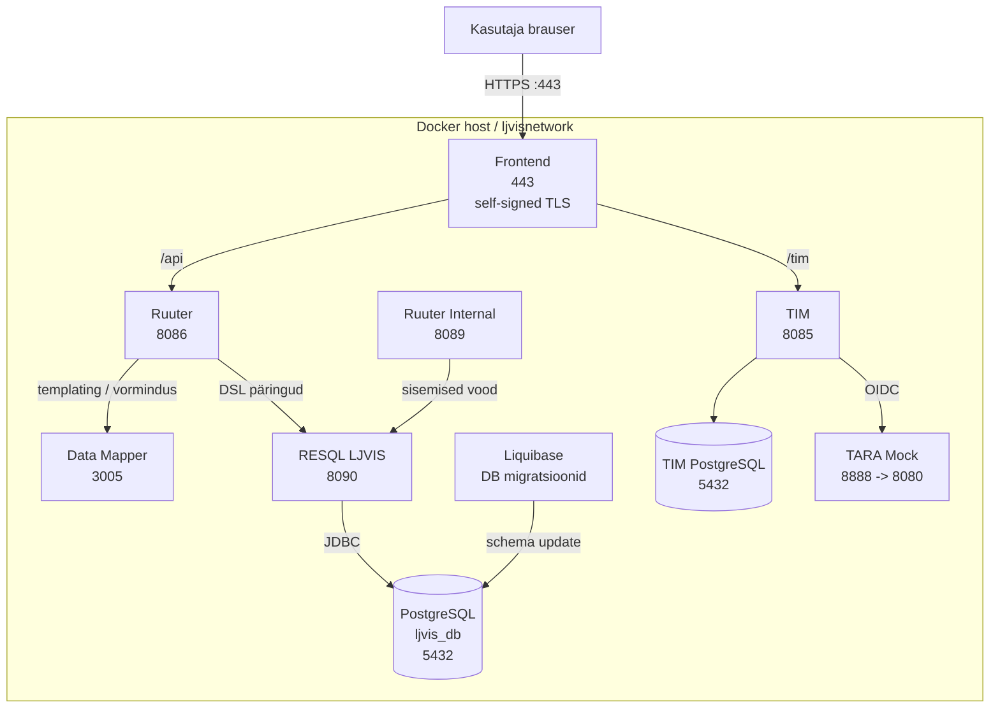
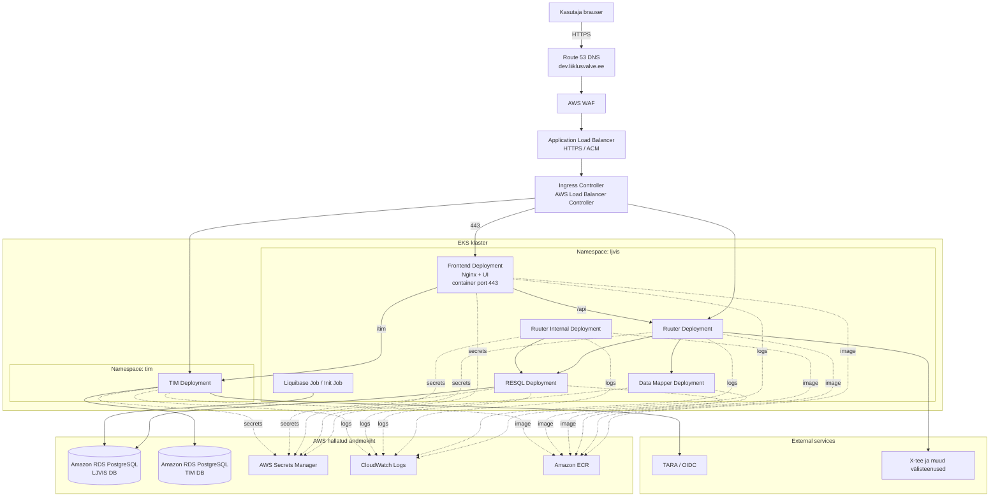
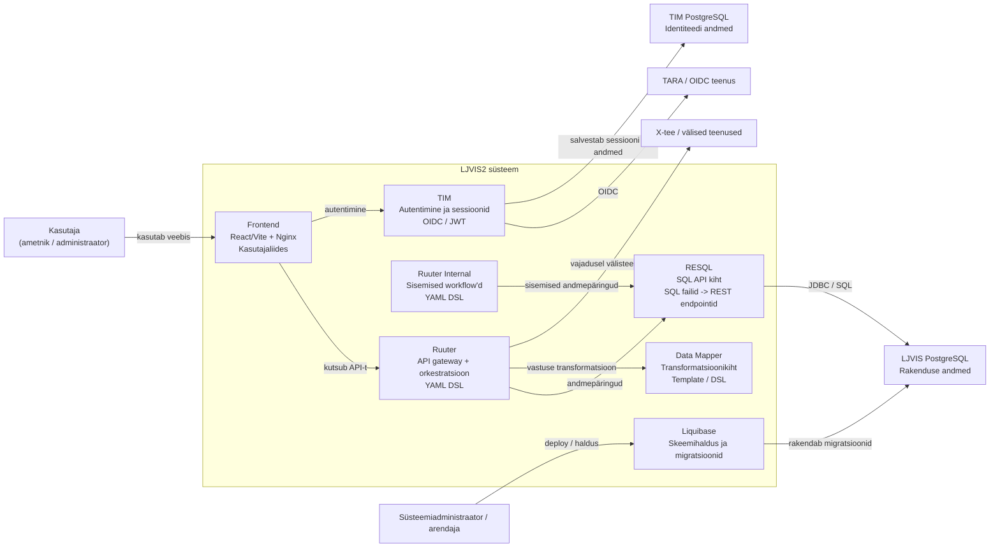

# LJVIS2 taristu vaade

See diagramm kirjeldab **praegust lokaalse/dev keskkonna taristut**. Arenduskeskkonna avalik aadress on `https://dev.liiklusvalve.ee/`.

## Taristu diagramm

## Teenused ja rollid

- **Frontend**
  - Nginx-i taga jooksev kasutajaliides
  - Avaldatud port: `443:443`
  - Arenduskeskkonna avalik aadress on `https://dev.liiklusvalve.ee/`
  - Dev-keskkonnas kasutab self-signed TLS sertifikaati
  - Suunab API päringud `Ruuter` teenusele ja autentimise `TIM` teenusele

- **Ruuter**
  - Väline API kiht
  - Avaldatud port: `8086:8086`
  - Kasutab `DSL/Ruuter` vooge
  - Suhtleb `RESQL` ja `Data Mapper` teenustega

- **Ruuter Internal**
  - Sisemiste voogude API kiht
  - Avaldatud port: `8089:8089`
  - Kasutab `DSL/Ruuter.internal` vooge

- **RESQL LJVIS**
  - SQL mikroteenus andmebaasiga suhtlemiseks
  - Avaldatud port: `8090:8090`
  - Ühendub PostgreSQL andmebaasiga JDBC kaudu

- **Data Mapper**
  - Mallide ja andmete vormindamise kiht
  - Avaldatud port: `3005:3005`
  - Kasutab `DSL` sisu ja Handlebars vaateid

- **Database**
  - PostgreSQL 14.1
  - Hosti port: `54321`, konteineri port: `5432`
  - Andmed salvestatakse kausta `./data`

- **Liquibase**
  - Skeemi ja algandmete migratsioonid
  - Käivitub pärast andmebaasi healthcheck'i
  - Kasutab `DSL/Liquibase` changelog'e

- **TIM**
  - Autentimise/identiteedi teenus
  - Avaldatud port: `8085:8085`
  - Kasutab eraldi PostgreSQL andmebaasi

- **TIM PostgreSQL**
  - TIM teenuse eraldi andmebaas
  - Hosti port: `9876`, konteineri port: `5432`

- **TARA Mock**
  - Ainult lokaalse arenduse / CI jaoks
  - Avaldatud port: `8888:8080`
  - TIM kasutab seda OIDC teenusena arenduskeskkonnas

## Portide ülevaade

| Teenus | Host port | Container port | Eesmärk |
|---|---:|---:|---|
| Frontend | 443 | 443 | HTTPS kasutajaliides (self-signed cert) |
| Ruuter | 8086 | 8086 | Väline API |
| Ruuter Internal | 8089 | 8089 | Sisemine API |
| Data Mapper | 3005 | 3005 | Mallid / vormindus |
| RESQL LJVIS | 8090 | 8090 | SQL teenus |
| Database | 54321 | 5432 | LJVIS andmebaas |
| TIM | 8085 | 8085 | Autentimine |
| TIM PostgreSQL | 9876 | 5432 | TIM andmebaas |
| TARA Mock | 8888 | 8080 | Dev OIDC mock |

## Põhilised andmevood

### Kasutaja vaade

1. Brauser avab `Frontend` teenuse üle HTTPS-i aadressil `https://dev.liiklusvalve.ee/`
2. Frontend kuulab porti `443`
3. Frontend kasutab dev-keskkonnas self-signed sertifikaati
4. Frontend saadab API päringud `Ruuter` teenusele
5. `Ruuter` kasutab äriloogika voogude jaoks `RESQL` ja vajadusel `Data Mapper` teenust
6. `RESQL` loeb või kirjutab andmeid `Database` teenusesse

### Autentimise vaade

1. Frontend suunab autentimisega seotud päringud `TIM` teenusele
2. `TIM` kasutab oma andmebaasi `TIM PostgreSQL`
3. Dev-keskkonnas suhtleb `TIM` teenus `TARA Mock` teenusega

### Andmebaasi elutsükkel

1. `Database` käivitub
2. `Liquibase` ootab andmebaasi healthcheck'i
3. `Liquibase` rakendab skeemi- ja andmemigratsioonid
4. Rakendusteenused kasutavad valmis skeemi

## Märkused

- Kõik teenused on samas Docker võrgus: `ljvisnetwork`
- `TARA Mock` on ainult **local dev / CI** jaoks, mitte productionis
- Diagramm ei kirjelda Kubernetes/Helm production paigutust, vaid olemasolevat `docker-compose` põhist taristut

## AWS production / Kubernetes target taristu

See vaade kirjeldab **soovituslikku production-paigutust AWS-is**, kui LJVIS2 viiakse Kubernetesesse.
See ei põhine olemasolevatel Helm chartidel repo sees, vaid olemasolevate teenuste loogilisel paigutusel EKS/Kubernetes keskkonda.

### Production taristu diagramm

### Soovituslik Kubernetes paigutus

- **Ingress / ALB**
  - AWS ALB lõpetab TLS-i ACM sertifikaadiga
  - Väline aadress on `https://dev.liiklusvalve.ee`
  - Ingress route'ib liikluse teenustele `frontend`, `ruuter` ja `tim`

- **Frontend Deployment**
  - Teenindab staatilist UI-d
  - Väliselt avaldatud üle HTTPS aadressil `https://dev.liiklusvalve.ee`
  - Frontend konteiner kuulab porti `443`
  - Ei räägi otse andmebaasiga
  - Suhtleb `Ruuter` ja `TIM` teenustega

- **Ruuter Deployment**
  - Väline API ja äriloogika orkestratsioon
  - Võimalik eraldi `Service`
  - Võib vajada HPA-d, kui API koormus kasvab

- **Ruuter Internal Deployment**
  - Sisemised vood
  - Soovituslikult **mitte** avalikult eksponeeritud
  - Ligipääs ainult klastri sees

- **RESQL Deployment**
  - Andmebaasipäringute teenus
  - Ligipääs ainult sisemiselt klastri võrgus

- **Data Mapper Deployment**
  - Transformatsiooniteenus
  - Ligipääs ainult sisemiselt klastri võrgus

- **Liquibase Job**
  - Käivitub deploy käigus eraldi `Job` või `init job` kujul
  - Rakendab skeemimuudatused enne rakenduste täielikku rollout'i

- **TIM Deployment**
  - Autentimise teenus
  - Suhtleb TARA-ga ja oma eraldi andmebaasiga

- **RDS PostgreSQL**
  - LJVIS põhiandmebaas eraldi instantsina
  - TIM andmebaas soovituslikult eraldi instants või vähemalt eraldi DB/schema turvapiiride tõttu

### Production põhimõtted

- **TARA Mock productionis puudub**
- **TLS lõpetatakse ALB-s ACM sertifikaadiga**
- **Väline frontend URL on `https://dev.liiklusvalve.ee`**
- **Sisemised teenused (`ruuter-internal`, `resql`, `data-mapper`) ei pea olema internetist otse kättesaadavad**
- **Saladused** hoida `Secrets Manager` või Kubernetes Secret + External Secrets lahendusega
- **Logid** saata `CloudWatch Logs`-i
- **Container image'id** hoida `Amazon ECR`-is

## C4-stiilis diagramm

See diagramm näitab LJVIS2 süsteemi **konteineri tasemel** ehk kes mida teeb ja kellega suhtleb.

### C4 Container diagram

### C4 tõlgendus

- **Kasutaja** suhtleb ainult `Frontend`-iga
- **Frontend** ei suhtle kunagi otse andmebaasiga
- **Ruuter** on peamine äriloogika ja orkestratsiooni kiht
- **RESQL** kapseldab andmebaasipäringud REST teenusena
- **Data Mapper** tegeleb ainult andmete ümberkujundamisega
- **TIM** tegeleb autentimisega, mitte äriloogikaga
- **Liquibase** vastutab andmebaasi skeemi muutmise eest

## Soovitus dokumentatsiooni kasutamiseks

- Kasuta faili alguses olevat diagrammi **dev/lokaalse keskkonna** selgitamiseks
- Kasuta AWS production diagrammi **sihtarhitektuuri** aruteluks
- Kasuta C4 diagrammi **süsteemi rollide ja vastutuste** kiireks selgitamiseks
