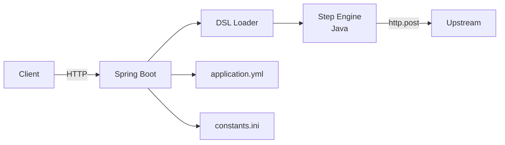
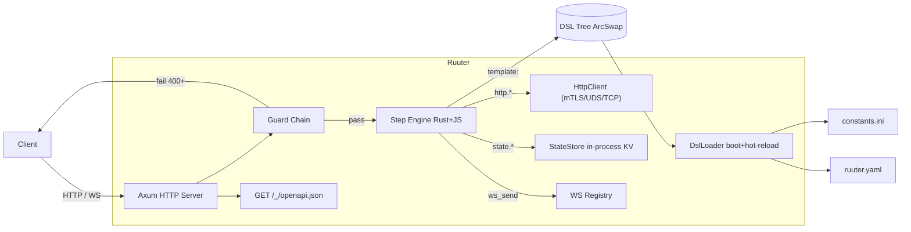
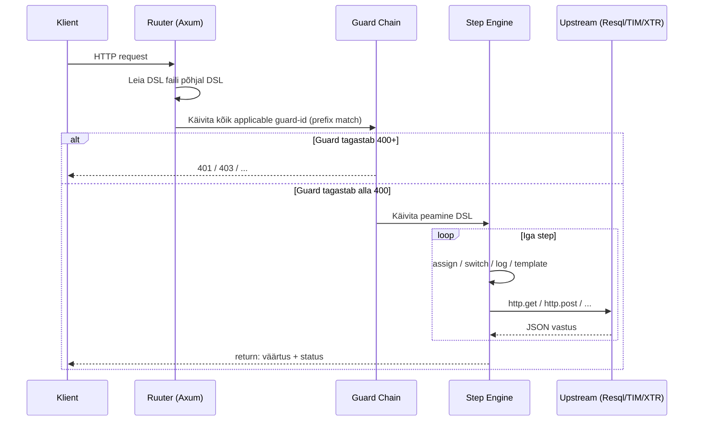
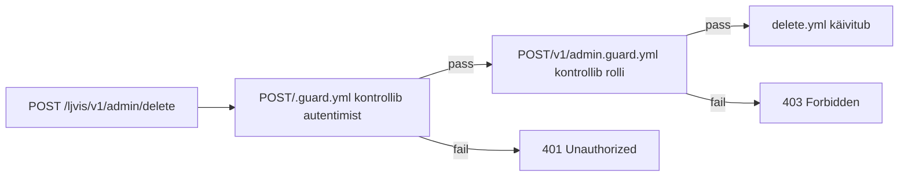

# Migration Guide: Java Ruuter → Rust Ruuter

> **Eesmärk:** See dokument on mõeldud LLM-ile (või arendajale) sisendiks, mille põhjal saab kirjutada toimivad DSL-id, konfiguratsioonid ja guard-failid Rust Ruuteri jaoks. Kõik väited on kontrollitud Ruuteri lähtekoodist (`/Users/viljauss/code/Ruuter`).

---

## Kõige olulisemad muudatused lühidalt

### Teenuse tarbijale (API kasutajale)

Muutub **mitte midagi** — URL-id, HTTP meetodid ja vastuse formaadid jäävad samaks. Rust Ruuter on täielikult tagasiühilduv Java Ruuteri URL-skeemiga.

### DSL kirjeldajale (arendajale)

| Teema | Java Ruuter | Rust Ruuter |
|-------|-------------|-------------|
| **Konfiguratsioonifail** | `application.yml` (Spring Boot) | `ruuter.yaml` (projekti juurkaustas) |
| **Konstandiviide** | `[#KEY]` | `[#KEY]` (säilib) **või** uus `#{KEY}` süntaks |
| **Skriptimootor** | — | `${JS avaldis}` (Boa / QuickJS) |
| **Guard failinimed** | `.guard` (ilma laiendita) | `.guard`, `.guard.yml`, `<stem>.guard.yml` — kõik töötavad |
| **`call:` verb** | `http.post` jne | sama: `http.get`, `http.post`, `http.put`, `http.patch`, `http.delete` |
| **`template:` step** | olemas | olemas, sama süntaks |
| **`state:` step** | puudub | **uus** — mälupõhine KV, ainult sama protsessi sees |
| **`iterate:` step** | puudub | **uus** — iteratsioon üle massiivi koos `collect`/`into` |
| **`single_flight:` step** | puudub | **uus** — koondab concurrent sama-key päringud üheks |
| **`ws_send:` step** | puudub | **uus** — WebSocket sõnumite saatmine |
| **SSRF kaitse** | puudub | vaikimisi sees (`block_private_networks: true`) |
| **OpenAPI spec** | puudub | automaatne `GET /_/openapi.json` |
| **Hot-reload** | restart vajalik | opt-in `dsl.allow_dsl_reloading: true` (ainult dev) |
| **Idempotency-Key** | raamistiku sees | eemaldatud — DSL-i vastutus (`state.set` + body hash) |

---

## Arhitektuur

### Java Ruuter



### Rust Ruuter



### Päringu vool (üksikasjalik)



---

## DSL failide struktuur

### Kaustapuu

```
DSL/
└── <project>/              ← projekti nimi (nt "ljvis")
    ├── GET/
    │   ├── <path>.yml      ← endpoint GET /<project>/<path>
    │   ├── <stem>.guard.yml ← kaitseb GET /<project>/<stem>/* (sibling guard)
    │   └── <stem>/
    │       ├── .guard.yml  ← in-folder guard (Java parity)
    │       └── <file>.yml
    ├── POST/
    │   └── ...
    ├── PUT/
    ├── PATCH/
    ├── DELETE/
    ├── WS/                 ← WebSocket endpointid
    ├── triggers/           ← event-trigger DSL-id
    └── sources/            ← WebSocket / event source configs
```

> **Reegel:** `DSL/<project>/<METHOD>/<path>.yml` → endpoint `<METHOD> /<project>/<path>`

### Näide: LJVIS projekt

```
DSL/ljvis/
├── GET/
│   ├── v1/
│   │   ├── users/
│   │   │   ├── .guard.yml            ← kaitseb kõiki /v1/users/* endpointe
│   │   │   ├── local.yml             → GET /ljvis/v1/users/local
│   │   │   └── local/
│   │   │       └── search.yml        → GET /ljvis/v1/users/local/search
│   │   └── vehicle-categories.yml   → GET /ljvis/v1/vehicle-categories
├── POST/
│   ├── auth/
│   │   └── logout.yml               → POST /ljvis/auth/logout
│   └── v1/
│       └── xroad/
│           └── arireg/
│               └── lihtandmed.yml   → POST /ljvis/v1/xroad/arireg/lihtandmed
└── TEMPLATES/
    └── check-user-authority.yml     ← template (ei ole otsene endpoint)
```

---

## DSL sammude (steps) täielik loend

Kõik sammutüübid on defineeritud `src/steps/mod.rs`-is. Iga samm on YAML mapping, mille **esimene võti** määrab sammu tüübi.

### `assign` — muutujate määramine

```yaml
set_user_id:
  assign:
    userId: ${incoming.body.id}
    fullName: ${incoming.body.firstName + ' ' + incoming.body.lastName}
    timestamp: ${Date.now()}
  next: validate
```

**Muutuja kontekst:**
- `incoming.body` — POST/PUT keha (JSON objekt)
- `incoming.params` — URL query parameetrid
- `incoming.headers` — HTTP päised
- `incoming.origin` — kliendi IP
- `<stepName>.response.body` — eelneva HTTP sammu vastuse keha
- `<stepName>.response.status` — eelneva HTTP sammu HTTP staatuskood

### `return` — vastuse tagastamine

```yaml
ok:
  return:
    userId: ${userId}
    name: ${fullName}
  status: 200
  next: end

error:
  return:
    error: "Not found"
  status: 404
  next: end
```

> `next: end` — DSL lõpetamine. Ilma `end`-ita jätkatakse järgmise sammuga.

### `http.*` — HTTP päringud

```yaml
call_resql:
  call: http.post
  args:
    url: "[#LJVIS_RESQL]/v1/users/local/get"
    body:
      personalCode: ${incoming.body.personalCode}
    headers:
      Cookie: ${incoming.headers.cookie}
  result: resqlResponse
  error: handleError
  timeout: 5000
  next: checkResult
```

**Toetatud verbid:** `http.get`, `http.post`, `http.put`, `http.patch`, `http.delete`

**Argumendid:**
- `url` — sihtaadress. `[#KONSTANT]` laetakse `constants.ini`-st
- `body` — JSON keha (POST/PUT/PATCH)
- `query` — URL parameetrid (GET)
- `headers` — HTTP päised
- `content_type` — vaikimisi `application/json`
- `result` — muutuja nimi kuhu vastus salvestatakse
- `error` — sammu nimi mis käivitub vea korral
- `timeout` — timeout millisekundites (vaikimisi: `http_request_timeout` konfiguratsioonist)

> **SSRF kaitse:** vaikimisi on `block_private_networks: true`. Otseühendused privaatsetele IP-dele (10.x, 192.168.x, 172.16.x jne) blokeeritakse. Sisemised teenused (Resql, TIM, DMapper) peavad kasutama `unix_socket_map` või täpset IP aadressi `allowed_ips` loetelus, **või** tuleb `block_private_networks: false` seada (turvariski tõttu ei soovitata).

### `switch` — tingimusloogika

```yaml
check_role:
  switch:
    - condition: ${incoming.headers['x-user-role'] === 'admin'}
      next: adminFlow
    - condition: ${incoming.headers['x-user-role'] === 'officer'}
      next: officerFlow
  next: unauthorized
```

- Tingimused evalueeritakse järjest — esimene `true` võidab
- `switch.next` (väljaspool loendit) = vaikimisi haru kui ükski tingimus ei klapi

### `log` — logimine

```yaml
log_request:
  log: "User ${userId} requested resource ${resourceId} from ${incoming.origin}"
  next: processRequest
```

### `template` — teise DSL-i väljakutse

```yaml
check_auth:
  template: "ljvis/TEMPLATES/check-user-authority"
  request_type: "GET"
  body:
    jwtToken: ${incoming.headers.cookie}
  result: authResult
  next: checkAuthResult
```

- `template` viitab DSL-i teele ilma `.yml`-ta
- Tagastusväärtus on saadaval `<result>.response.body` kaudu
- `TEMPLATES/` alamkaust on konventsioon — Ruuter laeb kõik `.yml` failid, sõltumata kausta nimest

### `state` — mälupõhine KV (uus)

```yaml
save_token:
  state:
    set:
      key: "session_${userId}"
      value: ${jwtToken}
  next: respond

read_token:
  state:
    get:
      key: "session_${userId}"
      into: cachedToken
  next: useToken

delete_token:
  state:
    delete:
      key: "session_${userId}"
  next: done
```

> **Hoiatus:** `state` on **protsessi-sisene** KV — container restart kustutab kõik. Püsivaks andmehoidlaks kasuta Resql-i.

### `iterate` — itereerimine (uus)

```yaml
process_items:
  iterate:
    over: ${incoming.body.items}
    as: item
    do:
      - call: http.post
        args:
          url: "[#RESQL]/v1/item/insert"
          body:
            id: ${item.id}
            name: ${item.name}
        result: insertResult
    collect: ${insertResult.response.body.id}
    into: insertedIds
    max_items: 100
  next: respond
```

### `single_flight` — duplikaatpäringute koondamine (uus)

```yaml
cached_query:
  single_flight:
    key: "user_${incoming.params.userId}"
    ttl_ms: 2000
    do:
      - call: http.get
        args:
          url: "[#RESQL]/v1/users/get?id=${incoming.params.userId}"
        result: dbResult
    result: dbResult
  next: respond
```

---

## Guard failid — detailselt

Guards on DSL-id mis käivituvad **enne** peamist DSL-i. Guard tagastab `status >= 400` → peamine DSL blokeeritakse. Guard tagastab `status < 400` → jätkatakse.

### Kolm guard faili konventsiooni

Kõik kolm on toetatud ja töötavad paralleelselt:

#### 1. Sibling guard (Rust konventsioon) — `<stem>.guard.yml`

```
DSL/ljvis/GET/
├── v1.guard.yml        ← kaitseb /v1/* kõiki GET endpointe
└── v1/
    └── users.yml
```

Guard key: `GET/v1` — kaitseb kõiki DSL-e mille key algab `GET/v1/`-ga.

#### 2. In-folder guard (Java parity) — `.guard.yml` kaustas sees

```
DSL/ljvis/GET/
└── v1/
    ├── .guard.yml      ← kaitseb kõiki /v1/* endpointe (sees olev guard)
    └── users.yml
```

Failinimi on täpselt `.guard.yml` (punkt eespool). Guard key = sisaldav kataloog.

#### 3. `.guard` (ilma laiendita) — Java Ruuteri legacy

Töötab täpselt nagu `.guard.yml`. Tagasiühilduvuseks.

### Guard-ide kihistumine (stacking)

Mitme taseme guard-id **rakenduvad kõik** — need ei asenda üksteist.

```
DSL/ljvis/POST/
├── .guard.yml             ← rakendub KÕIGILE POST endpointidele
└── v1/
    ├── admin.guard.yml    ← rakendub /v1/admin/* endpointidele
    └── admin/
        └── delete.yml     ← saab MÕLEMAD guard-id
```



### Guard override — `declaration.override_ancestors: true`

Konkreetne endpoint võib asendada kõik esivanemad guardid:

```yaml
# DSL/ljvis/POST/v1/admin/force-reset.guard.yml
declaration:
  override_ancestors: true

deny:
  status: 403
  return:
    error: "force-reset is disabled in this environment"
  next: end
```

Selle endpoiniga käivitub **ainult** see guard — mitte `.guard.yml` ega `admin.guard.yml`.

### Näide: autentimise guard LJVIS-i jaoks

```yaml
# DSL/ljvis/POST/.guard.yml — kaitseb kõiki POST endpointe

check_cookie:
  switch:
    - condition: ${!incoming.headers.cookie}
      next: unauthorized
  next: call_tim

call_tim:
  call: http.post
  args:
    url: "[#LJVIS_TIM]/v1/jwt/userinfo"
    headers:
      Cookie: ${incoming.headers.cookie}
  result: timResponse
  error: unauthorized
  next: check_tim_status

check_tim_status:
  switch:
    - condition: ${timResponse.response.status !== 200}
      next: unauthorized
  next: authorized

authorized:
  return:
    message: "Guard passed"
  status: 200
  next: end

unauthorized:
  return:
    error: "Authentication required"
  status: 401
  next: end
```

---

## Konfiguratsioon (`ruuter.yaml`)

Fail asub projekti juurkaustas. Kõik väljad on valikulised — olemas on turvalised vaikeväärtused.

```yaml
# ruuter.yaml — Rust Ruuter konfiguratsioon

config_path: ./DSL          # DSL failide kaust
port: 8080

http_request_timeout: 15000  # ms, vaikimisi 15s
max_step_recursions: 10000   # kaitseb lõpmatu next: tsükli eest
http_response_size_limit: 16777216  # 16 MiB

cors:
  allowed_origins:
    - "https://ljvis.example.com"
  allow_credentials: false

incoming_requests:
  allowed_method_types: [GET, POST, PUT, PATCH, DELETE, OPTIONS]

internal_requests:
  disabled: false
  allowed_urls: []          # tühi = kõik URL-id lubatud
  allowed_ips: []
  block_private_networks: true  # SSRF kaitse — vaikimisi sees!

csrf:
  allowed_origins: []       # tühi = kontroll väljas (sama-origin piisab)
  enforce_on_methods: [POST, PUT, PATCH, DELETE]

optimistic_concurrency:
  require_if_match: false   # true → PUT/PATCH/DELETE ilma If-Match saab 428

scripting:
  max_loop_iterations: 1000000
  max_stack_size: 400

dsl:
  allowed_filetypes: [.yml, .yaml]
  processed_filetypes: [.yml, .yaml]
  allow_dsl_reloading: false  # true ainult arenduses!

logging:
  display_request_content: false
  display_response_content: false
  print_stack_trace: false
  meaningful_errors: false   # true = üksikasjalikumad veateatad

response_default_headers:
  X-Content-Type-Options: nosniff
  X-Frame-Options: DENY
```

### SSRF ja privaatne võrk

Vaikimisi (`block_private_networks: true`) blokeeritakse väljuvad HTTP päringud järgmistele aadressivahemikele:
- `127.0.0.0/8`, `::1` (loopback)
- `10.0.0.0/8`, `172.16.0.0/12`, `192.168.0.0/16` (RFC-1918)
- `169.254.0.0/16`, `fe80::/10` (link-local)
- `fc00::/7` (ULA)

**Lahendused sisemiste teenuste jaoks:**
1. `unix_socket_map` — UDS transport (soovitatav)
2. `internal_requests.allowed_urls` — URL prefiksite whitelist
3. `internal_requests.allowed_ips` — IP whitelist
4. `block_private_networks: false` — KÕIK blokeeringud eemaldatakse (ei soovitata prod-is)

```yaml
# unix_socket_map näide — DSL kirjutab http://resql/query
# aga transport läheb Unix sokli kaudu
unix_socket_map:
  resql: "/var/run/ruuter/resql.sock"
  tim:   "/var/run/ruuter/tim.sock"
```

### Konstandiviited (`constants.ini`)

```ini
[DSL]
LJVIS_RESQL=http://resql:8082
LJVIS_TIM=http://tim:8085
LJVIS_DMAPPER_HBS=http://dmapper:3000
LJVIS_XTR=http://xtr:8080
```

Viide DSL-is: `[#LJVIS_RESQL]` **või** uus `#{LJVIS_RESQL}` süntaks.

> Section headers (`[DSL]`, `[DEFAULT]` jne) on loetud aga ei scoop'i võtmeid — kõik võtmed on globaalsed.

---

## OpenAPI automaatne genereerimine

Rust Ruuter genereerib OpenAPI 3.1 spetsifikatsiooni automaatselt kõigist laetud DSL-idest. Genereeritakse boot-ajal (ja hot-reload'i korral uuesti).

### Endpoint

```
GET /_/openapi.json
```

### Mis genereeritakse automaatselt

Kood: `src/openapi.rs`

| OpenAPI väli | Allikas |
|---|---|
| `paths` | DSL failide struktuur: `DSL/<project>/<METHOD>/<path>.yml` → `/<project>/<path>` |
| `operationId` | `<method>_<project>_<slug>` (nt `post_ljvis_v1_users_local`) |
| `summary` | failinimi ilma laiendita |
| `description` | `declaration.description` kui olemas, muidu auto-tekst |
| `tags` | projekti nimi |
| `responses` | kõik `status:` väärtused `return` sammudes; fallback `200` |
| `parameters` | `declaration.allowed_params` ja `declaration.allowed_header` |
| `requestBody` | `declaration.allowed_body` (ainult POST/PUT/PATCH) |

### `declaration` samm — OpenAPI rikastamine

Lisades DSL-i `declaration` sammu saab OpenAPI speci täpsustada:

```yaml
# DSL/ljvis/POST/v1/users/local.yml
declaration:
  description: "Loo uus kohalik kasutaja"
  allowed_body:
    - personalCode
    - firstName
    - lastName
    - email
  allowed_header:
    - Cookie
  allowed_params: []

validate_input:
  switch:
    - condition: ${!incoming.body.personalCode}
      next: error_missing
  next: call_resql

call_resql:
  call: http.post
  args:
    url: "[#LJVIS_RESQL]/v1/users/local/insert"
    body:
      personalCode: ${incoming.body.personalCode}
      firstName: ${incoming.body.firstName}
  result: insertResult
  next: respond

respond:
  return:
    id: ${insertResult.response.body.id}
  status: 201
  next: end

error_missing:
  return:
    error: "personalCode is required"
  status: 400
  next: end
```

### Postman collection genereerimine

**Käsitsi** (ühekordne):
```bash
# 1. Käivita Ruuter
docker compose up -d

# 2. Lae OpenAPI spec
curl -s http://localhost:8080/_/openapi.json > openapi.json

# 3. Teisenda Postman collection-iks
npx openapi-to-postmanv2 \
    -s openapi.json \
    -o ljvis.postman_collection.json -p
```

**Automaatuuendus** (skript):
```bash
#!/bin/bash
# generate-postman.sh — käivitada pärast DSL muudatusi

set -e
curl -sf http://localhost:8080/_/openapi.json > postman/openapi.json
npx openapi-to-postmanv2 \
    -s postman/openapi.json \
    -o postman/ljvis.postman_collection.json -p
echo "Postman collection updated: postman/ljvis.postman_collection.json"
```

Newman CLI-ga käivitamine:
```bash
newman run postman/ljvis.postman_collection.json \
       -e postman/ljvis.postman_environment.json \
       --env-var "baseUrl=http://localhost:8080"
```

---

## Docker Compose seadistus

```yaml
# docker-compose.yml

ruuter:
  image: turnerrainer/ruuter:rc
  environment:
    - RUST_LOG=info
  volumes:
    - ./DSL/Ruuter/ljvis:/app/DSL/ljvis:ro
    - ./constants.ini:/app/constants.ini:ro
    - ./ruuter.yaml:/app/ruuter.yaml:ro
  ports:
    - "8080:8080"
  read_only: true
  security_opt:
    - no-new-privileges:true
  cap_drop:
    - ALL
```

> **NB:** `DSL/Ruuter/ljvis` mount → `/app/DSL/ljvis` tähendab projekti nimi on `ljvis` ja URL-id on `/<method>/ljvis/<path>`.
>
> Kui soovid `/<method>/<path>` (ilma `ljvis` prefiksita), mount `/app/DSL` otse.

---

## Muutuvad failid üleviimisel

### Failid mis **ei muutu**

- `DSL/Ruuter/ljvis/**/*.yml` — DSL YAML-id on ühilduvad (samad sammutüübid)
- `constants.ini` — sama formaat, sama süntaks `[#KEY]`
- `DSL/Ruuter/ljvis/**/.guard` — Java-legacy guard failid töötavad

### Failid mis **muutuvad**

| Java Ruuter | Rust Ruuter | Muudatus |
|---|---|---|
| `application.yml` (Spring) | `ruuter.yaml` | Täiesti erinev formaat |
| `application.properties` | `ruuter.yaml` | Sama |
| `docker-compose.yml` (image) | `docker-compose.yml` | Image: `turnerrainer/ruuter:rc` |

### Uued failid

| Fail | Eesmärk |
|---|---|
| `ruuter.yaml` | Ruuteri konfiguratsioon |
| `DSL/Ruuter/<project>/**/*.guard.yml` | Sibling guard-id (uus konventsioon) |

---

## Täielik DSL näide: X-Road Äriregister päring

```yaml
# DSL/Ruuter/ljvis/POST/v1/xroad/arireg/lihtandmed.yml

declaration:
  description: "Äriregistri lihtandmete päring X-Road kaudu"
  allowed_body:
    - registryCode
    - companyName

validate_input:
  switch:
    - condition: ${!incoming.body.registryCode && !incoming.body.companyName}
      next: error_missing_params
  next: check_auth

check_auth:
  template: "ljvis/TEMPLATES/check-user-authority"
  request_type: "GET"
  body:
    jwtToken: ${incoming.headers.cookie}
  result: authResult
  next: check_auth_result

check_auth_result:
  switch:
    - condition: ${authResult.response.status !== 200}
      next: unauthorized
  next: map_request

map_request:
  call: http.post
  args:
    url: "[#LJVIS_DMAPPER_HBS]/arireg_lihtandmed_request"
    body:
      registryCode: ${incoming.body.registryCode}
      companyName: ${incoming.body.companyName}
  result: mappedRequest
  error: error_dmapper
  next: call_xtr

call_xtr:
  call: http.post
  args:
    url: "[#LJVIS_XTR]/ar/lihtandmed_v3"
    body: ${mappedRequest.response.body}
  result: xtrResponse
  error: error_xtr
  next: map_response

map_response:
  call: http.post
  args:
    url: "[#LJVIS_DMAPPER_HBS]/arireg_lihtandmed_response"
    body: ${xtrResponse.response.body}
  result: finalResponse
  next: log_success

log_success:
  log: "lihtandmed OK for registryCode=${incoming.body.registryCode} from ${incoming.origin}"
  next: respond

respond:
  return: ${finalResponse.response.body}
  status: 200
  next: end

error_missing_params:
  return:
    error: "registryCode or companyName is required"
  status: 400
  next: end

unauthorized:
  return:
    error: "Authentication required"
  status: 401
  next: end

error_dmapper:
  log: "DMapper error for lihtandmed: ${mappedRequest.response.status}"
  next: error_upstream

error_xtr:
  log: "XTR error for lihtandmed: ${xtrResponse.response.status}"
  next: error_upstream

error_upstream:
  return:
    error: "Upstream service error"
  status: 502
  next: end
```

---

## Piirangud ja teadaolevad erinevused

| Teema | Olukord |
|---|---|
| **`state.*`** | Ainult ühe protsessi mälu — kahe replika vahel ei sünkroniseeru. Kasuta Resql-i persistentseks KV-ks. |
| **Hot-reload** | Ei laadi uuesti: `constants.ini`, `ruuter.yaml`, trigger DSL-id, source configs. Restart vajalik. |
| **`triggers/` ja `sources/`** | Reserveeritud kataloogid — Ruuter ei loo nende põhjal HTTP endpointe. |
| **`cronmanager-jobs/`** | Reserveeritud kataloog — ignoreeritakse DSL-laaduris. |
| **WebSocket** | `DSL/<project>/WS/<path>.yml` → endpoint `ws://host/<project>/<path>`. OpenAPI-s ei kuvata (AsyncAPI's töö). |
| **Idempotency-Key** | Raamistik ei käsitle enam — DSL peab ise implementeerima `state.set` + body hash mustriga. |
| **Path parameetrid** | Toetatud: üks DSL fail saab vastata `/things`, `/things/{id}`, `/things/{id}/{sub}` (task 018). |
