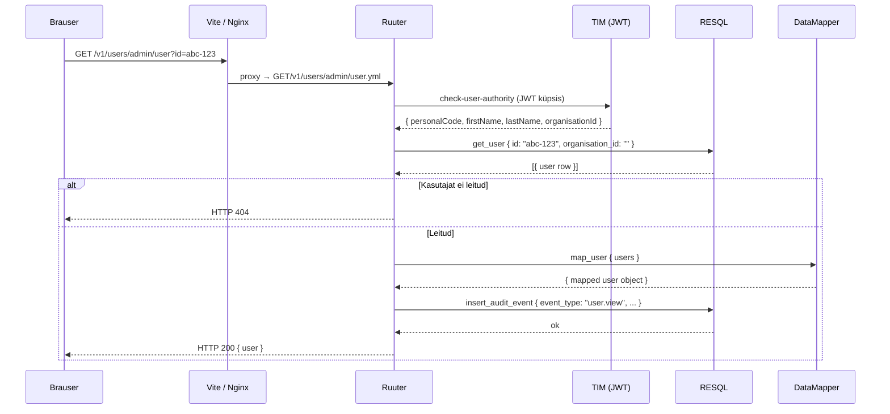
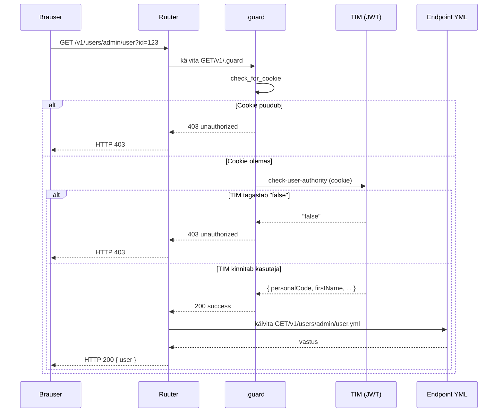

# LJVIS REST API disainijuhend

Projekti teenuste arendamisel kasutatakse **contract-first** lähenemist — enne implementatsiooni koostatakse OpenAPI leping (`docs/openapi.yaml`), mis on Ruuter DSL struktuuri siduv allikas.

---

## 1. HTTP meetodite kasutamine

| Meetod | Kasutus | Idempotentne |
|--------|---------|--------------|
| `GET` | Ressursi lugemine (üksik või nimekiri) | Jah |
| `POST` | Uue ressursi loomine | Ei |
| `PUT` | Olemasoleva ressursi täielik uuendamine | Jah |
| `DELETE` | Ressursi eemaldamine | Jah |

**Reeglid:**

- `GET` päringud **ei tohi** muuta serveripoolset olekut.
- `POST` on reserveeritud loomisoperatsioonidele. Keerukate filtritega otsingud (nt CSV eksport) kasutavad `GET`-i query paramitega.
- `PUT` uuendab tervikuna — partial update'i jaoks kasutatakse samuti `PUT`-i, kuna DSL ei toeta `PATCH`-i loomulikult.
- `DELETE` toimib query paramitega, mitte request body-ga.

---

## 2. URI-de nimetamise reeglid

### 2.1 Üldpõhimõtted

- URI-d on **väiketähelised**, sõnad eraldatakse sidekriipsuga (`kebab-case`): `/user-groups`, `/audit-logs`.
- URI tähistab **ressursikollektsiooni või toimingut**, mitte HTTP meetodit — `GET /v1/users/admin/user`, mitte `GET /v1/users/admin/get-user`.
- Versioon on URI esimene segment: `/v1/...`

### 2.2 Staatilised path segmendid vs query paramid

Ruuter DSL kasutab **staatilisi path segmente** failitee kaardistamiseks. Dünaamilised identifikaatorid edastatakse **query paramitena**.

| Tüüp | Näide | Selgitus |
|------|-------|----------|
| Staatiline segment | `/v1/users/admin` | `admin` on DSL kausta nimi |
| Staatiline toiming | `/v1/users/admin/user` | `user.yml` fail DSL-is |
| Query param (id) | `/v1/users/admin/user?id=123` | dünaamiline väärtus |
| Query param (filter) | `/v1/users/admin?search=Mari&page=1` | otsing ja leheküljed |

**Scope** (`admin` | `local`) on **staatiline path segment** — see kaardistub eraldi DSL failidega, millel on erinev äriloogika ja õigusekontrroll.

### 2.3 Keelatud mustrid

| Vale URI | Probleem |
|----------|----------|
| `GET /v1/users/admin/123` | `id` on path segmendina — Ruuter DSL ei suuda seda staatilise failiteena lahendada |
| `GET /v1/users/admin/get-user` | HTTP meetodi nimetus URI-s — meetod ise ütleb juba `GET` |
| `POST /v1/users/admin/read/get` | CRUD-tegevus lisatasandil — `read/get` on redundantne |
| `POST /v1/users/admin/edit/insert` | CRUD-verb URI-s — loomine on `POST` meetodi ülesanne, mitte URI osa |
| `POST /v1/users/admin/list` | Nimekirja lugemine `POST`-iga — nimekirioperatsioonid on `GET` |

### 2.4 Soovituslikud mustrid

| Toiming | Soovituslik URI | Selgitus |
|---------|-----------------|----------|
| Nimekirja lugemine | `GET /v1/users/admin?search=Mari&page=0&pageSize=20` | Filtrid query paramitena |
| Üksiku ressursi lugemine | `GET /v1/users/admin/user?id=123` | `id` query paramina, toiming staatilise segmendina |
| Ressursi loomine | `POST /v1/users/admin` | HTTP meetod tähistab loomist |
| Ressursi uuendamine | `PUT /v1/users/admin/update` | Toiming staatilise segmendina, `id` request body-s |
| Seosega ressursi lugemine | `GET /v1/user-groups/admin/users?id=456` | `scope` path segmendina, `id` query paramina |
| Ressursi kustutamine | `DELETE /v1/user-groups/user?id=456&userId=789` | Mitu identifikaatorit query paramitena |

### 2.5 Andmevoo näidis — kasutaja detailvaate avamine



---

## 3. Veakoodid

Kõik veavastused järgivad [RFC 7807 Problem Details](https://datatracker.ietf.org/doc/html/rfc7807) formaati.

| HTTP kood | Tähendus | Kasutus LJVIS-is |
|-----------|----------|-----------------|
| `200 OK` | Päring õnnestus | Lugemine, uuendamine |
| `201 Created` | Ressurss loodud | Uue kasutaja, grupi, klassifikaatori väärtuse loomine |
| `400 Bad Request` | Vigane päring | Puuduv kohustuslik väli, vale formaat |
| `401 Unauthorized` | Autentimata | JWT küpsis puudub või on aegunud |
| `403 Forbidden` | Puudub õigus | Kasutajal pole vajalikku permission koodi |
| `404 Not Found` | Ressurss puudub | Antud id-ga kirjet andmebaasis pole |
| `409 Conflict` | Konflikt | Isikukood on juba registreeritud, grupi nimi on juba olemas |
| `422 Unprocessable Entity` | Valideerimise viga | Välja väärtus ei vasta reeglitele (tühi nimi, vale kuupäev jne) |
| `500 Internal Server Error` | Serveriviga | Ootamatu viga RESQL-is või Ruuteris |
| `503 Service Unavailable` | Teenus maas | RESQL või andmebaas ei vasta |

### Vea vastuse formaat

```json
{
  "type": "VALIDATION_ERROR",
  "field": "email",
  "code": "invalid_format"
}
```

Kirjutamisoperatsioonide valideerimisvigu tagastab Ruuter DSL `status: 422` koos väljaga `field_error`.

---

## 4. Päringute struktuur

### 4.1 Nimekirja päringud (GET)

Kõik nimekirja-otspunktid toetavad järgmisi query parameid:

| Param | Tüüp | Kirjeldus |
|-------|------|-----------|
| `search` | string | Vabatekstotsing |
| `page` | integer | Lehekülje number (0-põhine) |
| `pageSize` | integer | Kirjete arv lehel |
| `sorting` | string | Sortimisväli ja suund (nt `name asc`) |

### 4.2 Ressursi päringud id järgi

`id` edastatakse alati **query paramina**:

```
GET /v1/users/admin/user?id=abc-123
GET /v1/classifiers/classifier?id=42
GET /v1/logs/log?id=99
```

### 4.3 Kirjutamisoperatsioonid

`id` (uuendatava ressursi identifikaator) edastatakse **request body-s**:

```json
PUT /v1/users/admin/update
{
  "id": "abc-123",
  "firstName": "Mari",
  ...
}
```

---

## 5. Versionimine

- Kõik API teed algavad `/v1/` prefiksiga.
- Murduva muutuse korral (breaking change) lisatakse uus versioon (`/v2/`) — vana versioon jääb tööle kuni kliendid on migreerinud.
- Auth teed (`/auth/...`) ei kasuta versiooniprefksit, kuna need on TIM-i omasüsteem.

---

## 6. Autentimine ja autoriseerimine

- Kõik otspunktid nõuavad JWT küpsist, mille väljastab TIM pärast TARA autentimist.
- Ruuter kontrollib iga päringu alguses `check-user-authority` templiga kasutaja olemasolut ja aktiivsust.
- Õigused (`permissions`) on stringikoodid (nt `user.list.admin`, `classifier.read`) — kasutajal peavad olema vajalikud koodid JWT-s.
- `scope` path segment (`admin` | `local`) määrab, milline DSL fail käivitub ja millised andmed on nähtavad.

### 6.1 .guard failid

Ruuter täidab iga päringu eel automaatselt `.guard` faili, kui see asub vastava meetodi kausta `v1/` tasemel. LJVIS-is on guard fail kõikides meetodikataloogides:

```
DSL/Ruuter/ljvis/
  GET/v1/.guard
  POST/v1/.guard
  PUT/v1/.guard
  DELETE/v1/.guard
```

`.guard` fail käivitub **enne** tegelikku endpoint-faili ja tagastab kas `200 success` (lubab edasi) või `403 unauthorized` (katkestab).

**Guard faili loogika sammhaaval:**

| Samm | Toiming | Tulemus |
|------|---------|---------|
| `check_for_cookie` | Kontrollib, kas `cookie` päis on olemas | Puudub → `guard_fail` |
| `authenticate` | Kutsub TIM-i `check-user-authority` template'i JWT küpsisega | Tagastab `authority_result` |
| `check_authority_result` | Kontrollib, et tulemus ei ole `"false"` | Vale → `guard_fail` |
| `guard_success` | Tagastab `200 "success"` | Ruuter jätkab endpoint-failiga |
| `guard_fail` | Tagastab `403 "unauthorized"` | Päring katkeb, vastust ei saadeta |

**Guard faili struktuur** (`GET/v1/.guard`):

```yaml
check_for_cookie:
  switch:
    - condition: ${incoming.headers == null || incoming.headers.cookie == null}
      next: guard_fail
  next: authenticate

authenticate:
  template: "[#LJVIS_PROJECT_LAYER]/check-user-authority"
  requestType: templates
  headers:
    cookie: ${incoming.headers.cookie}
  result: authority_result

check_authority_result:
  switch:
    - condition: ${authority_result !== "false"}
      next: guard_success
  next: guard_fail

guard_success:
  return: "success"
  status: 200
  next: end

guard_fail:
  return: "unauthorized"
  status: 403
  next: end
```

### 6.2 Guard andmevoog



---

## 7. Mock otspunktid

Arenduseks on kõigil otspunktidel mock vaste. Mock aktiveeritakse `frontend/.env.local` failiga:

```
VITE_USE_MOCK=true
```

Ruuter resolveerib mock faili lisades tee lõppu `/mock`:

```
GET /v1/users/admin  →  GET/v1/users/admin/mock.yml
GET /v1/users/admin/user?id=1  →  GET/v1/users/admin/user/mock.yml
```

---

## 8. Seotud dokumendid

- `docs/openapi.yaml` — täielik API leping
- `docs/api-endpoints.md` — kõigi otspunktide loend tabelina
- `docs/audit-logging.md` — audit sündmuste logimise reeglid
- `docs/errors.json` — kõigi veatüüpide masinarloetav kataloog (kood, sõnum, stsenaariumid, otspunktid)
- `docs/db_errorhandling_rules.md` — andmebaasi veakäsitluse reeglid
- `DSL/Ruuter/ljvis/` — Ruuter DSL failid (tegelik implementatsioon)
