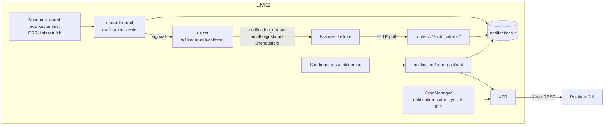

# Teavituste ja Postkast 2.0 liidese spetsifikatsioon

**Hange:** peatükk „Teavitused ja Postkast 2.0 liides" — spetsifikatsioon ja administraatori juhend.
**Administraatori juhend:** [admin-guide/09-teavitused.md](../admin-guide/09-teavitused.md) ·
**Otsus:** [ADR-006](../workingdocs/architecture-decisions.md) · **Mallid:** [pk2-templates](../pk2-templates/README.md) ·
**Integratsioonikaart:** [integratsioonid.md §5](../integrations/integratsioonid.md#5-postkast-20)

## 1. Eesmärk ja ulatus

Teavituste moodul edastab sündmusi kahe kanali kaudu:

| Kanal | Saaja | Tehnoloogia | Näide |
|---|---|---|---|
| **Rakendusesisene (desktop)** | LJVIS 2 kasutaja, õiguspõhiselt | Andmebaas + WebSocket-signaal + HTTP pull | Uus NCR-teade, sissetulnud NU |
| **Väline (Postkast 2.0)** | Veoettevõtja, Tööinspektsioon (e-post) | X-tee REST (`GOV/70006317/postkast`) läbi XTR-i | Raske rikkumise teavitus veoettevõtjale |

Mooduli vastutus: teavituse **loomine** (sündmuse põhjal), **kohaletoimetamine**, **jälgimine** (staatus),
**tõrkest taastumine** (käsitsi uuesti saatmine) ja **auditeeritavus**. Väljaspool ulatust: Postkast 2.0
mallide loomine/haldus (haldusliides on eraldi kanal; mallid loob kolmas osapool, vt
[pk2-templates](../pk2-templates/README.md)), SMS ja muud kanalid.

## 2. Mõisted

| Mõiste | Tähendus |
|---|---|
| Teavitus (`notifications.notification`) | Rakendusesisene teade; nähtav kasutajatele, kellel on `required_permission` |
| Saatmislogi (`notifications.outbound_log` + `_recipient`) | Väliskanali saatmiskirje; **append-only** |
| Teavituse tunnus (`notification_key`) | LJVIS 2 antud unikaalne tunnus, liigub X-tee päisesse |
| Malli vastendus (`notification_template_mapping`) | Teavituse liik → Postkast 2.0 malli tunnus, kanal, keel, saajad; append-only, muudetav haldusvaates |
| Sündmuse võti (`event_key`) | Idempotentsuse võti: sama sündmus ei loo teist teavitust |

## 3. Teavituse liigid

| Liik (`notification_type`) | Kanal | Päästik | Saaja |
|---|---|---|---|
| `ncr_violation`, `ncr_response` | desktop | ERRU NCR sissetulek / vastus | Õigusega `ncr.read` / `ncr.respond` |
| `driving_ban`, `weight_violation` | desktop | ERRU/vorm | Vastava õigusega kasutajad |
| `nu_inbound_received` | desktop | Sissetulnud ERRU NU päring | Õigus `nu.read`, valikuliselt haldusvaates määratud isikud |
| `carrier_violation` | Postkast 2.0 | Raske rikkumise (MSI/VSI/SI) avalikustamine, kui kasutaja märkis kinnitamisel veoettevõtja teavituse linnukese | Veoettevõtja (äriregistri andmed `ar/detailandmed_v1`) |
| `labor_foreign_proposal` | Postkast 2.0 | Välisriigi rikkumise vormil „foreignAuthorityProposal" linnukese muutus | Tööinspektsiooni aadress |
| `labor_tachograph_not_downloaded` | Postkast 2.0 | Avalikustatud sõidu- ja puhkeaja kontrollkaart märkega „andmed alla laadimata" | Tööinspektsiooni aadress |
| `labor_kabotage` | Postkast 2.0 | **Päästik puudub** (mall olemas, DSL-i trigger tegemata) | Tööinspektsiooni aadress |

Täielik kataloog on tabelis `notifications.notification_template_mapping` ja nähtav haldusvaates
„Postkasti mallide ja vastuvõtjate seaded".

## 4. Arhitektuur

Põhimõtted:
- **Signaal ja andmed on lahus.** WebSocket kannab ainult `{type:"notification_update"}`; kasutajaandmeid ei saadeta.
  Klient hangib andmed autenditud HTTP päringuga.
- **Õiguspõhine signaal.** Ühendus märgistatakse õiguste sildiga (`perms`); `broadcast_where` saadab signaali ainult
  ühendustele, mille sildis on teavituse `required_permission`. Silt värskendatakse iga frame'iga.
- **Varumehhanism.** WS katkemisel jätkab klient pollinguga (60 s); taasühendus eksponentsiaalse viivitusega 1 s → 30 s.
- **Sisene kutse kaitstud.** `ruuter-internal` → `ruuter` kutse kasutab jagatud saladust (`INTERNAL_COMMUNICATION_KEY`).

## 5. Andmemudel

| Tabel | Eesmärk | Märkused |
|---|---|---|
| `notifications.notification` | Rakendusesisesed teavitused | `type`, `required_permission`, `title_et`, `body_et`, seotud olem; unikaalne `(type, event_key)` — idempotentsus |
| `notifications.notification_read` | Lugemisseis kasutaja kaupa | PK `(notification_id, user_code)` |
| `notifications.outbound_log` | Väliskanali saatmiskirje | **Append-only**; `original_log_id` viitab uuesti saatmisel algsele; staatus `queued`/`in_progress`/`sent`/`error`; `payload_json` |
| `notifications.outbound_log_recipient` | Adressaadid ja saatmistulemus | Seotud `outbound_log` kirjega |
| `notifications.notification_template_mapping` | Liik → mall/kanal/keel/saajad | Append-only (uus rida = uus versioon); `desktop_recipient_personal_codes` |
| `notifications.carrier_notification_request` | Veoettevõtja teavituse tellimus kinnitamisest avalikustamiseni | Append-only; üks avatud tellimus vormi kohta |

Täpne DDL: Liquibase changesetid `DSL/Liquibase/changelog/*notification*`. ERD: [andmemudeli ERD](../architecture/andmemudel-erd.md).

## 6. Protsessid

### 6.1 Rakendusesisene teavitus
1. Sündmus kutsub `POST /ljvis/notification/create` (`ruuter-internal`) liigi, `required_permission`, seotud olemi ja `event_key`-ga.
2. Funktsioon otsib malli vastenduse, sisestab rea (kordus sama `event_key`-ga ei loo uut), saadab WS-signaali.
3. Kasutaja kelluke uuendab lugemata arvu (`GET /v1/notifications/unread-count`); nimekiri `GET /v1/notifications/list`.
4. Lugemine: `POST /v1/notifications/mark-read?q={id}` / `mark-all-read`.

### 6.2 Väline saatmine (Postkast 2.0)
1. Sündmus (nt avalikustamine) → `notification/send-postkast` (või `send-carrier-from-request`, kui tellimus tehti kinnitamisel).
2. Valitakse mall malli vastendusest; adressaat tuleb äriregistrist (veoettevõtja) või vastendusest (Tööinspektsioon).
3. Lisatakse `outbound_log` rida (`queued`) ja saadetakse XTR-i kaudu; X-tee päisesse läheb `notification_key`.
4. Postkast 2.0 ei teata tulemust ise → cron `notification-status-sync` (iga 5 min) pärib seisu ja uuendab staatuse.
5. Lõppstaatuseta teavitus muudetakse **24 h või 48 kontrollikatse järel** staatuseks `error`.

### 6.3 Ebaõnnestunud saatmise taastamine
`POST /v1/notifications/outbound-log/resend/send?q={logId}` (õigus `notification.resend`): saadab teavituse **muutmata kujul**,
loob uue rea uue tunnusega; algne `error` rida jääb. Kui algkirje ei ole `error`, vastus on 409.

## 7. Liidesed

### 7.1 Ruuter (UI jaoks)
| Meetod ja tee | Õigus | Eesmärk |
|---|---|---|
| `GET /v1/notifications/list` | sisselogitud kasutaja (filtreerib õigusega) | In-app nimekiri |
| `GET /v1/notifications/unread-count` | sama | Lugemata arv |
| `POST /v1/notifications/mark-read`, `mark-all-read` | sama | Lugemine |
| `GET /v1/notifications/outbound-log/list` | `notification.list` | Saatmislogi filtritega |
| `GET /v1/notifications/outbound-log/recipients` | `notification.list` | Adressaadi saatmisraport |
| `POST /v1/notifications/outbound-log/resend/send` | `notification.resend` | Uuesti saatmine |
| `GET/POST /v1/notification-template-mapping/*` | `notification-template-mapping` õigus | Mallide vastenduste haldus |
| WS `/api/notifications/connect` | sisselogitud | Signaalikanal |

### 7.2 X-tee (Postkast 2.0)
| Konstant | Eesmärk |
|---|---|
| `PK_NOTIFICATIONS_ENDPOINT` | Teavituse saatmine (`…/notification-management/v1/notifications`) |
| `PK_SENDING_OPERATIONS_ENDPOINT` | Saatmisoperatsiooni staatus |

Toodangus osutavad need XTR-i (`http://xtr:8080/postkast/notifications`, `…/sending-operations`); dev/CI-s mock samas Ruuteris.
Kliendi identifikaator: `<instants>/GOV/70001231/ljvis2`, teenus `<instants>/GOV/70006317/postkast`.

## 8. Turve ja andmekaitse

- Saatmislogi sisaldab e-posti aadresse (isikuandmed): iga nimekirja avamine auditeeritakse (`notification.list.view`),
  käsitsi uuesti saatmine samuti (`notification.resend.manual`).
- Õigused: `notification.list`, `notification.resend` (varem `notification.admin`); teavituse nähtavus `required_permission` järgi.
- LJVIS 2 ei hoia Postkast 2.0 tõendeid; autentimine toimub X-tee turvaserveris.
- WebSocketi signaal ei sisalda andmeid; HTTP pull kontrollib õigusi uuesti.
- Append-only logi tagab, et saatmise ajalugu ei muutu.

## 9. Mittefunktsionaalsed nõuded

| Nõue | Lahendus |
|---|---|
| Idempotentsus | Unikaalne `(type, event_key)`; kordustöötlus ei loo teist teavitust |
| Tõrketaluvus | WS → polling; saatmisstaatuse cron korjab ebaõnnestunud sünkroonid; käsitsi uuesti saatmine |
| Jälgitavus | Saatmislogi, auditisündmused, `xroad.integration_log`, cron-i `ignoreFailures` + korduskatse |
| Jõudlus | Teavituste nimekirjad ja lugemata arv on indekseeritud (`idx_notification_perm`, `idx_notification_created`) |
| Skaleeritavus | `WsRegistry` on protsessisisene (ADR-006): signaal saadetakse `ruuter` protsessi kaudu; mitme `ruuter` replikaga paigalduses tuleb seda arvestada (signaal jõuab ainult selle replika ühendustele) |

## 10. Seadistus

| Parameeter | Asukoht | Kirjeldus |
|---|---|---|
| `PK_NOTIFICATIONS_ENDPOINT`, `PK_SENDING_OPERATIONS_ENDPOINT` | `constants.ini` / ConfigMap | Postkast 2.0 lõpp-punktid |
| `INTERNAL_COMMUNICATION_KEY` | SSM / Secret | Jagatud saladus WS-broadcast'i sisekutsele |
| `XROAD_INSTANCE` | `constants.ini` | X-tee instants |
| Malli tunnused, saajad, keel, aktiivsus | Haldus → „Postkasti mallide ja vastuvõtjate seaded" | Muudetav ilma väljalaseta |
| Staatuse sünk | `DSL/CronManager/notification-status-sync.yaml` | `0 */5 * * * ?` |

## 11. Testimine

- Newman `notifications` (loomine, idempotentsus, lugemine, 401/403 õigused, saatmislogi, adressaadi raport, uuesti saatmine koos algkirje säilimisega);
- DSL-testid [`DSL-tests-internal/notification/`](../../DSL-tests-internal/notification);
- Playwright: `notifications.spec.ts`, `notification-template-mapping.spec.ts`;
- pärisliides: Postkast 2.0 test-keskkonnas käsitsi (vt [integratsioonid.md](../integrations/integratsioonid.md#5-postkast-20)).

## 12. Teadaolevad piirangud

- `labor_kabotage` päästik puudub (mall olemas).
- Postkast 2.0 mallid luuakse väljaspool LJVIS 2 (kolmas osapool); malli tunnus peab olema vastenduses enne kasutuselevõttu.
- Auto-trigger-i ja täieliku newman/Confluence katvuse lahtised punktid: vt projekti muudatuste logi.
