# LJVIS – Kasutuslood (projekt)

<!-- EPIC_02 BEGIN -->
# LJVIS2 – EPIC 02 Kasutajagruppide kasutuslood

## Kasutajagrupid

| Grupp | Kirjeldus |
|-------|-----------|
| **Peakasutaja (Admin)** | Täielik ligipääs kõikidele asutustele. Haldab kasutajaid, kasutajagruppe, asutusi ja õigusi süsteemiüleselt. |
| **Lokaalne kontohaldur (Local)** | Organisatsioonitasandi haldaja. Haldab kasutajaid ja vaatab kasutajagruppe ainult oma asutuse piires. |
| **Süsteemprotsess (BgService)** | Automaatne öine taustateenus. Käivitub ilma inimkasutaja seansita; deaktiveerib aegunud ligipääsuga kasutajad. |

---

## 1. Peakasutaja (Admin)

> Roll `admin`. Täielik ligipääs kõikidele asutustele ja funktsioonidele selles epics.

### 1a. Kasutajate haldamine

| # | Kasutuslugu | Vajalik õigus |
|---|-------------|---------------|
| PA-01 | Kasutajate nimekirja vaatamine (kõik asutused) | `user.list.admin` |
| PA-02 | Kasutajate otsing nimekirjas (ees-/perekonnanime järgi) | `user.list.admin` |
| PA-03 | Kasutaja detailvaate avamine | `user.read.admin` |
| PA-04 | Uue kasutaja loomine | `user.edit.admin` |
| PA-05 | Kasutaja isiku andmete muutmine | `user.edit.admin` |
| PA-06 | Kasutaja ligipääsuperiooodi muutmine | `user.edit.admin` |
| PA-07 | Kasutaja asutuse muutmine (eemaldab kõik aktiivsed grupid) | `user.edit.admin` |
| PA-08 | Kasutajale kasutajagrupi määramine | `user.edit.admin` |
| PA-09 | Kasutajalt kasutajagrupi eemaldamine | `user.edit.admin` |

### 1b. Kasutajagruppide haldamine

| # | Kasutuslugu | Vajalik õigus |
|---|-------------|---------------|
| PA-10 | Kasutajagruppide nimekirja vaatamine (kõik asutused) | `user_group.list.admin` |
| PA-11 | Kasutajagruppide otsing nimekirjas (grupi/asutuse nime järgi) | `user_group.list.admin` |
| PA-12 | Kasutajagrupi detailvaate avamine | `user_group.read.admin` |
| PA-13 | Kasutajagrupi liikmete vaatamine (kõik asutused) | `user_group.list_users.admin` |
| PA-14 | Uue kasutajagrupi loomine (nimetus + asutused + õigused) | `user_group.create`, `organisation.list`, `permission.list` |
| PA-15 | Kasutajagrupi nimetuse muutmine | `user_group.update` |
| PA-16 | Kasutajagrupi seotud asutuste muutmine | `user_group.update`, `organisation.list` |
| PA-17 | Kasutajagrupi õiguste muutmine | `user_group.update`, `permission.list` |
| PA-18 | Kasutaja sidumine kasutajagrupiga | `user_group.add_user`, `user_group.search_eligible_users` |
| PA-19 | Kasutaja eemaldamine kasutajagrupist | `user_group.remove_user` |

---

## 2. Lokaalne kontohaldur (Local)

> Roll `local`. Haldab ainult oma asutuse kasutajaid ja vaatab oma asutusega seotud gruppe.

### 2a. Kasutajate haldamine (oma asutus)

| # | Kasutuslugu | Vajalik õigus |
|---|-------------|---------------|
| KH-01 | Oma asutuse kasutajate nimekirja vaatamine | `user.list.local` |
| KH-02 | Kasutajate otsing nimekirjas (ees-/perekonnanime järgi) | `user.list.local` |
| KH-03 | Kasutaja detailvaate avamine (oma asutus) | `user.read.local` |
| KH-04 | Uue kasutaja loomine (oma asutus, fikseeritud asutusega) | `user.edit.local` |
| KH-05 | Kasutaja isiku andmete muutmine (oma asutus) | `user.edit.local` |
| KH-06 | Kasutaja ligipääsuperiooodi muutmine (oma asutus) | `user.edit.local` |
| KH-07 | Kasutajale kasutajagrupi määramine (oma asutusega seotud grupid) | `user.edit.local` |
| KH-08 | Kasutajalt kasutajagrupi eemaldamine (oma asutus) | `user.edit.local` |

> **NB:** Lokaalne kontohaldur **ei saa muuta kasutaja asutust** — asutuse väli on fikseeritud tema enda asutuseks.

### 2b. Kasutajagruppide vaatamine (oma asutus)

| # | Kasutuslugu | Vajalik õigus |
|---|-------------|---------------|
| KH-09 | Oma asutusega seotud kasutajagruppide nimekirja vaatamine | `user_group.list.local` |
| KH-10 | Kasutajagruppide otsing nimekirjas | `user_group.list.local` |
| KH-11 | Kasutajagrupi detailvaate avamine (oma asutus) | `user_group.read.local` |
| KH-12 | Kasutajagrupi liikmete vaatamine (oma asutus) | `user_group.list_users.local` |

> **NB:** Lokaalne kontohaldur **ei saa kasutajagruppe luua ega muuta** — grupi nimetuse, asutuste ja õiguste muutmine on ainult peakasutajale (`user_group.update` / `user_group.create`).

---

## 3. Süsteemprotsess (BgService)

> Automatiseeritud öine taustateenus. Käivitub iga öö kell 02:00 Eesti aja järgi. Ei nõua inimkasutaja seanssi.

| # | Kasutuslugu | Kirjeldus |
|---|-------------|-----------|
| SP-01 | Deaktiveeritavate kasutajate tuvastamine | Filtreerib kasutajad olekuga `pending_deactivation` ja `access_end ≤ tänane kuupäev` |
| SP-02 | Kasutajagrupi liikmelisuste eemaldamine | Iga leitud kasutaja kõikidele aktiivsetele liikmelisustele lisatakse `removed` olekurida |
| SP-03 | Kasutaja oleku muutmine mitteaktiivseks | INSERT uus rida `user_account_state`-sse olekuga `inactive` |
| SP-04 | Auditilogimine | Fikseerib iga kasutaja kohta eemaldatud grupid, olekumuutuse ja töötluse tulemuse (sh vead) |

> **NB:** Iga kasutaja töötlus on iseseisev tehing — ühe kasutaja viga ei peata teiste töötlemist.

---
---

# Sequence diagrammid kasutajagruppide kaupa

> **Arhitektuurne kontekst:** Kõik diagrammid järgivad Buerokratt-perekonna komponentide arhitektuuri (vt `Ruuter_RESQL_DataMapper_arhitektuur.md`).
>
> - **Front-end** suhtleb ainult **Ruuter**iga (REST API)
> - **Ruuter** teostab autoriseerimise (`.guard` failid / JWT) ja orkestreerib äriloogika (YAML DSL)
> - **RESQL** täidab andmebaasipäringuid (üks fail = üks päring = üks endpoint; ainult INSERT ja SELECT)
> - **CronManager** haldab perioodilisi taustatöid

---

## PA – Peakasutaja (kasutajate haldamine)

### PA-01…PA-03 · Kasutajate nimekirja vaatamine ja kasutaja detailvaade

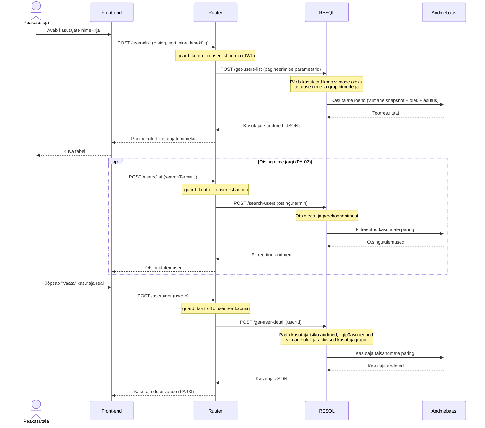
```mermaid
sequenceDiagram
    actor Admin as Peakasutaja
    participant FE as Front-end
    participant Ruuter as Ruuter
    participant RESQL as RESQL
    participant DB as Andmebaas

    Admin->>FE: Avab kasutajate nimekirja
    FE->>Ruuter: POST /users/list (otsing, sortimine, lehekülg)
    Note over Ruuter: .guard: kontrollib user.list.admin (JWT)
    Ruuter->>RESQL: POST /get-users-list (pagineerimise parameetrid)
    Note over RESQL: Pärib kasutajad koos viimase oleku,<br/>asutuse nime ja grupinimedega
    RESQL->>DB: Kasutajate loend (viimane snapshot + olek + asutus)
    DB-->>RESQL: Toorresultaat
    RESQL-->>Ruuter: Kasutajate andmed (JSON)
    Ruuter-->>FE: Pagineeritud kasutajate nimekiri
    FE-->>Admin: Kuva tabel

    opt Otsing nime järgi (PA-02)
        FE->>Ruuter: POST /users/list (searchTerm=...)
        Note over Ruuter: .guard: kontrollib user.list.admin
        Ruuter->>RESQL: POST /search-users (otsingutermin)
        Note over RESQL: Otsib ees- ja perekonnanimest
        RESQL->>DB: Filtreeritud kasutajate päring
        DB-->>RESQL: Otsingutulemused
        RESQL-->>Ruuter: Filtreeritud andmed
        Ruuter-->>FE: Otsingutulemused
    end

    Admin->>FE: Klõpsab "Vaata" kasutaja real
    FE->>Ruuter: POST /users/get (userId)
    Note over Ruuter: .guard: kontrollib user.read.admin
    Ruuter->>RESQL: POST /get-user-detail (userId)
    Note over RESQL: Pärib kasutaja isiku andmed, ligipääsuperiood,<br/>viimane olek ja aktiivsed kasutajagrupid
    RESQL->>DB: Kasutaja täisandmete päring
    DB-->>RESQL: Kasutaja andmed
    RESQL-->>Ruuter: Kasutaja JSON
    Ruuter-->>FE: Kasutaja detailvaade (PA-03)
```

### PA-04…PA-07 · Kasutaja loomine ja muutmine

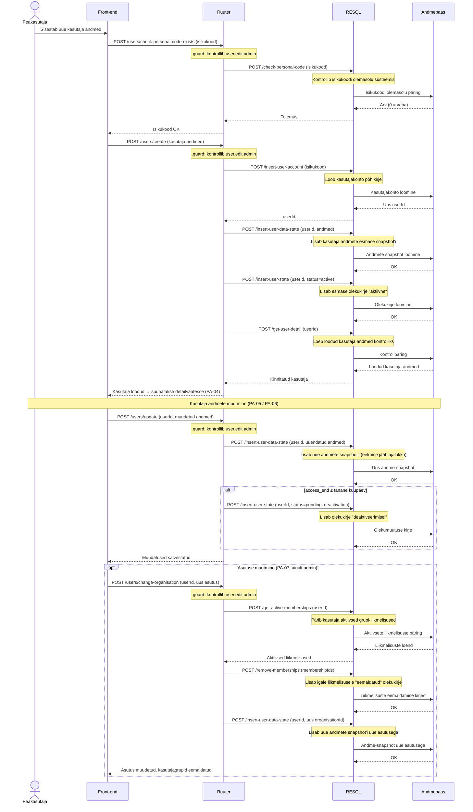
```mermaid
sequenceDiagram
    actor Admin as Peakasutaja
    participant FE as Front-end
    participant Ruuter as Ruuter
    participant RESQL as RESQL
    participant DB as Andmebaas

    Admin->>FE: Sisestab uue kasutaja andmed
    FE->>Ruuter: POST /users/check-personal-code-exists (isikukood)
    Note over Ruuter: .guard: kontrollib user.edit.admin
    Ruuter->>RESQL: POST /check-personal-code (isikukood)
    Note over RESQL: Kontrollib isikukoodi olemasolu süsteemis
    RESQL->>DB: Isikukoodi olemasolu päring
    DB-->>RESQL: Arv (0 = vaba)
    RESQL-->>Ruuter: Tulemus
    Ruuter-->>FE: Isikukood OK

    FE->>Ruuter: POST /users/create (kasutaja andmed)
    Note over Ruuter: .guard: kontrollib user.edit.admin
    Ruuter->>RESQL: POST /insert-user-account (isikukood)
    Note over RESQL: Loob kasutajakonto põhikirje
    RESQL->>DB: Kasutajakonto loomine
    DB-->>RESQL: Uus userId
    RESQL-->>Ruuter: userId

    Ruuter->>RESQL: POST /insert-user-data-state (userId, andmed)
    Note over RESQL: Lisab kasutaja andmete esmase snapshot'i
    RESQL->>DB: Andmete snapshot loomine
    DB-->>RESQL: OK

    Ruuter->>RESQL: POST /insert-user-state (userId, status=active)
    Note over RESQL: Lisab esmase olekukirje "aktiivne"
    RESQL->>DB: Olekukirje loomine
    DB-->>RESQL: OK

    Ruuter->>RESQL: POST /get-user-detail (userId)
    Note over RESQL: Loeb loodud kasutaja andmed kontrolliks
    RESQL->>DB: Kontrollpäring
    DB-->>RESQL: Loodud kasutaja andmed
    RESQL-->>Ruuter: Kinnitatud kasutaja
    Ruuter-->>FE: Kasutaja loodud → suunatakse detailvaatesse (PA-04)

    Note over Admin,DB: Kasutaja andmete muutmine (PA-05 / PA-06)

    FE->>Ruuter: POST /users/update (userId, muudetud andmed)
    Note over Ruuter: .guard: kontrollib user.edit.admin
    Ruuter->>RESQL: POST /insert-user-data-state (userId, uuendatud andmed)
    Note over RESQL: Lisab uue andmete snapshot'i (eelmine jääb ajalukku)
    RESQL->>DB: Uus andme-snapshot
    DB-->>RESQL: OK
    alt access_end ≤ tänane kuupäev
        Ruuter->>RESQL: POST /insert-user-state (userId, status=pending_deactivation)
        Note over RESQL: Lisab olekukirje "deaktiveerimisel"
        RESQL->>DB: Olekumuutuse kirje
        DB-->>RESQL: OK
    end
    Ruuter-->>FE: Muudatused salvestatud

    opt Asutuse muutmine (PA-07, ainult admin)
        FE->>Ruuter: POST /users/change-organisation (userId, uus asutus)
        Note over Ruuter: .guard: kontrollib user.edit.admin
        Ruuter->>RESQL: POST /get-active-memberships (userId)
        Note over RESQL: Pärib kasutaja aktiivsed grupi-liikmelisused
        RESQL->>DB: Aktiivsete liikmelisuste päring
        DB-->>RESQL: Liikmelisuste loend
        RESQL-->>Ruuter: Aktiivsed liikmelisused

        Ruuter->>RESQL: POST /remove-memberships (membershipIds)
        Note over RESQL: Lisab igale liikmelisusele "eemaldatud" olekukirje
        RESQL->>DB: Liikmelisuste eemaldamise kirjed
        DB-->>RESQL: OK

        Ruuter->>RESQL: POST /insert-user-data-state (userId, uus organisationId)
        Note over RESQL: Lisab uue andmete snapshot'i uue asutusega
        RESQL->>DB: Andme-snapshot uue asutusega
        DB-->>RESQL: OK
        Ruuter-->>FE: Asutus muudetud, kasutajagrupid eemaldatud
    end
```

### PA-08…PA-09 · Kasutajagruppide määramine kasutajale

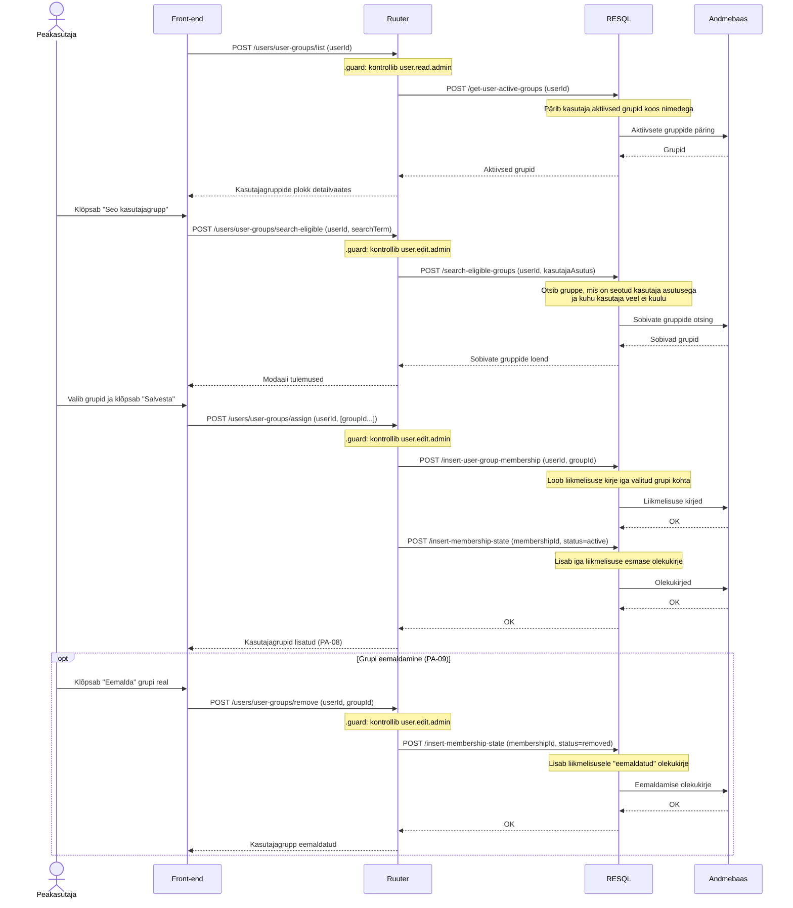
```mermaid
sequenceDiagram
    actor Admin as Peakasutaja
    participant FE as Front-end
    participant Ruuter as Ruuter
    participant RESQL as RESQL
    participant DB as Andmebaas

    FE->>Ruuter: POST /users/user-groups/list (userId)
    Note over Ruuter: .guard: kontrollib user.read.admin
    Ruuter->>RESQL: POST /get-user-active-groups (userId)
    Note over RESQL: Pärib kasutaja aktiivsed grupid koos nimedega
    RESQL->>DB: Aktiivsete gruppide päring
    DB-->>RESQL: Grupid
    RESQL-->>Ruuter: Aktiivsed grupid
    Ruuter-->>FE: Kasutajagruppide plokk detailvaates

    Admin->>FE: Klõpsab "Seo kasutajagrupp"
    FE->>Ruuter: POST /users/user-groups/search-eligible (userId, searchTerm)
    Note over Ruuter: .guard: kontrollib user.edit.admin
    Ruuter->>RESQL: POST /search-eligible-groups (userId, kasutajaAsutus)
    Note over RESQL: Otsib gruppe, mis on seotud kasutaja asutusega<br/>ja kuhu kasutaja veel ei kuulu
    RESQL->>DB: Sobivate gruppide otsing
    DB-->>RESQL: Sobivad grupid
    RESQL-->>Ruuter: Sobivate gruppide loend
    Ruuter-->>FE: Modaali tulemused

    Admin->>FE: Valib grupid ja klõpsab "Salvesta"
    FE->>Ruuter: POST /users/user-groups/assign (userId, [groupId...])
    Note over Ruuter: .guard: kontrollib user.edit.admin
    Ruuter->>RESQL: POST /insert-user-group-membership (userId, groupId)
    Note over RESQL: Loob liikmelisuse kirje iga valitud grupi kohta
    RESQL->>DB: Liikmelisuse kirjed
    DB-->>RESQL: OK
    Ruuter->>RESQL: POST /insert-membership-state (membershipId, status=active)
    Note over RESQL: Lisab iga liikmelisuse esmase olekukirje
    RESQL->>DB: Olekukirjed
    DB-->>RESQL: OK
    RESQL-->>Ruuter: OK
    Ruuter-->>FE: Kasutajagrupid lisatud (PA-08)

    opt Grupi eemaldamine (PA-09)
        Admin->>FE: Klõpsab "Eemalda" grupi real
        FE->>Ruuter: POST /users/user-groups/remove (userId, groupId)
        Note over Ruuter: .guard: kontrollib user.edit.admin
        Ruuter->>RESQL: POST /insert-membership-state (membershipId, status=removed)
        Note over RESQL: Lisab liikmelisusele "eemaldatud" olekukirje
        RESQL->>DB: Eemaldamise olekukirje
        DB-->>RESQL: OK
        RESQL-->>Ruuter: OK
        Ruuter-->>FE: Kasutajagrupp eemaldatud
    end
```

---

## PA – Peakasutaja (kasutajagruppide haldamine)

### PA-10…PA-13 · Kasutajagruppide nimekiri ja detailvaade

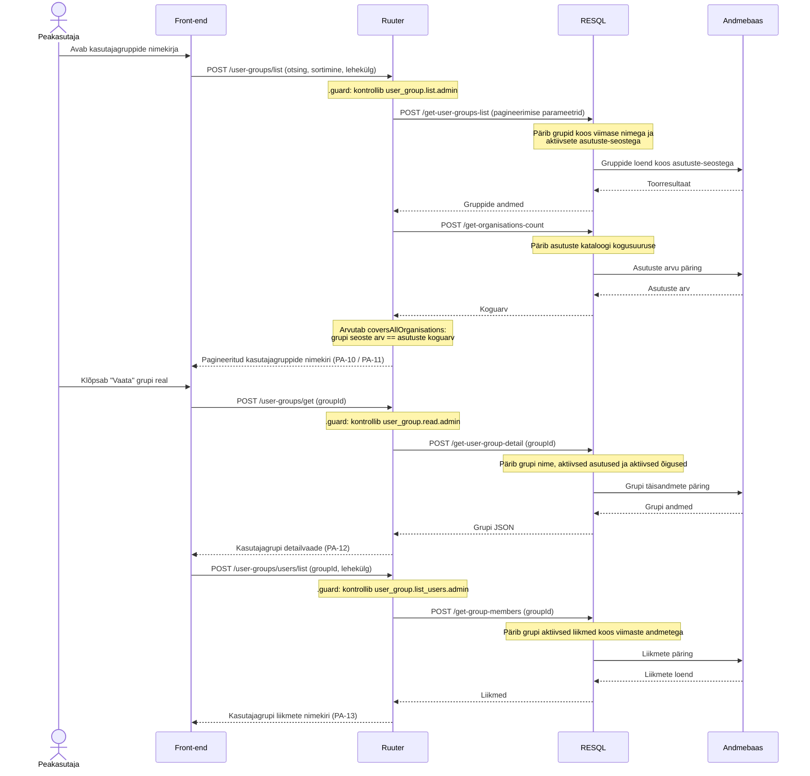
```mermaid
sequenceDiagram
    actor Admin as Peakasutaja
    participant FE as Front-end
    participant Ruuter as Ruuter
    participant RESQL as RESQL
    participant DB as Andmebaas

    Admin->>FE: Avab kasutajagruppide nimekirja
    FE->>Ruuter: POST /user-groups/list (otsing, sortimine, lehekülg)
    Note over Ruuter: .guard: kontrollib user_group.list.admin
    Ruuter->>RESQL: POST /get-user-groups-list (pagineerimise parameetrid)
    Note over RESQL: Pärib grupid koos viimase nimega ja<br/>aktiivsete asutuste-seostega
    RESQL->>DB: Gruppide loend koos asutuste-seostega
    DB-->>RESQL: Toorresultaat
    RESQL-->>Ruuter: Gruppide andmed

    Ruuter->>RESQL: POST /get-organisations-count
    Note over RESQL: Pärib asutuste kataloogi kogusuuruse
    RESQL->>DB: Asutuste arvu päring
    DB-->>RESQL: Asutuste arv
    RESQL-->>Ruuter: Koguarv
    Note over Ruuter: Arvutab coversAllOrganisations:<br/>grupi seoste arv == asutuste koguarv
    Ruuter-->>FE: Pagineeritud kasutajagruppide nimekiri (PA-10 / PA-11)

    Admin->>FE: Klõpsab "Vaata" grupi real
    FE->>Ruuter: POST /user-groups/get (groupId)
    Note over Ruuter: .guard: kontrollib user_group.read.admin
    Ruuter->>RESQL: POST /get-user-group-detail (groupId)
    Note over RESQL: Pärib grupi nime, aktiivsed asutused ja aktiivsed õigused
    RESQL->>DB: Grupi täisandmete päring
    DB-->>RESQL: Grupi andmed
    RESQL-->>Ruuter: Grupi JSON
    Ruuter-->>FE: Kasutajagrupi detailvaade (PA-12)

    FE->>Ruuter: POST /user-groups/users/list (groupId, lehekülg)
    Note over Ruuter: .guard: kontrollib user_group.list_users.admin
    Ruuter->>RESQL: POST /get-group-members (groupId)
    Note over RESQL: Pärib grupi aktiivsed liikmed koos viimaste andmetega
    RESQL->>DB: Liikmete päring
    DB-->>RESQL: Liikmete loend
    RESQL-->>Ruuter: Liikmed
    Ruuter-->>FE: Kasutajagrupi liikmete nimekiri (PA-13)
```

### PA-14 · Uue kasutajagrupi loomine

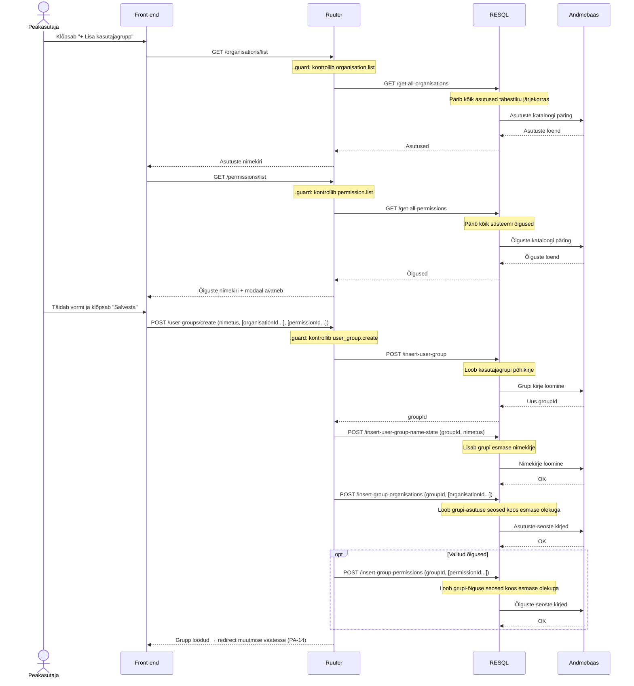
```mermaid
sequenceDiagram
    actor Admin as Peakasutaja
    participant FE as Front-end
    participant Ruuter as Ruuter
    participant RESQL as RESQL
    participant DB as Andmebaas

    Admin->>FE: Klõpsab "+ Lisa kasutajagrupp"
    FE->>Ruuter: GET /organisations/list
    Note over Ruuter: .guard: kontrollib organisation.list
    Ruuter->>RESQL: GET /get-all-organisations
    Note over RESQL: Pärib kõik asutused tähestiku järjekorras
    RESQL->>DB: Asutuste kataloogi päring
    DB-->>RESQL: Asutuste loend
    RESQL-->>Ruuter: Asutused
    Ruuter-->>FE: Asutuste nimekiri

    FE->>Ruuter: GET /permissions/list
    Note over Ruuter: .guard: kontrollib permission.list
    Ruuter->>RESQL: GET /get-all-permissions
    Note over RESQL: Pärib kõik süsteemi õigused
    RESQL->>DB: Õiguste kataloogi päring
    DB-->>RESQL: Õiguste loend
    RESQL-->>Ruuter: Õigused
    Ruuter-->>FE: Õiguste nimekiri + modaal avaneb

    Admin->>FE: Täidab vormi ja klõpsab "Salvesta"
    FE->>Ruuter: POST /user-groups/create (nimetus, [organisationId...], [permissionId...])
    Note over Ruuter: .guard: kontrollib user_group.create

    Ruuter->>RESQL: POST /insert-user-group
    Note over RESQL: Loob kasutajagrupi põhikirje
    RESQL->>DB: Grupi kirje loomine
    DB-->>RESQL: Uus groupId
    RESQL-->>Ruuter: groupId

    Ruuter->>RESQL: POST /insert-user-group-name-state (groupId, nimetus)
    Note over RESQL: Lisab grupi esmase nimekirje
    RESQL->>DB: Nimekirje loomine
    DB-->>RESQL: OK

    Ruuter->>RESQL: POST /insert-group-organisations (groupId, [organisationId...])
    Note over RESQL: Loob grupi-asutuse seosed koos esmase olekuga
    RESQL->>DB: Asutuste-seoste kirjed
    DB-->>RESQL: OK

    opt Valitud õigused
        Ruuter->>RESQL: POST /insert-group-permissions (groupId, [permissionId...])
        Note over RESQL: Loob grupi-õiguse seosed koos esmase olekuga
        RESQL->>DB: Õiguste-seoste kirjed
        DB-->>RESQL: OK
    end

    Ruuter-->>FE: Grupp loodud → redirect muutmise vaatesse (PA-14)
```

### PA-15…PA-17 · Kasutajagrupi andmete muutmine

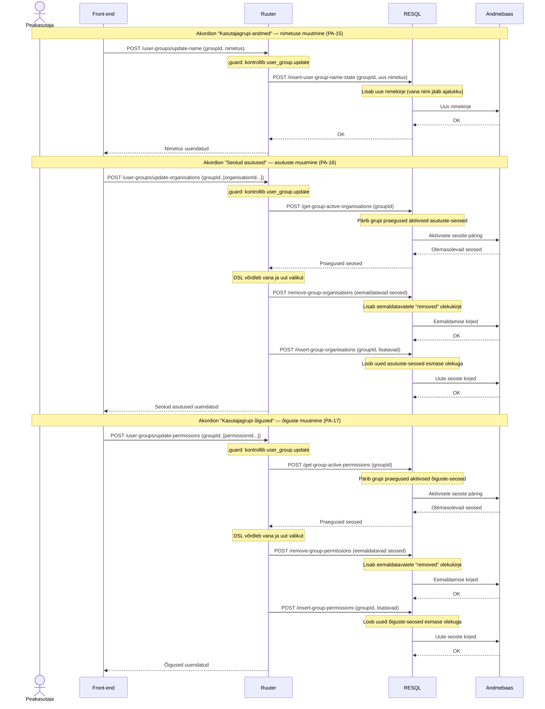
```mermaid
sequenceDiagram
    actor Admin as Peakasutaja
    participant FE as Front-end
    participant Ruuter as Ruuter
    participant RESQL as RESQL
    participant DB as Andmebaas

    Note over Admin,DB: Akordion "Kasutajagrupi andmed" — nimetuse muutmine (PA-15)

    FE->>Ruuter: POST /user-groups/update-name (groupId, nimetus)
    Note over Ruuter: .guard: kontrollib user_group.update
    Ruuter->>RESQL: POST /insert-user-group-name-state (groupId, uus nimetus)
    Note over RESQL: Lisab uue nimekirje (vana nimi jääb ajalukku)
    RESQL->>DB: Uus nimekirje
    DB-->>RESQL: OK
    RESQL-->>Ruuter: OK
    Ruuter-->>FE: Nimetus uuendatud

    Note over Admin,DB: Akordion "Seotud asutused" — asutuste muutmine (PA-16)

    FE->>Ruuter: POST /user-groups/update-organisations (groupId, [organisationId...])
    Note over Ruuter: .guard: kontrollib user_group.update
    Ruuter->>RESQL: POST /get-group-active-organisations (groupId)
    Note over RESQL: Pärib grupi praegused aktiivsed asutuste-seosed
    RESQL->>DB: Aktiivsete seoste päring
    DB-->>RESQL: Olemasolevad seosed
    RESQL-->>Ruuter: Praegused seosed
    Note over Ruuter: DSL võrdleb vana ja uut valikut

    Ruuter->>RESQL: POST /remove-group-organisations (eemaldatavad seosed)
    Note over RESQL: Lisab eemaldatavatele "removed" olekukirje
    RESQL->>DB: Eemaldamise kirjed
    DB-->>RESQL: OK

    Ruuter->>RESQL: POST /insert-group-organisations (groupId, lisatavad)
    Note over RESQL: Loob uued asutuste-seosed esmase olekuga
    RESQL->>DB: Uute seoste kirjed
    DB-->>RESQL: OK
    Ruuter-->>FE: Seotud asutused uuendatud

    Note over Admin,DB: Akordion "Kasutajagrupi õigused" — õiguste muutmine (PA-17)

    FE->>Ruuter: POST /user-groups/update-permissions (groupId, [permissionId...])
    Note over Ruuter: .guard: kontrollib user_group.update
    Ruuter->>RESQL: POST /get-group-active-permissions (groupId)
    Note over RESQL: Pärib grupi praegused aktiivsed õiguste-seosed
    RESQL->>DB: Aktiivsete seoste päring
    DB-->>RESQL: Olemasolevad seosed
    RESQL-->>Ruuter: Praegused seosed
    Note over Ruuter: DSL võrdleb vana ja uut valikut

    Ruuter->>RESQL: POST /remove-group-permissions (eemaldatavad seosed)
    Note over RESQL: Lisab eemaldatavatele "removed" olekukirje
    RESQL->>DB: Eemaldamise kirjed
    DB-->>RESQL: OK

    Ruuter->>RESQL: POST /insert-group-permissions (groupId, lisatavad)
    Note over RESQL: Loob uued õiguste-seosed esmase olekuga
    RESQL->>DB: Uute seoste kirjed
    DB-->>RESQL: OK
    Ruuter-->>FE: Õigused uuendatud
```

### PA-18…PA-19 · Kasutajate sidumine ja eemaldamine grupist

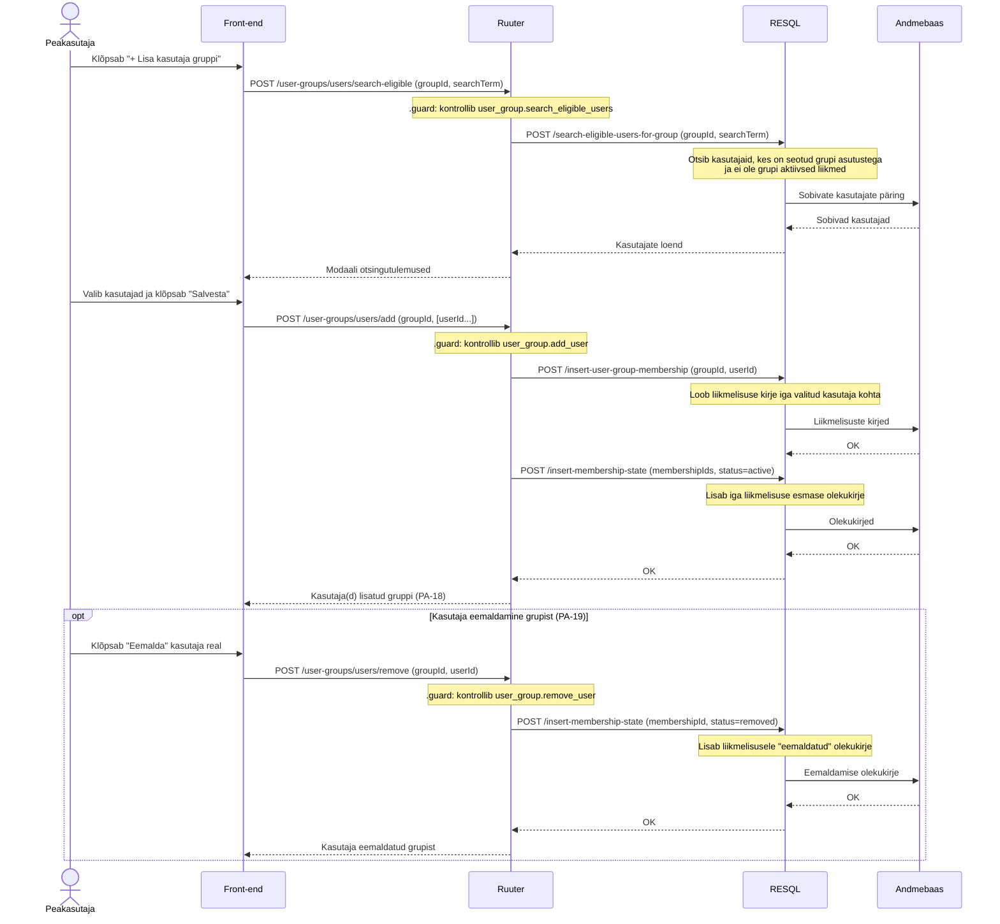
```mermaid
sequenceDiagram
    actor Admin as Peakasutaja
    participant FE as Front-end
    participant Ruuter as Ruuter
    participant RESQL as RESQL
    participant DB as Andmebaas

    Admin->>FE: Klõpsab "+ Lisa kasutaja gruppi"
    FE->>Ruuter: POST /user-groups/users/search-eligible (groupId, searchTerm)
    Note over Ruuter: .guard: kontrollib user_group.search_eligible_users
    Ruuter->>RESQL: POST /search-eligible-users-for-group (groupId, searchTerm)
    Note over RESQL: Otsib kasutajaid, kes on seotud grupi asutustega<br/>ja ei ole grupi aktiivsed liikmed
    RESQL->>DB: Sobivate kasutajate päring
    DB-->>RESQL: Sobivad kasutajad
    RESQL-->>Ruuter: Kasutajate loend
    Ruuter-->>FE: Modaali otsingutulemused

    Admin->>FE: Valib kasutajad ja klõpsab "Salvesta"
    FE->>Ruuter: POST /user-groups/users/add (groupId, [userId...])
    Note over Ruuter: .guard: kontrollib user_group.add_user
    Ruuter->>RESQL: POST /insert-user-group-membership (groupId, userId)
    Note over RESQL: Loob liikmelisuse kirje iga valitud kasutaja kohta
    RESQL->>DB: Liikmelisuste kirjed
    DB-->>RESQL: OK
    Ruuter->>RESQL: POST /insert-membership-state (membershipIds, status=active)
    Note over RESQL: Lisab iga liikmelisuse esmase olekukirje
    RESQL->>DB: Olekukirjed
    DB-->>RESQL: OK
    RESQL-->>Ruuter: OK
    Ruuter-->>FE: Kasutaja(d) lisatud gruppi (PA-18)

    opt Kasutaja eemaldamine grupist (PA-19)
        Admin->>FE: Klõpsab "Eemalda" kasutaja real
        FE->>Ruuter: POST /user-groups/users/remove (groupId, userId)
        Note over Ruuter: .guard: kontrollib user_group.remove_user
        Ruuter->>RESQL: POST /insert-membership-state (membershipId, status=removed)
        Note over RESQL: Lisab liikmelisusele "eemaldatud" olekukirje
        RESQL->>DB: Eemaldamise olekukirje
        DB-->>RESQL: OK
        RESQL-->>Ruuter: OK
        Ruuter-->>FE: Kasutaja eemaldatud grupist
    end
```

---

## KH – Lokaalne kontohaldur

### KH-01…KH-03 · Kasutajate nimekirja vaatamine ja detailvaade (oma asutus)

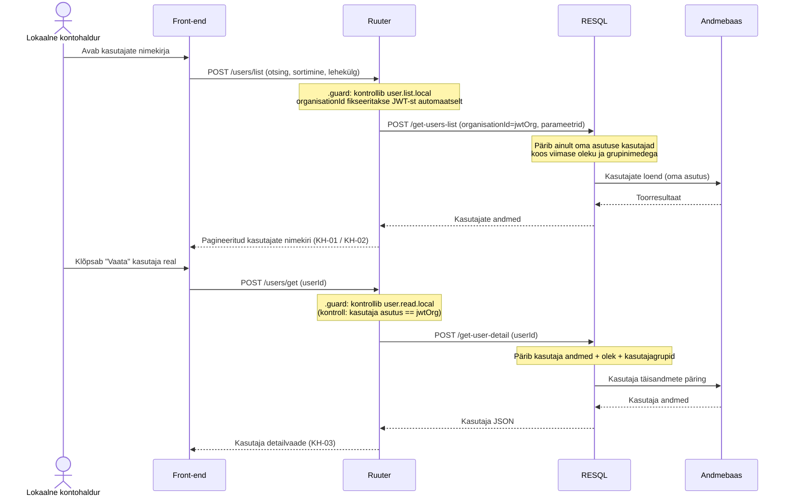
```mermaid
sequenceDiagram
    actor KH as Lokaalne kontohaldur
    participant FE as Front-end
    participant Ruuter as Ruuter
    participant RESQL as RESQL
    participant DB as Andmebaas

    KH->>FE: Avab kasutajate nimekirja
    FE->>Ruuter: POST /users/list (otsing, sortimine, lehekülg)
    Note over Ruuter: .guard: kontrollib user.list.local<br/>organisationId fikseeritakse JWT-st automaatselt
    Ruuter->>RESQL: POST /get-users-list (organisationId=jwtOrg, parameetrid)
    Note over RESQL: Pärib ainult oma asutuse kasutajad<br/>koos viimase oleku ja grupinimedega
    RESQL->>DB: Kasutajate loend (oma asutus)
    DB-->>RESQL: Toorresultaat
    RESQL-->>Ruuter: Kasutajate andmed
    Ruuter-->>FE: Pagineeritud kasutajate nimekiri (KH-01 / KH-02)

    KH->>FE: Klõpsab "Vaata" kasutaja real
    FE->>Ruuter: POST /users/get (userId)
    Note over Ruuter: .guard: kontrollib user.read.local<br/>(kontroll: kasutaja asutus == jwtOrg)
    Ruuter->>RESQL: POST /get-user-detail (userId)
    Note over RESQL: Pärib kasutaja andmed + olek + kasutajagrupid
    RESQL->>DB: Kasutaja täisandmete päring
    DB-->>RESQL: Kasutaja andmed
    RESQL-->>Ruuter: Kasutaja JSON
    Ruuter-->>FE: Kasutaja detailvaade (KH-03)
```

### KH-04…KH-06 · Kasutaja loomine ja muutmine (oma asutus)

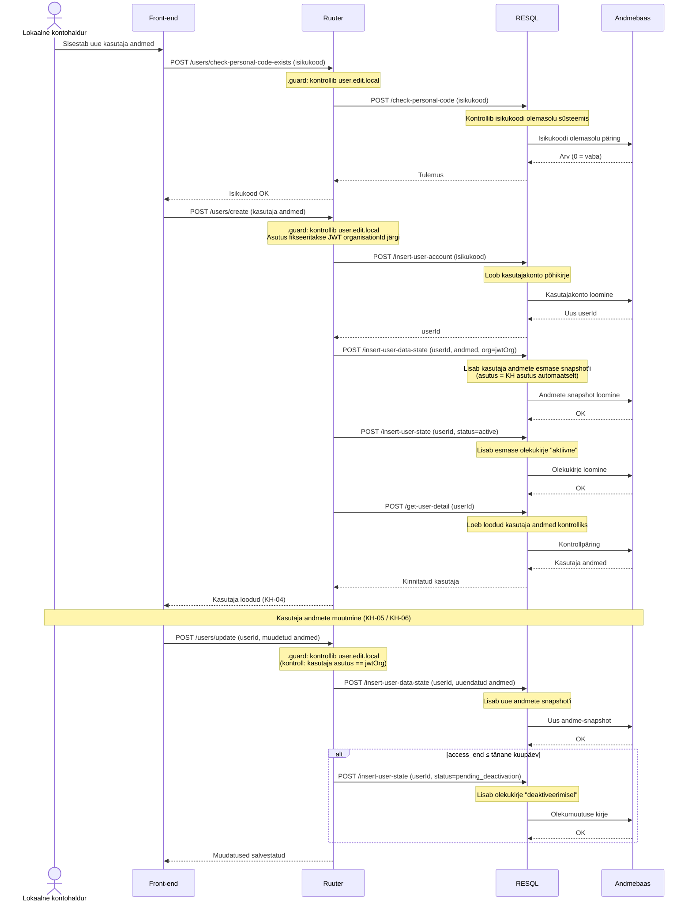
```mermaid
sequenceDiagram
    actor KH as Lokaalne kontohaldur
    participant FE as Front-end
    participant Ruuter as Ruuter
    participant RESQL as RESQL
    participant DB as Andmebaas

    KH->>FE: Sisestab uue kasutaja andmed
    FE->>Ruuter: POST /users/check-personal-code-exists (isikukood)
    Note over Ruuter: .guard: kontrollib user.edit.local
    Ruuter->>RESQL: POST /check-personal-code (isikukood)
    Note over RESQL: Kontrollib isikukoodi olemasolu süsteemis
    RESQL->>DB: Isikukoodi olemasolu päring
    DB-->>RESQL: Arv (0 = vaba)
    RESQL-->>Ruuter: Tulemus
    Ruuter-->>FE: Isikukood OK

    FE->>Ruuter: POST /users/create (kasutaja andmed)
    Note over Ruuter: .guard: kontrollib user.edit.local<br/>Asutus fikseeritakse JWT organisationId järgi
    Ruuter->>RESQL: POST /insert-user-account (isikukood)
    Note over RESQL: Loob kasutajakonto põhikirje
    RESQL->>DB: Kasutajakonto loomine
    DB-->>RESQL: Uus userId
    RESQL-->>Ruuter: userId

    Ruuter->>RESQL: POST /insert-user-data-state (userId, andmed, org=jwtOrg)
    Note over RESQL: Lisab kasutaja andmete esmase snapshot'i<br/>(asutus = KH asutus automaatselt)
    RESQL->>DB: Andmete snapshot loomine
    DB-->>RESQL: OK

    Ruuter->>RESQL: POST /insert-user-state (userId, status=active)
    Note over RESQL: Lisab esmase olekukirje "aktiivne"
    RESQL->>DB: Olekukirje loomine
    DB-->>RESQL: OK

    Ruuter->>RESQL: POST /get-user-detail (userId)
    Note over RESQL: Loeb loodud kasutaja andmed kontrolliks
    RESQL->>DB: Kontrollpäring
    DB-->>RESQL: Kasutaja andmed
    RESQL-->>Ruuter: Kinnitatud kasutaja
    Ruuter-->>FE: Kasutaja loodud (KH-04)

    Note over KH,DB: Kasutaja andmete muutmine (KH-05 / KH-06)

    FE->>Ruuter: POST /users/update (userId, muudetud andmed)
    Note over Ruuter: .guard: kontrollib user.edit.local<br/>(kontroll: kasutaja asutus == jwtOrg)
    Ruuter->>RESQL: POST /insert-user-data-state (userId, uuendatud andmed)
    Note over RESQL: Lisab uue andmete snapshot'i
    RESQL->>DB: Uus andme-snapshot
    DB-->>RESQL: OK
    alt access_end ≤ tänane kuupäev
        Ruuter->>RESQL: POST /insert-user-state (userId, status=pending_deactivation)
        Note over RESQL: Lisab olekukirje "deaktiveerimisel"
        RESQL->>DB: Olekumuutuse kirje
        DB-->>RESQL: OK
    end
    Ruuter-->>FE: Muudatused salvestatud
```

### KH-07…KH-08 · Kasutajagruppide määramine ja eemaldamine (oma asutus)

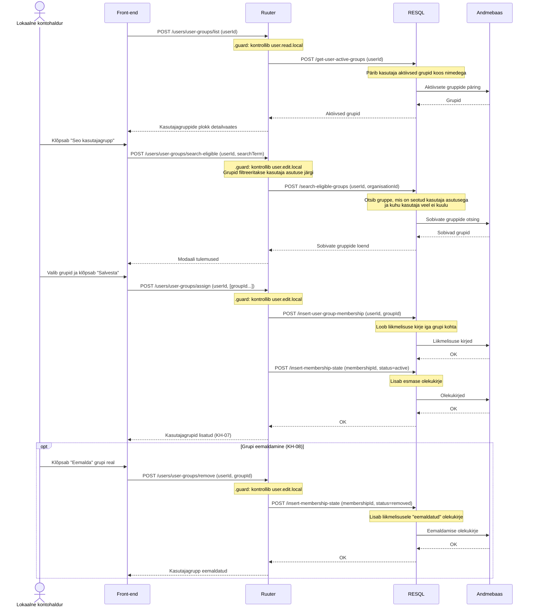
```mermaid
sequenceDiagram
    actor KH as Lokaalne kontohaldur
    participant FE as Front-end
    participant Ruuter as Ruuter
    participant RESQL as RESQL
    participant DB as Andmebaas

    FE->>Ruuter: POST /users/user-groups/list (userId)
    Note over Ruuter: .guard: kontrollib user.read.local
    Ruuter->>RESQL: POST /get-user-active-groups (userId)
    Note over RESQL: Pärib kasutaja aktiivsed grupid koos nimedega
    RESQL->>DB: Aktiivsete gruppide päring
    DB-->>RESQL: Grupid
    RESQL-->>Ruuter: Aktiivsed grupid
    Ruuter-->>FE: Kasutajagruppide plokk detailvaates

    KH->>FE: Klõpsab "Seo kasutajagrupp"
    FE->>Ruuter: POST /users/user-groups/search-eligible (userId, searchTerm)
    Note over Ruuter: .guard: kontrollib user.edit.local<br/>Grupid filtreeritakse kasutaja asutuse järgi
    Ruuter->>RESQL: POST /search-eligible-groups (userId, organisationId)
    Note over RESQL: Otsib gruppe, mis on seotud kasutaja asutusega<br/>ja kuhu kasutaja veel ei kuulu
    RESQL->>DB: Sobivate gruppide otsing
    DB-->>RESQL: Sobivad grupid
    RESQL-->>Ruuter: Sobivate gruppide loend
    Ruuter-->>FE: Modaali tulemused

    KH->>FE: Valib grupid ja klõpsab "Salvesta"
    FE->>Ruuter: POST /users/user-groups/assign (userId, [groupId...])
    Note over Ruuter: .guard: kontrollib user.edit.local
    Ruuter->>RESQL: POST /insert-user-group-membership (userId, groupId)
    Note over RESQL: Loob liikmelisuse kirje iga grupi kohta
    RESQL->>DB: Liikmelisuse kirjed
    DB-->>RESQL: OK
    Ruuter->>RESQL: POST /insert-membership-state (membershipId, status=active)
    Note over RESQL: Lisab esmase olekukirje
    RESQL->>DB: Olekukirjed
    DB-->>RESQL: OK
    RESQL-->>Ruuter: OK
    Ruuter-->>FE: Kasutajagrupid lisatud (KH-07)

    opt Grupi eemaldamine (KH-08)
        KH->>FE: Klõpsab "Eemalda" grupi real
        FE->>Ruuter: POST /users/user-groups/remove (userId, groupId)
        Note over Ruuter: .guard: kontrollib user.edit.local
        Ruuter->>RESQL: POST /insert-membership-state (membershipId, status=removed)
        Note over RESQL: Lisab liikmelisusele "eemaldatud" olekukirje
        RESQL->>DB: Eemaldamise olekukirje
        DB-->>RESQL: OK
        RESQL-->>Ruuter: OK
        Ruuter-->>FE: Kasutajagrupp eemaldatud
    end
```

### KH-09…KH-12 · Kasutajagruppide vaatamine (oma asutus)

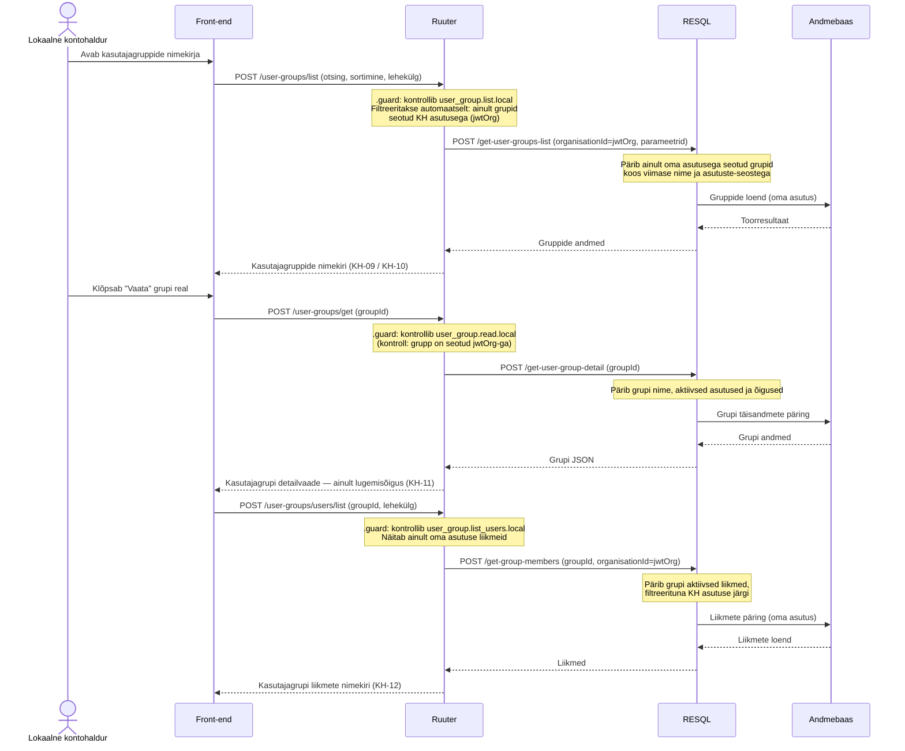
```mermaid
sequenceDiagram
    actor KH as Lokaalne kontohaldur
    participant FE as Front-end
    participant Ruuter as Ruuter
    participant RESQL as RESQL
    participant DB as Andmebaas

    KH->>FE: Avab kasutajagruppide nimekirja
    FE->>Ruuter: POST /user-groups/list (otsing, sortimine, lehekülg)
    Note over Ruuter: .guard: kontrollib user_group.list.local<br/>Filtreeritakse automaatselt: ainult grupid<br/>seotud KH asutusega (jwtOrg)
    Ruuter->>RESQL: POST /get-user-groups-list (organisationId=jwtOrg, parameetrid)
    Note over RESQL: Pärib ainult oma asutusega seotud grupid<br/>koos viimase nime ja asutuste-seostega
    RESQL->>DB: Gruppide loend (oma asutus)
    DB-->>RESQL: Toorresultaat
    RESQL-->>Ruuter: Gruppide andmed
    Ruuter-->>FE: Kasutajagruppide nimekiri (KH-09 / KH-10)

    KH->>FE: Klõpsab "Vaata" grupi real
    FE->>Ruuter: POST /user-groups/get (groupId)
    Note over Ruuter: .guard: kontrollib user_group.read.local<br/>(kontroll: grupp on seotud jwtOrg-ga)
    Ruuter->>RESQL: POST /get-user-group-detail (groupId)
    Note over RESQL: Pärib grupi nime, aktiivsed asutused ja õigused
    RESQL->>DB: Grupi täisandmete päring
    DB-->>RESQL: Grupi andmed
    RESQL-->>Ruuter: Grupi JSON
    Ruuter-->>FE: Kasutajagrupi detailvaade — ainult lugemisõigus (KH-11)

    FE->>Ruuter: POST /user-groups/users/list (groupId, lehekülg)
    Note over Ruuter: .guard: kontrollib user_group.list_users.local<br/>Näitab ainult oma asutuse liikmeid
    Ruuter->>RESQL: POST /get-group-members (groupId, organisationId=jwtOrg)
    Note over RESQL: Pärib grupi aktiivsed liikmed,<br/>filtreerituna KH asutuse järgi
    RESQL->>DB: Liikmete päring (oma asutus)
    DB-->>RESQL: Liikmete loend
    RESQL-->>Ruuter: Liikmed
    Ruuter-->>FE: Kasutajagrupi liikmete nimekiri (KH-12)
```

---

## SP – Süsteemprotsess (öine deaktiveerimine)

### SP-01…SP-04 · Kasutaja deaktiveerimise öine protsess

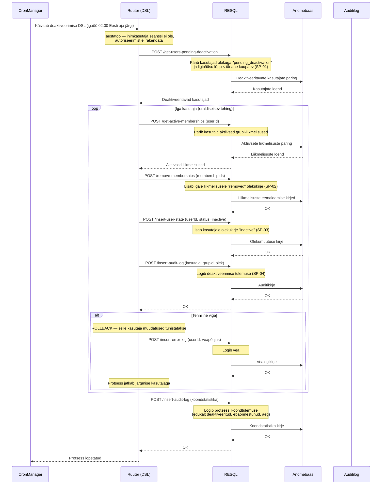
```mermaid
sequenceDiagram
    participant Cron as CronManager
    participant Ruuter as Ruuter (DSL)
    participant RESQL as RESQL
    participant DB as Andmebaas
    participant Log as Auditilog

    Cron->>Ruuter: Käivitab deaktiveerimise DSL (igaöö 02:00 Eesti aja järgi)
    Note over Ruuter: Taustatöö — inimkasutaja seanssi ei ole,<br/>autoriseerimist ei rakendata

    Ruuter->>RESQL: POST /get-users-pending-deactivation
    Note over RESQL: Pärib kasutajad olekuga "pending_deactivation"<br/>ja ligipääsu lõpp ≤ tänane kuupäev (SP-01)
    RESQL->>DB: Deaktiveeritavate kasutajate päring
    DB-->>RESQL: Kasutajate loend
    RESQL-->>Ruuter: Deaktiveeritavad kasutajad

    loop Iga kasutaja (eraldiseisev tehing)
        Ruuter->>RESQL: POST /get-active-memberships (userId)
        Note over RESQL: Pärib kasutaja aktiivsed grupi-liikmelisused
        RESQL->>DB: Aktiivsete liikmelisuste päring
        DB-->>RESQL: Liikmelisuste loend
        RESQL-->>Ruuter: Aktiivsed liikmelisused

        Ruuter->>RESQL: POST /remove-memberships (membershipIds)
        Note over RESQL: Lisab igale liikmelisusele "removed" olekukirje (SP-02)
        RESQL->>DB: Liikmelisuste eemaldamise kirjed
        DB-->>RESQL: OK

        Ruuter->>RESQL: POST /insert-user-state (userId, status=inactive)
        Note over RESQL: Lisab kasutajale olekukirje "inactive" (SP-03)
        RESQL->>DB: Olekumuutuse kirje
        DB-->>RESQL: OK

        Ruuter->>RESQL: POST /insert-audit-log (kasutaja, grupid, olek)
        Note over RESQL: Logib deaktiveerimise tulemuse (SP-04)
        RESQL->>DB: Auditikirje
        DB-->>RESQL: OK
        RESQL-->>Ruuter: OK

        alt Tehniline viga
            Note over Ruuter: ROLLBACK — selle kasutaja muudatused tühistatakse
            Ruuter->>RESQL: POST /insert-error-log (userId, veapõhjus)
            Note over RESQL: Logib vea
            RESQL->>DB: Vealogikirje
            DB-->>RESQL: OK
            Note over Ruuter: Protsess jätkab järgmise kasutajaga
        end
    end

    Ruuter->>RESQL: POST /insert-audit-log (koondstatistika)
    Note over RESQL: Logib protsessi koondtulemuse<br/>(edukalt deaktiveeritud, ebaõnnestunud, aeg)
    RESQL->>DB: Koondstatistika kirje
    DB-->>RESQL: OK
    RESQL-->>Ruuter: OK
    Ruuter-->>Cron: Protsess lõpetatud
```
<!-- EPIC_02 END -->

<!-- EPIC_04 BEGIN -->
# LJVIS – EPIC 04 Klassifikaatorite haldamine kasutuslood

## Kasutajagrupid

| Kasutajagrupp | Rollikood | Ulatus epikus |
|---------------|-----------|---------------|
| **Peakasutaja (Admin)** | `admin` | Ainus roll, kellel on õigus klassifikaatoreid hallata: nimekiri, detailvaade, päise muutmine, väärtuste lisamine ja kehtivuse lõpetamine. Süsteemiülene — kõik klassifikaatorid. |

> **Märkus tarbimistee kohta:** Teised rollid (ametnik, lokaalne kontohaldur, kodanik) loevad klassifikaatorite väärtusi tarbimiskontekstis (rippmenüüd, otsingufiltreid) teiste epic'ide vaadetes. Nad ei pääse EPIC 04 haldusvaadetele. Tarbimisendpoint'ide õigusmudel (eraldi kood vs. ainult kehtiv JWT) ei ole lõplikult kinnitatud.

---

## 1. Peakasutaja (Admin)

### 1.1 Klassifikaatorite nimekiri ja navigeerimine

| # | Kasutuslugu | Vajalik õigus |
|---|-------------|---------------|
| PK-01 | Peakasutaja avab klassifikaatorite nimekirja (menüütee „Haldus > Klassifikaatorid"), mis kuvab kõigi klassifikaatorite koodi, nimetust ja selgitust pagineerituna. Vaikimisi sortimine: nimetus A → Ö (eesti tähestik). Kasutaja saab sorteerida veergude Kood ja Nimetus järgi. | `classifier.list` |
| PK-02 | Peakasutaja otsib klassifikaatoreid koodi või nimetuse järgi (OR-loogika, case-insensitive, osaline vastavus, vähemalt 3 tähemärki). | `classifier.list` |
| PK-03 | Peakasutaja avab klassifikaatori detailvaate nimekirja realt klõpsates või lingilt „Vaata". | `classifier.list`, `classifier.read` |

### 1.2 Klassifikaatori detailvaade

| # | Kasutuslugu | Vajalik õigus |
|---|-------------|---------------|
| PK-04 | Peakasutaja vaatab klassifikaatori päist: kood (`code`, muutmatu), nimetus (`name`) ja selgitus (`description`) viimase versiooni järgi. Breadcrumb: „Haldus > Klassifikaatorid > [code]“. | `classifier.read` |
| PK-05 | Peakasutaja vaatab klassifikaatori väärtuste nimekirja: kood (`code`), nimetus (`name`), kehtivuse algus (`validFrom`), kehtivuse lõpp (`validUntil`) ja olek (`isValid`: kehtiv / lõpetatud). Vaikimisi kuvatakse ainult kehtivad väärtused; filtri väljalülitamisel kuvatakse ka lõpetatud. Sortimine veergude Kood, Nimetus, Kehtivuse algus, Kehtivuse lõpp järgi. | `classifier.read` |

### 1.3 Klassifikaatori andmete muutmine

| # | Kasutuslugu | Vajalik õigus |
|---|-------------|---------------|
| PK-06 | Peakasutaja muudab klassifikaatori nimetust (`name`) ja/või selgitust (`description`) detailvaate nupust „Muuda“. Kood (`code`) on lukustatud ja muutmatu. Iga muudatus salvestatakse uue versioonireana (INSERT-only); varasemad versioonid säilivad. | `classifier.read`, `classifier.edit` |

> **NB:** Klassifikaatori `code` on muutmatu kõigil rollidel. Backend keeldub koodipuutmatuse rikkumiskatsest (HTTP 400).

### 1.4 Klassifikaatori väärtuste haldamine

| # | Kasutuslugu | Vajalik õigus |
|---|-------------|---------------|
| PK-07 | Peakasutaja lisab klassifikaatorisse uue väärtuse modaalist „+ Lisa väärtus“: kood (`code`, unikaalne klassifikaatori piires, muutmatu), nimetus (`name`, muutmatu), kehtivuse algus (`validFrom`) ja valikuliselt kehtivuse lõpp (`validUntil`). Koodi unikaalsust kontrollitakse nii klient-poolselt (blur-sündmusel) kui server-poolselt (pre-INSERT). | `classifier.read`, `classifier_value.edit` |
| PK-08 | Peakasutaja lõpetab kehtiva väärtuse kehtivuse kinnitusdialoogist „Lõpeta kehtivus": süsteem määrab kehtivuse lõpuks tänase kuupäeva. Väärtus jääb süsteemi alles ja kuvatakse olekuga „Lõpetatud". Juba lõpetatud väärtust ei saa taasavada. | `classifier.read`, `classifier_value.edit` |

> **NB:** Väärtuse `code` ja `name` on muutmatud pärast lisamist. Ümbernimetamiseks tuleb vana väärtus lõpetada ja uus lisada.

---

# Sequence diagrammid kasutajagruppide kaupa

> **Arhitektuurne kontekst:** Kõik diagrammid järgivad Buerokratt-perekonna komponentide arhitektuuri (vt `Ruuter_RESQL_DataMapper_arhitektuur.md`).
>
> - **Front-end** suhtleb ainult **Ruuter**iga (REST API)
> - **Ruuter** teostab autoriseerimise (`.guard` failid / JWT) ja orkestreerib äriloogika (YAML DSL)
> - **RESQL** täidab andmebaasipäringuid (üks fail = üks päring = üks endpoint; ainult INSERT ja SELECT)
> - **CronManager** haldab perioodilisi taustatöid

## 1. Peakasutaja (Admin)

### PK-01…PK-03 · Klassifikaatorite nimekiri ja navigeerimine

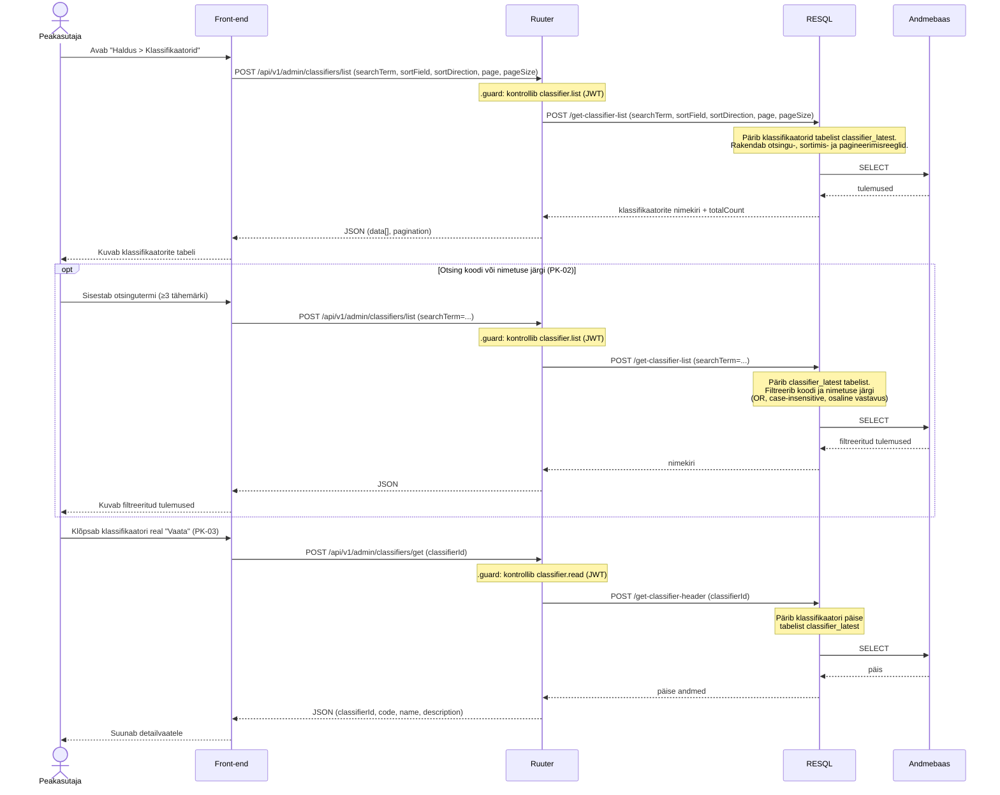
```mermaid
sequenceDiagram
    actor PK as Peakasutaja
    participant FE as Front-end
    participant Ruuter as Ruuter
    participant RESQL as RESQL
    participant DB as Andmebaas

    PK->>FE: Avab "Haldus > Klassifikaatorid"
    FE->>Ruuter: POST /api/v1/admin/classifiers/list (searchTerm, sortField, sortDirection, page, pageSize)
    Note over Ruuter: .guard: kontrollib classifier.list (JWT)
    Ruuter->>RESQL: POST /get-classifier-list (searchTerm, sortField, sortDirection, page, pageSize)
    Note over RESQL: Pärib klassifikaatorid tabelist classifier_latest.<br/>Rakendab otsingu-, sortimis- ja pagineerimisreeglid.
    RESQL->>DB: SELECT
    DB-->>RESQL: tulemused
    RESQL-->>Ruuter: klassifikaatorite nimekiri + totalCount
    Ruuter-->>FE: JSON (data[], pagination)
    FE-->>PK: Kuvab klassifikaatorite tabeli

    opt Otsing koodi või nimetuse järgi (PK-02)
        PK->>FE: Sisestab otsingutermi (≥3 tähemärki)
        FE->>Ruuter: POST /api/v1/admin/classifiers/list (searchTerm=...)
        Note over Ruuter: .guard: kontrollib classifier.list (JWT)
        Ruuter->>RESQL: POST /get-classifier-list (searchTerm=...)
        Note over RESQL: Pärib classifier_latest tabelist.<br/>Filtreerib koodi ja nimetuse järgi<br/>(OR, case-insensitive, osaline vastavus)
        RESQL->>DB: SELECT
        DB-->>RESQL: filtreeritud tulemused
        RESQL-->>Ruuter: nimekiri
        Ruuter-->>FE: JSON
        FE-->>PK: Kuvab filtreeritud tulemused
    end

    PK->>FE: Klõpsab klassifikaatori real "Vaata" (PK-03)
    FE->>Ruuter: POST /api/v1/admin/classifiers/get (classifierId)
    Note over Ruuter: .guard: kontrollib classifier.read (JWT)
    Ruuter->>RESQL: POST /get-classifier-header (classifierId)
    Note over RESQL: Pärib klassifikaatori päise<br/>tabelist classifier_latest
    RESQL->>DB: SELECT
    DB-->>RESQL: päis
    RESQL-->>Ruuter: päise andmed
    Ruuter-->>FE: JSON (classifierId, code, name, description)
    FE-->>PK: Suunab detailvaatele
```

---

### PK-04…PK-05 · Klassifikaatori detailvaade

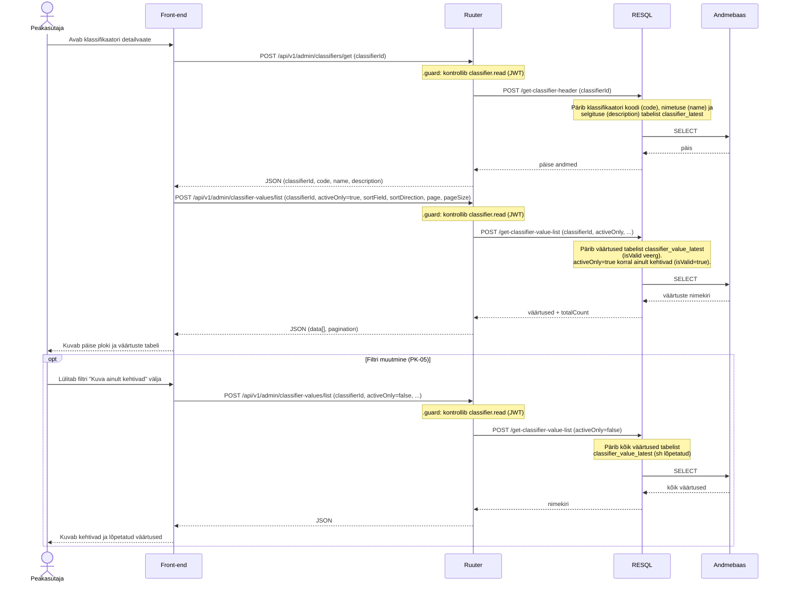
```mermaid
sequenceDiagram
    actor PK as Peakasutaja
    participant FE as Front-end
    participant Ruuter as Ruuter
    participant RESQL as RESQL
    participant DB as Andmebaas

    PK->>FE: Avab klassifikaatori detailvaate
    FE->>Ruuter: POST /api/v1/admin/classifiers/get (classifierId)
    Note over Ruuter: .guard: kontrollib classifier.read (JWT)
    Ruuter->>RESQL: POST /get-classifier-header (classifierId)
    Note over RESQL: Pärib klassifikaatori koodi (code), nimetuse (name) ja<br/>selgituse (description) tabelist classifier_latest
    RESQL->>DB: SELECT
    DB-->>RESQL: päis
    RESQL-->>Ruuter: päise andmed
    Ruuter-->>FE: JSON (classifierId, code, name, description)

    FE->>Ruuter: POST /api/v1/admin/classifier-values/list (classifierId, activeOnly=true, sortField, sortDirection, page, pageSize)
    Note over Ruuter: .guard: kontrollib classifier.read (JWT)
    Ruuter->>RESQL: POST /get-classifier-value-list (classifierId, activeOnly, ...)
    Note over RESQL: Pärib väärtused tabelist classifier_value_latest<br/>(isValid veerg).<br/>activeOnly=true korral ainult kehtivad (isValid=true).
    RESQL->>DB: SELECT
    DB-->>RESQL: väärtuste nimekiri
    RESQL-->>Ruuter: väärtused + totalCount
    Ruuter-->>FE: JSON (data[], pagination)
    FE-->>PK: Kuvab päise ploki ja väärtuste tabeli

    opt Filtri muutmine (PK-05)
        PK->>FE: Lülitab filtri "Kuva ainult kehtivad" välja
        FE->>Ruuter: POST /api/v1/admin/classifier-values/list (classifierId, activeOnly=false, ...)
        Note over Ruuter: .guard: kontrollib classifier.read (JWT)
        Ruuter->>RESQL: POST /get-classifier-value-list (activeOnly=false)
        Note over RESQL: Pärib kõik väärtused tabelist<br/>classifier_value_latest (sh lõpetatud)
        RESQL->>DB: SELECT
        DB-->>RESQL: kõik väärtused
        RESQL-->>Ruuter: nimekiri
        Ruuter-->>FE: JSON
        FE-->>PK: Kuvab kehtivad ja lõpetatud väärtused
    end
```

---

### PK-06 · Klassifikaatori andmete muutmine

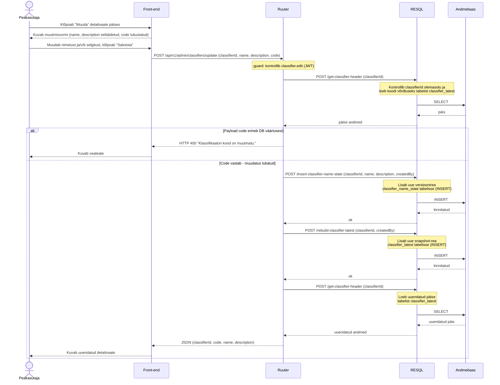
```mermaid
sequenceDiagram
    actor PK as Peakasutaja
    participant FE as Front-end
    participant Ruuter as Ruuter
    participant RESQL as RESQL
    participant DB as Andmebaas

    PK->>FE: Klõpsab "Muuda" detailvaate päises
    FE-->>PK: Kuvab muutmisvormi (name, description eeltäidetud, code lukustatud)

    PK->>FE: Muudab nimetust ja/või selgitust, klõpsab "Salvesta"
    FE->>Ruuter: POST /api/v1/admin/classifiers/update (classifierId, name, description, code)
    Note over Ruuter: .guard: kontrollib classifier.edit (JWT)

    Ruuter->>RESQL: POST /get-classifier-header (classifierId)
    Note over RESQL: Kontrollib classifierId olemasolu ja<br/>loeb koodi võrdluseks tabelist classifier_latest
    RESQL->>DB: SELECT
    DB-->>RESQL: päis
    RESQL-->>Ruuter: päise andmed

    alt Payload code erineb DB väärtusest
        Ruuter-->>FE: HTTP 400 "Klassifikaatori kood on muutmatu."
        FE-->>PK: Kuvab veateate
    else Code vastab - muudatus lubatud
        Ruuter->>RESQL: POST /insert-classifier-name-state (classifierId, name, description, createdBy)
        Note over RESQL: Lisab uue versioonirea<br/>classifier_name_state tabelisse (INSERT)
        RESQL->>DB: INSERT
        DB-->>RESQL: kinnitatud
        RESQL-->>Ruuter: ok

        Ruuter->>RESQL: POST /rebuild-classifier-latest (classifierId, createdBy)
        Note over RESQL: Lisab uue snapshot-rea<br/>classifier_latest tabelisse (INSERT)
        RESQL->>DB: INSERT
        DB-->>RESQL: kinnitatud
        RESQL-->>Ruuter: ok

        Ruuter->>RESQL: POST /get-classifier-header (classifierId)
        Note over RESQL: Loeb uuendatud päise<br/>tabelist classifier_latest
        RESQL->>DB: SELECT
        DB-->>RESQL: uuendatud päis
        RESQL-->>Ruuter: uuendatud andmed

        Ruuter-->>FE: JSON (classifierId, code, name, description)
        FE-->>PK: Kuvab uuendatud detailvaate
    end
```

---

### PK-07 · Uue väärtuse lisamine

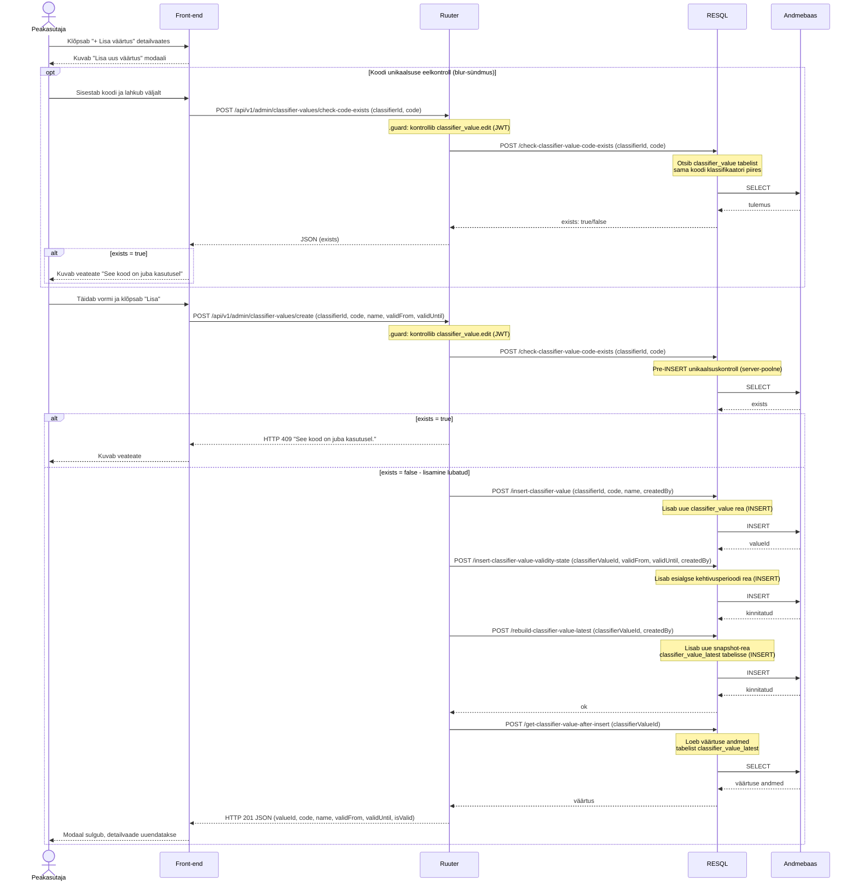
```mermaid
sequenceDiagram
    actor PK as Peakasutaja
    participant FE as Front-end
    participant Ruuter as Ruuter
    participant RESQL as RESQL
    participant DB as Andmebaas

    PK->>FE: Klõpsab "+ Lisa väärtus" detailvaates
    FE-->>PK: Kuvab "Lisa uus väärtus" modaali

    opt Koodi unikaalsuse eelkontroll (blur-sündmus)
        PK->>FE: Sisestab koodi ja lahkub väljalt
        FE->>Ruuter: POST /api/v1/admin/classifier-values/check-code-exists (classifierId, code)
        Note over Ruuter: .guard: kontrollib classifier_value.edit (JWT)
        Ruuter->>RESQL: POST /check-classifier-value-code-exists (classifierId, code)
        Note over RESQL: Otsib classifier_value tabelist<br/>sama koodi klassifikaatori piires
        RESQL->>DB: SELECT
        DB-->>RESQL: tulemus
        RESQL-->>Ruuter: exists: true/false
        Ruuter-->>FE: JSON (exists)
        alt exists = true
            FE-->>PK: Kuvab veateate "See kood on juba kasutusel"
        end
    end

    PK->>FE: Täidab vormi ja klõpsab "Lisa"
    FE->>Ruuter: POST /api/v1/admin/classifier-values/create (classifierId, code, name, validFrom, validUntil)
    Note over Ruuter: .guard: kontrollib classifier_value.edit (JWT)

    Ruuter->>RESQL: POST /check-classifier-value-code-exists (classifierId, code)
    Note over RESQL: Pre-INSERT unikaalsuskontroll (server-poolne)
    RESQL->>DB: SELECT
    DB-->>RESQL: exists

    alt exists = true
        Ruuter-->>FE: HTTP 409 "See kood on juba kasutusel."
        FE-->>PK: Kuvab veateate
    else exists = false - lisamine lubatud
        Ruuter->>RESQL: POST /insert-classifier-value (classifierId, code, name, createdBy)
        Note over RESQL: Lisab uue classifier_value rea (INSERT)
        RESQL->>DB: INSERT
        DB-->>RESQL: valueId

        Ruuter->>RESQL: POST /insert-classifier-value-validity-state (classifierValueId, validFrom, validUntil, createdBy)
        Note over RESQL: Lisab esialgse kehtivusperioodi rea (INSERT)
        RESQL->>DB: INSERT
        DB-->>RESQL: kinnitatud

        Ruuter->>RESQL: POST /rebuild-classifier-value-latest (classifierValueId, createdBy)
        Note over RESQL: Lisab uue snapshot-rea<br/>classifier_value_latest tabelisse (INSERT)
        RESQL->>DB: INSERT
        DB-->>RESQL: kinnitatud
        RESQL-->>Ruuter: ok

        Ruuter->>RESQL: POST /get-classifier-value-after-insert (classifierValueId)
        Note over RESQL: Loeb väärtuse andmed<br/>tabelist classifier_value_latest
        RESQL->>DB: SELECT
        DB-->>RESQL: väärtuse andmed
        RESQL-->>Ruuter: väärtus

        Ruuter-->>FE: HTTP 201 JSON (valueId, code, name, validFrom, validUntil, isValid)
        FE-->>PK: Modaal sulgub, detailvaade uuendatakse
    end
```

---

### PK-08 · Väärtuse kehtivuse lõpetamine

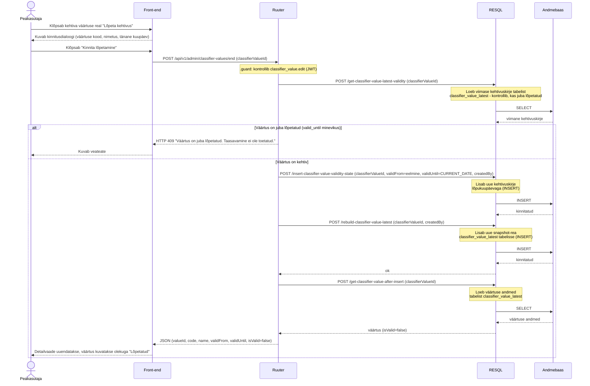
```mermaid
sequenceDiagram
    actor PK as Peakasutaja
    participant FE as Front-end
    participant Ruuter as Ruuter
    participant RESQL as RESQL
    participant DB as Andmebaas

    PK->>FE: Klõpsab kehtiva väärtuse real "Lõpeta kehtivus"
    FE-->>PK: Kuvab kinnitusdialoogi (väärtuse kood, nimetus, tänane kuupäev)

    PK->>FE: Klõpsab "Kinnita lõpetamine"
    FE->>Ruuter: POST /api/v1/admin/classifier-values/end (classifierValueId)
    Note over Ruuter: .guard: kontrollib classifier_value.edit (JWT)

    Ruuter->>RESQL: POST /get-classifier-value-latest-validity (classifierValueId)
    Note over RESQL: Loeb viimase kehtivuskirje tabelist<br/>classifier_value_latest - kontrollib, kas juba lõpetatud
    RESQL->>DB: SELECT
    DB-->>RESQL: viimane kehtivuskirje

    alt Väärtus on juba lõpetatud (valid_until minevikus)
        Ruuter-->>FE: HTTP 409 "Väärtus on juba lõpetatud. Taasavamine ei ole toetatud."
        FE-->>PK: Kuvab veateate
    else Väärtus on kehtiv
        Ruuter->>RESQL: POST /insert-classifier-value-validity-state (classifierValueId, validFrom=eelmine, validUntil=CURRENT_DATE, createdBy)
        Note over RESQL: Lisab uue kehtivuskirje<br/>lõpukuupäevaga (INSERT)
        RESQL->>DB: INSERT
        DB-->>RESQL: kinnitatud

        Ruuter->>RESQL: POST /rebuild-classifier-value-latest (classifierValueId, createdBy)
        Note over RESQL: Lisab uue snapshot-rea<br/>classifier_value_latest tabelisse (INSERT)
        RESQL->>DB: INSERT
        DB-->>RESQL: kinnitatud
        RESQL-->>Ruuter: ok

        Ruuter->>RESQL: POST /get-classifier-value-after-insert (classifierValueId)
        Note over RESQL: Loeb väärtuse andmed<br/>tabelist classifier_value_latest
        RESQL->>DB: SELECT
        DB-->>RESQL: väärtuse andmed
        RESQL-->>Ruuter: väärtus (isValid=false)

        Ruuter-->>FE: JSON (valueId, code, name, validFrom, validUntil, isValid=false)
        FE-->>PK: Detailvaade uuendatakse, väärtus kuvatakse olekuga "Lõpetatud"
    end
```
<!-- EPIC_04 END -->
