# LJVIS2 kasutajajuhend

## Sissejuhatus

LJVIS2 (Liiklusjärelvalve infosüsteem 2) on veebipõhine tööriist transpordiametnikele ja ettevõtjatele. Selle abil dokumenteeritakse liiklus-, tööinspektsiooni- ja tehnilisi kontrolle, hallatakse kasutajaid ning vaadatakse auditilogi.

## Kellele juhend on mõeldud

- **Ametnikele**, kes täidavad kontrollakte (nt tee kontroll, tööinspektsioon, tehniline kontroll).
- **Administraatoritele**, kes haldavad süsteemi kasutajaid, gruppe, õigusi ja klassifikaatoreid.
- **Ettevõtja esindajatele**, kes soovivad tulevikus vaadata ettevõtte riskitaset.

## Peamised funktsioonid

- TARA autentimine
- Kontrollaktide vormid
- Failide manustamine
- Kasutajate ja õiguste haldus
- Klassifikaatorite haldus
- Auditilogi
- Planeeritud riskihindamine

## Süsteemi arhitektuur ühe pilguga

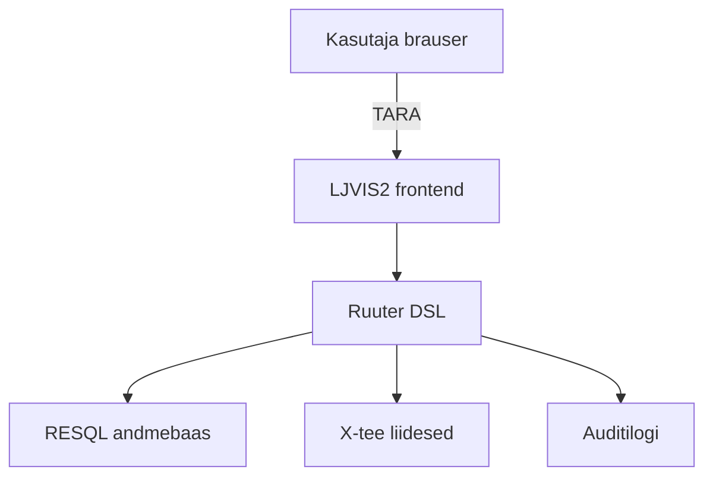


## Sisselogimine

Süsteemi sisenemiseks kasutatakse Eesti autentimisteenust TARA. Sisselogimislehel on kaks sisenevusnuppu: **Kodanikule** ja **Ametnikule**.

## Sisselogimise sammud

1. Avage LJVIS2 veebiaadress.
2. Valige oma rolli järgi nupp:
   - **Kodanikule** — ettevõtja esindajale (tulevikus riskitaseme vaatamiseks).
   - **Ametnikule** — transpordiametnikule.
3. Teid suunatakse TARA autentimiskeskkonda.
4. Sisestage isikukood ja autentige end (Smart-ID, Mobiil-ID või ID-kaart).
5. Pärase edukat autentimist suunatakse Teid tagasi LJVIS2 töölauale.

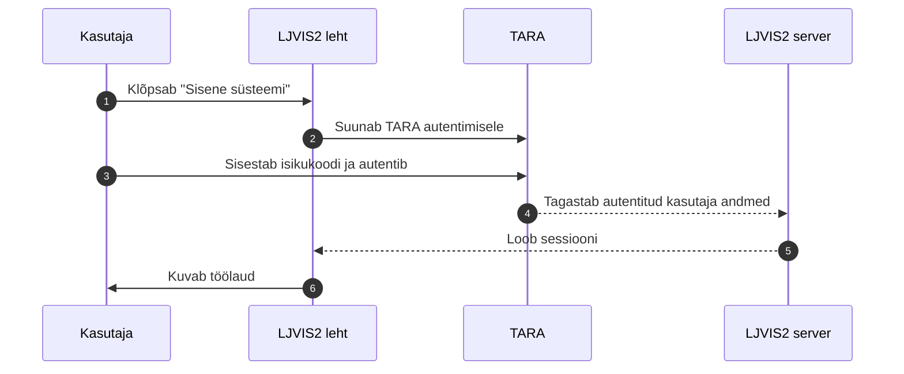

## Rollid ja õigused

Pärast sisselogimist määrab süsteem, millised menüüpunktid kuvatakse. See sõltub Teie kuuluvusest kasutajagruppidesse.

| Roll | Tüüpiline õigus | Ligipääs |
|---|---|---|
| Üldadministraator | `user.list.admin`, `user_group.list.admin`, `classifier.list`, `audit.read` | Kõik |
| Organisatsiooni admin | `user.list.local`, `user_group.list.local` | Oma organisatsioon |
| Ametnik | `foreign_violation_form.write` jms | Kontrollaktide täitmine |
| Ettevõtja esindaja | — (riskivaade) | Oma ettevõtte andmed |

## Väljalogimine

Väljalogimiseks klõpsake paremas ülanurgas kasutaja menüüd ja valige **Logi välja**. See lõpetab nii LJVIS2 kui ka TIM sessiooni.


## Menüü ja navigatsioon

Põhimenüü asub vasakul küljel. Süsteemi vaates on topeltnupp: vasakul **Menüü** ja paremal **Kasutaja**.

## Menüü struktuur

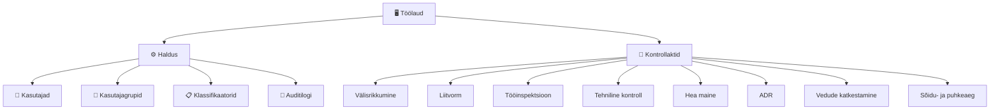

## Menüüpunktide õigused

| Menüüpunkt | Õigus | Selgitus |
|---|---|---|
| Töölaud | — | Avaleht kõigile autenditud kasutajatele |
| Kasutajad | `user.list.admin` või `user.list.local` | Kasutajate nimekiri ja haldus |
| Kasutajagrupid | `user_group.list.admin` või `user_group.list.local` | Gruppide haldus |
| Klassifikaatorid | `classifier.list` | Klassifikaatorite vaatamine ja muutmine |
| Auditilogi | `audit.read` | Tegevuste logi |
| Välisriigis toimunud rikkumise akt | `foreign_violation_form.write` | Vormi täitmine |
| Liitvorm | `compound_form.write` | Tee kontrolli vorm |
| Tööinspektsiooni kontrollakt | `labour_inspection_form.write` | Tööinspektsiooni vorm |
| Tehniline kontroll | `vehicle_technical_form.write` / `trailer_technical_form.write` | Sõiduki/haagise kontroll |
| Vedude katkestamine | `transport_interruption_form.write` | Katkestamise vorm |
| ADR | `adr_form.write` | Ohtlike kaupade vorm |
| Hea maine | `good_repute_form.write` | Hea maine vorm |
| Sõidu- ja puhkeaeg | `drive_rest_form.write` | Sõidu- ja puhkeaeg |

## Menüü käitumine mobiilis

Mobiilseadmes on külgmenüü vaikimisi peidus. Selle avamiseks vajutage ülemisel ribal **Menüü** nuppu. Menüü sulgub automaatselt, kui valite uue lehekülje.

## Aktiivne punkt

Aktiivne menüüpunkt on esile tõstetud. Kui olete haldusala all, jääb **Haldus** grupp lahti.


## Töölaud

Töölaud on süsteemi avaleht pärast sisselogimist. Sellelt saab kiiresti alustada levinud tegevusi.

## Töövoo algus

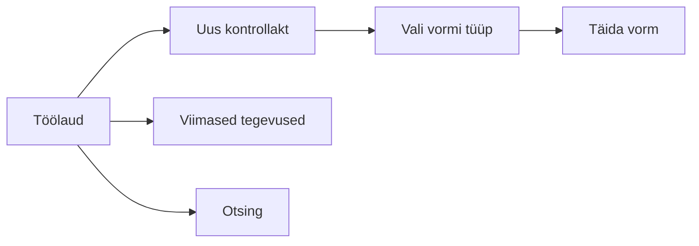

## Võimalikud komponendid

- **Kiirlingid uute vormide juurde** — näiteks "Uus liitvorm", "Uus välisrikkumise akt".
- **Viimased tegevused** — nimekiri viimati salvestatud või vaadatud vormidest.
- **Hoiatused ja märkused** — võimalikud tõrked või infomärkused.

## Töölaud erinevate rollide jaoks

- **Ametnikule** kuvatakse peamiselt vormide lingid.
- **Administraatorile** võidakse kuvada täiendavaid linke kasutajate ja auditilogi halduseks.


## Vormide üldine käsitsemine

Kõik kontrollaktid töötavad sarnaselt. Selles peatükis kirjeldatakse ühised toimingud.

## Vormi elutsükkel

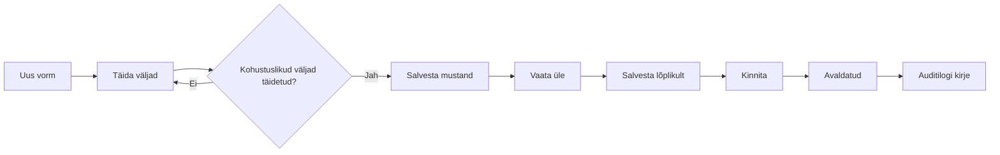

## Kohustuslikud väljad

Kohustuslikud väljad on tähistatud tärniga `*` või punase tähega. Vormi ei saa lõplikult salvestada enne, kui kõik kohustuslikud väljad on korrektselt täidetud.

## Salvestamise nupud

| Nupp | Selgitus |
|---|---|
| Salvesta mustand | Salvestab vormi mustandina. Veel ei kinnitata. |
| Salvesta lõplikult | Valideerib ja salvestab vormi. Nõuab kõigi kohustuslike väljade täitmist. |
| Kinnita | Muudab vormi avaldatuks. Hiljem muuta ei saa. |
| Tühista | Tühistab vormi täitmise. |

## Mõisted

| Mõiste | Selgitus |
|---|---|
| Mustand | Salvestatud, kuid mitte kinnitatud vorm. Saab muuta. |
| Avaldatud | Kinnitatud vorm, mida enam muuta ei saa. |
| Snapshot | Vormi salvestatud seisund ajateljel. Võimaldab vaadata varasemaid versioone. |
| Vormi number | Unikaalne number, mis antakse vormile salvestamisel. |

## Vormide otsing

Vormidele pääseb ligi töölaua või menüü kaudu. Iga vormi vaade koosneb:

- põhiandmete kaartidest
- alamvormide loendist (liitvormi puhul)
- failide loendist
- ajaloo/snapshots loendist


## Välisriigis toimunud rikkumise akt

Välisriigis toimunud rikkumise akti kasutatakse siis, kui välisriigi ametiasutus edastab Eesti transpordiametile teate liiklusrikkumisest, mille on toime pannud Eesti vedaja või tema juht välisriigis.

## Vormi eesmärk

- Dokumenteerida välisriigis tuvastatud rikkumine
- Määrata sanktsioon ja soovitatav meede
- Salvestada rikkumise detailid (sõiduk, juht, ettevõte)
- Edastada andmed hilisemaks statistikaks ja riskihindamiseks

## Menüü tee

Töölaud → **Välisriigis toimunud rikkumise akt** → Täida vorm

või

Menüü → Kontrollaktid → **Välisriigis toimunud rikkumise akt**

## Vormi osad ja kohustuslikud väljad

Vorm on jagatud kaartideks. Allpool on iga kaardi väljad. Kui välja juures on täht `*`, on see kohustuslik.

### 1. Teatava info

| Väli | Kohustuslik | Selgitus |
|---|---|---|
| Teatav riik (`reportingCountryCode`) | Jah | Vali riik, kust teade tuli |
| Teatav asutus (`reportingAuthority`) | Jah | Asutuse nimi, max 600 tähemärki |

### 2. Kontrolli info

| Väli | Kohustuslik | Selgitus |
|---|---|---|
| Kontrolli kuupäev (`inspectionDate`) | Jah | Kuupäev, mil kontroll toimus |
| Kontrolli kellaaeg (`inspectionTime`) | Ei | Kellaaeg HH:MM formaadis |
| Kontrolli aadressirida 1 (`inspectionAddressLine1`) | Ei | Max 300 tähemärki |
| Kontrolli aadressirida 2 (`inspectionAddressLine2`) | Ei | Max 300 tähemärki |
| Kontrolli piirkond (`inspectionRegion`) | Ei | Max 100 tähemärki |
| Kontrolli linn (`inspectionCity`) | Ei | Max 100 tähemärki |
| Kontrolli riik (`inspectionCountryCode`) | Ei | Valik riikide loendist |

### 3. Ettevõtte info

Ettevõtte andmeid saab otsida registrikoodi või nime järgi. Otsingunupp täidab leitud ettevõtte andmed vormi.

| Väli | Kohustuslik | Selgitus |
|---|---|---|
| Registrikood (`companyRegCode`) | Ei | 20 tähemärki |
| Ettevõtte nimi (`companyName`) | Ei | Max 300 tähemärki |
| Ettevõtte riik (`companyCountryCode`) | Ei | Valik riikide loendist |
| Aadressirida 1 (`companyAddressLine1`) | Ei | Max 300 tähemärki |
| Aadressirida 2 (`companyAddressLine2`) | Ei | Max 300 tähemärki |
| Linn (`companyCity`) | Ei | Max 100 tähemärki |
| Postiindeks (`companyPostalCode`) | Ei | Max 20 tähemärki |

### 4. Juhi info

| Väli | Kohustuslik | Selgitus |
|---|---|---|
| Juhi eesnimi (`driverFirstName`) | Ei | Max 200 tähemärki |
| Juhi perekonnanimi (`driverLastName`) | Ei | Max 200 tähemärki |

### 5. Sõiduki info

Sõiduki andmeid saab otsida registri numbri järgi. Otsing kasutab X-tee liidest.

| Väli | Kohustuslik | Selgitus |
|---|---|---|
| Registrinumber (`vehicleRegNr`) | Ei | Max 20 tähemärki |
| Mark (`vehicleMake`) | Ei | Max 100 tähemärki |
| Mudel (`vehicleModel`) | Ei | Max 100 tähemärki |
| Sõiduki riik (`vehicleCountryCode`) | Ei | Valik riikide loendist |
| VIN (`vehicleVin`) | Ei | Max 17 tähemärki |
| Esmane registreerimine (`vehicleFirstRegistration`) | Ei | Kuupäev |
| Keretüüp (`vehicleBodyType`) | Ei | Max 50 tähemärki |

### 6. Loadokoopia info

| Väli | Kohustuslik | Selgitus |
|---|---|---|
| Loadokoopia number (`licenceCopyNumber`) | Ei | Max 100 tähemärki |

### 7. Rikkumise kirjeldus

| Väli | Kohustuslik | Selgitus |
|---|---|---|
| Rikkumise kirjeldus (`violationDescription`) | Ei | Vaba tekst |
| Väiksemate rikkumiste arv (`minorViolationsCount`) | Ei | Arv (0–999) |

### 8. Sanktsioon

| Väli | Kohustuslik | Selgitus |
|---|---|---|
| Sanktsioon (`sanctionCode`) | Jah | Valik: KORRAS, HOIATUS, KABOTAAŽVEO AJUTINE KEELAMINE, TRAHV, LIIKLEMISKEELD, SÕIDUKI KASUTAMISE TAKISTAMINE, MUU |
| Sanktsiooni märkused (`sanctionNotes`) | Ei | Vaba tekst |

### 9. Soovitatav meede

| Väli | Kohustuslik | Seligitus |
|---|---|---|
| Soovitatav meede (`recommendedMeasureCode`) | Jah | Valik: PUUDUVAD, HOIATUS, ÜHENDUSE TEGEVUSLOA PEATAMINE, ÜHENDUSE TEGEVUSLUBA KEHTETUKS, TEGEVUSLOA ARAKIRJADE PEATAMINE, TEGEVUSLUBA KEHTETUKS, JUHITUNNISTUSEST KEELDUMINE, JUHITUNNISTUS KEHTETUKS, MUU |
| Soovitatava meetme täpsustus (`recommendedMeasureNotes`) | Jah, kui meede on "MUU" | Vaba tekst |
| Üldised märkused (`recommendedMeasureGeneralNotes`) | Ei | Vaba tekst |

### 10. Sisestamise kuupäev

| Väli | Kohustuslik | Selgitus |
|---|---|---|
| Sisestamise kuupäev (`dataEntryDate`) | Jah | Kuupäev |

### 11. Inspektori info

| Väli | Kohustuslik | Selgitus |
|---|---|---|
| Eesnimi (`inspectorFirstName`) | Jah | Max 100 tähemärki |
| Perekonnanimi (`inspectorLastName`) | Jah | Max 100 tähemärki |
| Asutus (`inspectorOrganisationId`) | Jah | Valik organisatsioonide loendist |
| Ametikoht (`inspectorProfession`) | Jah | Max 100 tähemärki |

### 12. EL rikkumiste loend

Lahtri klõpsates avaneb EL määruse rikkumiste loend, mis on jagatud rühmadesse MSI, VSI, SI, MI. Valida saab mitme rikkumise. Need väärtused ei ole vormi täitmiseks kohustuslikud, kuid on olulised riskihindamiseks.

## Vormi salvestamine

Pärast kõigi kohustuslike väljade täitmist saate vormi salvestada. Vormi elutsükkel:

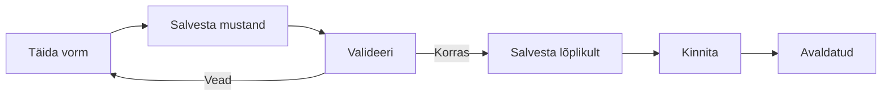

## Nipid

- Kasutage otsingunuppe ettevõtte ja sõiduki andmete automaatseks täitmiseks.
- Kui sanktsioon või soovitatav meede on "MUU", peate kindlasti täitma täpsustava tekstivälja.
- EL rikkumiste raskusastmed (MSI/VSI/SI/MI) mõjutavad tulevikus ettevõtte riskiskoori.


## Liitvorm (tee kontroll)

Liitvorm on peamine tee kontrolli akt. Iga liitvorm võib sisaldada mitut alamvormi: sõidu- ja puhkeaeg, tehniline kontroll, ADR, hea maine, vedude katkestamine.

## Vormi eesmärk

- Registreerida tee kontrolli põhiandmed (koht, aeg, sõiduk, ettevõte)
- Siduda kontrolliga juhid, kaasreisijad ja tehnilised alamkontrollid
- Anda alus riskihindamiseks ja statistikaks

## Menüü tee

Töölaud → **Liitvorm** → Täida vorm

või

Menüü → Kontrollaktid → **Liitvorm**

## Vormi osad ja kohustuslikud väljad

### 1. Kontrolli asukoht ja aeg

| Väli | Kohustuslik | Selgitus |
|---|---|---|
| Tee (`road`) | Jah | Riigimaantee, kohalik tee või muu |
| Tee nimetus (`roadOther`) | Jah, kui tee = "muu" | Vaba tekst |
| Kilomeeter (`kilometer`) | Jah, kui tee valitud | Numbriline väärtus, max 3 tähte |
| Maakond (`county`) | Jah, kui kontrolli riik = "EE" | Valik maakondade loendist |
| Kontrolli kuupäev (`controlDate`) | Jah | Kuupäev |
| Kontrolli kellaaeg (`controlTime`) | Jah | Kellaaeg |
| Kontrolli riik (`controlCountryCode`) | Jah | Valik riikide loendist |

### 2. Sõiduki info

| Väli | Kohustuslik | Selgitus |
|---|---|---|
| Sõiduki riik (`vehicleCountryCode`) | Jah | Valik riikide loendist |
| Sõiduki kategooria (`vehicleCategoryCode`) | Jah | Valik sõidukikategooriate loendist |
| Sõiduki kategooria muu (`vehicleCategoryOther`) | Jah, kui kategooria = "muu" | Vaba tekst |

Sõiduki registri number ja muud andmed täidetakse tehnilise kontrolli alamvormis või otsinguga.

### 3. Ettevõtte info

Ettevõtte andmeid saab otsida registrikoodi või nime järgi X-tee liidese kaudu.

| Väli | Kohustuslik | Selgitus |
|---|---|---|
| Registrikood (`companyRegCode`) | Jah | Ettevõtte registrikood |
| Ettevõtte nimi (`companyName`) | Jah | Max 300 tähemärki |
| Ettevõtte riik (`companyCountryCode`) | Jah | Valik riikide loendist |

### 4. Juhtide info

Liitvormil peab olema vähemalt üks juht.

| Väli | Kohustuslik | Selgitus |
|---|---|---|
| Juhi eesnimi (`drivers[].firstName`) | Jah (esimene juht) | Max 200 tähemärki |
| Juhi perekonnanimi (`drivers[].lastName`) | Jah (esimene juht) | Max 200 tähemärki |
| Juhi isikukood (`drivers[].personalCodeForeign`) | Jah (esimene juht) | Max 50 tähemärki |
| Juhi sünnikuupäev (`drivers[].birthDate`) | Jah (esimene juht) | Kuupäev |

### 5. Kaasreisija info

Kaasreisija andmed on valikulised, kuid soovitatavad, kui sõidukis oli kaasreisija.

### 6. Inspektori info

| Väli | Kohustuslik | Selgitus |
|---|---|---|
| Eesnimi (`inspectorFirstName`) | Jah | Max 100 tähemärki |
| Perekonnanimi (`inspectorLastName`) | Jah | Max 100 tähemärki |
| Asutus (`inspectorOrganisationId`) | Jah | Valik organisatsioonide loendist |
| Ametikoht (`inspectorProfession`) | Jah | Max 100 tähemärki |

### 7. Haagiste info

Liitvormil võib lisada ühe või mitu haagist. Haagiste puhul on täidetavad:

- Haagise riik
- Haagise kategooria
- Haagise registri number
- Haagise tunnus

## Alamvormide lisamine

Pärast liitvormi salvestamist saab sellele lisada alamvorme:

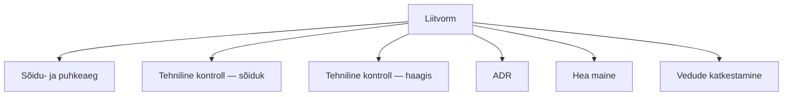

Iga alamvorm salvestatakse eraldi, kuid on seotud liitvormi ID-ga.

## Vormi salvestamine ja kinnitamine

1. Täitke kõik kohustuslikud väljad.
2. Klõpsake **Salvesta mustand** — vorm salvestatakse mustandina.
3. Kontrollige andmed.
4. Klõpsake **Kinnita** — vorm muutub avaldatuks.

Avaldatud vormi ei saa enam muuta. Paranduste tegemiseks tuleb luua uus vorm või pöörduda administraatori poole.

## Nipid

- Tee ja kilomeeter seatakse kontrolli toimumuskoha järgi.
- Ettevõtte otsing töötab kõige täpsemini Eesti registrikoodiga (8 numbrit).
- Kõik alamvormid peavad olema seotud liitvormiga enne kinnitamist.


## Tööinspektsiooni kontrollkaart

Tööinspektsiooni kontrollkaarti kasutatakse tööinspektsiooni kontrolli andmete fikseerimiseks. Selle abil salvestatakse kontrolli üldandmed, kontrollitud veoliigid ja salvestite tüübid, rikkumised, ettekirjutuse tegemine ning väärteomenetluse info.

## Vormi eesmärk

- Registreerida tööinspektsiooni kontrolli põhiandmed (inspektor, kuupäev, ettevõte, kontrolli liik).
- Dokumenteerida kontrollitud veoliigid ja juhtide/sõidukite arv erinevate salvestite tüüpide lõikes.
- Märkida, kas on koostatud ettekirjutus.
- Salvestada karistatud isiku ja väärteomenetluse andmed.
- Lisada kontrolli käigus tuvastatud rikkumised klassifikaatorist.

## Menüü tee

Töölaud → **Tööinspektsiooni kontrollkaart** → Täida vorm

või

Menüü → Kontrollaktid → **Tööinspektsiooni kontrollkaart**

## Vormi osad ja väljad

Vorm koosneb mitmest kaardist. Kui välja juures on täht `*`, on see kohustuslik.

### 1. Üldandmed

| Väli | Kohustuslik | Selgitus |
|---|---|---|
| Kontrolli läbiviimise eest vastutav isik (`inspectorName`) | Jah | Max 200 tähemärki |
| Kontrolli kuupäev (`inspectionDate`) | Jah | Kuupäev, ei tohi olla tulevikus |
| Kontrolli liik (`inspectionType`) | Jah | Valik: sõitjate vedu või veose vedu |
| Ettevõtte nimi (`companyName`) | Jah | Max 300 tähemärki |
| Registrikood (`companyRegCode`) | Jah | Max 20 tähemärki |

### 2. Kontrollimised

| Väli | Kohustuslik | Selgitus |
|---|---|---|
| Sõidukite arv (`vehicleCount`) | Ei | Ainult numbrid, max 5 tähemärki |
| Kontrollitud juhtide arv (`totalDriversCount`) | Ei | Ainult numbrid, max 5 tähemärki |

Kontrollimiste maatriksis saab lisada ridu erinevate veoliikide kohta. Iga rea kohta täidetakse järgmised arvulised väljad:

- Veoliik (`transportClass`)
- Analoogsalvestiga juhid (`analogRecorderDrivers`)
- Digitaalsalvestiga juhid (`digitalRecorderDrivers`)
- Nutisalvestiga juhid (`smartRecorderDrivers`)
- Analoogsalvestiga tööpäevad (`analogRecorderWorkDays`)
- Digitaalsalvestiga tööpäevad (`digitalRecorderWorkDays`)
- Nutisalvestiga tööpäevad (`smartRecorderWorkDays`)

### 3. Ettekirjutus

| Väli | Kohustuslik | Selgitus |
|---|---|---|
| Ettekirjutus koostatud (`prescriptionComposed`) | Ei | Märkeruut |

### 4. Väärteomenetlus

| Väli | Kohustuslik | Selgitus |
|---|---|---|
| Karistatud isiku isikukood (`punishedPersonIdCode`) | Ei | Max 20 tähemärki |
| Karistatud isiku eesnimi (`punishedPersonFirstName`) | Ei | Max 100 tähemärki |
| Karistatud isiku perekonnanimi (`punishedPersonLastName`) | Ei | Max 100 tähemärki |
| Väärteomenetluse viitenumber (`proceedingReferenceNumber`) | Ei | Max 50 tähemärki |

### 5. Rikkumised

Rikkumisi saab lisada nupuga **Lisa rikkumine**. Avanevas valikus saab valida rikkumise õigusliku aluse, liigi ja koodi. Iga rikkumise juurde määratakse kogus. Rikkumised pole vormi salvestamiseks kohustuslikud, kuid neid peetakse vajalikuks riskihindamise jaoks.

## Vormi salvestamine ja kinnitamine

1. Täitke kõik kohustuslikud väljad.
2. Klõpsake **Salvesta** — vorm salvestatakse mustandina.
3. Kontrollige andmed.
4. Klõpsake **Kinnita** — vorm muutub lõplikuks.

Rikkumistega akti puhul toimub kinnitamine e-toimiku kaudu, mitte otse vormi vaates.

## Nipid

- Kontrolli kuupäev ei tohi jääda tulevikku.
- Sõidukite arv ja kontrollitud juhtide arv aktsepteerivad ainult numbreid.
- Ühte veoliiki saab kontrollimiste maatriksisse lisada ainult ühe korra.
- Märkige ettekirjutus koostatuks, kui see on tehtud.
- Kasutage rikkumiste lisamiseks rikkumiste valijat, et vältida vaba teksti sisestamist.


## Tehniline kontroll

Tehnilise kontrolli vormiga fikseeritakse sõiduki või haagise tehnonõuetele vastavuse kontrolli tulemused. Vormil on kaks varianti: **mootorsõiduki** ja **haagise** kontroll.

## Menüü tee

Töölaud → **Kontrollaktid** → **Tehniline kontroll**

või

Liitvorm → **Tehniline kontroll — sõiduk** / **Tehniline kontroll — haagis**

## Vormi eesmärk

- Märkida iga kontrollitava osa/sõlme seisund (kontrollitud, ei vasta nõuetele, ei kontrollitud).
- Fikseerida leitud rikked ja nende raskusastmed.
- Määrata kontrolli tulemus ning vajadusel menetluste ja rikkumiste andmed.
- Siduda tulemused liitvormiga.

## Sõiduki ja haagise variandi erinevus

| Omadus | Mootorsõiduk | Haagis |
|---|---|---|
| Osade nimekiri | Täielik nimekiri | Välistatud osad: `CAA_2`, `CAA_3`, `CAA_7`, `CAA_9` |
| Rikkumiste valik | Kõik EU rikkumised | Välistatud koodid: `MSI203`, `MSI204`, `VSI847`, `SI926` |
| Päis | Mootorsõiduki tehnonõuetele vastavuse kontrollvorm | Haagise tehnonõuetele vastavuse kontrollvorm |

## Vormi osad ja väljad

### 1. Sõiduki kontrollitavate osade ja sõlmede nimekiri

Iga osa/sõlm reana. Iga rea olekut saab määrata:

- **Ei kontrollitud**
- **Kontrollitud**
- **Ei vasta nõuetele**

Valides **Ei vasta nõuetele**, avaneb rikete valiku modaalaken.

### 2. Tuvastatud rikked

Tabelis kuvatakse osa/sõlm, rike ja raskusaste. Rikked jagunevad raskusastmeteks:

- `VO`
- `OV`
- `EOV`

Raskete rikkete (`OV`, `EOV`) alusel arvutab süsteem kontrolli tulemuse automaatselt ümber.

### 3. Kontrolli tulemus

| Väli | Selgitus |
|---|---|
| **Kontrolli tulemus** | Valik: Tehniliselt korras / Suunatud erakorralisele tehnoülevaatusele / Suunatud erakorralisele tehnoülevaatusele liiklusregistri andmete täpsustamiseks Transpordiametis / Sõidukeeld |
| **Autovedu on katkestatud** | Kuvatakse, kui tulemus on *Sõidukeeld* |
| **Transpordiameti täpsustus** | Kuvatakse erakorralise ülevaatuse TA variandi korral: registreerimisnumber, VIN/TIN, telgede arv, istekohtade arv, omavoliline ümberehitus |
| **Menetluse liik** | Lühimenetlus / Kiirmenetlus / Üldmenetlus (kuvatakse, kui tulemus pole *Tehniliselt korras*) |
| **Menetluse viitenumber** | Vaba tekst, kuvatakse menetluse liigi valikul |

### 4. Märkused

- Väli: **Märkused**
- Max 2000 tähemärki.
- Rikkete valimisel lisatakse märkustesse automaatselt rida: `<rike> – <raskusaste>`.

### 5. Raske rikkumise tuvastamine

Kuvatakse, kui tulemus pole *Tehniliselt korras*. Võimalik märgata EU määrusest tulenevaid raskeid rikkumisi kategooriates **MSI**, **VSI** ja **SI**.

### 6. Manused

Vormi number olemasolul saab lisada faile.

### 7. X-tee andmed

Kuvatakse pärast salvestamist (mitte mustandis). Administraator saab täita:

- **Erakorraline tehnoülevaatus läbitud**
- **Jõustunud otsus**
- **Menetluse lõpetamise alus**

## Kohustuslikud väljad

Vormis on üks tingimuslikult kohustuslik väli:

| Väli | Tingimus |
|---|---|
| **Menetluse viitenumber** | Kohustuslik, kui on valitud **Menetluse liik** |

Muud väljad ei ole vormilt otseselt kohustuslikud, kuid kontrolli tulemuse ja rikkumiste loogika võib nõuda teatud valikute täitmist.

## Rikete valimine ja osade kokkuvõte

1. Osade tabelis klõpsake rea olekuks **Ei vasta nõuetele**.
2. Valige avanenud aknas üks või mitu riket.
3. Määrake iga rikke jaoks raskusaste (`VO`, `OV` või `EOV`).
4. Kinnitage valikud — rikked ilmuvad **Tuvastatud rikked** tabelisse ja osa olekuks jääb *Ei vasta nõuetele*.
5. Vajadusel eemaldage rikked tuvastatud rikkete tabelist. Kui osal pole enam rikkeid, muutub olek tagasi *Kontrollituks*.

## Nipid

- Kui valite raskusastmega `OV` või `EOV` rikked, lukustab süsteem madalamad tulemused ja pakub automaatselt kõrgemat kontrolli tulemuse taset.
- Sõidukeelu tulemusel märgib süsteem automaatselt rikkumise `MSI302`.
- `MSI302` eemaldamine on tavakasutajale sõidukeelu korral keelatud; administraator saab seda üle kirjutada.
- Avaldatud vormi ei saa enam muuta. Paranduste tegemiseks tuleb luua uus vorm või pöörduda administraatori poole.
- X-tee andmeid saab täita ja salvestada alles pärast vormi kinnitamist.


## Autoveo katkestamise kontrollvorm

Autoveo katkestamise kontrollvormi kasutatakse tee kontrolli käigus autoveo katkestamise fakti ja selle aluste registreerimiseks. Vorm salvestatakse liitvormi (koondvormi) alamvormina.

## Vormi eesmärk

- Registreerida autoveo katkestamise toimumiskoht (elukoht / aadress)
- Dokumenteerida katkestamise põhjus ja õiguslikud alused
- Määrata katkestamise lõppemise tingimus
- Fikseerida isiku taotlused

## Menüü tee

**Liitvorm** → **Autoveo katkestamise kontrollvorm** → **Lisa autoveo katkestamise kontrollvorm**

või

**Töölaud** → **Liitvorm (tee kontroll)** → alamvormide sektsioonis **Autoveo katkestamine**

## Vormi osad ja väljad

### 1. Päis

| Väli | Kohustuslik | Selgitus |
|---|---|---|
| Päis (`headerText`) | Ei | Täidetakse vaikimisi PPA struktuuriüksuse aadressiga, kui vorm luuakse uuena |

### 2. Elukoht

| Väli | Kohustuslik | Selgitus |
|---|---|---|
| Riik (`residenceCountry`) | Ei | Vaikimisi Eesti (`EE`) |
| Maakond (`residenceRegion`) | Ei | Valik EHAK maakondade loendist (Eesti puhul) |
| Linn/Vald (`residenceCity`) | Ei | Valik maakonna linnade/valdade loendist |
| Tänav, maja (`residenceAddressLine`) | Ei | Vaba tekst |
| Postiindeks (`residencePostalCode`) | Ei | Max 10 tähemärki |

### 3. Kontrolli tulemus

| Väli | Kohustuslik | Selgitus |
|---|---|---|
| Kuna (`interruptionReason`) | Ei | Põhjendus, miks autovedu katkestati |
| Õiguslikud alused (`legalBases`) | Ei | Mitu valikut klassifikaatorist `INTERRUPTION_BASES` |

### 4. Autoveo katkestamise lõppemise tingimus

| Väli | Kohustuslik | Selgitus |
|---|---|---|
| Lõppemise tingimus (`terminationCondition`) | Ei | Vaikimisi tekst: *"KUNI VEO KATKESTAMISE ALUSE ÄRALANGEMISENI."* |

### 5. Isiku taotlused

| Väli | Kohustuslik | Selgitus |
|---|---|---|
| Isiku taotlused (`personApplications`) | Ei | Isiku poolt esitatud taotlused |

### 6. Failid

| Väli | Kohustuslik | Selgitus |
|---|---|---|
| Manused | Ei | Üleslaaditavad failid. Failide lisamiseks peab vorm olema kõigepealt salvestatud. |

## Kohustuslikud väljad

Vormi React-komponentides (`TransportInterruptionFormPage.tsx`) pole ühtegi välja `required` parameetriga kohustuslikuks märgitud. Ainus kliendipoolne valideerimine kehtib postiindeksi pikkuse kohta — max 10 tähemärki.

Täielikuks salvestamiseks ja kinnitamiseks peavad kõik vormi täitmiseks vajalikud andmed siiski olemas olema.

## Seos liitvormiga

Autoveo katkestamise vorm on **alamvorm**, mis on seotud ühe konkreetse liitvormi (`compoundFormKey`) ID-ga. Vormile pääseb ligi liitvormi vaates klõpsates lingil `Lisa autoveo katkestamise kontrollvorm` või otse lingil `/control-forms/transport-interruption/:id`.

Iga katkestamise vorm saab oma alamnumbri ja versiooni (`subFormNumber/version`), mis kuvatakse ka päises.

## Vormi salvestamine ja kinnitamine

1. Täitke soovitud väljad.
2. Klõpsake **Salvesta** — vorm salvestatakse olekusse `saved`.
3. Kui kõik on korras, klõpsake **Kinnita** — vorm muutub kinnituks.

Pärast kinnitamist / avaldamist vormi enam muuta ei saa. Muudatuste tegemiseks tuleb luua uus versioon või pöörduda administraatori poole.

## Nipid

- Päis täidetakse automaatselt ametniku struktuuriüksuse aadressiga, kui vorm luuakse uuena.
- Lõppemise tingimus on vaikimisi ette täidetud; seda saab vajadusel muuta.
- Failide lisamiseks peab vorm olema kõigepealt salvestatud — enne salvestamist failide kaart pole nähtav.
- Õiguslike aluste valikud tulevad klassifikaatorist; valida saab mitut korraga.


## ADR kontrollvorm (ohtlik veos)

ADR kontrollvormi kasutatakse ohtliku veose kontrolli tulemuste dokumenteerimiseks. Vorm võimalik salvestada veos, rikkumised, rakendatud meetmed ja viited ADR sätetele.

## Vormi eesmärk

- Registreerida ohtliku kauba veo kontrolli andmed
- Dokumenteerida autojuhi abi, koolitustunnistused ja laadimiskohad
- Kirjeldada veetavaid ohtlikke kaupu
- Fikseerida rikkumised ja kontrolli tulemused
- Edastada vajadusel andmed X-tee kaudu

## Menüü tee

Liitvormis: **Liitvorm** → **Lisa ADR kontrollvorm**

või

Menüü → Kontrollaktid → **ADR kontrollvorm**

## Vormi osad ja kohustuslikud väljad

Vorm on jagatud kaartideks. Kui välja juures on täht `*`, on see kohustuslik.

### 1. Autojuhi abi andmed

Andmed täidetakse ainult rikkumise korral. Isikukoodi järgi saab otsida andmeid X-tee liidese kaudu.

| Väli | Kohustuslik | Selgitus |
|---|---|---|
| Isikukood (`driverAssistant.personalCodeEe`) | Ei | Eesti isikukood |
| Eesnimi (`driverAssistant.firstName`) | Ei | |
| Perekonnanimi (`driverAssistant.lastName`) | Ei | |
| Kodakondsus (`driverAssistant.citizenshipCode`) | Ei | Valik riikide loendist |
| Sünniaeg (`driverAssistant.birthDate`) | Ei | Kuupäev |

### 2. ADR koolitustunnistuse numbrid

| Väli | Kohustuslik | Selgitus |
|---|---|---|
| Autojuhi ADR koolitustunnistuse number (`driverAdrCertificateNumber`) | Ei | Max 100 tähemärki |
| Meeskonnaliikme ADR koolitustunnistuse number (`crewAdrCertificateNumber`) | Ei | Max 100 tähemärki |
| Autojuhi abi ADR koolitustunnistuse number (`assistantAdrCertificateNumber`) | Ei | Max 100 tähemärki |

### 3. Viimase peale- või mahalaadimise aadress ja kuupäev

| Väli | Kohustuslik | Selgitus |
|---|---|---|
| Riik (`lastLoadAddress.countryCode`) | Ei | |
| Maakond (`lastLoadAddress.county`) | Ei | EHAK valik, kui riik on Eesti |
| Linn (`lastLoadAddress.city`) | Ei | EHAK valik, kui riik on Eesti |
| Tänav (`lastLoadAddress.street`) | Ei | |
| Postiindeks (`lastLoadAddress.postalCode`) | Ei | Max 10 tähemärki |
| Kuupäev (`lastLoadDate`) | Ei | |

### 4. Järgmise peale- või mahalaadimise aadress

Sisaldab samu välju nagu eelmine osa (`nextLoadAddress`), kuupäev puudub.

### 5. Veetavate ohtlike kaupade andmed

Tabelisse saab lisada ühe või mitu rida. Igale kaubale täidetakse:

| Väli | Selgitus |
|---|---|
| ÜN-number (`unNumber`) | Ohtliku kauba ÜRO number |
| Pakendirühm (`packagingGroup`) | Pakkumisrühm |
| Kogus (`quantity`) | |
| Ühik (`unitCode`) | |

Ridade lisamiseks klõpsake **+ Lisa ohtlik kaup**. Rida saab kustutada prügikasti ikooni abil.

### 6. Erandi kohaldamine

| Väli | Kohustuslik | Selgitus |
|---|---|---|
| Kas kohaldatakse erandit (`exemptionApplied`) | Ei | Jah / Ei |
| ADRi punkt (`exemptionAdrProvision`) | Jah, kui erandit kohaldatakse | ADR säte, max 200 tähemärki |

### 7. Mahuti tüüp

| Väli | Kohustuslik | Selgitus |
|---|---|---|
| Mahuti tüüp (`containerType`) | Ei | Mahtlast, Paak, Pakend, MEMU |

### 8. Rikkumised

Rikkumiste loend kuvatakse klassifikaatori `DANGEROUS_GOODS_INFRINGEMENTS_NEW` väärtuste järgi. Iga rea kohta määratakse tulemus:

- **Kontrollitud (C)**
- **Ei ole võimalik kontrollida (NC)**
- **Ei kohaldata (NA)**

Kui tulemus on valitud, saab täiendavalt sisestada:

- Riskikategooria (`riskCategory`)
- ADRi punkt (`adrProvision`)
- Märkus (`notes`)

Väli **Muud rikkumised** (`otherViolations`) võimaldab vabalt teksti sisestada.

### 9. Kontrolli tulemus

| Väli | Kohustuslik | Selgitus |
|---|---|---|
| Kontrolli tulemus (`resultType`) | Ei | Korras, alustati väärteomenetlust, hoiatus, sõidukeeld (ADR art 5), autovedu on katkestatud |
| Menetluse liik (`proceedingType`) | Ei | Kiirmenetlus / Üldmenetlus |
| Menetluse viitenumber (`proceedingReferenceNumber`) | Jah, kui menetlus valitud | |
| Rakendatud meetmed (`correctiveMeasures`) | Ei | Kohapeal, enne sõidu lõppu, ettevõtte territooriumil |
| Plomm avatud kontrolli käigus (`sealOpened`) | Ei | Jah / Ei |
| Plommi avamise kuupäev (`sealOpenedDate`) | Ei | Kui plomm avati |
| Plommi paigaldamise kuupäev (`sealInstalledDate`) | Ei | Kui plomm avati |

### 10. Märkused

| Väli | Kohustuslik | Selgitus |
|---|---|---|
| Märkused (`notes`) | Ei | Vaba tekst, max 4000 tähemärki |

### 11. X-tee andmed

Kuvatakse pärast kinnitamist. Muudetav ainult õigusega `control_form.edit_locked`.

| Väli | Kohustuslik | Selgitus |
|---|---|---|
| Jõustunud otsus (`enforcementDecision`) | Ei | |
| Menetluse lõpetamise alus (`proceedingClosureBasis`) | Ei | |

## Vormi salvestamine ja kinnitamine

1. Täitke kõik kohustuslikud väljad.
2. Klõpsake **Salvesta** — vorm salvestatakse mustandina.
3. Klõpsake **Kinnita** — vorm muutub lõplikult salvestatuks ja nähtavaks X-tee andmete sisestamiseks.

Pärast kinnitamist ei saa vormi tavaliselt enam muuta. Paranduste tegemiseks on vaja administraatori õigust `control_form.edit_locked`.

## Nipid

- Autojuhi abi andmed ja koolitustunnistused täidetakse ainult rikkumise korral.
- Kui valite erandi kohaldamise, peate täitma ADRi punkti.
- Kui menetluse liik on valitud, on menetluse viitenumber kohustuslik.
- Ohtlike kaupade ridu saab lisada, muuta ja kustutada kontrolli käigus.
- Rikkumiste loend võib olla tühi, kui klassifikaator pole veel seadistatud.


## Hea maine vorm

Hea maine vormi (ametlik nimetus: *Hea maine nõudele mittevastavaks tunnistatud veokorraldusjuht*) kasutatakse veokorraldusjuhi hea maine hindamise tulemuse registreerimiseks, sealhulgas ametialase pädevuse tunnistuse andmete ja sobivuse hinnangu salvestamiseks.

## Vormi eesmärk

- Registreerida veokorraldusjuhi hea maine hindamine
- Salvestada ametialase pädevuse tunnistuse andmed
- Määrata veokorraldusjuhi sobivus (`Sobib` või `Sobimatu`)
- Tuvastada sobimatuse kehtivusaeg, kui see on asjakohane

## Menüü tee

Töölaud → **+ Lisa** → **Hea maine nõudele mittevastavaks tunnistatud veokorraldusjuht**

Või otse URL-ilt: `/control-forms/good-repute/new`

## Vormi osad ja väljad

Vorm koosneb kolmest kaardist. Tähe `*` tähistab kohustuslikku välja.

### 1. Veokorraldusjuhi andmed

Isiku andmeid saab osaliselt automaatselt täita, sisestades isikukoodi ja klõpsates nuppu **Otsi**.

| Väli | Kohustuslik | Selgitus |
|---|---|---|
| Isikukood (`personalCode`) | Jah | Max 20 tähemärki |
| Eesnimi (`firstName`) | Jah | Max 100 tähemärki |
| Perekonnanimi (`lastName`) | Jah | Max 100 tähemärki |
| Sünniaeg (`dateOfBirth`) | Jah | Kuupäev |
| Sünnikoht (`placeOfBirth`) | Ei | Max 200 tähemärki |

### 2. Ametialase pädevuse tunnistus

| Väli | Kohustuslik | Selgitus |
|---|---|---|
| Tunnistuse number (`certificateNumber`) | Jah | Max 100 tähemärki |
| Väljaandmise kuupäev (`certificateIssueDate`) | Jah | Kuupäev |
| Väljaandnud riik (`certificateCountryCode`) | Jah | Valik riikide loendist |

### 3. Sobivuse hinnang

| Väli | Kohustuslik | Selgitus |
|---|---|---|
| Sobivus (`fitnessStatus`) | Jah | Valik: `Sobib` või `Sobimatu` |
| Sobimatuks tunnistamise kuupäev (`unfitFromDate`) | Jah, kui sobivus on `Sobimatu` | Kuupäev |
| Sobimatuse lõppkuupäev (`unfitUntilDate`) | Jah, kui sobivus on `Sobimatu` | Kuupäev |

## Nipid

- Sisestage isikukood ja kasutage nuppu **Otsi**, et täita eesnimi, perekonnanimi ja sünniaeg automaatselt.
- Kuupäevad ei tohi olla tulevikus.
- Kui sobivuseks valitakse `Sobimatu`, ilmuvad lisaks kuupäevaväljad. Lõppkuupäev peab olema hilisem kui alguskuupäev.
- Kohustuslikud väljad tuleb enne salvestamist täita.
- Vormi salvestamiseks klõpsake nuppu **Salvesta** ja katkestamiseks **Tühista**.


## Sõidu- ja puhkeaja kontrollvorm

Sõidu- ja puhkeaja kontrollvormi kasutatakse tee kontrolli käigus juhi või meeskonnaliikme sõidu- ja puhkeaja nõuete, dokumentide/õiguste, samuti ATP ja sõiduki massi/mõõtmete täitmise registreerimiseks. Vormil on kaks varianti: autojuhi ja meeskonnaliikme oma.

## Vormi eesmärk

- Registreerida kontrollitud vedu ja veoklass
- Määrata kontrolli tulemus ja vajadusel menetluse liik
- Dokumenteerida dokumentide/õiguste kontrolli tulemused
- Märgistada sõidu- ja puhkeaja rikkumised koos raskusastmega
- Jäädvustada ATP kokkuleppe ning sõiduki massi ja mõõtmete rikkumised
- Salvestada lisamärkused ja failid

## Menüü tee

Seda vormit täidetakse liitvormi (tee kontroll) alamvormina:

**Liitvorm → Lisa alamvorm → Autojuhi sõidu- ja puhkeaja kontrollvorm**  
või  
**Liitvorm → Lisa alamvorm → Meeskonnaliikme sõidu- ja puhkeaja kontrollvorm**

Olemasolevat vormi saab avada otse URL-ilt:

- Autojuht: `/control-forms/sp-driver/:id`
- Meeskonnaliige: `/control-forms/sp-teammate/:id`

## Autojuhi ja meeskonnaliikme vormi erinevus

| Omadus | Autojuht (`driver`) | Meeskonnaliige (`teammate`) |
|---|---|---|
| Peamised plokid | Veoliik, veoklass, kontrolli tulemus, dokumendid, sõidu-/puhkeaja rikkumised, mass/mõõtmed, ATP | Samad, välja arvatud massi/mõõtmete plokk |
| Sõiduki mass ja mõõtmed | Kuvatakse ainult autojuhile | Puudub |
| Kabotaažrikkumised | Kuvatakse autojuhile, kui veoklass hõlmab kabotaaži | Puuduvad |

## Vormi osad ja väljad

Vormis on täidetavad kaardid/akkordionid. Tärniga `*` tähistatud väljad on kohustuslikud.

### 1. Veoliik ja veoklass

| Väli | Kohustuslik | Selgitus |
|---|---|---|
| Veoliik (`transportType`) | Jah | Valik: sõitjatevedu või veosevedu |
| Tühisõit (`transportEmptyRun`) | Ei | Märkeruut |
| Veo iseloom (`transportNature`) | Ei | Valik: tasuline või oma kulul |
| Tegevusloa nõudest vabastatud vedu (`transportNatureExempt`) | Ei | Märkeruut |

### 2. Veoklassid

| Väli | Kohustuslik | Selgitus |
|---|---|---|
| Veoklassid (`transportClasses`) | Ei | Valik mitmest klassifikaatori väärtusest |
| Kabotaažrikkumised (`cabotageViolations`) | Ei | Aktiveerub ainult autojuhil, kui valitud on `CABOTAGE` |

### 3. Kontrolli tulemus

| Väli | Kohustuslik | Selgitus |
|---|---|---|
| Tulemus (`resultType`) | Jah | Valik: KORRAS, HOIATUS, ETTEKIRJUTUS, JUHTIMISELT, AREST, AUTOVEDU, ALUSTATI |
| Menetluse liik (`proceedingType`) | Jah, kui tulemus pole `KORRAS` ega `HOIATUS` | LYHI, KIIR, YLD |
| Menetluse viitenumber (`proceedingReferenceNumber`) | Jah, kui menetluse liik valitud | Tekstiväli |

Juhul kui `resultType` = `KORRAS`, ei avane dokumendi/õiguse, sõidu-puhkeaja ega massi/mõõtmete täitmise plokid.

### 4. Dokumendi või õiguse kontroll

Aktiivne, kui tulemus pole `KORRAS`.

- **Dokumentide kontroll** (`documentChecks`) – vali dokumentide liigid ja seotud rikkumised modaalaknas.
- **Muud dokumendid** (`otherDocuments`) – märgi dokumendi olek (nõuetekohane või puudub).

### 5. Sõidu- ja puhkeaja nõuete täitmine

Aktiivne, kui tulemus pole `KORRAS`.

| Väli | Kohustuslik | Selgitus |
|---|---|---|
| SP rakendatavus (`spApplicability`) | Ei | Valik: Rakendatakse / Ei rakendata / Ei kontrollitud |
| Tachograafi tüüp (`tachographTypeCode`) | Jah, kui `spApplicability` = `RAKENDATAKSE` | Valik klassifikaatorist |
| Tachograafi andmed alla laadimata (`tachographDataNotDownloaded`) | Ei | Märkeruut |
| Kontrollitud päevade arv (`checkedDaysCount`) | Ei | Arv (max 3 numbrit) |
| Tööpäevade arv (`workDaysCount`) | Ei | Arv; peab jääma kontrollitud päevade arvu piiresse |
| Muu tegevuse päevade arv (`otherActivityDaysCount`) | Ei | Arv (max 3 numbrit) |

Sellel plokil saab lisada ka **sõidu- ja puhkeaja rikkumised** (`violations5612006`, `violations1652014`, `violations200215`, `violations5932008`, `violations20201057`).

### 6. Sõiduki massi ja mõõtmete ning ATP kokkuleppe nõuetele vastavus

Aktiivne ainult autojuhil, kui tulemus pole `KORRAS`.

- **Mõõtmised ja rikkumised** (`massDimensionMeasurements`) – lisatakse modaalakna kaudu.

### 7. ATP kokkuleppe nõuete kontroll

| Väli | Kohustuslik | Selgitus |
|---|---|---|
| ATP rikkumine leitud (`atpViolationFound`) | Ei | Jah / Ei |
| ATP rikkumise kirjeldus (`atpViolationDescription`) | Jah, kui `atpViolationFound` = `true` | Vaba tekst, max 4000 tähemärki |

### 8. Failid

- `FormFiles` – võimaldab lisada vormi seotud faile.

### 9. Märkused

| Väli | Kohustuslik | Selgitus |
|---|---|---|
| Märkused (`notes`) | Ei | Vaba tekst, kuvatakse kui tulemus pole `KORRAS` |

## Transport type, control result, tachograph, ATP violation

- **Veoliik** määrab, kas tegu on sõitjate- või veoseveduga. See mõjutab kabotaažrikkumiste loendit.
- **Kontrolli tulemus** määrab, kas vorm jääb lihtsaks korrashoiuks või avab edasised plokid rikkumisteks ja menetluseks.
- **Tachograaf** tuleb täpsustada ainult siis, kui sõidu- ja puhkeaja nõuded **rakendatakse**.
- **ATP rikkumine** tuleb kirjeldada tekstiväljas juhul, kui valitud on "Jah".

## Rikkumiste raskusastmed (MSI / VSI / SI / MI)

Rikkumiste modaalaknas valitakse kolmel tasemel:

1. **Tase 1** – rikkumiste grupp (näiteks määruse nimi)
2. **Tase 2** – konkreetne rikkumise liik või artikkel
3. **Tase 3** – rikkumise detail, kus `description` väli sisaldab raskusastet

Raskusaste kuvatakse valiku ees **rasvases kirjas** enne rikkumise nime. Need väärtused võivad olla näiteks **MSI** (most serious infringement), **VSI**, **SI** või **MI**. Iga tase 3 valiku korral salvestatakse rikkumise kood (`violationCode`) ja raskusastme kood (`severityCode`) koos nimega.

## Nipid

- Määra kõigepealt **kontrolli tulemus** – see avab või peidab ülejäänud plokid.
- Kui tulemus on **Korras**, ei ole vaja täita dokumendi, sõidu-puhkeaja ega massi/mõõtmete andmeid.
- Tachograafi tüüp on kohustuslik ainult siis, kui sõidu- ja puhkeaja nõuded **rakendatakse**.
- ATP rikkumise korral täida kindlasti ka **kirjeldus**.
- Meeskonnaliikme vormil puuduvad sõiduki massi/mõõtmete ja kabotaaži alamvalikud.
- Veoklassi valik ja veoliik mõjutavad näidatavaid kabotaažrikkumiste valikuid.


## Failide lisamine vormidele

Kontrollaktidele saab lisada manuseid, näiteks fotosid, tõendeid või dokumentide koopiaid.

## Millistes vormides saab faile lisada

Failide lisamine on saadaval peamistes vormides, kus on vaja tõendada visuaalselt või dokumendiga kontrolli tulemusi. Näiteks:

- liitvorm
- tehniline kontroll
- ADR
- tööinspektsioon

## Manuse lisamise sammud

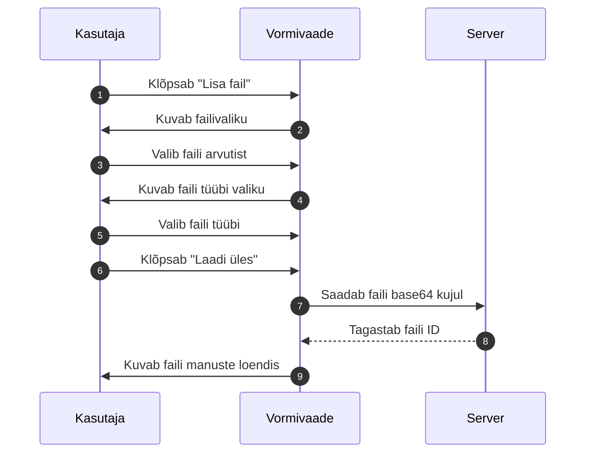

## Faili tüüp

Iga fail peab olema märgitud tüübiga, mis selgitab, mida fail kujutab. Näiteks:

- dokumendifoto
- tõend
- lisamaterjal
- kontrolli foto

## Faili piirangud

- Maksimaalne failisuurus: 25 MB (võib sõltuda seadistusest)
- Lubatud formaadid: PDF, JPG, PNG
- Iga fail on seotud konkreetse vormiga ja vormi numbri ning faili tüübiga

## Failide kustutamine

Manuseid saab kustutada enne vormi kinnitamist. Pärast kinnitamist ei saa manuseid enam lisada ega kustutada.

## Failide allalaadimine

Kinnitatud vormi vaates saab kõiki manuseid alla laadida. Klõpsake faili nime või allalaadimise ikooni.


## Vormide vaatamine ja ajalugu

Salvestatud vormidele pääseb ligi nimekirja, töölaua või otsingu kaudu.

## Vormi detailvaade

Vormi detailvaade koosneb järgmistest osadest:

- **Põhiandmed** — vormi kõik täidetud väljad kaartide kaupa
- **Manused** — üleslaaditud failid
- **Ajalugu** — varasemad salvestatud versioonid (snapshots)
- **Alamvormid** — liitvormi puhul seotud alamvormid

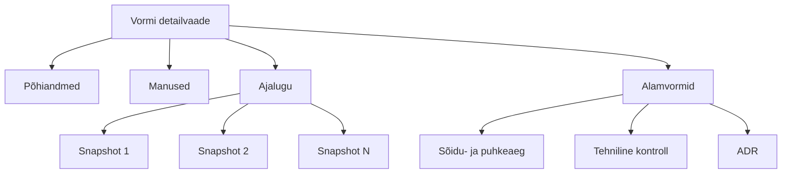

## URL-i struktuur

| Vaade | URL |
|---|---|
| Põhivaade | `/control-forms/<tüüp>/<id>` |
| Ajalooline versioon | `/control-forms/<tüüp>/<id>/<snapshotId>` |

Näide:
- `/control-forms/foreign-violation/12345`
- `/control-forms/foreign-violation/12345/snapshot-67890`

## Snapshot (ajalooline versioon)

Snapshot on vormi salvestatud seisund ajateljel. Iga salvestamine loob uue snapshoti. Snapshotide abil saab:

- vaadata, kuidas vorm aja jooksul muutus
- võrrelda kahte versiooni
- tõendada, milline oli vormi seisund kindlal ajal

## Muudatuste võrdlus

Mõned vormid võimaldavad võrrelda kahte snapshoti. Süsteem kuvab:

- millised väljad on muutunud
- vana ja uue väärtuse
- muutmise kuupäeva
- muutja nime

## Vormi staatused

| Staatus | Selgitus |
|---|---|
| Mustand | Salvestatud, kuid mitte kinnitatud. Saab muuta. |
| Avaldatud | Kinnitatud. Ei saa enam muuta. |
| Aegunud | Vormi kehtivusaeg on möödas (kui rakendatakse aegumist). |


## Planeeritud riskihindamine

> **Märkus:** Riskihindamine on arendamisel (LJVIS2-150 / 151 / 152). See peatükk kirjeldab planeeritud käitumust.

## Mis on riskihindamine

LJVIS2 hakkab automaatselt hindama Eesti ettevõtete riskitaset kontrollaktide põhjal. Riskiskoor arvutatakse Euroopa Liidu määruse 2022/695 (veoettevõtja hea maine ja juhtide juurdepääs kutsele) alusel.

## Arvutusvalem

Riskiskoori valem on:

```
R = ((Σᵢ ((nMSI×90 + nVSI×30 + nSI×10 + nMI×1) / Nᵢ)) / r) × g
```

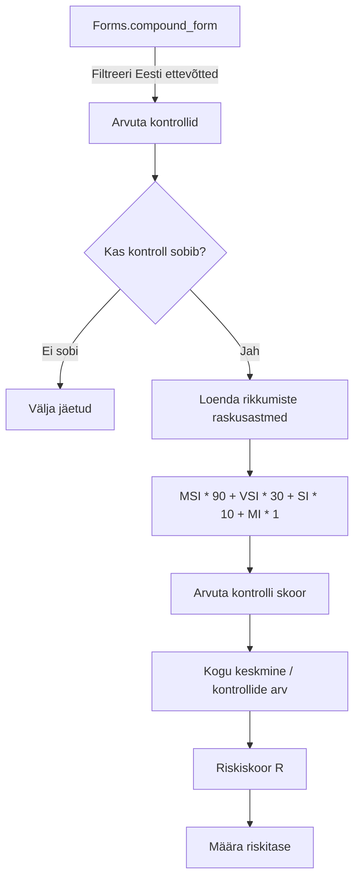

## Tähistused

| Tähis | Tähendus |
|---|---|
| `nMSI` | Huligaansõit (Most Serious Infringement) rikkumiste arv |
| `nVSI` | Väga tõsine rikkumine (Very Serious Infringement) arv |
| `nSI` | Tõsine rikkumine (Serious Infringement) arv |
| `nMI` | Vähemtõsine rikkumine (Minor Infringement) arv |
| `Nᵢ` | Kontrollitud sõidukite arv kontrollis i |
| `r` | Arvesse võetud kontrollide koguarv (sh nullpunktilised) |
| `g` | Aruka sõidumeeriku kaalutegur; esimeses versioonis 1,0 |
| `R` | Koondriskiskoor |

## Riskitasemed

| Riskitase | Väärtus | Kuvatav värv | Tähendus |
|---|---|---|---|
| Hall | `r = 0` | Hall | Kontrollimata — ettevõttel pole piisavalt kontrolle |
| Roheline | `0 ≤ R ≤ 100` | Roheline | Madal risk |
| Kollane | `101 ≤ R ≤ 200` | Kollane | Keskmine risk |
| Punane | `R ≥ 201` | Punane | Kõrge risk |

## Millised kontrollid arvesse lähevad

Arvesse lähevad:

- `compound_form` kirjed, mille staatus on `published`
- Ettevõtja on Eesti ettevõtja (registrikood 8 numbrit)
- Jõustumiskuupäev jääb kahe aasta pikkusesse ajavahemikku

### Nullpunktilised kontrollid

Need kontrollid lähevad arvesse (`r++`), kuid ei anna kaalupunkte:

- `sp_applicability = 'applied'` JA `proceeding_type` on expedited/general/summary JA puuduvad raskusastmega rikkumised
- `result_type = 'warning'` (HOIATUS) JA `sp_applicability = 'applied'` JA puuduvad EU raskusastmega rikkumised

### Välja jäetavad kontrollid

Kontrollid, mille `sp_applicability` on `not_checked` või `not_applied` ning tulemus on `ok`, ei lähe arvesse.

## Kodaniku vaade

Ettevõtte esindaja saab sisselogides vaadata oma ettevõtte riskitaset. Süsteem kontrollib TARA autentimise järel, kas isikul on äriregistri andmetel ettevõtja esindaja õigus.

Sama riskiteavet saavad vaadata ka administraatorid ja volitatud ametnikud — kas kõigi ettevõtete loendina või konkreetse ettevõtte detailvaates.

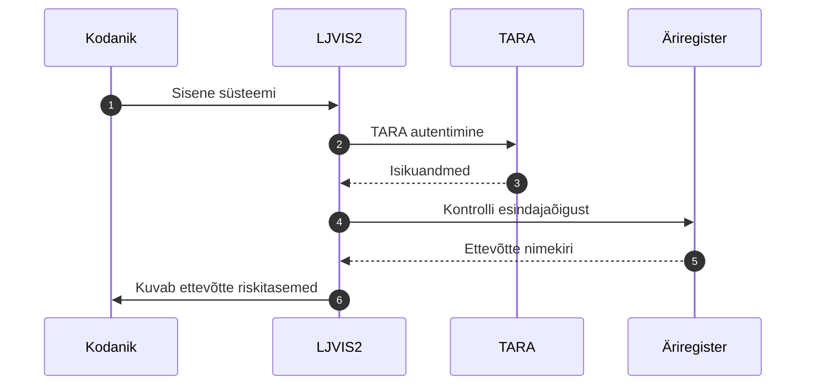

## Administraatori vaade

Ametnikud saavad vaadata kõigi Eesti ettevõtete riskitasemete loendit. Loend võimaldab:

- sorteerida ettevõtete nime järgi
- filtreerida riskitaseme järgi (Hall, Roheline, Kollane, Punane)
- otsida registrikoodi või nime järgi
- avada detailvaate, kus kuvatakse skoori moodustavad kontrollid

## ERRU integratsioon

Riskiskoor edastatakse Euroopa Liidu ERRU (European Register of Road Transport Undertakings) süsteemile CTUD (Common Transport Union Database) liidese kaudu. LJVIS2 pakub selleks eraldi `/current` endpointi, mida CTUD päringu töötleja kutsub.


