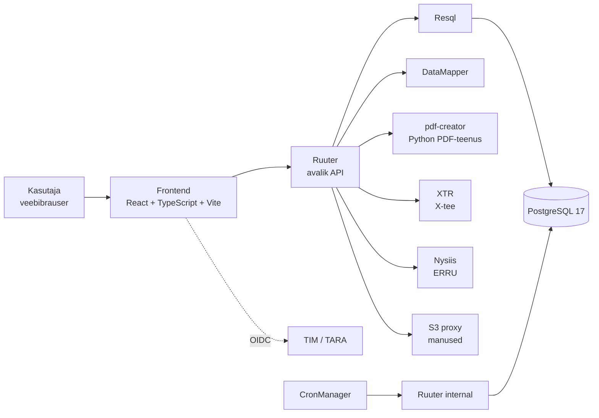
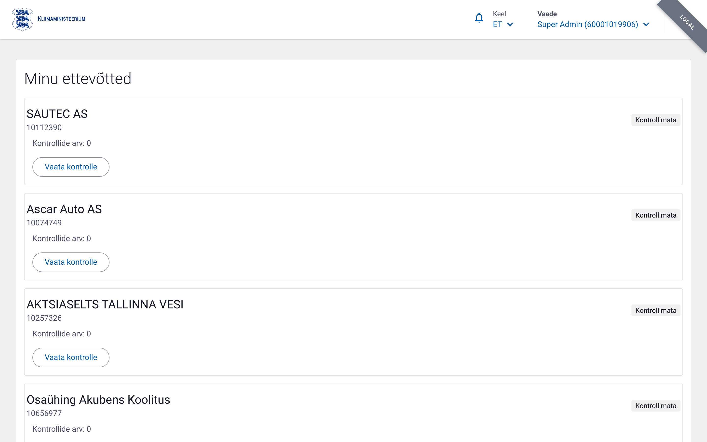
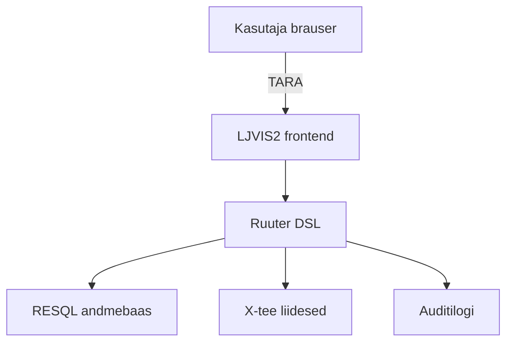

# Sissejuhatus

## Süsteemi ülesehitus

Järgmine joonis näitab LJVIS2 peamisi komponente, eraldi teenuseid ja nendevahelisi seoseid.

LJVIS2 (Liiklusjärelvalve infosüsteem 2) on veebipõhine tööriist transpordiametnikele ja ettevõtjatele. Selle abil dokumenteeritakse liiklus-, tööinspektsiooni- ja tehnilisi kontrolle, hallatakse kasutajaid ning vaadatakse auditilogi.

## Kellele juhend on mõeldud

- **Ametnikele**, kes täidavad kontrollakte (nt tee kontroll, tööinspektsioon, tehniline kontroll).
- **Administraatoritele**, kes haldavad süsteemi kasutajaid, gruppe, õigusi ja klassifikaatoreid.
- **Ettevõtja esindajatele**, kes vaatavad oma ettevõtte riskitaset ja protokolle.

Ettevõtja esindaja näeb sisselogimisel kodaniku töölauda, kus on koondatud tema ettevõtetega
seotud kontrollid ja protokollid:

## Peamised funktsioonid

- TARA autentimine
- Kontrollaktide vormid
- Failide manustamine
- Kasutajate ja õiguste haldus
- Klassifikaatorite haldus
- Auditilogi
- Riskihindamine
- ERRU-teated (hea maine, tehnokontroll, kontrollitulemuse teavitused)

## Süsteemi arhitektuur ühe pilguga

