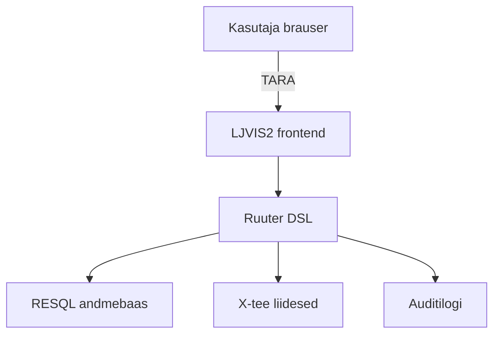

# Sissejuhatus

LJVIS2 (Liiklusjärelvalve infosüsteem 2) on veebipõhine tööriist transpordiametnikele ja ettevõtjatele. Selle abil dokumenteeritakse liiklus-, tööinspektsiooni- ja tehnilisi kontrolle, hallatakse kasutajaid ning vaadatakse auditilogi.

## Kellele juhend on mõeldud

- **Ametnikele**, kes täidavad kontrollakte (nt tee kontroll, tööinspektsioon, tehniline kontroll).
- **Administraatoritele**, kes haldavad süsteemi kasutajaid, gruppe, õigusi ja klassifikaatoreid.
- **Ettevõtja esindajatele**, kes soovivad tulevikus vaadata ettevõtte riskitaset.

## Peamised funktsioonid

- TARA autentimine
- Kontrollaktide vormid
- Failide manustamine
- Kasutajate ja õiguste haldus
- Klassifikaatorite haldus
- Auditilogi
- Planeeritud riskihindamine

## Süsteemi arhitektuur ühe pilguga

