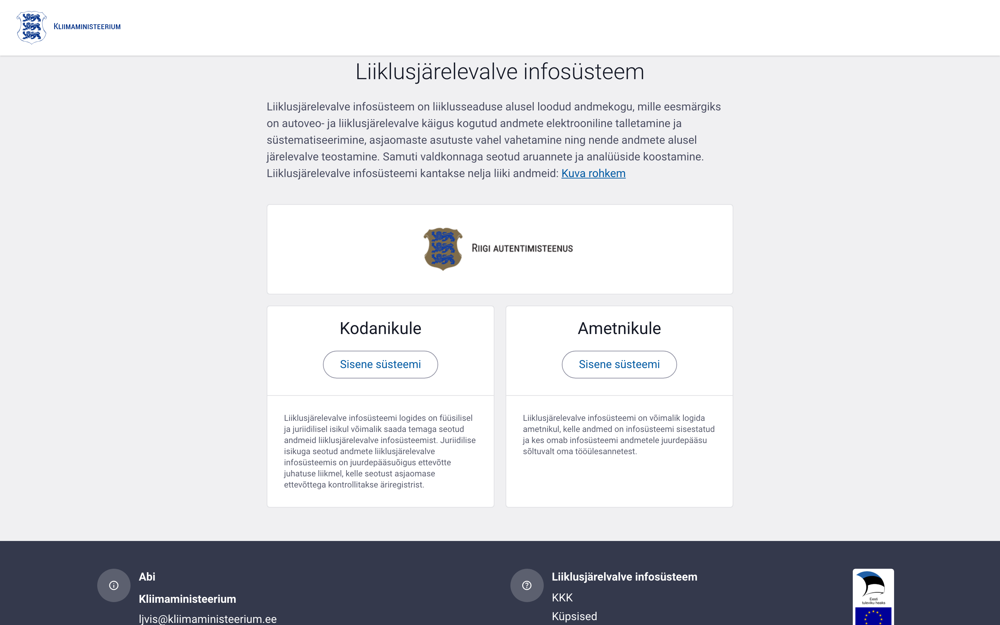
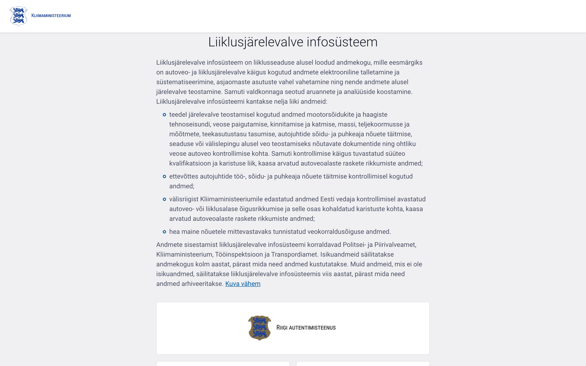
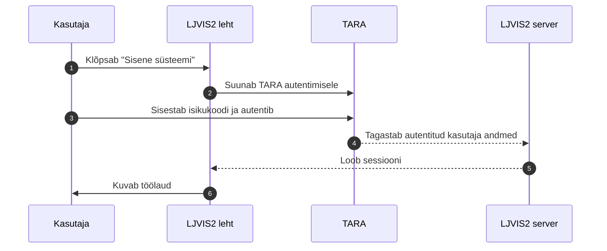

# Sisselogimine

Süsteemi sisenemiseks kasutatakse Eesti autentimisteenust TARA. Sisselogimislehel on kaks sisenevusnuppu: **Kodanikule** ja **Ametnikule**.

Lingile **Kuva rohkem** klõpsates avaneb süsteemi täpsem kirjeldus:

## Sisselogimise sammud

1. Avage LJVIS2 veebiaadress.
2. Valige oma rolli järgi nupp:
   - **Kodanikule** — ettevõtja esindajale (tulevikus riskitaseme vaatamiseks).
   - **Ametnikule** — transpordiametnikule.
3. Teid suunatakse TARA autentimiskeskkonda.
4. Sisestage isikukood ja autentige end (Smart-ID, Mobiil-ID või ID-kaart).
5. Pärast edukat autentimist suunatakse Teid tagasi LJVIS2 töölauale.

> TARA autentimisaken kuulub riigi autentimisteenusele ega ole selle juhendi osa. Testkeskkonnas
> võib autentimisaken erineda päris TARA-st.

## Rollid ja õigused

Pärast sisselogimist määrab süsteem, millised menüüpunktid kuvatakse. See sõltub Teie kuuluvusest kasutajagruppidesse.

| Roll | Tüüpiline õigus | Ligipääs |
|---|---|---|
| Üldadministraator | `user.list.admin`, `user_group.list.admin`, `classifier.list`, `audit.read` | Kõik |
| Organisatsiooni admin | `user.list.local`, `user_group.list.local` | Oma organisatsioon |
| Ametnik | `foreign_violation_form.write` jms | Kontrollaktide täitmine |
| Ettevõtja esindaja | — (riskivaade) | Oma ettevõtte andmed |

Kui Teil on nii ametniku konto kui ka kodaniku õigused, saate pärast sisselogimist vaadet
vahetada — vt peatükk [Vaate vahetamine](19-vaate-vahetamine.md).

## Väljalogimine

Väljalogimiseks klõpsake paremas ülanurgas kasutaja menüüd ja valige **Logi välja**. See lõpetab nii LJVIS2 kui ka TIM sessiooni.
