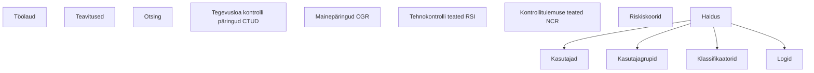

# Menüü ja navigatsioon

Põhimenüü asub vasakul küljel. Menüüpunktid sõltuvad Teie õigustest.

## Ülatasandi punktid

Vasakmenüü ülatasandil on (õiguste olemasolul, ülevalt alla):

| Punkt | Õigus | Selgitus |
|---|---|---|
| **Töölaud** | — | Avaleht kõigile autenditud kasutajatele |
| **Teavitused** | — | Rakendusesisesed teavitused kõigile; „Saadetud kirjad" vahekaart `notification.list` õigusega |
| **Otsing** | vormi lugemisõigus | Vormide koondotsing (vt [Vormide vaatamine ja ajalugu](15-vormide-vaatamine-ajalugu.md)) |
| **Tegevusloa kontrolli päringud** (CTUD) | `ctud.read` | ERRU tegevusloa kontrolli päringud |
| **Mainepäringud** (CGR) | `cgr.read` | ERRU hea maine päringud |
| **Tehnokontrolli teated RSI** | `rsi.read` | ERRU RoadSideInspection teated |
| **Kontrollitulemuse teated NCR** | `ncr.list` | ERRU NotifyCheckResult teated |
| **Riskiskoorid** | `risk_report.list` | Ettevõtete riskiskooride ja -tasemete loend (vt [Riskihindamine](16-riskihindamine.md)) |
| **Haldus** | — (avaneb, kui mõni alampunkt on nähtav) | Haldustegevuste rühm — vt allpool |

Neli keskmist punkti (CTUD, CGR, RSI, NCR) on **ERRU** (Euroopa autoveo-ettevõtjate
register) teadete ja päringute moodul.

## „Haldus" alammenüü

**Haldus** on rühm, mis avaneb sellele klõpsates. Alammenüüs on ainult
süsteemihalduse punktid:

| Alampunkt | Õigus | Selgitus |
|---|---|---|
| **Kasutajad** | `user.list.admin` või `user.list.local` | Kasutajate nimekiri ja haldus |
| **Kasutajagrupid** | `user_group.list.admin` või `user_group.list.local` | Gruppide haldus |
| **Klassifikaatorid** | `classifier.list` | Klassifikaatorite vaatamine ja muutmine |
| **Logid** | `audit.read` | Tegevuste (auditi)logi |

## Menüü struktuur

## Kust kontrollakte alustada

Uusi kontrollakte **ei alustata menüüst**, vaid **töölaualt** — plokkidest
„Koondvorm" ja „Vormid" (vt peatükk [Töölaud](04-toolaud.md)). Vormide
täitmisõigused on vormipõhised (nt `foreign_violation_form.write`,
`compound_form.write`, `labour_inspection_form.write`,
`vehicle_technical_form.write` / `trailer_technical_form.write`,
`transport_interruption_form.write`, `adr_form.write`, `good_repute_form.write`,
`drive_rest_form.write`).

## Menüü kokkuvoltimine

Menüüriba saab kokku voltida ülemises servas oleva noolenupuga; kokkuvolditult
kuvatakse ainult ikoonid.

## Menüü käitumine mobiilis

Mobiilseadmes on külgmenüü vaikimisi peidus. Selle avamiseks vajutage ülemisel
ribal **Menüü** nuppu. Menüü sulgub automaatselt, kui valite uue lehekülje.

## Aktiivne punkt

Aktiivne menüüpunkt on esile tõstetud. Kui olete haldusala lehel, jääb **Haldus**
rühm lahti.
