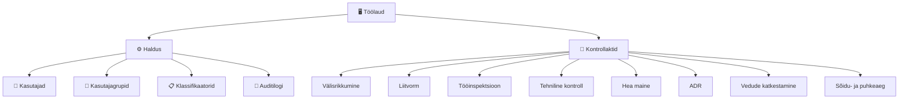

# Menüü ja navigatsioon

Põhimenüü asub vasakul küljel. Süsteemi vaates on topeltnupp: vasakul **Menüü** ja paremal **Kasutaja**.

## Menüü struktuur

## Menüüpunktide õigused

| Menüüpunkt | Õigus | Selgitus |
|---|---|---|
| Töölaud | — | Avaleht kõigile autenditud kasutajatele |
| Kasutajad | `user.list.admin` või `user.list.local` | Kasutajate nimekiri ja haldus |
| Kasutajagrupid | `user_group.list.admin` või `user_group.list.local` | Gruppide haldus |
| Klassifikaatorid | `classifier.list` | Klassifikaatorite vaatamine ja muutmine |
| Auditilogi | `audit.read` | Tegevuste logi |
| Välisriigis toimunud rikkumise akt | `foreign_violation_form.write` | Vormi täitmine |
| Liitvorm | `compound_form.write` | Tee kontrolli vorm |
| Tööinspektsiooni kontrollakt | `labour_inspection_form.write` | Tööinspektsiooni vorm |
| Tehniline kontroll | `vehicle_technical_form.write` / `trailer_technical_form.write` | Sõiduki/haagise kontroll |
| Vedude katkestamine | `transport_interruption_form.write` | Katkestamise vorm |
| ADR | `adr_form.write` | Ohtlike kaupade vorm |
| Hea maine | `good_repute_form.write` | Hea maine vorm |
| Sõidu- ja puhkeaeg | `drive_rest_form.write` | Sõidu- ja puhkeaeg |

## Menüü käitumine mobiilis

Mobiilseadmes on külgmenüü vaikimisi peidus. Selle avamiseks vajutage ülemisel ribal **Menüü** nuppu. Menüü sulgub automaatselt, kui valite uue lehekülje.

## Aktiivne punkt

Aktiivne menüüpunkt on esile tõstetud. Kui olete haldusala all, jääb **Haldus** grupp lahti.
