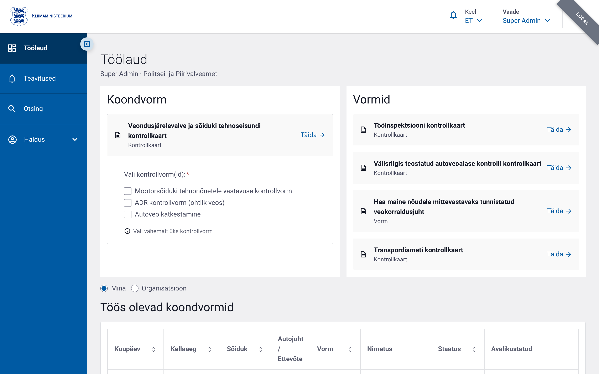
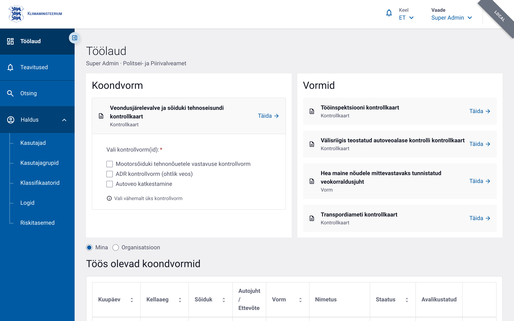
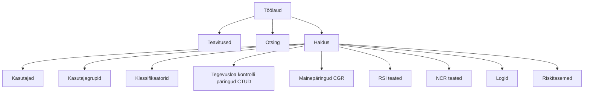

# Menüü ja navigatsioon

Põhimenüü asub vasakul küljel. Menüüpunktid sõltuvad Teie õigustest. Ülemisel
tasemel on **Töölaud**, **Teavitused**, **Otsing** ja **Haldus**.

Haldustegevused on koondatud **Haldus** rühma alla, mis avaneb sellele klõpsates.
Alammenüüs on **Kasutajad**, **Kasutajagrupid**, **Klassifikaatorid**,
**Tegevusloa kontrolli päringud**, **Mainepäringud**, **RSI teated**,
**NCR teated**, **Logid** ja **Riskitasemed**. Kuvatakse ainult need punktid,
milleks Teil on õigus:

Neli keskmist punkti on **ERRU** (Euroopa autoveo-ettevõtjate register) teated
ja päringud: tegevusloa kontroll (CTUD), hea maine päring (CGR), tehnokontrolli
teade (RSI) ja kontrollitulemuse teade (NCR).

Menüüriba saab kokku voltida ülemises servas oleva noolenupuga; kokkuvolditult
kuvatakse ainult ikoonid.

## Menüü struktuur

Uusi kontrollakte alustatakse **töölaualt** (plokid „Koondvorm" ja „Vormid"),
mitte eraldi menüüpunktist — vt peatükk [Töölaud](04-toolaud.md).

## Menüüpunktide õigused

| Menüüpunkt | Õigus | Selgitus |
|---|---|---|
| Töölaud | — | Avaleht kõigile autenditud kasutajatele |
| Teavitused | — | Rakendusesisesed teavitused kõigile; „Saadetud kirjad" vahekaart `notification.list` õigusega |
| Otsing | — | Vormide koondotsing (vt [Vormide vaatamine ja ajalugu](15-vormide-vaatamine-ajalugu.md)) |
| Kasutajad | `user.list.admin` või `user.list.local` | Kasutajate nimekiri ja haldus |
| Kasutajagrupid | `user_group.list.admin` või `user_group.list.local` | Gruppide haldus |
| Klassifikaatorid | `classifier.list` | Klassifikaatorite vaatamine ja muutmine |
| Tegevusloa kontrolli päringud (CTUD) | ERRU-õigus | ERRU tegevusloa kontrolli päringud |
| Mainepäringud (CGR) | ERRU-õigus | ERRU hea maine päringud |
| RSI teated | ERRU-õigus | Tehnokontrolli teated (RoadSideInspection) |
| NCR teated | ERRU-õigus | Kontrollitulemuse teated (NotifyCheckResult) |
| Logid | `audit.read` | Tegevuste (auditi)logi |
| Riskitasemed | riskihindamise õigus | Ettevõtete riskitasemete loend (vt [Riskihindamine](16-riskihindamine.md)) |

Kontrollakte alustatakse töölaualt, mitte menüüst; nende täitmisõigused on
vormipõhised (nt `foreign_violation_form.write`, `compound_form.write`,
`labour_inspection_form.write`, `vehicle_technical_form.write` /
`trailer_technical_form.write`, `transport_interruption_form.write`,
`adr_form.write`, `good_repute_form.write`, `drive_rest_form.write`).

## Menüü käitumine mobiilis

Mobiilseadmes on külgmenüü vaikimisi peidus. Selle avamiseks vajutage ülemisel ribal **Menüü** nuppu. Menüü sulgub automaatselt, kui valite uue lehekülje.

## Aktiivne punkt

Aktiivne menüüpunkt on esile tõstetud. Kui olete haldusala all, jääb **Haldus** grupp lahti.
