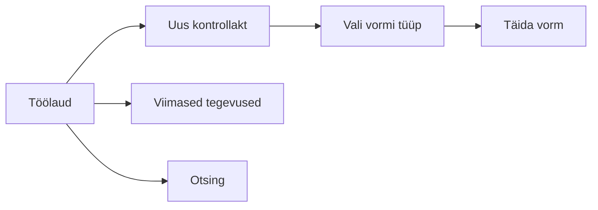

# Töölaud

Töölaud on süsteemi avaleht pärast sisselogimist. Sellelt saab kiiresti alustada levinud tegevusi.

## Töövoo algus

## Võimalikud komponendid

- **Kiirlingid uute vormide juurde** — näiteks "Uus liitvorm", "Uus välisrikkumise akt".
- **Viimased tegevused** — nimekiri viimati salvestatud või vaadatud vormidest.
- **Hoiatused ja märkused** — võimalikud tõrked või infomärkused.

## Töölaud erinevate rollide jaoks

- **Ametnikule** kuvatakse peamiselt vormide lingid.
- **Administraatorile** võidakse kuvada täiendavaid linke kasutajate ja auditilogi halduseks.
