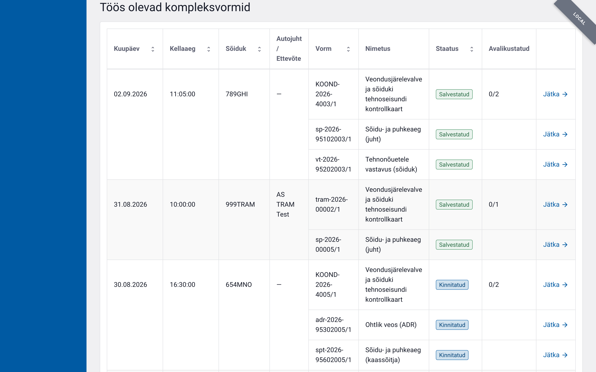
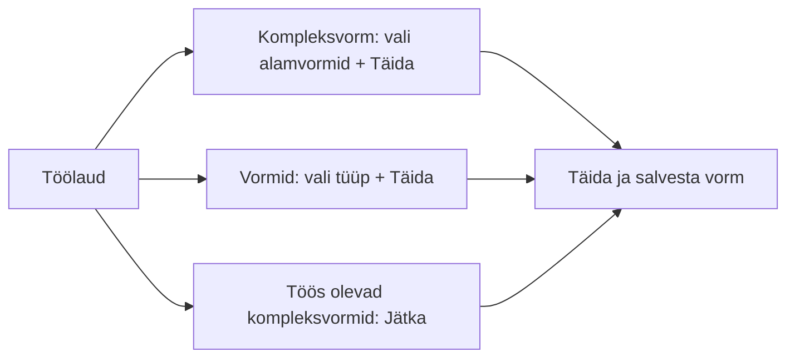

# Töölaud

Töölaud on süsteemi avaleht pärast sisselogimist. Pealkirja all kuvatakse Teie
roll ja organisatsioon (nt „Super Admin · Politsei- ja Piirivalveamet").

Ametniku töölaud koosneb kahest uue kontrolli alustamise plokist ja nende all
olevast pooleliolevate kontrollide tabelist.

## Kompleksvorm

Vasakpoolne plokk **Kompleksvorm** on mõeldud tee ääres tehtava komplekskontrolli
alustamiseks. Plokis on:

- **kompleksvormi kaart** — „Veondusjärelevalve ja sõiduki tehnoseisundi
  kontrollkaart";
- **märkeruutude loend „Vali kontrollvorm(id) *"** — milliseid alamvorme
  kompleksvormi juurde kohe luua (nt *Mootorsõiduki tehnonõuetele vastavuse
  kontrollvorm*, *ADR kontrollvorm*, *Autoveo katkestamine*). Kuvatakse ainult
  need alamvormid, mille loomiseks Teil on õigus;
- **nupp „Täida →"** — avab uue kompleksvormi valitud alamvormidega.

Enne kompleksvormi avamist tuleb valida **vähemalt üks** kontrollvorm — muidu on
nupp „Täida →" kättesaamatu ja kuvatakse vihje „Vali vähemalt üks kontrollvorm".

## Vormid

Parempoolne plokk **Vormid** loetleb iseseisvad (kompleksvormi väliselt
täidetavad) vormitüübid eraldi kaartidena, nt:

- Tööinspektsiooni kontrollkaart;
- Välisriigis teostatud autoveoalase kontrolli kontrollkaart;
- Hea maine nõuetele mittevastavaks tunnistatud veokorraldusjuht;
- Transpordiameti kontrollkaart.

Iga kaardi nupp **„Täida →"** avab vastava tühja vormi.

> Kui Teie õigused katavad ainult ühe ploki vorme, kuvatakse ainult see plokk.

## Töös olevad kompleksvormid

Plokkide all on tabel **Töös olevad kompleksvormid**, mis koondab kõik
pooleliolevad kontrollid. Read on **grupeeritud kompleksvormi kaupa**: iga
kompleksvormi esimene rida kannab põhivormi andmeid ning selle alla on taandega
loetletud alamvormid.

### Tabeli veerud

| Veerg | Sisu |
|---|---|
| **Kuupäev** | Kontrolli toimumise kuupäev |
| **Kellaaeg** | Kontrolli toimumise kellaaeg |
| **Sõiduk** | Sõiduki registreerimismärk |
| **Autojuht / Ettevõte** | Juhi nimi; kui see puudub, ettevõtte nimi |
| **Vorm** | Vormi number koos versiooniga (nt `KOOND-2026-4003/1`) |
| **Nimetus** | Vormi tüübi nimi |
| **Staatus** | Vormi hetkeseis (*Salvestatud*, *Kinnitatud*, *Avalikustatud*) |
| **Avalikustatud** | Kompleksvormi real: mitu alamvormi on avalikustatud (nt `0/2`) |

Iga rea lõpus on link **„Jätka →"**, mis avab vormi täitmiseks/vaatamiseks.
Veerge **Kuupäev**, **Kellaaeg**, **Sõiduk**, **Vorm** ja **Staatus** saab
sorteerida veeru päisele klõpsates. Tähtaja ületanud kontrollide read on esile
tõstetud.

### Mina / Organisatsioon

Tabeli kohal olev lüliti **Mina / Organisatsioon** valib, kas kuvatakse ainult
Teie enda pooleliolevad kompleksvormid või kõigi Teie organisatsiooni ametnike
omad. Lüliti „Organisatsioon" on nähtav ainult vastava õigusega kasutajatele.

## Kodaniku töölaud

Ettevõtja esindaja (kodaniku vaade) näeb töölaual kahte plokki:

- **Minu ettevõtted** — esindatavate ettevõtete kontrollide loend ja riskitase;
- **Minu protokollid** — vormid, kus esindaja on osaline.

## Töövoo algus

