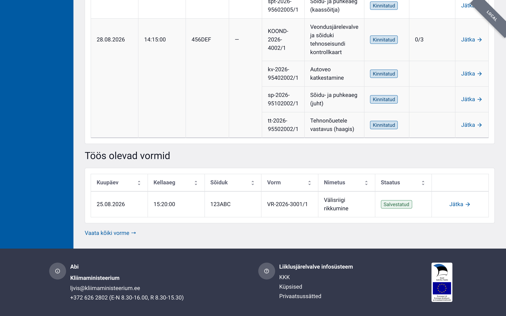
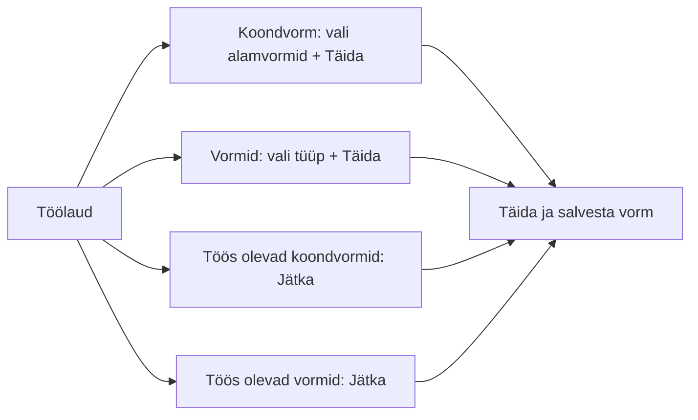

# Töölaud

Töölaud on süsteemi avaleht pärast sisselogimist. Pealkirja all kuvatakse Teie
roll ja organisatsioon (nt „Super Admin · Politsei- ja Piirivalveamet").

Ametniku töölaud koosneb kahest uue kontrolli alustamise plokist (**Koondvorm**
ja **Vormid**) ning nende all olevast **kahest pooleliolevate kontrollide
tabelist** — „Töös olevad koondvormid" ja „Töös olevad vormid".

## Koondvorm

Vasakpoolne plokk **Koondvorm** on mõeldud tee ääres tehtava
koondkontrolli alustamiseks. Plokis on:

- **koondvormi kaart** — „Veondusjärelevalve ja sõiduki tehnoseisundi
  kontrollkaart";
- **märkeruutude loend „Vali kontrollvorm(id) *"** — milliseid alamvorme
  koondvormi juurde kohe luua (nt *Mootorsõiduki tehnonõuetele vastavuse
  kontrollvorm*, *ADR kontrollvorm*, *Autoveo katkestamine*). Kuvatakse ainult
  need alamvormid, mille loomiseks Teil on õigus;
- **nupp „Täida →"** — avab uue koondvormi valitud alamvormidega.

Enne koondvormi avamist tuleb valida **vähemalt üks** kontrollvorm — muidu on
nupp „Täida →" kättesaamatu ja kuvatakse vihje „Vali vähemalt üks kontrollvorm".

## Vormid

Parempoolne plokk **Vormid** loetleb iseseisvad (koondvormi väliselt
täidetavad) vormitüübid eraldi kaartidena, nt:

- Tööinspektsiooni kontrollkaart;
- Välisriigis teostatud autoveoalase kontrolli kontrollkaart;
- Hea maine nõuetele mittevastavaks tunnistatud veokorraldusjuht;
- Transpordiameti kontrollkaart.

Iga kaardi nupp **„Täida →"** avab vastava tühja vormi.

> Kui Teie õigused katavad ainult ühe ploki vorme, kuvatakse ainult see plokk.

## Mina / Organisatsioon

Mõlema tabeli kohal on lüliti **Mina / Organisatsioon**, mis valib, kas
kuvatakse ainult Teie enda pooleliolevad vormid või kõigi Teie organisatsiooni
ametnike omad. Lüliti „Organisatsioon" on nähtav ainult vastava õigusega
kasutajatele.

## Töös olevad koondvormid

Esimene tabel **Töös olevad koondvormid** koondab kõik pooleliolevad
koondkontrollid. Read on **grupeeritud koondvormi kaupa**: iga koondvormi
esimene rida kannab põhivormi (üldosa) andmeid ning selle alla on **taandega**
loetletud selle koondvormi alamvormid.

| Veerg | Sisu |
|---|---|
| **Kuupäev** | Kontrolli toimumise kuupäev |
| **Kellaaeg** | Kontrolli toimumise kellaaeg |
| **Sõiduk** | Sõiduki registreerimismärk |
| **Autojuht / Ettevõte** | Juhi nimi; kui see puudub, ettevõtte nimi |
| **Vorm** | Vormi number koos versiooniga (nt `KOOND-2026-4003/1`) |
| **Nimetus** | Vormi tüübi nimi (koondvorm või alamvormi liik) |
| **Staatus** | Vormi hetkeseis (*Salvestatud*, *Kinnitatud*, *Avalikustatud*) |
| **Avalikustatud** | Koondvormi real: mitu alamvormi on avalikustatud (nt `0/2`) |

Iga rea lõpus on link **„Jätka →"**, mis avab vormi täitmiseks/vaatamiseks.

## Töös olevad vormid

Teine tabel **Töös olevad vormid** loetleb pooleliolevad **iseseisvad** vormid
(need, mida täidetakse koondvormist eraldi — tööinspektsiooni kontrollkaart,
välisriigi rikkumise kontrollkaart, hea maine vorm, Transpordiameti
kontrollkaart). Ühtegi grupeeringut siin ei ole — iga rida on üks vorm.

| Veerg | Sisu |
|---|---|
| **Kuupäev** | Kontrolli / sisestamise kuupäev |
| **Kellaaeg** | Kontrolli kellaaeg |
| **Sõiduk** | Sõiduki registreerimismärk (kui vorm seda sisaldab) |
| **Vorm** | Vormi number koos versiooniga |
| **Nimetus** | Vormi tüübi nimi |
| **Staatus** | Vormi hetkeseis |

Rea lõpus on link **„Jätka →"**. Tabeli all olev link **„Vaata kõiki vorme →"**
avab vormide koondotsingu.

Mõlemat tabelit saab **sorteerida** veeru päisele klõpsates. **Tähtaja ületanud**
kontrollide read on punaselt esile tõstetud. Kui pooleliolevaid vorme ei ole,
kuvatakse tabeli asemel vastav teade.

## Kodaniku töölaud

Ettevõtja esindaja (kodaniku vaade) näeb töölaual kahte plokki:

- **Minu ettevõtted** — esindatavate ettevõtete kontrollide loend ja riskitase;
- **Minu protokollid** — vormid, kus esindaja on osaline.

## Töövoo algus

