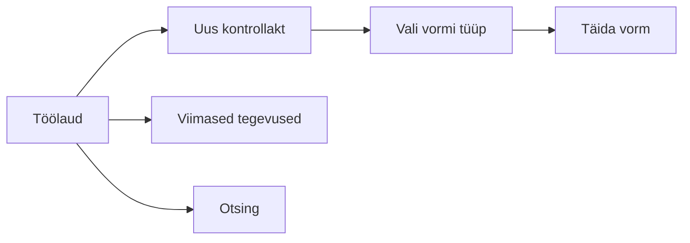

# Töölaud

Töölaud on süsteemi avaleht pärast sisselogimist. Ametniku töölaualt saab alustada uue
kontrollkaardi täitmist.

Nupp **+ Lisa** avab loetelu kontrollkaartidest, mida Teil on õigus luua. Alamvormid on
näidatud oma põhivormi all taandega.

## Töös olevad kompleksvormid

Töölaua alumises osas kuvatakse **Töös olevad kompleksvormid** tabel, mis näitab kõiki
pooleliolevaid kontrolle. Tabel on grupeeritud põhivormide kaupa: iga kompleksvormi rida
kuvab põhivormi andmed ning selle all esinevad alamvormid.

### Tabeli veerud

| Veerg | Sisu |
|-------|------|
| **Kuupäev** | Kontrolli toimumise kuupäev |
| **Kellaaeg** | Kontrolli toimumise kellaaeg |
| **Sõiduk** | Sõiduki registreerimismärk |
| **Autojuht / Ettevõte** | Juhi nimi (peamine) ja ettevõte (teisene). Kui juhi nimi puudub, kuvatakse ettevõtte nimi. |
| **Vorm** | Vormi number |
| **Nimetus** | Vormi tüübi nimi |
| **Staatus** | Vormi hetkestaatus (nt Salvestatud, Kinnitatud) |
| **Avalikustatud** | Mitu alamvormi on avalikustatud (nt `0/2` tähendab 0 avalikustatud 2-st) |

Kõiki veerge (v.a viimane) saab **sorteerida** — klõpsake veeru päisel.

Hilinenud tähtajaga read on esile tõstetud **punase tekstiga**.

## Kodaniku töölaud

Kodaniku vaates kuvatakse **Minu ettevõtted** (esindatavate ettevõtete kontrollid ja
riskitase) ning **Minu protokollid** (vormid, kus olete osaline).

## Töövoo algus

## Võimalikud komponendid

- **Kiirlingid uute vormide juurde** — näiteks "Uus liitvorm", "Uus välisrikkumise akt".
- **Töös olevad kompleksvormid** — pooleliolevate kontrollide tabel.
- **Hoiatused ja märkused** — võimalikud tõrked või infomärkused.

## Töölaud erinevate rollide jaoks

- **Ametnikule** kuvatakse peamiselt vormide lingid.
- **Administraatorile** võidakse kuvada täiendavaid linke kasutajate ja auditilogi halduseks.
