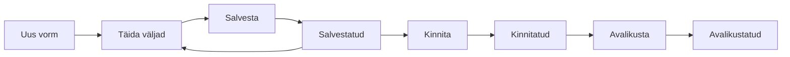

# Vormid

Kõik kontrollaktid (vormid) töötavad sarnaselt. Selles peatükis kirjeldatakse kõigile
vormidele ühised toimingud; iga vormitüüpi käsitletakse eraldi alampeatükis:

- [Välisriigi rikkumine](06-vorm-valisrikkumine.md)
- [Koondvorm](07-vorm-liitvorm.md) ja selle alamvormid
- [Tööinspektsiooni kontrollakt](08-vorm-tooinspektsioon.md)
- [Tehniline kontroll](09-vorm-tehniline-kontroll.md)
- [Autoveo katkestamine](10-vorm-vedude-katkestamine.md)
- [ADR-vorm](11-vorm-adr.md)
- [Hea maine](12-vorm-hea-maine.md)
- [Sõidu- ja puhkeaeg](13-vorm-soidu-puhkeaeg.md)

## Vormi elutsükkel

Vorm läbib kolm staatust: **Salvestatud → Kinnitatud → Avalikustatud**.

## Kohustuslikud väljad

Kohustuslikud väljad on tähistatud punase tärniga `*`. Vormi ei saa kinnitada
enne, kui kõik kohustuslikud väljad on korrektselt täidetud.

## Nupud

| Nupp | Selgitus |
|---|---|
| **Salvesta** | Salvestab vormi hetkeseisu. Vorm jääb muudetavaks (staatus *Salvestatud*). Iga salvestus loob uue versiooni. |
| **Kinnita** | Kinnitab vormi (staatus *Kinnitatud*). Nõuab kõigi kohustuslike väljade täitmist. |
| **Avalikusta** | Avalikustab kinnitatud vormi (staatus *Avalikustatud*). |
| **Muuda** | Avab kinnitatud/avalikustatud vormi uuesti redigeerimiseks (vastava õigusega). |
| **Kustuta** | Kustutab vormi. |
| **Tühista** / **Tagasi** | Väljub vormilt salvestamata. |

## Mõisted

| Mõiste | Selgitus |
|---|---|
| Salvestatud | Salvestatud, veel kinnitamata vorm. Saab muuta. |
| Kinnitatud | Kinnitatud vorm. Muutmiseks tuleb see uuesti avada nupuga „Muuda". |
| Avalikustatud | Avalikustatud vorm. |
| Versioon (snapshot) | Vormi salvestatud seisund ajateljel. Iga salvestus/kinnitus loob uue versiooni; varasemaid saab vaadata. |
| Vormi number | Unikaalne number, mis antakse vormile esimesel salvestamisel (nt `VR-2026-3001`). |

## Vormide otsing

Vormidele pääseb ligi töölaua või menüü kaudu. Iga vormi vaade koosneb:

- põhiandmete kaartidest
- alamvormide loendist (koondvormi puhul)
- failide loendist
- ajaloo/snapshots loendist
