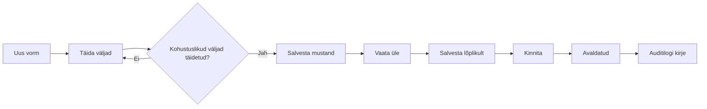

# Vormide üldine käsitsemine

Kõik kontrollaktid töötavad sarnaselt. Selles peatükis kirjeldatakse ühised toimingud.

## Vormi elutsükkel

## Kohustuslikud väljad

Kohustuslikud väljad on tähistatud tärniga `*` või punase tähega. Vormi ei saa lõplikult salvestada enne, kui kõik kohustuslikud väljad on korrektselt täidetud.

## Salvestamise nupud

| Nupp | Selgitus |
|---|---|
| Salvesta mustand | Salvestab vormi mustandina. Veel ei kinnitata. |
| Salvesta lõplikult | Valideerib ja salvestab vormi. Nõuab kõigi kohustuslike väljade täitmist. |
| Kinnita | Muudab vormi avaldatuks. Hiljem muuta ei saa. |
| Tühista | Tühistab vormi täitmise. |

## Mõisted

| Mõiste | Selgitus |
|---|---|
| Mustand | Salvestatud, kuid mitte kinnitatud vorm. Saab muuta. |
| Avaldatud | Kinnitatud vorm, mida enam muuta ei saa. |
| Snapshot | Vormi salvestatud seisund ajateljel. Võimaldab vaadata varasemaid versioone. |
| Vormi number | Unikaalne number, mis antakse vormile salvestamisel. |

## Vormide otsing

Vormidele pääseb ligi töölaua või menüü kaudu. Iga vormi vaade koosneb:

- põhiandmete kaartidest
- alamvormide loendist (liitvormi puhul)
- failide loendist
- ajaloo/snapshots loendist
