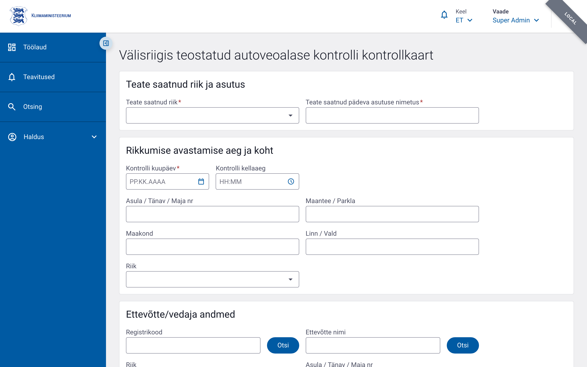
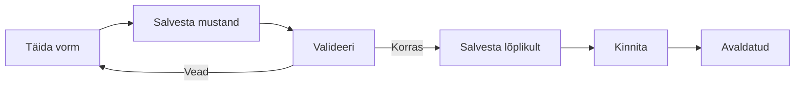

# Välisriigis toimunud rikkumise akt

Välisriigis toimunud rikkumise akti kasutatakse siis, kui välisriigi ametiasutus edastab Eesti transpordiametile teate liiklusrikkumisest, mille on toime pannud Eesti vedaja või tema juht välisriigis.

## Vormi eesmärk

- Dokumenteerida välisriigis tuvastatud rikkumine
- Määrata sanktsioon ja soovitatav meede
- Salvestada rikkumise detailid (sõiduk, juht, ettevõte)
- Edastada andmed hilisemaks statistikaks ja riskihindamiseks

## Menüü tee

Töölaud → **Välisriigis toimunud rikkumise akt** → Täida vorm

või

Menüü → Kontrollaktid → **Välisriigis toimunud rikkumise akt**

## Vormi osad ja kohustuslikud väljad

Vorm on jagatud kaartideks. Allpool on iga kaardi väljad. Kui välja juures on täht `*`, on see kohustuslik.

### 1. Teatava info

| Väli | Kohustuslik | Selgitus |
|---|---|---|
| Teatav riik (`reportingCountryCode`) | Jah | Vali riik, kust teade tuli |
| Teatav asutus (`reportingAuthority`) | Jah | Asutuse nimi, max 600 tähemärki |

### 2. Kontrolli info

| Väli | Kohustuslik | Selgitus |
|---|---|---|
| Kontrolli kuupäev (`inspectionDate`) | Jah | Kuupäev, mil kontroll toimus |
| Kontrolli kellaaeg (`inspectionTime`) | Ei | Kellaaeg HH:MM formaadis |
| Kontrolli aadressirida 1 (`inspectionAddressLine1`) | Ei | Max 300 tähemärki |
| Kontrolli aadressirida 2 (`inspectionAddressLine2`) | Ei | Max 300 tähemärki |
| Kontrolli piirkond (`inspectionRegion`) | Ei | Max 100 tähemärki |
| Kontrolli linn (`inspectionCity`) | Ei | Max 100 tähemärki |
| Kontrolli riik (`inspectionCountryCode`) | Ei | Valik riikide loendist |

### 3. Ettevõtte info

Ettevõtte andmeid saab otsida registrikoodi või nime järgi. Otsingunupp täidab leitud ettevõtte andmed vormi.

| Väli | Kohustuslik | Selgitus |
|---|---|---|
| Registrikood (`companyRegCode`) | Ei | 20 tähemärki |
| Ettevõtte nimi (`companyName`) | Ei | Max 300 tähemärki |
| Ettevõtte riik (`companyCountryCode`) | Ei | Valik riikide loendist |
| Aadressirida 1 (`companyAddressLine1`) | Ei | Max 300 tähemärki |
| Aadressirida 2 (`companyAddressLine2`) | Ei | Max 300 tähemärki |
| Linn (`companyCity`) | Ei | Max 100 tähemärki |
| Postiindeks (`companyPostalCode`) | Ei | Max 20 tähemärki |

### 4. Juhi info

| Väli | Kohustuslik | Selgitus |
|---|---|---|
| Juhi eesnimi (`driverFirstName`) | Ei | Max 200 tähemärki |
| Juhi perekonnanimi (`driverLastName`) | Ei | Max 200 tähemärki |

### 5. Sõiduki info

Sõiduki andmeid saab otsida registri numbri järgi. Otsing kasutab X-tee liidest.

| Väli | Kohustuslik | Selgitus |
|---|---|---|
| Registrinumber (`vehicleRegNr`) | Ei | Max 20 tähemärki |
| Mark (`vehicleMake`) | Ei | Max 100 tähemärki |
| Mudel (`vehicleModel`) | Ei | Max 100 tähemärki |
| Sõiduki riik (`vehicleCountryCode`) | Ei | Valik riikide loendist |
| VIN (`vehicleVin`) | Ei | Max 17 tähemärki |
| Esmane registreerimine (`vehicleFirstRegistration`) | Ei | Kuupäev |
| Keretüüp (`vehicleBodyType`) | Ei | Max 50 tähemärki |

### 6. Loadokoopia info

| Väli | Kohustuslik | Selgitus |
|---|---|---|
| Loadokoopia number (`licenceCopyNumber`) | Ei | Max 100 tähemärki |

### 7. Rikkumise kirjeldus

| Väli | Kohustuslik | Selgitus |
|---|---|---|
| Rikkumise kirjeldus (`violationDescription`) | Ei | Vaba tekst |
| Väiksemate rikkumiste arv (`minorViolationsCount`) | Ei | Arv (0–999) |

### 8. Sanktsioon

| Väli | Kohustuslik | Selgitus |
|---|---|---|
| Sanktsioon (`sanctionCode`) | Jah | Valik: KORRAS, HOIATUS, KABOTAAŽVEO AJUTINE KEELAMINE, TRAHV, LIIKLEMISKEELD, SÕIDUKI KASUTAMISE TAKISTAMINE, MUU |
| Sanktsiooni märkused (`sanctionNotes`) | Ei | Vaba tekst |

### 9. Soovitatav meede

| Väli | Kohustuslik | Seligitus |
|---|---|---|
| Soovitatav meede (`recommendedMeasureCode`) | Jah | Valik: PUUDUVAD, HOIATUS, ÜHENDUSE TEGEVUSLOA PEATAMINE, ÜHENDUSE TEGEVUSLUBA KEHTETUKS, TEGEVUSLOA ARAKIRJADE PEATAMINE, TEGEVUSLUBA KEHTETUKS, JUHITUNNISTUSEST KEELDUMINE, JUHITUNNISTUS KEHTETUKS, MUU |
| Soovitatava meetme täpsustus (`recommendedMeasureNotes`) | Jah, kui meede on "MUU" | Vaba tekst |
| Üldised märkused (`recommendedMeasureGeneralNotes`) | Ei | Vaba tekst |

### 10. Sisestamise kuupäev

| Väli | Kohustuslik | Selgitus |
|---|---|---|
| Sisestamise kuupäev (`dataEntryDate`) | Jah | Kuupäev |

### 11. Inspektori info

| Väli | Kohustuslik | Selgitus |
|---|---|---|
| Eesnimi (`inspectorFirstName`) | Jah | Max 100 tähemärki |
| Perekonnanimi (`inspectorLastName`) | Jah | Max 100 tähemärki |
| Asutus (`inspectorOrganisationId`) | Jah | Valik organisatsioonide loendist |
| Ametikoht (`inspectorProfession`) | Jah | Max 100 tähemärki |

### 12. EL rikkumiste loend

Lahtri klõpsates avaneb EL määruse rikkumiste loend, mis on jagatud rühmadesse MSI, VSI, SI, MI. Valida saab mitme rikkumise. Need väärtused ei ole vormi täitmiseks kohustuslikud, kuid on olulised riskihindamiseks.

## Vormi salvestamine

Pärast kõigi kohustuslike väljade täitmist saate vormi salvestada. Vormi elutsükkel:

## Nipid

- Kasutage otsingunuppe ettevõtte ja sõiduki andmete automaatseks täitmiseks.
- Kui sanktsioon või soovitatav meede on "MUU", peate kindlasti täitma täpsustava tekstivälja.
- EL rikkumiste raskusastmed (MSI/VSI/SI/MI) mõjutavad tulevikus ettevõtte riskiskoori.
