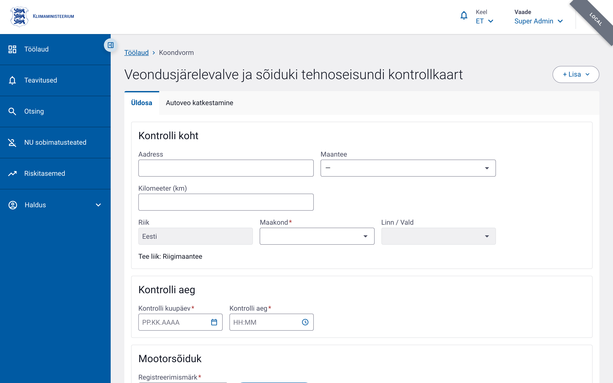
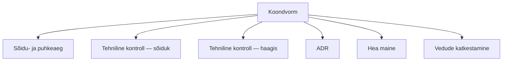
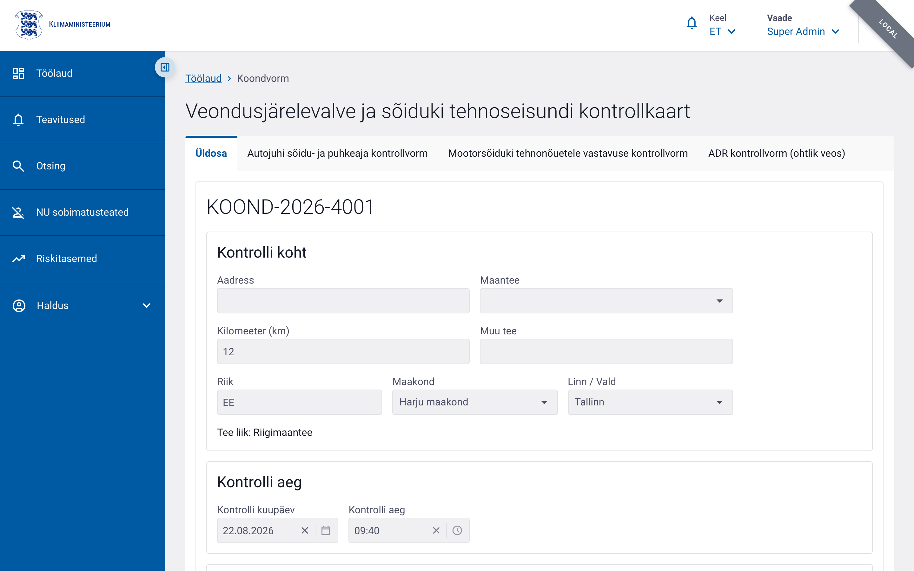

# Koondvorm (tee kontroll)

Koondvorm on peamine tee kontrolli akt. Iga koondvorm võib sisaldada mitut alamvormi: sõidu- ja puhkeaeg, tehniline kontroll, ADR, hea maine, vedude katkestamine.

## Vormi eesmärk

- Registreerida tee kontrolli põhiandmed (koht, aeg, sõiduk, ettevõte)
- Siduda kontrolliga juhid, kaasreisijad ja tehnilised alamkontrollid
- Anda alus riskihindamiseks ja statistikaks

## Kust vorm avada

**Töölaud → plokk „Koondvorm"**:

1. Kaardi „Veondusjärelevalve ja sõiduki tehnoseisundi kontrollkaart" all on
   loend **„Vali kontrollvorm(id)"** — märkige, millised alamvormid soovite kohe
   koondvormi juurde luua (autojuhi/meeskonnaliikme sõidu- ja puhkeaeg,
   mootorsõiduki/haagise tehnokontroll, ohtliku veose kontroll, autoveo
   katkestamine). Kuvatakse ainult need, mille loomiseks on Teil õigus.
2. Klõpsake **„Täida →"**. Enne tuleb valida vähemalt üks alamvorm.

Koondvorm avaneb **Üldosa** vahekaardil; märgitud alamvormid on kohe eraldi
vahekaartidena avatud. Olemasoleva koondvormi saab avada aadressilt
`/control-forms/compound/:id`.

## Vormi osad ja kohustuslikud väljad

Vorm koosneb **Üldosast** ja alamvormide vahekaartidest. Uue vormi loomisel avaneb Üldosa:

### 1. Kontrolli asukoht ja aeg

| Väli | Kohustuslik | Selgitus |
|---|---|---|
| Tee (`road`) | Jah | Riigimaantee, kohalik tee või muu |
| Tee nimetus (`roadOther`) | Jah, kui tee = "muu" | Vaba tekst |
| Kilomeeter (`kilometer`) | Jah, kui tee valitud | Numbriline väärtus, max 3 tähte |
| Maakond (`county`) | Jah, kui kontrolli riik = "EE" | Valik maakondade loendist |
| Kontrolli kuupäev (`controlDate`) | Jah | Kuupäev |
| Kontrolli kellaaeg (`controlTime`) | Jah | Kellaaeg |
| Kontrolli riik (`controlCountryCode`) | Jah | Valik riikide loendist |

### 2. Sõiduki info

| Väli | Kohustuslik | Selgitus |
|---|---|---|
| Sõiduki riik (`vehicleCountryCode`) | Jah | Valik riikide loendist |
| Sõiduki kategooria (`vehicleCategoryCode`) | Jah | Valik sõidukikategooriate loendist |
| Sõiduki kategooria muu (`vehicleCategoryOther`) | Jah, kui kategooria = "muu" | Vaba tekst |

Sõiduki registri number ja muud andmed täidetakse tehnilise kontrolli alamvormis või otsinguga.

### 3. Ettevõtte info

Ettevõtte andmeid saab otsida registrikoodi või nime järgi X-tee liidese kaudu.

| Väli | Kohustuslik | Selgitus |
|---|---|---|
| Registrikood (`companyRegCode`) | Jah | Ettevõtte registrikood |
| Ettevõtte nimi (`companyName`) | Jah | Max 300 tähemärki |
| Ettevõtte riik (`companyCountryCode`) | Jah | Valik riikide loendist |

### 4. Juhtide info

Koondvormil peab olema vähemalt üks juht.

| Väli | Kohustuslik | Selgitus |
|---|---|---|
| Juhi eesnimi (`drivers[].firstName`) | Jah (esimene juht) | Max 200 tähemärki |
| Juhi perekonnanimi (`drivers[].lastName`) | Jah (esimene juht) | Max 200 tähemärki |
| Juhi isikukood (`drivers[].personalCodeForeign`) | Jah (esimene juht) | Max 50 tähemärki |
| Juhi sünnikuupäev (`drivers[].birthDate`) | Jah (esimene juht) | Kuupäev |

### 5. Kaasreisija info

Kaasreisija andmed on valikulised, kuid soovitatavad, kui sõidukis oli kaasreisija.

### 6. Inspektori info

| Väli | Kohustuslik | Selgitus |
|---|---|---|
| Eesnimi (`inspectorFirstName`) | Jah | Max 100 tähemärki |
| Perekonnanimi (`inspectorLastName`) | Jah | Max 100 tähemärki |
| Asutus (`inspectorOrganisationId`) | Jah | Valik organisatsioonide loendist |
| Ametikoht (`inspectorProfession`) | Jah | Max 100 tähemärki |

### 7. Haagiste info

Koondvormil võib lisada ühe või mitu haagist. Haagiste puhul on täidetavad:

- Haagise riik
- Haagise kategooria
- Haagise registri number
- Haagise tunnus

## Alamvormide lisamine

Pärast koondvormi salvestamist saab sellele lisada alamvorme:

Iga alamvorm salvestatakse eraldi, kuid on seotud koondvormi ID-ga. Salvestatud koondvormi
vaates on Üldosa ja iga alamvorm eraldi vahekaardil:

## Vormi salvestamine, kinnitamine ja avalikustamine

Koondvorm ja iga alamvorm läbivad olekud **Salvestatud → Kinnitatud →
Avalikustatud**.

1. Täitke kohustuslikud väljad ja klõpsake **Salvesta** (staatus *Salvestatud*).
2. Kontrollige andmed ja klõpsake **Kinnita** (nõuab kõigi kohustuslike väljade
   täitmist; kõik avatud alamvormid kinnitatakse koos).
3. Klõpsake **Avalikusta**.

Kinnitatud/avalikustatud vormi saab uuesti avada nupuga **Muuda** (vastava
õigusega); iga muudatus tõstab versiooninumbrit.

## Nipid

- Tee ja kilomeeter seatakse kontrolli toimumuskoha järgi.
- Ettevõtte otsing töötab kõige täpsemini Eesti registrikoodiga (8 numbrit).
- Kõik alamvormid peavad olema seotud koondvormiga enne kinnitamist.
